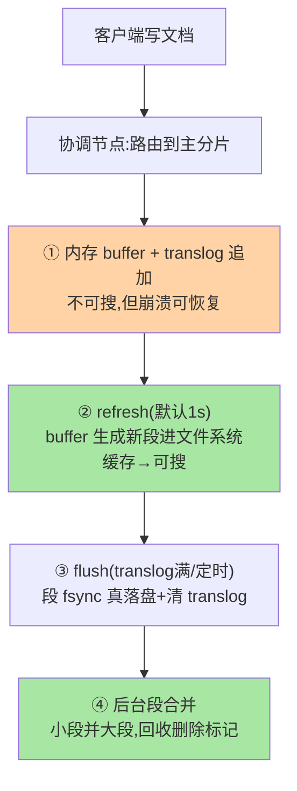
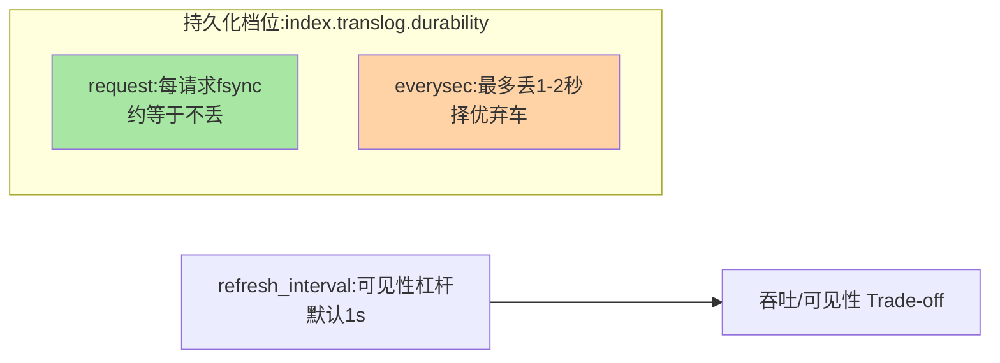

# 文档写入链路：refresh、translog 与 flush

> 「为什么刚写入的文档搜不到？」「ES 掉电会丢数据吗？」——答案都在写入链路的三件套里：refresh 决定「何时可搜」，translog 决定「崩溃不丢」，flush 决定「何时落盘」。这篇把一条文档从客户端到磁盘的完整旅程走一遍。

## 一句话摘要

写入链路四级流水：**① 写内存 buffer + 追加 translog**（此刻不可搜但已防丢）→ **② refresh（默认 1 秒）**：buffer 生成新段进文件系统缓存，**文档可搜** → **③ flush**（默认 30 分钟或 translog 满）：段真正 fsync 落盘 + translog 清空 → **④ 段合并**（后台）：小段合并回收。**近实时与崩溃安全的平衡**全在这条链路的时间参数里——refresh_interval 是「实时性」与「索引吞吐」的第一杠杆——这也是日志检索场景从 MySQL 全文索引演进到 ES 的核心红利之一。

## 一、为什么写入链路要「三级跳」

Lucene 段不可变（篇 2），生成段的开销大——如果每写一条就生成段，索引吞吐会崩掉。ES 的解法是**延迟批量化**：写入先进内存 buffer 攒批，refresh 时一次性生成段——「攒批生成」换来吞吐，「一秒延迟」就是代价。而「崩溃不丢」不能靠内存 buffer（掉电即失），translog（追加日志）补上这块——**buffer 管性能、translog 管安全、refresh 管可见性**，三者分工构成写入架构。

## 5W 速记卡

| 维度 | 一句话 |
|---|---|
| What | buffer+translog → refresh 生成段 → flush 落盘的写入流水线 |
| Why | 不可变段的生成开销大，必须攒批；安全靠追加日志兜底 |
| When | 「写入后搜不到」「丢失窗口」类问题排查 |
| Where | 分片（Lucene 实例）内部 |
| How | 默认 refresh 1s、flush 30min 或 translog 512MB（版本相关） |

## 二、一条文档的完整旅程

参数联动与丢失窗口的全景：

两个关键语义位置：**「可搜」发生在②**（段进了文件系统缓存，搜索读的是缓存页——所以快），**「安全」发生在①与③的配合**（掉电时用 translog 重放恢复未 flush 的段）。注意 ②的「进文件系统缓存」不等于落盘——这就是为什么还需要③的 fsync 与 translog。

## 三、refresh：近实时的第一杠杆

`refresh_interval` 默认 1s——把它调到 30s 甚至 -1（关闭），写入吞吐可数量级提升（段生成次数骤减），代价是可见性延迟同步变长。**场景化配置是业内默认**：日志类索引（分钟级可见可接受）调大 refresh + 大批量写入；搜索类索引保持默认；**全量导入时临时 -1，导完手动 refresh**（官方推荐的导入姿势）。刷新时机还能按需手动触发（`_refresh`），业务在「写完立即可见」的场景自己控制节奏。

## 四、与 MySQL 提交可见性的区别：MySQL 对照

| 维度 | ES 写入链路 | MySQL InnoDB |
|---|---|---|
| 可见性 | refresh 后（默认 1s） | 提交即可见 |
| 崩溃安全 | translog 重放 | redo log 恢复 |
| 持久化代价点 | flush 时 fsync 段 | 提交时 redo fsync |
| 更新模型 | 删旧建新（段） | 原位更新 |

对比 MySQL（本仓库日志系列篇 1 的 WAL）：translog 与 redo log 思想同源（追加日志保崩溃安全），但**可见性语义不同**——ES 的「提交成功」不等于「可搜」，这个差异是业务接入 ES 最常踩的认知坑。

## 五、典型场景与误区

**典型场景**：日志导入（bulk 大批量 + refresh 30s + 副本 0 过渡）、搜索索引同步（Canal 写入后接受 1-2 秒检索延迟）、全量重建（refresh -1 + 副本 0，完成后恢复）。

**误区与不适用**：① 「写入返回成功就能搜到」——返回成功只保证 translog 已写，可搜要等 refresh；② refresh 调太小（500ms）追实时——段生成风暴吃 CPU 与 IO，搜索延迟反而恶化；③ 无视 translog 的持久化档位（index.translog.durability：request/everysec）——request 每请求 fsync 最安全，everysec 接受秒级丢失窗口（与 MySQL 双 1 的取舍同构）；④ 大批大 key 场景忽视段合并压力——导入风暴后合并跟不上，磁盘水位暴涨。

## 六、你们可能会问

**Q1：怎么让「写入后立即可搜」？**
写入后手动 `POST /索引/_refresh`——配合低频写入的业务（管理后台）完全可行；高频写入场景接受默认 1s，或用「读主分片」之类架构手段规避（代价另算）。

**Q2：translog 会无限大吗？**
flush 时清空——触发条件 `flush_threshold_size`（默认 512MB）+ 定时（默认 30 分钟）；导入风暴期 translog 涨得快，flush 频繁本身也是压力源，需要联动观察。

**Q3：掉电到底丢多少？**
durability=request 时基本不丢（每请求 fsync translog）；everysec 时最多丢 1-2 秒——与 Redis AOF everysec 的「择优弃车」哲学完全同构（持久化机制的跨系统同源性又一例）。

## 七、自测三问

1. buffer/translog/refresh/flush 四个角色各自负责什么？
2. 「可搜」发生在哪一步？「崩溃安全」由谁保证？
3. refresh_interval 的场景化配置怎么定？全量导入的官方姿势是什么？

下一篇讲「段合并与存储结构」：磁盘上到底长什么样。

## 📌 数据与事实声明

- 写于 2026-09-08，链路默认值（refresh 1s、translog 512MB、durability request）以 ES 9.x 官方文档为准
- 与 MySQL WAL 的同源对比为本系列的知识关联视角
- 免责：以 elastic.co/docs 为准

## 📚 参考资料

| 类型 | 标题 | 来源 |
|---|---|---|
| 官方文档 | Near Real Time Search / translog | elastic.co/docs |
| 原理书 | 《Elasticsearch 源码解析与优化实战》张超（写入章） | 公开出版 |
| 关联系列 | 本仓库 MySQL《redo log 刷盘与组提交》（WAL 同源互指） | docs/data/mysql/ |
