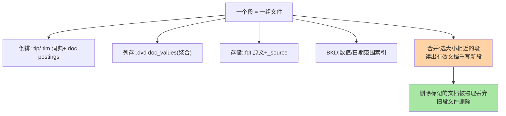
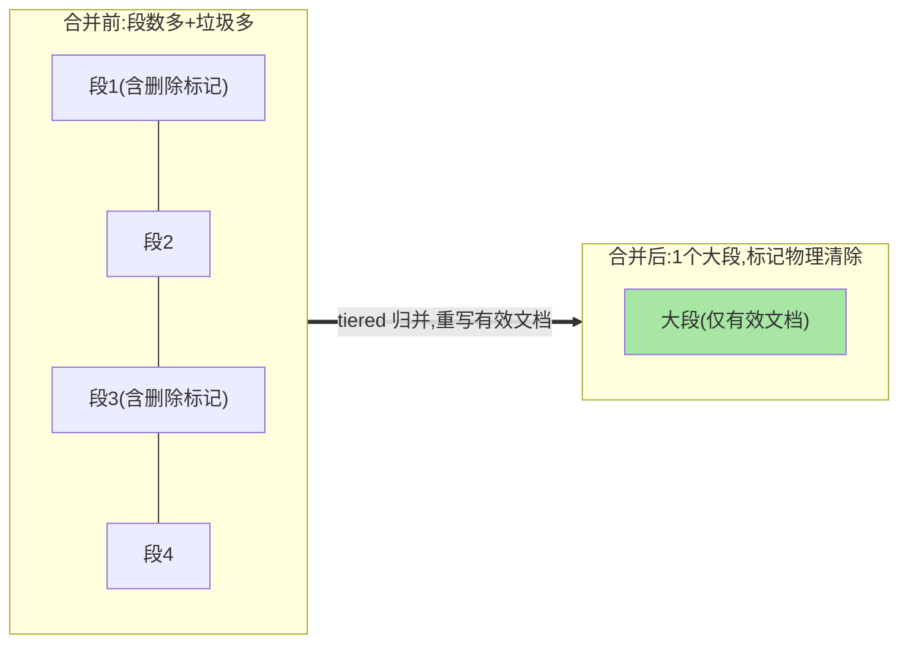

# 段合并与存储结构：磁盘上到底长什么样

> refresh 不断生成小段，删除只打标记——磁盘上小段越积越多、垃圾越积越厚，谁来做清洁工？段合并（merge）。这篇讲清一个段内部的文件构成、合并的策略分层（tiered）与 forcemerge 的运维用法。

## 一句话摘要

一个 Lucene 段是一组文件的集合：**倒排（.tip/.tim/.doc）、列存 doc_values（.dvd）、存储字段（.fdt）、BKD 数值索引**等——每段自带完整结构。**段合并**把多个小段合成大段：物理清除「标记删除」的文档、减少段数量（段太多搜索要遍历所有段，性能劣化）。合并策略是 **tiered 分层归并**（大小相近的段归并、逐层升级），代价是 **IO 与 CPU 的重负载**——「合并风暴吃掉写入吞吐」是 ES 运维的经典课题——空间与性能的 Trade-off 由合并策略参数表达，forcemerge（只读索引合并成单段）是运维收口手段。

## 一、为什么必须有段合并

三笔账决定合并的必要性：**空间账**——删除/更新只打标记，被标记的数据占着磁盘直到合并才回收；**性能账**——搜索要对所有段执行（段多则文件句柄、缓存压力、查询扇出全涨）；**写账**——refresh 频繁生成小段，不合并则段数爆炸。合并是「用可控的后台 IO 换取空间与查询性能」的清洁机制，代价也要算清：合并期间大 IO 与主线程资源竞争，导入风暴后合并跟不上就是磁盘水位暴涨。

## 5W 速记卡

| 维度 | 一句话 |
|---|---|
| What | 多个小段归并成大段，物理回收删除标记 |
| Why | 删除标记占空间、段数多拖慢搜索 |
| When | 自动后台持续进行；只读索引用 forcemerge 收口 |
| Where | 分片（Lucene 实例）内部 |
| How | tiered 策略：大小相近段归并，逐层升级 |

## 二、段的文件构成与合并流程

合并前后的效果对比：

tiered 策略的核心参数直觉：`merge_factor` 类（一次归并几个段）与 `segment_per_tier`（层间放大倍数，默认 10）——**大段很少参与合并**（放大倍数控制），所以「巨型段」形成后基本稳定；这也是 forcemerge 的价值：手动把只读索引（如昨天的日志索引）压成单个大段，查询路径最短、文件句柄最少。

## 三、合并的运维账：什么时候会出事

合并风暴三诱因：**① 灌入风暴**——大批量导入生成海量小段，合并线程全力追赶仍积压（磁盘水位 + IO 打满）；**② 合并与查询抢资源**——合并是后台线程但 IO 共享，高峰期大合并拖慢查询；**③ 配置不当**——合并线程数、限速参数（`indices.merge.scheduler` 族）乱调。**联动纪律**：导入场景的「refresh 调大 + 副本 0 + 导后手动forcemerge」是一套组合拳（写入链路篇的结论在此衔接），拆散单用效果打折。

## 四、与 InnoDB 段/页结构的区别：MySQL 对照

| 维度 | Lucene 段合并 | InnoDB 页机制 |
|---|---|---|
| 回收方式 | 后台合并物理回收 | purge 线程回收 undo/删除标记 |
| 结构稳定性 | 段不可变，合并重建 | 页可变，分裂合并 |
| 触发 | 段数量/大小策略 | 页利用率阈值 |

两者都是「延迟回收」的机制化实现（MySQL 的 purge 与 undo，本仓库 MySQL 系列已详述）——**「删除标记 + 后台回收」是存储引擎演进的跨系统通用模式**，上下游机制同源，理解一个再迁移另一个心智零成本。

## 五、典型场景与误区

**典型场景**：日志索引每日 forcemerge（昨天的索引压成 1 段）、导入风暴后的合并积压排查（`_cat/segments` 看段数水位）、索引模板预置合并参数（按业务写入形态定制）。

**误区与不适用**：① 对写入中的索引 forcemerge——边合并边生成新段白费功夫（forcemerge 只对只读/基本只读索引有意义）；② 合并限速调太小——积压更重；调太大挤占业务 IO——按磁盘类型实测；③ 忽视 _source 的体积——_source 存原文（.fdt），禁用 _source 会让 reindex/更新/highlight 全失效（空间与功能的 Trade-off，默认保留是正解）。

## 六、你们可能会问

**Q1：段数多少算多？**
经验警戒线是单分片段数过千且小段（<几十 MB）占比高——`_cat/segments?v` 直接看；「多」的本质是查询扇出与句柄压力，结合查询延迟观察。

**Q2：合并能彻底关掉吗？**
能（策略参数极端化）但等于放任段爆炸——合理做法是限速不关停；导入期临时调整是窗口行为，用完要恢复。

**Q3：_source 禁用省空间值不值？**
极特殊场景（空间极限 + 只按 doc_values 聚合）才考虑——损失 reindex/更新/高亮/部分排序能力，业内默认保留 _source，空间问题优先走压缩（best_compression）。

## 七、自测三问

1. 段内四类文件各存什么？哪类服务聚合？
2. 合并的三笔收益账与两笔代价账是什么？
3. forcemerge 的正确使用场景是什么？为什么写入中索引不能用？

下一篇讲「索引生命周期与冷热」：让数据按时间自动搬家。

## 📌 数据与事实声明

- 写于 2026-09-08，段文件构成与 tiered 策略以 Lucene 9.x / ES 9.x 为准
- 合并参数名为概念口径，具体参数名以官方文档为准
- 免责：以 elastic.co/docs 为准

## 📚 参考资料

| 类型 | 标题 | 来源 |
|---|---|---|
| 官方文档 | Merge / forcemerge API | elastic.co/docs |
| 原理书 | 《Elasticsearch 源码解析与优化实战》张超（合并章） | 公开出版 |
| 关联系列 | 本仓库 MySQL《undo log 与版本链》（延迟回收同源互指） | docs/data/mysql/ |
