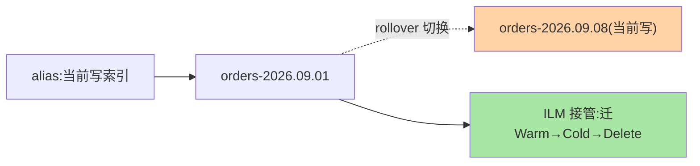

# 索引生命周期与冷热：让数据按时间自动搬家

> 日志天天在涨，磁盘三个月爆一次——治理它的不是人肉删数据，是 **ILM（索引生命周期管理）+ 冷热分层架构**：新数据在热节点（SSD、高配），随时间自动 rollover、迁移、缩副本、归档、删除。这篇讲清这套「数据的时间调度系统」。

## 一句话摘要

**ILM 按阶段自动管理索引的一生**：Hot（写入+查询）→ Warm（只读、可降副本）→ Cold（迁冷节点、冻结）→ Delete（到期删除）；触发条件按时间（索引年龄）或大小（rollover 阈值）。**冷热分层是配套硬件架构**：热节点 SSD 高配扛写入查询，冷节点大盘低配扛存储——数据按生命周期自动「从贵的地方搬到便宜的地方」，存储成本随数据年龄递减，这是日志类场景的成本架构核心。

## 一、为什么需要生命周期管理

日志/时序类数据的两条铁律决定了这套系统的必要性：**只写不改**（时间只前进，旧数据不可变——与段模型天然契合）、**价值随时间衰减**（昨天的日志高频查，去年的日志偶尔查）。人肉治理（按期删索引脚本）能跑但粗糙——ILM 把「 rollover 滚动、迁移、缩副本、删除」的调度规则化、自动化，让存储成本曲线跟随数据价值曲线。从人工脚本到策略引擎，这是日志架构演进中最具杠杆的一步，成本与自动化程度的 Trade-off 也由此得到了平台级解法。

## 5W 速记卡

| 维度 | 一句话 |
|---|---|
| What | ILM 四阶段策略 + 冷热分层硬件架构 |
| Why | 时序数据价值随时间衰减，成本要跟着衰减 |
| When | 日志/指标/时序场景标配；磁盘水位治理 |
| Where | ILM 策略绑定索引模板，节点打 hot/warm/cold 属性 |
| How | rollover 滚动索引 → 按龄迁移分层 → 到期删除 |

## 二、ILM 四阶段与冷热架构

四阶段的核心动作：**Hot** 期 rollover（单索引超 50GB 或 7 天滚动新索引，控制单索引规模）、**Warm** 期只读化 + 缩副本（1 副本降 0，空间近半）、**Cold** 期迁冷节点（可配 frozen 全冻结到对象存储级成本）、**Delete** 到期删除。策略通过**索引模板**自动挂到新索引——「新建即纳管」，无索引漏网。

## 三、rollover：滚动索引的工程意义

按时间建索引（orders-2026.09.08）是时序场景标配，rollover 把它规则化：别名指向当前写索引，达到阈值（大小/文档数/年龄任一）自动切新索引。三笔收益的全景：

**单索引可控**（段合并/forcemerge/删除都以索引为单位，小索引好治理）、**删除即粒度**（过期删除整个索引而非删文档——与段模型契合，删文档是标记删，删索引是真删）、**ILM 的调度单元**。**「按天/按大小滚动 + ILM 接管」是时序场景的标配骨架**。

## 四、与 MySQL 归档的区别：MySQL 对照

| 维度 | ES ILM 冷热 | MySQL 归档 |
|---|---|---|
| 自动化 | 平台内置策略引擎 | 脚本/工具自建 |
| 分层粒度 | 节点级分层 + 冻结 | 分区/归档表 |
| 删除语义 | 整索引删除（高效） | 批量 DELETE（贵，参考 MySQL 删除机制） |

MySQL 归档要自建调度与搬移脚本，且删除大表数据代价高（本仓库 MySQL 系列的结论）——ES 的 ILM 是「时序数据治理的原生内置」，这是日志场景选 ES 的成本侧核心理由。

## 五、典型场景与误区

**典型场景**：日志平台（Hot 7 天 → Warm 30 天 → Delete 90 天，存储成本降一个量级）、指标监控（Hot 3 天 → Cold 30 天）、审计合规（Cold 长期 + 冻结到对象存储）。

**误区与不适用**：① 热节点也放历史数据——分层的前提是「迁移真执行」，ILM 策略写了不等于节点标对了（hot/warm/cold 属性要打对）；② 副本说降就降——Warm 降副本后节点故障即丢数据窗口，容灾等级要与生命周期阶段联动评审；③ rollover 阈值拍脑袋——单索引 50GB 是经验参考，按「forcemerge 耗时与删除粒度」实测校准；④ 把 ILM 当备份——ILM 管生命周期不管容灾，快照仓库（备份）是另一套体系，两者都要有。

## 六、你们可能会问

**Q1：ILM 策略改了，存量索引生效吗？**
策略变更对绑定它的索引按「阶段推进时」取新配置——已过的阶段不回滚；要彻底重放需要手工干预。策略变更也是变更管理，走灰度。

**Q2：冻结（frozen）阶段的查询体验？**
frozen 层把数据放到对象存储级的成本，查询时临时恢复——查询延迟秒级，适合「偶尔查一下」的合规类数据；高频查询数据别冻结。

**Q3：怎么估算分层的容量配比？**
按数据年龄分布与查询频率画像：热层容量 = 日增量 × 热窗口；冷层按保留期总量——先给 ILM 跑一个月看各层实际水位再调整配比。

## 七、自测三问

1. ILM 四阶段各做什么动作？rollover 的三笔收益是什么？
2. 冷热分层的硬件逻辑是什么？成本为什么能随数据年龄递减？
3. ILM 与快照备份的分工是什么？

下一篇讲「分片与副本」：分布式架构的地基。

## 📌 数据与事实声明

- 写于 2026-09-08，ILM 四阶段与 rollover 默认阈值（50GB/30 天）以 ES 9.x 官方文档为准
- 「50GB 经验参考」为行业认知口径
- 免责：以 elastic.co/docs 为准

## 📚 参考资料

| 类型 | 标题 | 来源 |
|---|---|---|
| 官方文档 | Index lifecycle management / ILM: cold & frozen | elastic.co/docs |
| 实战书 | 《深入理解 Elasticsearch（原书第 3 版）》（运维章） | 公开出版 |
| 关联系列 | 本仓库 MySQL 系列归档删除相关篇（互指） | docs/data/mysql/ |
