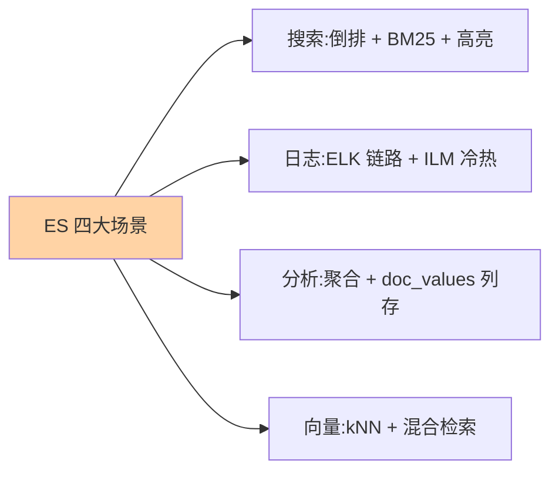

# ES 是什么：搜索、日志、分析与向量的全景

> 一句话：Elasticsearch 是基于 Lucene 的**分布式搜索与分析引擎**——用倒排索引把「文本检索」做到毫秒级，用分片架构把「海量数据」水平扩展，如今又加上向量检索拥抱语义搜索。

## 一句话摘要

ES 解决的核心问题是：**在亿级数据里「按内容找」并且「立刻算」**——关系数据库的 LIKE 全表扫描撑不起搜索与日志场景，ES 用倒排索引（按词找文档）与分布式分片（数据横向摊开）补上这块能力。它从搜索引擎起家，随版本演进长成搜索、日志、分析、向量四栖的多面手。四大典型场景：商品/内容搜索、日志分析（ELK）、业务指标聚合分析、向量语义检索（RAG 时代的新主场）。

## 一、为什么需要 ES

数据库做「按内容找」的三堵墙：`LIKE '%关键词%'` 走不了索引全表扫；分词检索（把「手机壳」拆成词再匹配）数据库没有原生能力；亿级数据的聚合统计（按维度 group by + 计数）在 OLTP 库上是灾难。ES 的答案是倒排索引——**不是「从文档里找词」，而是「从词直接找到文档」**，配合分片副本的分布式架构，把这两类需求都做到毫秒级。

## 5W 速记卡

| 维度 | 一句话 |
|---|---|
| What | 基于 Lucene 的分布式搜索与分析引擎 |
| Why | 亿级数据的全文检索、日志分析与实时聚合，数据库做不到 |
| When | 站内搜索、ELK 日志、业务 OLAP 分析、向量语义检索 |
| Where | 独立集群部署（通常与 Logstash/Beats/Kibana 组成 Elastic Stack） |
| How | 数据写入分片化的 Lucene 索引，查询经协调节点扇出到各分片汇聚 |

## 二、核心概念：索引、分片与近实时

**索引（Index）**是数据组织单元（类似数据库的表），横向切成多个**分片（shard）**分布到集群节点，每个分片有**副本（replica）**容灾。写入流程「一条文档进入 ES」：路由到主分片 → 写内存缓冲与 translog → **refresh**（默认每秒）生成可检索的段——这就是 ES「**近实时（NRT）**」的来源：写入到可搜约一秒延迟，这是与 MySQL「提交即可见」最关键的架构差异。

## 三、四大场景一张表

| 场景 | 数据特征 | ES 的用法 |
|---|---|---|
| 站内搜索 | 商品/内容，检索质量敏感 | 全文检索 + 相关性打分 + 高亮建议 |
| 日志分析 | 海量时序文本，写多读少 | ELK 链路 + 按时间 rollover + 冷热分层 |
| 业务分析 | 订单/行为数据实时聚合 | 桶/指标聚合（近实时 OLAP） |
| 向量检索 | 文本/图像 embedding | dense_vector + kNN 语义搜索（RAG 基建） |

场景与能力的映射一眼版：

## 四、与数据库的区别：MySQL / MongoDB / 向量库

| 维度 | Elasticsearch | MySQL | 专用向量库（Milvus 类） |
|---|---|---|---|
| 检索模型 | 倒排 + BM25 + 向量 kNN | B+ 树精确匹配 | 向量索引为主 |
| 事务 | 无 ACID 事务（近实时） | 完整 ACID | 弱 |
| 聚合分析 | 强（近实时） | 一般（OLTP 向） | 弱 |
| 定位 | 搜索/日志/分析/向量多面手 | 业务主数据 | 向量专精 |

**与 MySQL 的关系是互补不是替代**：业务主数据在 MySQL（事务与一致性），检索与分析副本进 ES——业内标准的「双写/同步双系统」架构。**与专用向量库的边界**：ES 的向量检索胜在「混合检索」（向量 + 关键词 + 过滤一体），亿级纯向量超大规模场景专用向量库仍有优势。

## 五、典型使用场景与误区

**典型场景**：电商搜索（分词 + 打分 + 聚合facet）、日志平台（Filebeat → Logstash → ES → Kibana）、RAG 知识库（文档切分 + embedding 入库 + 混合检索）。

**误区与不适用**：① 当主数据库用——无事务、无外键、近实时不可重复读，业务主数据放 ES 是架构错位；② 「更新」文档——ES 写入是「删旧建新」的段模型，高频更新代价高（这原是数据库的活）；③ 把 ES 的能力版图当静态的——它的边界随版本演进持续扩张（向量即近年新增），选型前查当前版本的官方能力表；④ 小数据量硬上——百万行以下的搜索需求 MySQL 索引 + 全文索引常已够用，ES 的价值在量级与检索质量。

## 六、你们可能会问

**Q1：ES 为什么快？**
倒排索引（词→文档的定位）+ 分片并行（查询扇出到所有分片汇聚）+ 列存 doc_values（聚合加速）三层合力——「快」是结构性的，不是参数调出来的。

**Q2：ES 是数据库吗？**
它是「搜索与分析引擎」——有存储有索引但无事务，把它当「检索与分析的副本层」，业务主库仍是关系数据库，这是最不容易走弯路的定位。

**Q3：RAG 时代 ES 还重要吗？**
更重要——kNN 向量检索 + BM25 关键词的混合检索是 RAG 召回质量的主流方案，ES 天然一体支持，这是它近年最重要的演进方向，也是它的新主场。

## 七、自测三问

1. 近实时（NRT）是什么意思？由哪个环节决定？
2. ES 与 MySQL 的定位差异一句话？
3. 四大场景各依赖 ES 的哪块核心能力？

下一篇讲「Lucene 与倒排索引」：为什么快的地基——倒排结构与词典机制。

## 📌 数据与事实声明

- 写于 2026-09-08，对标 Elasticsearch 9.x（官方文档 elastic.co/docs 为准）
- 「refresh 默认 1 秒」为官方默认值口径
- 免责：版本迭代快，特性以官方文档为准

## 📚 参考资料

| 类型 | 标题 | 来源 |
|---|---|---|
| 官方文档 | Elasticsearch Guide | elastic.co/docs |
| 实战书 | 《Elasticsearch in Action》Radu Gheorghe | 公开出版 |
| 原理书 | 《Elasticsearch 源码解析与优化实战》张超 | 公开出版 |
