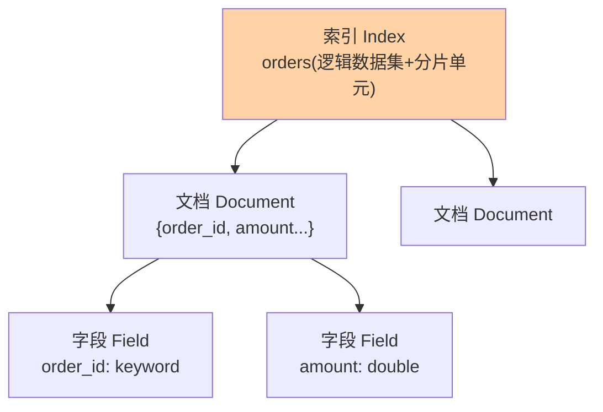

# 索引、文档与字段：ES 的数据模型与 type 移除史

> 从 MySQL 迁移心智到 ES，最容易犯的错是「翻译概念」——index 不是库，type 已成历史。这篇建立 ES 原生的三层模型（索引/文档/字段），顺带讲清 type 是怎么被移除的，理解「为什么删」比记住「删了」更有价值。

## 一句话摘要

ES 的数据模型三层：**索引（Index，逻辑数据集，对应「表」而非「库」）→ 文档（Document，JSON 单元，对应「行」）→ 字段（Field，JSON 键值）**。**mapping type 在 7.x 废弃、8.x 彻底移除**——因为「同一索引多种 type 共存」的语义在分布式过滤与空索引判断上漏洞百出，移除是「错误抽象的修正」。文档是**不可变**的：更新 = 删旧版本 + 建新版本（_version 递增），这与段模型一脉相承。

## 一、为什么概念要先纠偏

拿关系模型硬套 ES 会踩三个坑：把 index 当「库」来规划（导致索引碎片化）、期待文档级事务（ES 没有）、把 type 当分类器用（7.x 后直接报错）。**用 ES 原生模型思考：一个业务主题一个索引，一条记录一个文档，字段按用途选类型**——概念对了，后面的 mapping、分片设计才不会歪。

## 5W 速记卡

| 维度 | 一句话 |
|---|---|
| What | 索引/文档/字段三层模型 + 不可变文档 + 移除 type 的扁平命名空间 |
| Why | 检索引擎需要「按索引组织、按文档写入、按字段检索」的模型 |
| When | 建索引规划、写入与更新、版本并发控制时 |
| Where | `PUT /索引名/_doc/文档ID` 的 REST 语义里 |
| How | 文档 JSON 写入 → 路由到主分片 → 版本号递增的删除重建 |

## 二、三层模型与不可变文档



**文档不可变**：`_update` 语义是「取旧文档 → 改字段 → 存为新版本」，`_version` 单调递增——并发更新靠版本号检测冲突（乐观并发）：

```mermaid
flowchart LR
    U["更新请求"] --> G["取旧文档<br/>version N"]
    G --> W["写入新版本<br/>version N+1:删旧建新"]
    W --> CC{"并发冲突检测"}
    CC -->|"版本匹配"| OK["写入成功"]
    CC -->|"版本已变"| CF["409 冲突:按策略重试"]
    style OK fill:#a8e6a3
    style CF fill:#ff8b94
```这带来两个设计推论：**高频字段级更新代价高**（整文档重建），**读到的永远是完整版本**（无部分写）。版本控制还有 `if_seq_no/if_primary_term` 的精确对账写法（替代被废弃的外部版本写法），写入冲突敏感场景必用。

## 三、type 移除史：一次错误抽象的退场

历史上（ES 5.x 以前）一个索引内可以有多个 type（如 `shop` 索引里 `goods` 与 `review` 两个 type），初衷是「同库多表」。但这个抽象埋着雷：**不同 type 的同名字段在 Lucene 层被迫共享同一字段定义**（不同 type 想要不同类型就冲突），且「type 为空才允许某些操作」的判定在分布式场景开销巨大。官方演进路线：6.x 限一索引一 type → 7.x 废弃 type 参数（默认 `_doc`）→ 8.x 彻底移除。**教训沉淀：当两个概念的区分「只在 API 层有意义、在底层是同一份存储」时，这个抽象迟早被拆**——「一索引一 type」演进成今天的最佳实践。

## 四、与关系模型的区别：MySQL / MongoDB 对照

| 维度 | ES 索引/文档 | MySQL 库/表/行 | MongoDB 集合/文档 |
|---|---|---|---|
| 索引定位 | ≈ 表（不是库！） | 库与表两级 | 集合 |
| 文档/行 | 不可变、版本化 | 可变、原位更新 | 可变文档 |
| 事务 | 无跨文档事务 | 完整 ACID | 单文档原子/4.0+ 多文档 |
| 模式 | 动态/显式 mapping | 显式 DDL | 无模式 |

对照记忆：**索引 ≈ 表**是纠偏第一课；与 MongoDB 的「文档可变性」差异是第二课——同为文档模型，ES 的段架构决定了它的更新语义完全不同。

## 五、典型场景与误区

**典型场景**：订单检索索引（一订单一文档，字段按检索用途建模）、商品主数据检索副本（MySQL 同步而来，ES 只做读）、日志索引（按天建索引，文档只写不改——与不可变模型天然契合）。

**误区与不适用**：① 按时间「更新」大文档的高频字段——整文档重建代价高，更新密集字段考虑拆到独立索引或回库；② 用文档 ID 当业务外键做级联——ES 无 join 语义（nested/parent-join 是受限替代），关联建模靠冗余或应用层组装；③ 忽视 `_version` 并发冲突——多入口写同一文档时，不做版本控制的更新会静默覆盖。

## 六、你们可能会问

**Q1：为什么文档 ID 还要自己指定？**
不指定则 ES 自动生成（UUID 类）。业务语义键（订单号）做 `_id` 的好处是天然幂等（重复写入覆盖同一文档）与免二次路由查询；代价是 ID 分布若非随机可能引发分片热点（路由 = hash(_id)）。

**Q2：routing 是什么？**
文档路由默认 `hash(_id) % 主分片数`——也可自定义 routing（如按租户），把相关文档聚到同分片优化查询；代价是分布倾斜风险，属进阶用法。

**Q3：type 移除后老代码怎么办？**
7.x 过渡期已给足迁移路径（`include_type_name` 参数逐步废弃）——8.x 起去掉 URL 里的 type 即可，这是史上兼容期最长的移除之一。

## 七、自测三问

1. index/document/field 对应关系模型里的什么？最容易翻车的翻译是哪个？
2. type 为什么被移除？这条演进史沉淀了什么教训？
3. 文档不可变带来哪两个设计推论？

下一篇讲「Mapping 与字段类型」：text 与 keyword 的分野是检索正确性的第一关。

## 📌 数据与事实声明

- 写于 2026-09-08，对标 ES 9.x；type 移除时间线（6.x/7.x/8.x）为官方演进口径
- 「routing 默认 hash(_id)」为官方默认行为
- 免责：API 语义以 elastic.co/docs 为准

## 📚 参考资料

| 类型 | 标题 | 来源 |
|---|---|---|
| 官方文档 | Mapping / Removal of mapping types | elastic.co/docs |
| 实战书 | 《Elasticsearch in Action》Radu Gheorghe | 公开出版 |
| 原理书 | 《Elasticsearch 源码解析与优化实战》张超 | 公开出版 |
