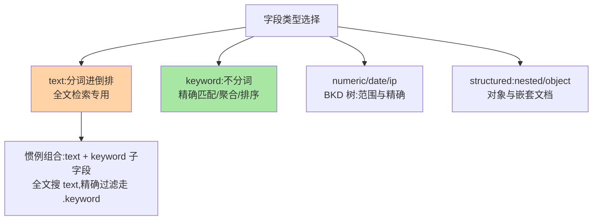

# Mapping 与字段类型：text 与 keyword 的分野

> ES 检索结果「时对时错」的第一嫌疑人是 mapping：同一个字符串字段，text 与 keyword 是两种命运——一个分词进倒排、一个原样做精确值。这篇讲清映射机制、核心字段类型与「动态映射的惊喜」。

## 一句话摘要

Mapping 是索引的**字段类型定义**（类似表的 DDL 但更丰富）：**text** 走分词进倒排（全文检索），**keyword** 不分词原样入倒排（精确匹配/聚合/排序），numeric/date/ip 等精确类型各有专用结构（BKD 树）。**动态映射**会在首次写入时自动推断类型——方便但常猜错（长文本被猜成 text+keyword 组合、数字猜成 long），**生产索引显式建 mapping 是纪律**。一个字段常配「text + keyword 子字段」双形态：全文搜 text、精确过滤聚合走 `field.keyword`。

## 一、为什么 mapping 是检索正确性的第一关

「检索行为 = 分词 + 结构」的乘积——两层架构组合定生死：mapping 定字段类型（决定分不分词、用什么索引结构），分词器定怎么拆（篇 5），两者共同决定「什么词能命中什么文档」。**检索不到的第一排查位就是 mapping**（`GET /索引/_mapping`）：字段被动态映射猜错类型、text 当 keyword 用（整句当一个 term）、keyword 当 text 用（分不出词）——三类事故占「搜不到/聚合不了」的大多数。

## 5W 速记卡

| 维度 | 一句话 |
|---|---|
| What | 字段类型定义（text/keyword/numeric/date/对象嵌套等） |
| Why | 字段类型决定分词行为与底层索引结构，是检索正确性的源头 |
| When | 建索引时显式定义；搜不到/聚合不了时排查 |
| Where | `GET/PUT /索引/_mapping` |
| How | text 分词进倒排做全文，keyword 原样做精确与聚合 |

## 二、核心字段类型一张表

类型选择是 mapping 的架构主干：

- **text vs keyword** 是第一分野：`商品标题` 要全文搜（text），`订单状态` 要精确过滤与聚合（keyword）；**同一字段要两种能力就配 text + keyword 子字段**——标题能全文搜、也能按「完整标题精确匹配」聚合
- **numeric/date** 走 BKD 树：范围查询（价格区间、时间窗）高效；**注意 range 查询的字段必须是数值/日期类型**——字符串数字无法 range（动态映射猜成 text 的经典事故）
- **object 与 nested**：JSON 对象默认拍平（object，数组内对象字段跨对象错配）；nested 把每个对象做成独立隐藏文档（精确按对象匹配，代价是文档数膨胀）

## 三、动态映射的「惊喜」与显式定义

首次写入未定义字段时，ES 按首值推断：JSON 数字→long/float、`true`→boolean、字符串→「text + keyword 子字段」（默认动态规则）、日期格式匹配→date。动态映射规则本身随版本演进调整过（字符串默认从 text 演进到 text+keyword 双形态），方便与错配之间的权衡由 dynamic 参数表达。代价恒定：**猜错不可逆**——已建字段的类型不能改（只能 reindex 重建）。生产纪律：**建索引时 `PUT /索引` 带显式 mapping，关闭或收紧 dynamic（`dynamic: strict` 对核心索引）**——让「猜错」在开发期报错，而不是在生产期静默错配。

## 四、与关系模型 DDL 的区别：MySQL schema 对照

| 维度 | ES mapping | MySQL DDL |
|---|---|---|
| 定义时机 | 写入前（或动态推断） | 建表显式 DDL |
| 类型可变性 | **不可改已有字段类型**（需 reindex） | ALTER 可改（有代价） |
| 多态 | 一字段多形态（text+keyword 子字段） | 一列一类型 |
| 事务约束 | 无 | DDL 约束 + 事务 |

核心差异：**ES 改字段类型的唯一路径是 reindex**——schema 演进自由度与 reindex 代价之间的取舍，MySQL 的 ALTER 灵活得多。标准路径（新建正确 mapping → _reindex → 别名原子切换）：

——所以 mapping 设计要「向前多想一步」（未来会不会按这个字段聚合/排序），reindex 大索引的代价让它成为最该避免的操作。

## 五、典型场景与误区

**典型场景**：商品索引（标题 text+keyword、类目 keyword、价格 double、上架时间 date、规格 nested）；日志索引（message text、服务名 keyword、level keyword——按服务聚合走 keyword）。

**误区与不适用**：① 一切字段全 text——聚合与精确过滤全废；② 一切字段全 keyword——全文检索能力归零；给字段「按用途」选类型是建模架构的基本功，而不是「图省事」一锅端；③ nested 滥用——每个嵌套对象是独立 Lucene 文档，大 nested 数组建索引与查询代价陡增；④ dynamic 放任生产——动态映射的「惊喜」在数据多样性高的入口（用户提交类）必然发生；mapping 还要随业务演进定期评估，新查询形态可能需要新字段形态。

## 六、你们可能会问

**Q1：text + keyword 子字段的双倍索引，值得吗？**
看双能力是否真实需要——索引空间与检索能力的权衡：标题类字段（既全文搜又精确下拉）值得；纯过滤字段直接 keyword、纯检索字段直接 text——双形态是按需选项不是默认项。

**Q2：已有索引字段类型错了怎么办？**
唯一正路是 reindex：建新索引（正确 mapping）→ `_reindex` → 别名原子切换。数据量大时按 `slices` 并行——并把「reindex 代价」写进 mapping 评审的敬畏清单。

**Q3：copy_to 是什么？**
把多个字段的值复制进一个检索字段（如 `title + description → all_text`）实现跨字段全文搜——与 multi_match 相比多耗索引空间但查询简单，二选一按场景。

## 七、自测三问

1. text 与 keyword 的分野是什么？双形态子字段怎么用？
2. 动态映射的典型「猜错」有哪些？生产怎么防？
3. 改字段类型的唯一路径是什么？这带来什么设计纪律？

下一篇讲「分词器与中文分词」：analyzer 三件套与 IK 分词。

## 📌 数据与事实声明

- 写于 2026-09-08，对标 ES 9.x；动态映射默认规则（字符串 → text+keyword）为官方默认
- 「已建字段类型不可改、需 reindex」为官方行为
- 免责：以 elastic.co/docs 为准

## 📚 参考资料

| 类型 | 标题 | 来源 |
|---|---|---|
| 官方文档 | Mapping / Field datatypes | elastic.co/docs |
| 实战书 | 《Elasticsearch 实战》（mapping 章） | 公开出版 |
| 实战书 | 《Elasticsearch in Action》Radu Gheorghe | 公开出版 |
