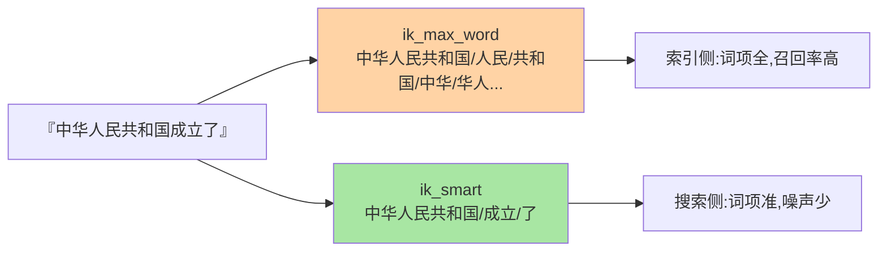

# 分词器与中文分词：检索正确性的第一道工序

> 「搜『西红柿』找不到『番茄炒蛋』、搜『手机壳』命中『手机』」——九成检索质量问题出在分词。这篇讲清 analyzer 三件套、analyzer 与 search_analyzer 的分工、IK 中文分词的两种模式，建立「分词决定词项」的直觉。

## 一句话摘要

分词器（analyzer）把文本拆成进倒排索引的**词项**，三件套构成：**character filter（预处理清洗）→ tokenizer（切词）→ token filter（加工：小写/停用词/同义词）**。**中文分词是特殊战场**——空格不切词，需要词典+统计模型（IK 的 ik_max_word 细粒度 / ik_smart 粗粒度）。**核心纪律：索引与搜索两侧的分词器要配对**（写入用 ik_max_word 保证词项丰富，搜索用 ik_smart 保证查询词精准），分词不一致 = 搜不到的直接病根。

## 一、为什么分词是第一道工序

倒排索引的原料就是词项——分词决定「索引里有哪些 term」。分词错了，后面 BM25 打分再精也救不回来：「清华大学的口碑」若不分词当一个整 term，搜「清华大学」永远命中不了。**分词是检索质量的乘数因子**：它错一层，查询层怎么优化都事倍功半。

## 5W 速记卡

| 维度 | 一句话 |
|---|---|
| What | character filter → tokenizer → token filter 的文本加工流水线 |
| Why | 词项是倒排的原料，分词决定什么能被搜到 |
| When | 建索引选 analyzer、检索质量排查、中文场景选 IK |
| Where | mapping 的 analyzer / search_analyzer 字段配置 |
| How | 索引侧细粒度切（ik_max_word），搜索侧粗粒度（ik_smart） |

## 二、analyzer 三件套与内置分词器

内置分词器：**standard**（默认，中文按单字切——能用但检索质量差）、**simple/whitespace**（英文简单场景）、**english**（含词干化停用词）。中文按单字切的 standard 在生产几乎必换 **IK**——单字切分无词义，BM25 打分与召回质量都受限。

## 三、IK 中文分词：两种模式的配对哲学

配对效果的差异一目了然：

IK 的两个分析器：**ik_max_word**（最细粒度：「中华人民共和国」→ 中华人民共和国/人民/共和国/中华/华人/人民共和...）与 **ik_smart**（最粗粒度：→ 中华人民共和国）。配对哲学：**索引侧 max_word（词项越全，任何角度的搜索都能命中），搜索侧 smart（查询词越准，噪声越少）**——这就是「索引与搜索分词器配对」的业界默认姿势。

**自定义词典**是 IK 的生产必备：业务专有名词（产品名、人名、热词）不在通用词典里会被切碎——IK 支持主词典/停用词典/扩充词典，且支持热更新（远程词典轮询）。**词典治理是中文搜索的长期运营工作**，不是一次性配置——从通用词典到业务词典的演进，是中文搜索体系成熟的标志。

## 四、与英文分词的区别：MySQL / 英文场景对照

| 维度 | 中文分词（IK） | 英文分词（english） |
|---|---|---|
| 切分依据 | 词典 + 统计模型 | 空格 + 词干化 |
| 难点 | 歧义切分、新词 | 时态/复数归一 |
| 运营成本 | 词典持续运营 | 相对低 |

与 MySQL 的对照：MySQL 全文索引对中文支持弱（内建分词简陋，ngram 是补丁方案）——从 MySQL 全文索引演进到 ES 分词生态是中文检索的基础架构升级，**ES 的分词生态是决定性优势**，这也是「中文场景选 ES」的主要理由之一。

## 五、典型场景与误区

**典型场景**：商品标题检索（ik_max_word 索引 + ik_smart 搜索 + 同义词「手机=移动电话」）、人名机构检索（自定义词典保专名）、日志 message 中文检索（standard 单字切可接受的容忍场景）。

**误区与不适用**：① 索引与搜索分词器随便配——不一致就是「写进去的搜不出来」；② 一切字段全 ik_max_word——状态码、品牌 ID 这类精确值字段该用 keyword，分词是浪费；③ 词典一配了之——新业务新热词没有词典运营机制，检索质量会随时间衰减；④ 忽视 `_analyze` 工具——它就是分词的「显微镜」，任何分词问题先 `POST _analyze` 看切出来的词项再下结论。

## 六、你们可能会问

**Q1：怎么快速验证一段文本的分词结果？**
`POST /索引/_analyze {"analyzer": "ik_max_word", "text": "..."}` 直接看词项流——排查「搜不到」的第一步永远是看两侧切出来的词是否对得上。

**Q2：ik_max_word 和 ik_smart 到底哪个做索引侧？**
默认配对是 max_word 索引 + smart 搜索；追求召回率极特殊的场景也有双 max_word 的用法（接受噪声换召回）——配对原则是「索引词项是搜索词项的超集」，保证任何查询词都能在索引里找到对应 term——上下游模块的这条契约是配对配置的架构底线。

**Q3：拼音检索怎么做？**
拼音分词插件（把汉字转拼音 token 进索引）+ 自定义 analyzer 组合——常与 IK 组成多 analyzer 字段（一个字段多路索引），中文与拼音双路检索。

## 七、自测三问

1. analyzer 三件套各自干什么？
2. ik_max_word 与 ik_smart 的配对哲学是什么？「超集关系」为什么重要？
3. 「搜不到」的第一排查动作是什么？

下一篇讲「文本处理」：同义词、停用词与归一化的治理。

## 📌 数据与事实声明

- 写于 2026-09-08，analyzer 三件套与 IK 模式为官方/插件公开口径
- 「词典运营」为工程实践口径
- 免责：插件版本行为以官方文档为准

## 📚 参考资料

| 类型 | 标题 | 来源 |
|---|---|---|
| 官方文档 | Analyzers / IK 分词插件 | elastic.co/docs、github.com/infinilabs/analysis-ik |
| 实战书 | 《Elasticsearch 实战》（分词章） | 公开出版 |
| 实战书 | 《Elasticsearch in Action》Radu Gheorghe | 公开出版 |
