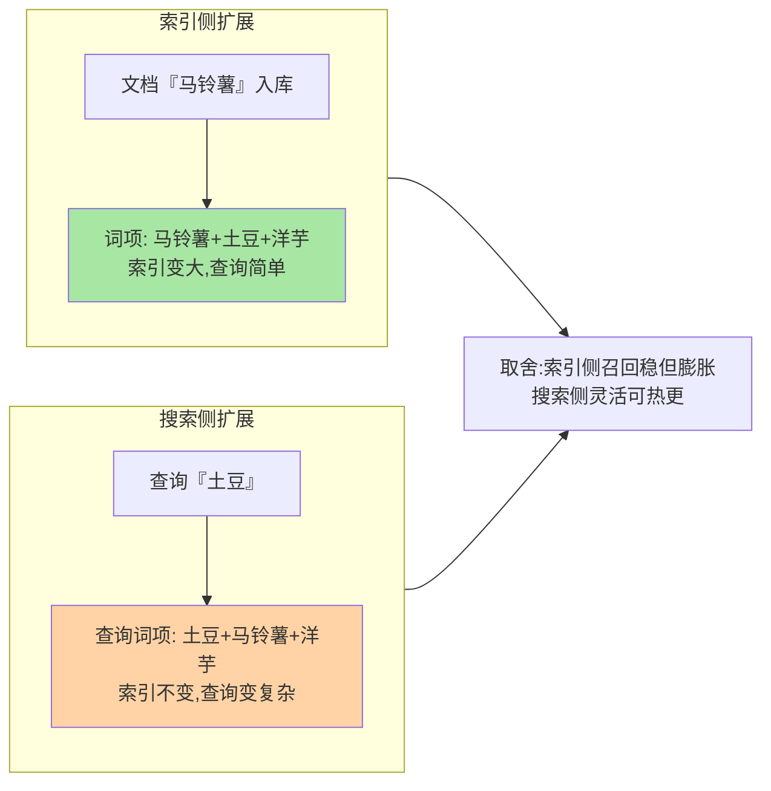
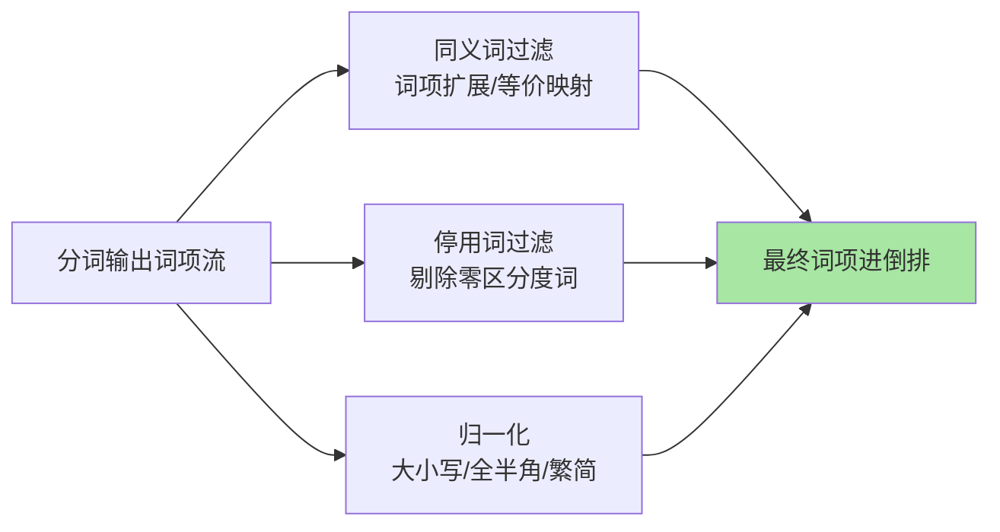

# 文本处理：同义词、停用词与归一化

> 分词解决「切得对」，文本处理解决「对得上」：用户搜「土豆」，商品写的是「马铃薯」——同义词让两个词项连起来。这篇讲 token filter 层的三大治理件：同义词、停用词、归一化，它们是搜索质量的第二增长曲线。

## 一句话摘要

token filter 在分词后加工词项：**同义词过滤**（synonym graph，把「土豆/马铃薯/洋芋」映射成等价词项，索引侧扩展文档词、搜索侧扩展查询词）、**停用词**（把「的/了/the/is」这类无区分度的高频词剔除，省索引提精度）、**归一化**（大小写、全半角、繁简、词干——把「同一事实的多种写法」归拢成同一词项）。三件都是**索引结构级决策**：改规则意味着 reindex，上线前要想清楚。

## 一、为什么需要文本处理层

分词把「番茄炒蛋的做法」切成词项，但用户搜的是「西红柿炒蛋」——**词项层不匹配，倒排就无从命中**。检索链路的架构分工正在于此：分词管切分，文本处理管对得上。文本处理层的使命：在词项进索引前/查询词进检索前，把「语义等价但字面不同」「无信息量」「书写变体」统一处理。它决定了「召回的天花板」，是搜索从「能用」到「好用」的分水岭。

## 5W 速记卡

| 维度 | 一句话 |
|---|---|
| What | 同义词/停用词/归一化三类 token filter 治理 |
| Why | 字面不同的等价表达要能互相命中 |
| When | 检索召回率不达预期、搜索质量专项 |
| Where | analyzer 的 token filter 配置 + 同义词词典文件 |
| How | synonym_graph 等价映射 + stopwords 剔除 + lowercase/归一链 |

## 二、同义词：索引侧还是搜索侧

**索引侧扩展**：文档入库时词项已扩展——召回稳定、reindex 后一致；代价索引膨胀，**改同义词表要 reindex**。**搜索侧扩展**：查询时展开——同义词表可热更新（运营改词即时生效）；代价是查询复杂度上升、新词覆盖不了存量特殊写法。业内常用折中：**双向各配常用等价词（索引侧放稳定核心词），搜索侧放灵活运营词**——同义词分「语言级等价」（稳定，索引侧）与「业务级等价」（常变，搜索侧）两层治理。

**synonym_graph** 过滤器支持多词同义与位置感知（graph 结构），是当前推荐的过滤器（synonym 已属历史 API）。文本处理链的整体位置：

## 三、停用词与归一化：去噪与归拢

- **停用词**：「的/了/在/the/a」出现频率极高但区分度为零——剔除后索引更小、BM25 的 IDF 计算更准。注意**中文停用词表要谨慎**：「的」在品牌名（「口腔的」类 edge case）与短语匹配里可能有用——停用词表不是越大越好
- **归一化**：lowercase（大小写）、asciifolding（重音符）、CJK 全半角、繁简转换（需要插件）、词干化（英文 porter_stem：running→run）。归一化的目标：**同一事实只有一种词项形态**——「iPhone」与「iphone」是两个词项还是一个是归一化决策，直接影响命中

## 四、与 MySQL 全文检索的区别：处理能力的代差

| 维度 | ES token filter 层 | MySQL 全文索引 |
|---|---|---|
| 同义词 | 可配置（graph 结构、双侧行） | 无原生 |
| 停用词 | 可自定义多语言表 | 内置有限 |
| 归一化 | 插件生态丰富 | 有限 |

文本处理层的可编排性是 ES 检索质量的护城河——MySQL 全文索引够用但不长于精细化治理，检索质量要求高时迁移 ES 是业内常规路径——这也是搜索架构演进中代差最明显的一层。

## 五、典型场景与误区

**典型场景**：电商同义词运营（「土豆=马铃薯」「手机=移动电话=手机号」分级治理）、内容平台繁简混排（归一化统一词项）、站内搜索去噪（停用词 + lowercase 基础链）。

**误区与不适用**：① 同义词表无治理机制——词表是运营资产，没评审没版本，错一条污染全站召回；② 停用词表照搬英文经验——中文停用词误伤率高，小表起步观察；③ 归一化规则随意加——每条规则都在改词项形态，加错要 reindex，规则上线前用 `_analyze` 全量验证。

## 六、你们可能会问

**Q1：同义词改了词表，必须 reindex 吗？**
只有索引侧扩展需要；搜索侧扩展（search_analyzer 的同义词）热更新即可——这正是「双层治理」的技术动因。

**Q2：怎么评估同义词的效果？**
A/B 观察：同义词命中带来的新增召回占比、点击率是否正常（召回对了点击不对 = 同义词噪声）——同义词的验收是搜索质量指标不是配置完成。

**Q3：停用词影响 BM25 打分吗？**
影响且通常变好——高频无区分词剔除后，剩余词项的 IDF 更有区分度；但剔除词的语义贡献（否定词「不」）要警惕，中文否定词不能进停用词表。

## 七、自测三问

1. 同义词索引侧与搜索侧扩展各用什么换什么？双层治理怎么分？
2. 停用词与归一化各解决什么问题？误伤风险在哪？
3. 为什么文本处理规则要「上线前想清楚」？

下一篇讲「高亮与搜索建议」：检索结果体验层的两大件。

## 📌 数据与事实声明

- 写于 2026-09-08，synonym_graph/stop filter 等为 ES 9.x 官方 API 口径
- 同义词双侧取舍为业界工程共识的归纳
- 免责：以 elastic.co/docs 为准

## 📚 参考资料

| 类型 | 标题 | 来源 |
|---|---|---|
| 官方文档 | Token filters / Synonym graph | elastic.co/docs |
| 实战书 | 《Elasticsearch 实战》（文本处理章） | 公开出版 |
| 实战书 | 《Elasticsearch in Action》Radu Gheorghe | 公开出版 |
