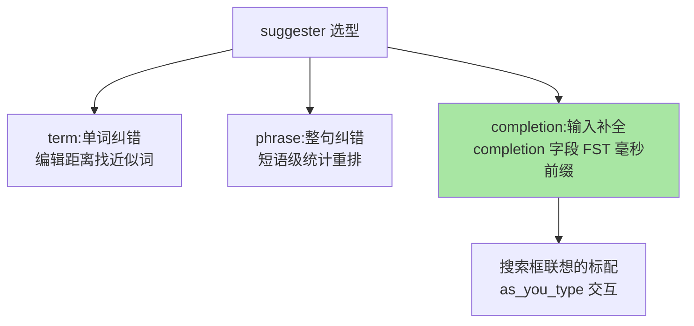

# 高亮与搜索建议：搜索体验的两大件

> 检索结果「找得到」之后，用户还要「看得清」与「打得快」：高亮告诉用户为什么命中，搜索建议替用户把词打对。这两件体验层的功能都建立在已学过的机制上——高亮复用分词链路，建议（suggester）复用专用索引结构。

## 一句话摘要

**高亮（highlight）**：在命中文档里定位查询词并加标记（`<em>` 标签），三种实现（unified 为主流默认）本质是「词项在原文中的定位回放」；**搜索建议（suggester）**：term/phrase 纠错补全（编辑距离找近似词）、completion 前缀补全（专用 completion 字段，FST 结构毫秒响应）。两者都是「检索主链路之外的用户体验件」——代价模型不同，选型看交互场景。

## 一、为什么体验件值得单独讲

搜索质量的评价不只「召回对不对」，还有「用户感知到的对不对」：结果页没有高亮，用户不知道哪段命中了；输入有错字没有纠错建议，用户卡在搜索框。**体验件直接影响转化率**——电商站内搜索的 A/B 数据反复验证：高亮与纠错建议的完备度与搜索转化正相关。机制上它们都「借用」前几篇的基础设施：高亮用分词链路定位，补全用专用索引结构——体验层与检索层的这种架构复用，是 ES 生态演进的典型模式。

## 5W 速记卡

| 维度 | 一句话 |
|---|---|
| What | 结果高亮（highlight）+ 纠错补全（term/phrase/completion suggester） |
| Why | 「感知到的相关」与「命中」同样影响转化 |
| When | 结果页渲染、搜索框输入联想、零结果页纠错 |
| Where | 查询体 highlight 块 / suggest 块 + completion 字段 mapping |
| How | 分词定位回放做高亮；FST 前缀/编辑距离做建议 |

## 二、高亮：命中位置的回放

主流实现 **unified highlighter**（默认推荐）：按需选择「词项向量或原文重分词」定位，兼顾性能与正确性。工程要点：`fragment_size` 控制片段长度（移动端更短）、`number_of_fragments` 控制条数、**高亮字段必须是可分词的 text**（keyword 整串高亮无意义）。性能账：高亮是查询时逐文档的重放动作，结果集大时高亮开销显著——**只对返回的 Top N 结果开高亮**（窗口查询已天然限定），别对全量命中开。

## 三、搜索建议：三种 suggester 的分工

- **term suggester**：查不到时给「你是不是要搜：××」（编辑距离最近的词项）——零结果页的标准补救
- **phrase suggester**：整句级别纠错（考虑词间搭配统计），纠错质量高于逐词 term
- **completion suggester**：搜索框联想的标配——completion 专用字段以 FST 结构常驻内存，前缀补全毫秒级；代价是**专用字段与专用索引**（不能当普通文本检索），且更新走重建路径

三者组合的生产形态：输入中用 completion 联想、无结果时 term/phrase 纠错——「联想 + 兜底纠错」双层建议链。

## 四、与数据库 LIKE 的区别：体验代差的来源

LIKE `%词%` 只能给「原始匹配」，高亮靠应用层字符串替换（脆弱）、建议靠另建方案；ES 的体验件**复用分词与索引结构**，是「检索链路的原生能力」。这层代差的本质：**体验件需要「词项级」的理解，只有分词索引体系才有词项**——这也是搜索场景选 ES 而非 LIKE 的体验侧理由——两代方案在体验能力上的演进代差清晰可见。

## 五、典型场景与误区

**典型场景**：电商结果页高亮（标题 + 关键卖点字段）、搜索框联想（completion 存「热门词 + 品牌词」，按热度权重排序）、零结果页纠错（term suggester + 「换个词试试」话术）。

**误区与不适用**：① 高亮字段选错（对 keyword 字段高亮整串）；② completion 字段当普通文本用（语义完全不同）；③ 联想词表无运营——completion 的输入是「业务想推什么」，热词榜与业务运营脱节则联想无价值；④ 纠错建议过度自信——「你是不是要搜」给 2-3 个候选即可，自动改写查询要谨慎（改错方向比不纠错更伤信任）。

## 六、你们可能会问

**Q1：高亮的标记会被 XSS 吗？**
高亮标签是 ES 注入的固定标签（pre/post_tags），但**原文内容本身**可能含恶意标签——前端渲染时对片段做转义，标签白名单放行，安全责任在前端不在 ES。

**Q2：completion 联想怎么带业务权重？**
completion 字段支持 contexts（分类过滤）与输入变体多权重——热度排序常见做法是「定时任务按搜索量重刷联想索引」，联想词表是运营产物不是静态配置。

**Q3：高亮命中了但用户搜的词被分词拆开了怎么办？**
unified 高亮按查询词项逐个定位——「手机壳」拆成「手机」「壳」会分别高亮（可能高亮不连续片段），这是分词语义的正确回放；要整词高亮需查询侧用短语匹配（match_phrase）控制。

## 七、自测三问

1. 高亮的三种实现里为什么 unified 是默认推荐？
2. 三种 suggester 各解决什么交互问题？组合形态是什么？
3. 「体验件复用检索基础设施」体现在哪两处？

下一篇进入检索核心：「查询 DSL」——match/term/range/bool 的组合逻辑。

## 📌 数据与事实声明

- 写于 2026-09-08，unified 默认、completion FST 为 ES 9.x 官方口径
- 「转化率正相关」为搜索产品公开实践的共识归纳
- 免责：以 elastic.co/docs 为准

## 📚 参考资料

| 类型 | 标题 | 来源 |
|---|---|---|
| 官方文档 | Highlighters / Search suggesters | elastic.co/docs |
| 实战书 | 《Elasticsearch 实战》（高亮与建议章） | 公开出版 |
| 实战书 | 《Elasticsearch in Action》Radu Gheorghe | 公开出版 |
