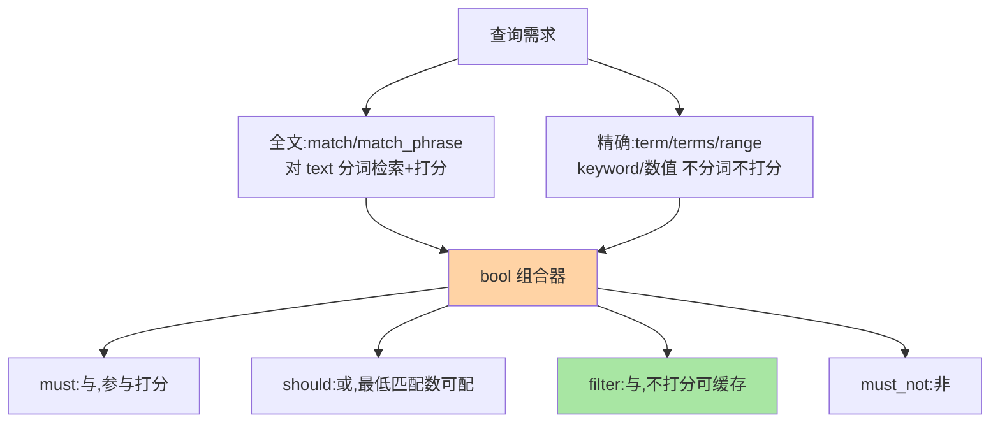
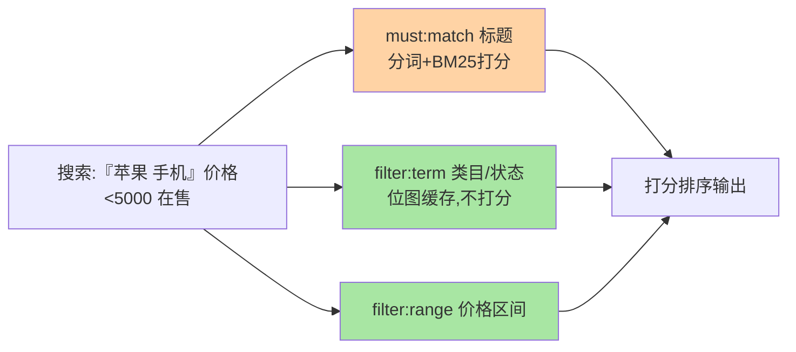

# 查询 DSL：match、term 与 bool 的组合逻辑

> ES 查询的第一道认知关：**match 会分词、term 不分词**——这一字之差决定检索语义。这篇讲清两大查询族（全文 vs 精确）、bool 的组合逻辑、query 与 filter context 的性能分野，DSL 的组合能力就全部打通了。

## 一句话摘要

查询 DSL 分两族：**全文查询（match/match_phrase）**对 text 字段分词检索、带相关性打分；**精确查询（term/terms/range）**对 keyword/数值字段精确匹配、不打分。**bool 查询是组合器**：must（与，打分）/ should（或，影响分）/ filter（与，不打分）/ must_not（非）。**query context 打分、filter context 不打分**——过滤条件全走 filter（可被位图缓存，性能数量级优势），这是 ES 查询性能调优的第一原则。

## 一、为什么 DSL 的分类要先立住

「为什么我的 term 查询搜不到？」「为什么 range 查询这么慢？」——多数查询问题的根源是把两族查询用混了：term 查 text 字段（分词后的词项 ≠ 原文整串）、全文需求用了 filter（无打分无相关性）。**先立「两族 + 一组合器」的框架，DSL 的几十种查询都能挂进框架理解**。

## 5W 速记卡

| 维度 | 一句话 |
|---|---|
| What | 全文族（match 系）+ 精确族（term/range 系）+ bool 组合器 |
| Why | 检索语义二分：要相关性的全文匹配 vs 要精确的过滤 |
| When | 构造一切检索请求时 |
| Where | `GET /索引/_search` 的 query 体 |
| How | 全文走分词打分，精确走词项比对，bool 组合四类子句 |

## 二、两族查询与 bool 组合

一个典型组合（商品搜索）的执行分层：

具体写法（商品搜索）：`match`（标题关键词，相关性排序）+ `filter: term`（类目/状态精确过滤）+ `filter: range`（价格区间）——**「全文找 + 精确筛」是 ES 查询的标准骨架**。注意 term 查 keyword 字段用原值，查 text 字段匹配的是分词后的词项（「手机壳」在 text 里可能是两个词项，term 「手机壳」查不到——这是第一高频误区）。

## 三、query vs filter context：打分与缓存的分野

query context（must/should 内）回答「匹配得多好」→ 算 BM25 分；filter context（filter/must_not 内）回答「匹不匹配」→ 只算命中，**且可被位图缓存**（相同 filter 条件跨查询复用）。性能含义：**时间戳、状态、类目这类不变语义的过滤全放 filter**，查询性能可数量级提升——filter 缓存是 ES 查询调优的第一杠杆。经验法则：「参与排序的条件放 must，参与筛选的条件全放 filter」。

## 四、与 SQL WHERE 的区别：MySQL 对照

| 维度 | ES DSL | SQL WHERE |
|---|---|---|
| 打分语义 | 相关性分数排序 | 无（精确匹配） |
| 缓存粒度 | filter context 位图缓存 | 执行计划级 |
| 分词介入 | match 系分词 | LIKE/全文函数 |
| 组合 | bool 四类子句 | AND/OR/NOT |

SQL 的 WHERE 是纯布尔语义，DSL 多了「相关性」这层——**从 SQL 转 ES 的心智转换核心就是接受「打分排序」成为一等公民**——这是两代查询架构演进出的语义分野。

## 五、典型场景与误区

**典型场景**：商品搜索（match 标题 + filter 类目/价格/状态）、日志检索（match message + filter 时间窗与服务名，时间窗必放 filter 吃缓存）、圈人（terms 标签 + must_not 黑名单）。

**误区与不适用**：① term 查 text 字段——分词语义错位，应 match 或用 keyword 子字段；② 过滤条件放 must——白白打分且不吃 filter 缓存；③ should 单独用不生效——打分与缓存的分工是查询架构的基本功（有 must 时 should 只是加分项，要「至少满足」需 `minimum_should_match`）；④ 分页用 from+size 深翻——默认最多 10000（window 限制），深翻页用 search_after（原理与限制在聚合特性层展开）。

## 六、你们可能会问

**Q1：match_phrase 和 match 的区别？**
match 是「包含任一/多数词项」（按分词），match_phrase 要求「词项按顺序相邻出现」（位置信息）——短语语义更强、召回更窄，精确句式搜索用 phrase。

**Q2：filter 缓存什么时候会失效？**
段（segment）级别缓存——段合并或刷新产生新段后按段重建；「不变条件的过滤」跨查询命中率高，所以时间窗这类滚动条件也建议 filter（按近期段命中）。

**Q3：怎么调试一条 DSL？**
`_validate/query?explain` 看语法与执行计划、`explain:true` 看单文档打分明细——「为什么这条分数高」的答案就在 explain 输出里（打分机制细节见下一篇 BM25）。

## 七、自测三问

1. 两族查询的分野是什么？term 查 text 为什么查不到？
2. bool 四类子句各自语义？filter context 的性能优势来自哪？
3. 「全文找 + 精确筛」的标准骨架怎么搭？

下一篇讲「相关性打分」：BM25 公式与相关度调优。

## 📌 数据与事实声明

- 写于 2026-09-08，DSL 语义以 ES 9.x 官方文档为准；from+size 默认窗口 10000 为官方默认
- filter context 位图缓存为官方机制
- 免责：以 elastic.co/docs 为准

## 📚 参考资料

| 类型 | 标题 | 来源 |
|---|---|---|
| 官方文档 | Query DSL / bool query | elastic.co/docs |
| 实战书 | 《Elasticsearch in Action》Radu Gheorghe（DSL 章） | 公开出版 |
| 实战书 | 《Elasticsearch 实战》（查询章） | 公开出版 |
