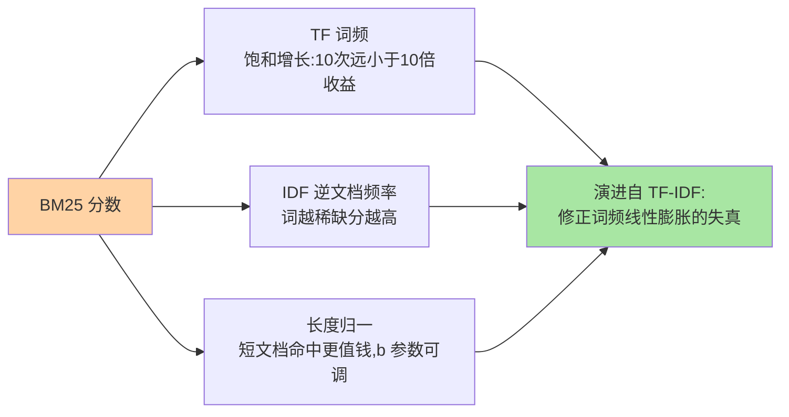
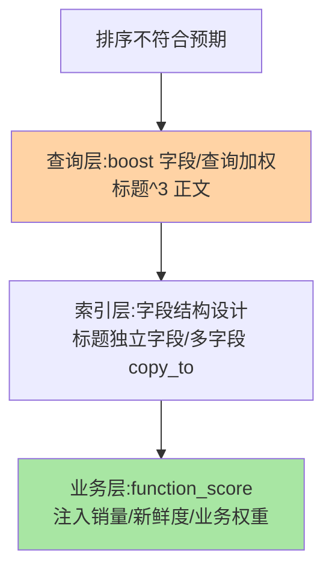

# 相关性打分：BM25 与相关度调优

> 搜索结果「谁排第一」由 BM25 说了算。这篇拆开 BM25 公式的三个因子——词频、逆文档频率、文档长度归一，讲清「为什么这条结果排在前面」可推理化，并给出相关度调优的三层手段。

## 一句话摘要

BM25 按「**词频 TF（这个文档里该词出现多少次）× 逆文档频率 IDF（该词有多稀缺）× 长度归一（短文档命中更值钱）**」给每个命中文档算分。它是对 TF-IDF 的演进修正：词频影响有**饱和上限**（出现 10 次不会是 1 次的 10 倍分），长度归一有**可调参数**（b 值权衡长短文档）。调优三层：**查询层**（boost 加权字段）、**索引层**（字段结构设计）、**业务层**（function_score 注入热度/新鲜度）。

## 一、为什么打分是搜索的灵魂

数据库返回「满足条件的结果集」，搜索引擎返回「**按相关性排好序的结果集**」——排序质量就是搜索质量。用户只看第一屏，BM25 的排序决定了产品体验：它把「词在文档里的重要程度」量化成可比较的分数。理解公式不是为了背公式，是为了**让「为什么它排第一」可推理**——排查排序问题时 explain 输出的就是这些因子的乘积。

## 5W 速记卡

| 维度 | 一句话 |
|---|---|
| What | 词频×逆文档频率×长度归一的排序算法（ES 默认） |
| Why | 结果要按相关性排序，排序即搜索体验 |
| When | 排序不符合预期、相关度专项调优 |
| Where | 查询 explain 输出 / 相似度参数 |
| How | TF 饱和 + IDF 稀缺加权 + 长度归一，业务因子用 function_score 叠加 |

## 二、BM25 三因子与 TF-IDF 的演进

与 TF-IDF 的两处关键演进：**TF 饱和**（k1 参数控制，词频对分数的贡献递减到封顶——防止长文档靠堆词作弊）与**参数化的长度归一**（b=0 关闭归一，b=1 完全按长度惩罚，默认 0.75）。公式不必背，**因子的业务含义必须懂**：标题命中的权重天然应高于正文（字段级 boost 或独立字段结构解决）。

## 三、相关度调优三层

- **查询层 boost**：`match` 的 `boost` 参数、字段级 `^3` 权重——快速但粗糙（线性放大）
- **索引层设计**：标题、标签、正文拆字段分别检索（各配权重），比「全文混在一个字段」的排序质量高一个档——**打分质量的上限在建索引时就定了**
- **业务层 function_score**：BM25 分与业务分（销量、新鲜度、运营权重）的加权融合——搜索排序的工业形态几乎都是「相关性 × 业务分」双因子，纯 BM25 排序只存在于教科书

## 四、与 PageRank 类算法的区别：文档内 vs 链接图

BM25 是「**查询-文档**」级别的局部打分（只看本次查询词与该文档），PageRank 类是「文档-文档」链接图的全局权威分——两者是不同架构层面的信号，正交可叠加（学术搜索常两者结合）。理解 BM25 的边界：它不懂「文档质量」，只懂「词的匹配程度」——质量信号要靠 function_score 外挂注入。

## 五、典型场景与误区

**典型场景**：电商搜索（BM25 + 销量/新品 function_score 融合）、站内内容搜索（标题 boost 高于正文）、日志检索（相关性要求低，时间排序为主——BM25 弱化）。

**误区与不适用**：① 排序不对就调 BM25 参数——k1/b 的全局调整影响所有查询，先查「是不是字段结构/查询写法问题」，参数是最后手段；② function_score 脚本滥用——每文档执行脚本的代价极高，用预计算字段 + 权重衰减（decay 函数）替代实时脚本；③ 忽视 IDF 的跨分片失真——词的文档频率按分片本地统计，分片数小时 IDF 估计偏差大（小索引的排序抖动源），大分片数或 DFS 查询模式可缓解。

## 六、你们可能会问

**Q1：怎么看到一条结果的打分明细？**
`GET /索引/_search {"explain": true}` 或 `POST /索引/_explain/{id}`——输出里 BM25 各因子的逐项计算值，排序问题的归因从这里开始。

**Q2：boost 设多大合适？**
boost 是指数级敏感的（内部乘平方）——从 1 开始小步调整看 explain 分数变化，不要上来就 ^10；更工程的做法是字段结构与 function_score，boost 只做微调。

**Q3：销量权重和 BM25 分怎么融合？**
function_score 的 field_value_factor + 权重（如 `BM25 × log(1+销量)`）——融合比例按业务定（搜索负责人常在「相关性优先」与「业务优先」间做取舍决策），灰度对比点击率验证。

## 七、自测三问

1. BM25 三因子各自的业务含义？对 TF-IDF 的两处演进修正是什么？
2. 相关度调优三层各做什么？为什么说上限在建索引时已定？
3. 纯 BM25 排序为什么不是工业形态？业务分怎么融合？

下一篇讲「聚合分析」：桶、指标与管道聚合的分析能力。

## 📌 数据与事实声明

- 写于 2026-09-08，BM25 为 ES 默认相似度（5.x 起默认），参数 k1/b 默认值为官方口径
- 「boost 平方放大」为官方文档行为说明
- 免责：以 elastic.co/docs 为准

## 📚 参考资料

| 类型 | 标题 | 来源 |
|---|---|---|
| 官方文档 | BM25 similarity / function_score | elastic.co/docs |
| 实战书 | 《Elasticsearch in Action》Radu Gheorghe（相关性章） | 公开出版 |
| 原理书 | 《深入理解 Elasticsearch（原书第 3 版）》 | 公开出版 |
