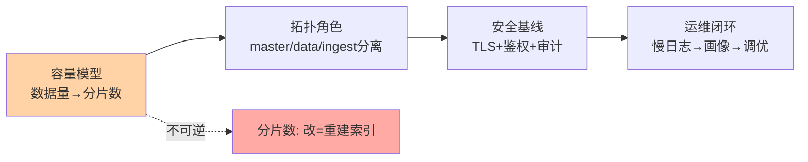
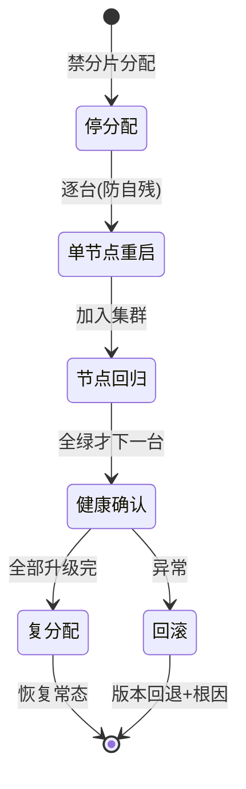
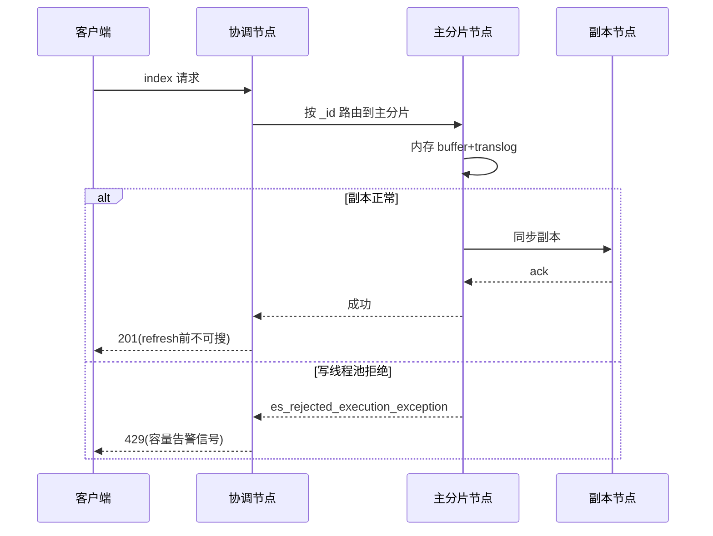

# ES 生产部署实战：容量、分片、安全与运维闭环

> ES 的入门层讲了原理（倒排/分片/DSL），专题层讲了调优深度——本篇把它们装配成一套生产部署决策：节点角色怎么配、分片数怎么定、安全基线怎么搭、日常运维怎么形成闭环。**生产部署的 ES 问题九成出在部署期决策：分片数、堆内存、角色混部——写代码之前，这三个决策已经决定了系统的命运。**

> **本文核心**：ES 生产部署 = 「容量模型 → 拓扑角色 → 安全基线 → 运维闭环」四段决策链——容量模型决定分片数与节点数（分片是部署期的一次性决策，改起来要 reindex），拓扑角色决定稳定性（master/data/ingest 分离是防脑裂与资源互踩的根基），安全基线决定下限（认证/鉴权/审计三件套），运维闭环决定可持续（慢日志→画像→调优→再观测）。**分片决策的不可逆性是 ES 部署区别于一般中间件的最大特征。**

## 一句话摘要

生产级 ES 集群的部署决策链：①容量模型——按「日增数据量 × 保留期 × 副本系数」算总量，按单分片 20-50GB（业内量级认知）反推主分片数，按可用性要求定副本数；②拓扑角色——专用 master（3 节点防脑裂）、data 节点按冷热分层（热节点 SSD 扛写入、冷节点大容量盘扛存量）、ingest 按需独立；③安全基线——TLS 传输加密、角色鉴权（最小权限）、审计日志，加上操作系统层（vm.max_map_count、禁 swap、文件句柄）；④运维闭环——慢日志采集、分片健康画像、段合并监控、滚动升级流程。每个决策给出参数级建议与验证手段。

## 🎯 本文核心（机制坐标）



## 一、容量模型：分片数的推导与不可逆性

推导链条：日增原始数据 → 建索引膨胀（倒排索引通常使存储膨胀至原始的 1.5-3 倍，业内量级认知）→ 乘保留天数 → 乘副本系数（1 副本即 ×2）→ 总存储量 → ÷ 单分片目标大小（20-50GB）= 主分片数。例：日增 10GB、保留 90 天、1 副本 → 总量约 2.7-5.4TB → 按 30GB/分片 → 90-180 个主分片，按时间索引分日建（每日 1-2 个分片）自然摊平。

**不可逆性的工程含义**：主分片数在建索引时确定，事后修改必须 reindex（全量重写）——所以时间序列数据（日志、埋点）用「按时间滚动索引 + ILM」天然规避（每天新索引即可调分片数）；实体数据（商品、用户）的初始分片数要按 3-5 年数据量预留。**「宁多勿少」是主分片的工程纪律**——空分片的元数据开销远小于 reindex 的代价，但单节点数千分片的上限也要敬畏（集群状态压力）。

## 二、拓扑角色：谁该跟谁分开

| 角色 | 职责 | 生产配置 | 混部风险 |
|---|---|---|---|
| master 专用 | 集群状态管理、分片调度 | 3 节点奇数（防脑裂），低配即可 | 数据节点 GC 抖动会拖垮选主 |
| data 热 | 写入与热查询 | SSD、高配 CPU 内存 | — |
| data 冷 | 存量只读查询 | 大容量 HDD | 与热节点混部则冷查询拖慢热写入 |
| ingest | 数据预处理管道 | 管道复杂时独立 | 复杂 pipeline 抢占数据节点资源 |
| 协调 | 请求汇聚 | 大查询多的场景独立 | 混部时大查询打爆数据节点 |

角色分离的三条铁律：①master 三节点独立部署是底线（data 节点抖动引发选主风暴是 ES 集群最经典的自残形态）；②冷热分离用节点属性 + ILM 自动迁移（热数据 SSD、存量 HDD，成本降一半以上是常见收益）；③协调角色在「大聚合查询多」的场景独立（深度聚合的内存风暴不波及写入节点）。

## 三、安全基线与操作系统层

```yaml
# 安全基线三件套(8.x 原生安全默认开启)
xpack.security.enabled: true
xpack.security.transport.ssl.egg: enable   # 节点间 TLS
xpack.security.http.ssl.enabled: true      # 客户端 TLS
# 鉴权: 内置角色最小权限原则
#   写入账号: create_index + write(限定索引模式 logs-*)
#   查询账号: read(限定业务索引) 禁 delete
```

操作系统层的四个必查项：`vm.max_map_count ≥ 262144`（mmapfs 的进程映射上限，默认值直接导致节点启动失败）；禁 swap（内存页换出 = GC 毫秒变秒）；文件句柄 ≥ 65535（段文件数量庞大）；JVM 堆 ≤ 物理内存一半且 ≤30GB（压缩指针边界，剩余留给页缓存——ES 的性能一半在堆外页缓存）。

冷热分层与 ILM 的数据流转：


滚动升级的受控状态机：



写入链路的关键路径与拒绝点：



## 四、demo 验证点：部署验收的六道关

1. **健康关**：`GET _cluster/health` 全绿（all shards assigned）；`_cat/nodes` 角色标识与规划一致
2. **写入关**：按目标速率压写 30 分钟，写入延迟 P99 稳定（ rejects 归零——`thread_pool.write.rejected` 是第一告警）
3. **查询关**：目标查询集 P95 达标；慢日志（`index.search.slowlog`）无未加索引字段的 query
4. **容灾关**：杀一个 data 节点 → 集群 yellow（副本缺失）→ 节点回归自动恢复；杀一个 master → 10 秒内新主选出（选主耗时进监控）
5. **安全关**：未认证请求 401、越权写 403、审计日志记录全量敏感操作——三探针全过
6. **恢复关**：模拟节点重入，恢复速率（`indices.recovery`）在预算内且未拖垮业务查询（恢复限流参数生效）

```bash
# 验证环境最小集: 6 节点(master×3 + hot×2 + cold×1)
bin/elasticsearch -Enode.roles=master -Enode.name=m1
bin/elasticsearch -Enode.roles=data_hot,data_content -Enode.name=h1
curl -u elastic 'https://localhost:9200/_cluster/health?pretty'
```

## 五、事故叙事三则

**叙事一：data 与 master 混部，大查询触发选主风暴。**三十节点小集群为省资源全部混部，一次深度聚合（千万级桶聚合）打爆数据节点 GC——master 角色所在节点同受影响，集群反复「选主 → 断连 → 再选主」，业务侧表现为全集群秒级抖动半小时。修复：master 独立三节点，聚合查询迁协调节点。复盘沉淀：**混部省下的三台机器钱，一次选主风暴加倍奉还**——角色分离是 ES 集群的第一保险。

**叙事二：分片数拍脑袋，一年后 reindex 三十亿文档。**业务初始按「每索引 5 分片」建模板，两年后单索引 200GB、单分片 40GB 尚可，但总分片数膨胀到数千（大量小索引）——集群状态膨胀、调度迟缓。更深的坑在另一个团队：实体索引按当前数据量建 5 分片，三年后单分片 120GB，查询与恢复全部超时，唯一出路 reindex 三十亿文档（停写窗口一周）。复盘沉淀：**时间序列用 ILM 滚动、实体数据按 3-5 年预留**——两条路都通向「分片决策前置」，跳过的人用 reindex 补课。

**叙事三：滚动升级没禁分片分配，升级期集群自残。**升级节点逐台重启时，节点一离线其分片立即向其他节点迁移（默认分配策略）——迁移流量叠加业务写入，IO 打满，后续节点重启一个慢一个。修复：升级前 `_cluster/settings` 禁分片分配，节点回归后再开启。复盘沉淀：**滚动升级的标准前置是「停分配 → 逐台重启 → 复分配」**——默认行为是为「节点真挂了」设计的，主动升级时要显式关掉。

## 六、追问链：把「分片数」问穿一层

- **追问一：分片是不是越大越省事（少分片）？**——单分片过大的代价：恢复慢（分片是恢复与再平衡的原子单位，500GB 分片迁移以小时计）、查询并行度不足（单分片单线程查）、JVM 压力集中。过小则元数据与调度开销（每分片一个 Lucene 实例的固定成本）。20-50GB 是两个失效面之间的工程窗口——**分片是「恢复原子性」与「并行度」的定价单位**，不是越大越好也不是越碎越好。
- **再追问：副本数是越多越可用吗？**——副本提升读吞吐与容错，但占双倍存储、拖慢写入（写要同步所有副本）。工程取值：可用性诉求 1 副本覆盖单节点故障；2 副本只在「写入高峰读并发也高 + 节点数充足」时有意义。**可用性的真实边界在「几副本能覆盖几台同时挂」**——按机架感知分布 1 副本已能扛单机架故障，盲堆副本数是存储预算的浪费。
- **打破砂锅：为什么 ES 不支持动态改分片数（像分区数那样）？**——分片是 Lucene 索引的物理边界（路由 = hash → 分片号），改分片数意味着全量数据按新路由重分布——等价于 reindex。这是「路由简单高效」的设计代价：查询无需两跳（先查元数据再查数据），代价是分布变更要全量重写。理解这个根因，「分片决策前置」就不是纪律而是必然。

## 七、反方案分析：三个部署期「捷径」的代价

- **为什么不全混部省机器**：见叙事一——混部的钱省在机器上，赔在故障半径上。折中：小集群（<5 节点）可 master 与 cold data 混部（冷节点负载平稳），data 热节点绝不动
- **为什么不开自动创建索引就上生产**：auto create 确实方便，代价是字段类型被首条文档猜定（dynamic mapping 的经典坑，互指入门层篇 3）——错类型后查询静默失配。生产纪律：索引模板（显式 mapping）+ 禁 auto create
- **为什么不用默认 10000 limit 就放心灌数据**：总分片超限后新索引创建失败（业务报错），默认值是兜底不是配额规划——按容量模型的分片数预算主动管理 limit，超限即容量评审信号

## 八、设计思想：部署期决策的「不可逆性定价」

ES 部署的方法论核心是**按决策的可逆性分配验证成本**：分片数（不可逆）→ 最高验证等级（按 3-5 年建模 + 评审）；堆内存与 OS 参数（可逆但高危）→ 标准检查单；查询调优（高度可逆）→ 运维闭环迭代。这套「可逆性定价」的决策分配广泛适用——数据库分片、K8s 网络方案、消息 Topic 规划都遵循同一逻辑：**可逆性越低的决策，前置验证的成本投入比越高**。ES 把分片的不可逆性推到极致（物理路由边界），因此它的部署方法论在所有中间件里最值得迁移。

## 九、不同量级的思考：部署档位的演进

- **十万级文档/天以下**：约束来源是正确性——单机或 3 节点小集群 + 模板显式 mapping，安全基线默认开启。这一档的核心问题是「mapping 与安全基线」，而不是「角色分离」
- **百万级/天**：约束来源是写入稳定性——冷热分离入场（热 SSD 冷 HDD）、ILM 滚动索引、写入 rejected 监控。这一档的核心问题是「写入与存储的成本分摊」，ILM 是主战场
- **千万级/天 / 多团队共享**：约束来源是隔离与治理——按业务分集群（共享集群的分片配额与查询熔断都难做）、分片配额治理、慢查询追责闭环。这一档的核心问题是「共享与隔离的边界」，业务分集群是收敛解

**自下而上与触发升级**：先测日增量与查询形态，低档不建大集群；触发升级的信号是「写入 rejected 出现」「冷数据挤占热存储」「跨团队争抢资源」——部署档位跟数据形态走，分片决策每个档位都前置。

## 十、参数级配置清单（ADR-0012）

| 配置项 | 默认值参考 | 分档推荐 | 为什么 |
|---|---|---|---|
| 单分片目标大小 | 20-50GB | 日志类 30GB、实体类 ≤50GB | 恢复原子性与并行度的平衡窗口 |
| JVM 堆 | 物理内存一半且 ≤30GB | 热数据节点顶格 30GB | 压缩指针边界 + 页缓存留白 |
| master 节点数 | 3 | 跨机房 5 | 奇数防脑裂，跨机房容灾加量 |
| 副本数 | 1 | 读密集高可用场景 2 | 双倍存储成本按可用性定价 |
| vm.max_map_count | 262144 | 不动 | mmapfs 硬性要求，默认即为此设 |
| 刷新间隔 | 1s | 日志写入重可调 30s | 刷新频率是写性能的第一旋钮 |
| 慢日志阈值 | query 1s / index 50% | 按业务 SLA 收紧 | 慢日志是调优闭环的数据源 |
| 分片总量上限 | 10000（默认 limit） | 按容量模型主动管理 | 默认是兜底，不是配额规划 |

## 十一、步骤级操作（ADR-0012）

1. **前置**：容量模型表（推导链每个系数标注出处）+ OS 参数检查单（map_count/swap/句柄）过一遍
2. **部署**：按拓扑角色起节点 → `GET _cluster/health` 全绿 → 安全基线三探针（401/403/审计）验证
3. **验证**：按 §四 六道关顺序执行（健康→写入→查询→容灾→安全→恢复），产出验收记录
4. **回退**：滚动升级走「停分配→逐台→复分配」；配置变更（如刷新间隔）逐索引灰度观察；分片级问题唯一回退是「重建索引双写切换」——再次证明分片决策前置的价值
5. **运营**：慢日志周报 + 分片画像月审（单分片大小分布/总分片水位）+ 容量预算线进监控

## 十二、业内惯例

- 日志类集群惯例：ILM 全生命周期托管（热 7 天 SSD → 温 30 天 HDD → 删除），分片数每日索引 1-2 个自然滚动
- 集群治理惯例：按业务分集群优于共享大集群（共享时的查询熔断与配额隔离工具成熟度低）；跨集群查询（CCS）做聚合视图
- 升级惯例：大版本升级先在影子集群全量验证（mapping 兼容 + 查询行为），再走滚动升级——ES 大版本的 breaking change 率业内公认不低

## 你们可能会问

**Q1：用 K8s 上的 ES Operator 部署还是自己管虚拟机？**
Operator 的价值是「运维动作标准化」（扩缩容/升级/快照声明化）；代价是多一层抽象（存储性能、网络抖动的排查链变长）。数据密集型 ES 对 IO 敏感——团队 K8s 运维力强且存储层可控（本地盘/高性能云盘）用 Operator，否则虚拟机 + 脚本更可控。

**Q2：快照备份怎么规划？**
快照到对象存储（S3 类），策略：每日增量 + 每周全量 + 保留按合规要求；快照还要「验证可恢复」（恢复演练季度一次）——没验证过的备份等于没备份。跨机房容灾用 CCS + 远端快照仓双保险。

**Q3：查询越来越慢，先看哪里？**
固定三步：慢日志定位慢查询形态（未命中索引的字段/深分页/深度聚合）→ `_cat/shards` 看分片倾斜（热点分片拖长尾）→ 线程池队列（search rejected 即查询容量到顶）。三步覆盖九成慢查询归因——顺序固定，防止东看西看。

## 十三、什么时候用 / 不用

- ✅ 前置部署决策：分片数按 3-5 年建模、角色分离、安全默认开启——写数据前完成
- ✅ 运维闭环：慢日志 → 画像 → 调优常态化——ES 是「运维定义性能」的系统
- ❌ 不做：无容量模型直接建索引——分片的不可逆惩罚等着
- ❌ 不做：跨大版本原地升级无彩排——影子集群验证是前置
- ❌ 不用 ES 扛：强事务与主键点查为主（OLTP 语义）——那是数据库的领地

## 开放问题

- ES 与专用向量库的边界：混合检索（BM25 + 向量）在 ES 内闭环 vs 多引擎并存统一路由——检索架构的「一套全管」与「专用专管」之争会随向量检索成熟再定价
- Serverless 形态下的部署决策残留：容量模型被平台吸收后，「查询形态设计」「mapping 纪律」「慢查询治理」成为使用者仅存的决策点——部署方法论的重心迁移
- 冷数据的长尾：合规保留期越拉越长（监管要求），「归档到对象存储 + 按需挂载检索」与「冷节点常驻」的成本曲线交叉点在移动，ILM 策略要按年重估

运维闭环的四段循环（性能不是一次调优，是持续运营）：


集群规模的部署档位演进：


### 分片治理的两份例行报告

分片决策前置之后，运营期的分片治理靠两份报告维持：**月度分片画像**——全集群分片大小分布（P50/P95）、单索引分片数、总分片水位对 limit 的比例，异常信号是「小分片堆积」（大量 <5GB 分片 = 索引粒度过细，元数据与调度成本上升）与「大分片潜行」（单分片悄悄越过 50GB = 下一次恢复事故的预约）；**慢查询周报**——慢日志 Top 形态聚合（未命中索引字段/深分页/深度聚合三类占比）+ 责任到业务线。两份报告的成本是脚本化定时任务，收益是把「集群为什么变慢」的排查从故障日提前到周会——治理前移是 ES 运维的核心经济学。

## Trade-off：性能、成本与复杂度的三角

ES 部署的每个决策都在三角里定位：副本与热节点买性能（存储与硬件成本），冷热分层与 ILM 买成本（迁移复杂度），角色分离与安全基线买稳定性（机器与心智成本）。**三角的支点是容量模型**——数据形态（写入速率/保留期/查询模式）定了，三角的最优点就定了；脱离容量模型谈三角，每个决策都变成玄学。这套「模型定支点」的思路与容量规划（互指 engineering 容量篇）完全同构——ES 只是把它体现得最彻底。

### 集群体检的十项速查（值班周检）

给值班同学的周检清单，十项各一分钟：①`_cluster/health` 全绿；②`_cat/nodes` 无离线节点、堆水位 <75%；③磁盘最大水位 <70%；④分片总数对 limit 比例 <80%；⑤写入 rejected 周计数为零；⑥查询 P95 在 SLA 内；⑦master 选主历史（日志）无频繁切换；⑧快照任务全成功；⑨ILM 索引无 `ERROR` 阶段；⑩安全审计日志在滚动。十项全绿收工，任何一项红即开工单——周检的价值不在发现大故障（监控已覆盖），在发现「缓慢劣化」：磁盘水位爬坡、分片悄悄逼近 limit、堆水位月月新高——大规模系统的故障很少有突然的，都是劣化没被看见。

### 一份最小生产配置模板（骨架）

配置的「骨架模板」比零散建议更可迁移——以下是最小生产骨架（按 8.x 口径，具体值按容量模型调整）：

```yaml
# 节点角色(以 hot data 节点为例)
node.roles: [ data_hot, data_content, ingest ]   # master 独立三节点另部署
# 堆与资源
-Xms30g -Xmx30g                                   # ≤物理内存一半,≤30GB 压缩指针边界
bootstrap.memory_lock: true                        # 配合禁 swap
# 安全基线(8.x 默认开启,显式声明防漂移)
xpack.security.enabled: true
xpack.security.transport.ssl.enabled: true
xpack.security.http.ssl.enabled: true
# 写入稳定性
indices.memory.index_buffer_size: 20%             # 写入重集群调大
thread_pool.write.queue_size: 1000                 # 队列即缓冲,拒绝即容量信号
```

模板的意义不在参数值本身（会随版本与负载调整），在「配置即文档」：新节点加入时按模板起，防配置漂移；每次变更走模板仓库的变更单——配置治理与代码治理同纪律。

## 跨周期视角：五年后 ES 部署的形态

三条演化线：①Serverless 化（云厂商的 ES Serverless / OpenSearch 无服务器形态）把容量模型决策部分转移给平台——「分片数」这类决策可能被自动分片机制吸收，但容量思维（成本与性能的定价）仍是使用者的功课；②存算分离让冷热分层下沉为存储层选项，本地盘时代的手工分层在退场；③检索需求多元化（向量检索进入主线程）让「ES 一套管所有检索」的假设松动，混合检索架构（多引擎并存 + 统一路由）是新议题。**决策链（容量→拓扑→安全→闭环）的方法论长存，决策对象随形态迁移**。

## 💡 实战提示

- 💡 分片数按 3-5 年建模——它是 ES 里唯一「改 = 重建」的部署决策
- 💡 master 三节点独立部署是底线——混部的选主风暴是 ES 第一自残形态
- 💡 OS 四查项（map_count/swap/句柄/堆）写入装机清单——每次扩节点都跑
- 💡 滚动升级先停分片分配——默认分配策略是为「节点真挂了」设计的
- 💡 慢日志是调优闭环的数据源——没有慢日志的 ES 集群是盲飞的

### 慢查询三步归因的实操展开

「固定三步」落到命令与判断：第一步慢日志——`GET logs-*/_search` 慢查询样本从 `index.search.slowlog` 索引拉取，先看「took_time 分布」与「query_did_match」形态：大量 `match_no_docs` 的查询通常是没有命中 keyword 前缀的 term 查询（mapping 类型错误的直接证据）；第二步分片倾斜——`_cat/shards/索引?v&s=store.size:desc` 看头部分片是否远超均值，倾斜分片 = 该分片承载的查询与恢复都是长尾；第三步线程池——`_cat/thread_pool/search?v` 看 `queue` 与 `rejected`，rejected 增长即查询容量到顶（加协调节点或限流，而不是盲目加数据节点）。三步各答一个问题：查询写得对吗、数据分布匀吗、容量够吗——九成慢查询在第一步就终结。

### 容量预算表在 ES 的落地形态

把容量篇的预算表方法落到 ES 专属字段：分片总水位（当前/limit 比例）、单分片大小分布（P50/P95）、磁盘水位（热节点 70% 告警）、写入 rejected 计数、查询 P95 与慢日志条数——五条预算线进监控告警，越线即容量评审。ES 的特殊性在「分片不可逆」：预算表的用途不止告警，更是「下个周期分片策略是否要调整」的决策依据——预算运营与分片治理在这里交汇。

## 自测三问

1. 分片数的完整推导链是什么？为什么说它不可逆？
2. 角色分离的三条铁律是什么？各自防什么事故？
3. 「按可逆性分配验证成本」如何指导部署决策的优先级？

## 🎯 核心带走

- **核心一句话**：ES 生产部署 = 容量模型 → 拓扑角色 → 安全基线 → 运维闭环——分片决策的不可逆性决定它必须前置，运维闭环决定性能可持续
- **容量链**：日增 × 膨胀 × 保留 × 副本 → ÷30GB → 主分片数；时间序列用 ILM 滚动、实体按 3-5 年预留
- **哪里会坏**：混部选主风暴、分片拍脑袋 reindex 三十亿、滚动升级自残
- **边界**：按业务分集群优于共享；OLTP 语义不进 ES；备份必须带恢复演练
- **量级迁移**：低档问 mapping 与安全、中档问冷热与 ILM、高档问隔离治理

## 📌 数据与事实声明

- 写于 2026-09-15；分片/角色/安全机制以 Elastic 官方文档（8.x）公开口径为准；「20-50GB 单分片」「膨胀 1.5-3 倍」为业内量级认知，按自有数据实测校准
- 事故叙事为业内高频 ES 运维事故模式的匿名化叙事，非特定公司事件
- 免责：默认值与最佳实践随版本演进，以对应版本文档为准

## 📚 参考资料

| 类型 | 标题 | 来源 |
|---|---|---|
| 官方文档 | Elastic Stack 安装与 Size/Shard 规划 | elastic.co/guide |
| 官方文档 | ILM 索引生命周期管理 | elastic.co/guide |
| 系列内 | 入门层原理 14 篇 / 专题层调优深度 | 本仓库 ES 各层 |
| 关联篇 | 《亿级容量实战选型决策》 | engineering/专题层 |
