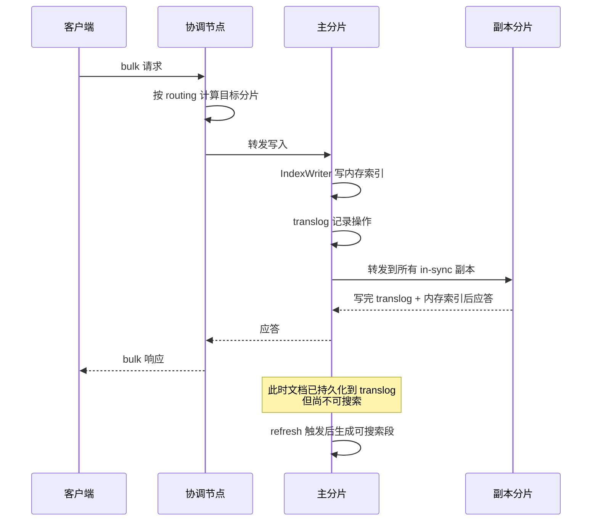
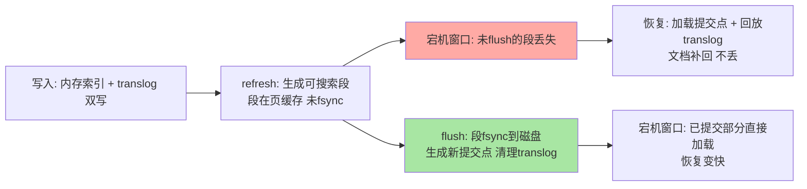
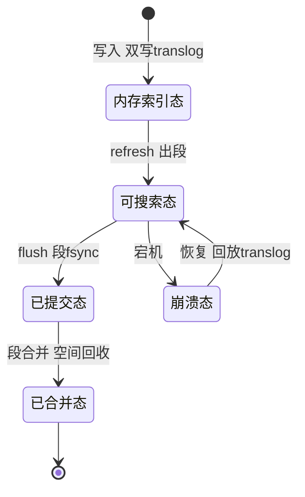

# 写入链路与近实时检索：refresh、translog、flush 的三角账本

> ES 号称「近实时」——这个「近」字背后站着三个机制：refresh 决定**多久能被搜到**，translog 决定**崩溃丢多少**，flush 决定**磁盘上落定什么**。三者共享同一份 Lucene 内存结构，却各自有独立的触发节奏与代价曲线。这篇把三角关系拆到参数级：每个机制为什么存在、代价在哪里、生产上怎么调。

## 一句话摘要

写入链路的核心是「**不可变段 + 预写日志**」这对组合：文档先进 Lucene 内存索引与 translog（顺序写、 durability 由 `request`/`async` 决定），refresh 把内存索引封装成**可搜索的新段**（无 fsync、依赖 OS page cache），flush 才做真正的提交（段 fsync + 提交点 + 清理 translog）。**可见性、持久性、空间回收三件事被刻意解耦**——每一件都可以独立调速，这就是 ES 写性能调优的全部空间。

## 🎯 本文核心

**核心一句话：ES 把「可搜索」（refresh）与「可靠落盘」（flush）拆成两个独立事件，translog 是两者之间的事务日志——近实时性来自「刷新不做 fsync」，可靠性来自「translog 补齐刷新与落盘之间的窗口」，写性能调优本质上是在这三个节奏之间重新分配 IO 预算。**

机制链：bulk 路由到主分片 → IndexWriter 内存索引 + translog 双写 → refresh 生成可搜索段（页缓存态）→ flush 生成提交点（磁盘态）→ 段合并负责空间回收。全文一句话可重构：「refresh 买可见性，translog 保窗口，flush 结算落盘」。

## 前置阅读

- 入门层篇 12《文档写入链路》：bulk 流程、routing 公式、近实时概念的初次建立
- 入门层篇 13《段合并与存储结构》：段的物理形态与合并策略

## 目标导向

本文是什么：refresh / translog / flush 三机制的联动拆解与生产调优。功能是什么：让「为什么写入后搜不到、宕机会丢多少、bulk 导入怎么提速」三问有机制级答案。能得到什么：三个机制的参数级调速手册、写入限流（429）的归因模型、崩溃恢复的推演能力。为什么用：日志/指标/搜索类集群的写入侧容量规划与性能排障，必看。

## 一、边界：入门层讲过什么，本文讲什么

| 内容 | 入门层 | 本文 |
|---|---|---|
| bulk 写入流程、routing 公式 | ✅ 讲过 | 只作链路起点，不重复 |
| refresh / translog / flush 各自是什么 | 提了概念 | **本文核心：三者联动与代价账本** |
| refresh_interval / translog.durability 调优 | 未讲 | **本文核心二** |
| 段合并策略（merge policy） | ✅ 篇 13 讲过 | 只在「挤兑」处引用结论 |
| 副本同步与 sequence number | 未讲 | 本系列后续篇展开 |

## 二、一条文档的旅程：从协调节点到可搜索

流程里有三个容易被忽略的细节：

1. **副本应答发生在「写入内存索引 + translog」之后，而不是 fsync 之后**——默认配置下，一次 bulk 应答只保证「主副分片都收到了这个操作」，不保证段已落盘。落盘由 translog 的 fsync 策略决定（`index.translog.durability: request` 时在应答前 fsync translog，这才是默认路径）
2. **sequence number 与 primary term** 随操作一起下发：每个写操作在主分片上获得单调递增的 seq_no，副本用它做幂等去重与乱序重排——这是 7.x 之后副本恢复与冲突处理的地基
3. **协调节点不参与数据落盘**：它只做路由与汇总，写路径的 IO 发生在数据节点上——容量规划时协调角色单独部署的依据就在这

## 三、refresh：可见性事件，不是持久性事件

**为什么写入不能立刻被搜到？** 因为查询执行时走的是 Lucene `IndexReader` 的某个视图，新文档还在 `IndexWriter` 的内存索引结构里，这个视图根本看不见它们。

**追问：那 refresh 到底做了什么，让内存索引「变可见」？** 它不做 fsync，而是让 `IndexWriter` 把内存中的索引数据封装成一个新的**段（segment）**，然后打开一个新的 reader 视图指向它。段挂在操作系统的 page cache 上，搜索走内存，代价远小于磁盘同步。

**再追问：为什么连这个「reopen」都不能每次写入都做？** 段是不可变结构：每次 refresh 都生成一个新段、一个新 reader、一次查询缓存的潜在失效。写入频率如果等于刷新频率，段数量会在分钟级推爆，合并线程会陷入永远追不完的追赶战。

**打破砂锅：段为什么偏要设计成不可变？** ——并发读无锁（读者拿到的视图永不改变）、OS page cache 友好（文件一旦生成不再修改，缓存命中率极高）、压缩与跳表等结构可以一次性预计算到位。代价是：删除只能打标记（`.del` 位图），更新等于删+写，空间回收要等段合并。**不可变换来读侧的自由，把所有麻烦都推迟到了写侧的合并环节**——这是典型的把复杂度从读路径挪到写路径的设计取舍。

## 四、translog：刷新与落盘之间的那本账

translog 是一个追加写的操作日志，承担两件事：

1. **崩溃恢复**：节点宕机后重启分片，先加载上一次提交点（commit point）对应的段集合，再回放提交点之后的 translog 操作——refresh 过但未 flush 的文档就是靠这段日志补回来的
2. **操作历史保留**：7.x 起配合 retention lease 做基于操作的副本恢复——副本短暂掉线重连后，不用整段拷文件，回放保留窗口内的操作即可（默认保留策略 `retention.size` 512MB / `retention.age` 12h，公开口径）

**追问：translog 自己会不会丢？** 会——`durability: request` 时每次请求应答前 fsync，几乎不丢；`async` 时按 `sync_interval`（默认 5 秒，公开口径）批量刷，宕机丢最近一个窗口。**这本「丢多少」的账，就是 request 与 async 的全部区别。**

**追问：translog 什么时候清？** flush 成功后，提交点之前的 translog 文件不再需要，会被清理。translog 文件体积逼近 `flush_threshold_size`（默认 512MB，公开口径）也是自动 flush 的触发器之一——**translog 太大意味着崩溃恢复要回放太多操作，恢复时间会失控，这是阈值存在的真实动机**。

## 五、flush：真正的提交点

flush 对应 Lucene 的 commit：把内存中的段 fsync 到磁盘、生成新的提交点文件（segments_N）、按需清理 translog。它是最重的操作，但「重」的价值是**把恢复时间从「回放全部历史」缩短到「加载最近提交」**。

把一份文档的「生命周期状态」画出来，三个机制的位置一目了然：

注意「可搜索态 → 崩溃态 → 可搜索态」这条回边——它就是 translog 存在的全部理由：**可搜索不等于已提交，中间的窗口必须由日志兜住**。

三个机制的职责至此闭合：

| 机制 | 解决什么 | 代价什么 | 触发谁 |
|---|---|---|---|
| refresh | 可见性（搜得到） | 新段 + reader 切换 + 缓存失效 | 定时（默认 1s）/ 手动 `_refresh` |
| translog | 崩溃窗口内的持久性 | 每请求 fsync 的延迟（request 模式） | 每次写请求 |
| flush | 落盘 + 快速恢复 | fsync 全部段 + IO 尖峰 | translog 阈值 / 定期 / 手动 `_flush` |

## 六、源码/关键路径

以 8.x 主线口径（`org.elasticsearch.index.engine` 与 `org.apache.lucene.index`）：

- **写入入口**：`TransportShardBulkAction` → `InternalEngine#index()`——内部完成「`IndexWriter.addDocument` 写内存索引 + `Translog.add` 记日志」双写，随后在 `ReplicationOperation` 的调度下等副本应答
- **refresh**：`InternalEngine#refresh()` → Lucene `IndexWriter#maybeRefresh()`——检出新的 `SegmentInfos` 并生成新的 `SearcherManager` 视图；`refresh_interval` 由 `IndexService` 的定时任务驱动
- **translog**：`org.elasticsearch.index.translog.Translog`——`durability: request` 时 `SyncedFlush`... 准确说是在 `ensureSynced()` 里对刚写入的位置做 `fsync`；`async` 模式由 `TranslogSyncService` 按 `sync_interval` 批量刷
- **flush**：`InternalEngine#flush()` → Lucene `IndexWriter#commit()` + `Directory#sync()`——生成提交点后再滚动 translog（`rollTranslogGeneration`）
- **恢复**：`InternalEngine#recoverFromTranslog()`——加载提交点后回放 translog 直到与全局检查点对齐

阅读建议：抓住 `InternalEngine` 这一个类——它同时持有 `IndexWriter` 与 `Translog` 两个对象，三机制的调用全部汇聚于此，是理解「双写如何保持一致」的最佳切面。

## 七、写性能权衡：把 IO 预算重新分配

写入侧的调优对象，本质上是三个节奏参数。在动它们之前，先看清写入压力的构成：**单分片写入能力 ≈ f（批量大小、段生成频率、translog 同步策略、合并算力余量）**——bulk 批量过小会让网络与解析开销占主导，批量过大又会让单请求成为长尾并挤占写线程池，业内经验口径是单请求 5-15MB 起步试探、按 429 与延迟曲线收敛，这个起点只是搜索的起点，不是结论。

| 配置项 | 默认值 | 调优方向 | 为什么 |
|---|---|---|---|
| `index.refresh_interval` | 1s | 批量导入期设 30s 或 -1 | 每次刷新生成新段，段太碎→合并风暴 |
| `index.translog.durability` | request | 批量导入期可设 async | request 每请求 fsync，是延迟放大大头 |
| `index.translog.sync_interval` | 5s | async 模式下可拉长 | 丢数据窗口 = sync_interval |
| `index.translog.flush_threshold_size` | 512mb | 导入期可适度调大 | 减少自动 flush 频次，让 flush 更成批 |
| `index.number_of_replicas` | 1 | 导入期临时设 0 | 副本双写占一半写吞吐，导完恢复 |
| `index.codec` | default | 冷数据可 best_compression | 换取磁盘空间，写入 CPU 上升 |

**为什么不选「写入即 fsync、写入即可见」的反方案？** 每条文档一次 fsync + 一次段生成，普通 SSD 的 fsync 在毫秒级，吞吐直接塌方；段生成频率等于写入频率时，合并线程数小时内即被打穿。这套朴素方案在单机数据库的 redo log 语境可行，但搜索引擎的「段不可变」前提使它不可行——**可见性事件必须与写入事件解耦，refresh 就是这个解耦点**。

**为什么不用 Kafka 这类外部日志替代 translog？** 社区确实有过这类讨论（公开口径）：把预写日志外置，本地盘只存段。反对的理由压倒性——引入外部集群使故障域从「单节点」扩大到「日志集群」，顺序语义与 primary term 需要跨系统对齐，故障恢复路径多出一种「日志在、段不在」的中间态。translog 本地顺序写的成本，远低于分布式依赖的复杂度。

## 八、不同量级的思考：写入调优的档位约束

- **十万级（单集群小写入量）**：约束来自「人的精力」——这个量级默认参数就是最优解，调优收益小于误配置风险；思考方式是「少动」。这一档的核心问题是「默认值有没有被误改过」，而不是「参数压榨到多少」
- **百万级（日常写入可观的业务搜索）**：约束来自「段生成的固定开销」——refresh 1s 的默认值开始显得奢侈，5-30s 的按业务容忍度调速出现收益；思考方式是「按可见性容忍度分业务调速」。这一档的核心问题是「业务能容忍多久延迟」，而不是「ES 能多快」
- **千万级（日志/指标类写多读少）**：约束来自「磁盘的顺序写带宽与合并算力」——导入窗口 refresh -1 + async durability + 副本 0 的组合拳登场，且必须有「导完恢复默认 + 数据对账」的收尾流程；思考方式是「批量窗口化」。这一档的核心问题是「窗口流程有没有闭环」，而不是「参数调多激进」
- **亿级（持续海量写入）**：约束来自「集群规模的协调成本与故障半径」——按时间 rollover 拆索引、冷热分层、forcemerge 只留冷层做，写路径按分片数横向摊薄；思考方式是「用索引拓扑换单索引写入压力」。这一档的核心问题是「拓扑分形对不对」，而不是「单索引参数怎么调」

思考方式总结：十万级靠「少动」，百万级靠「分业务调速」，千万级靠「批量窗口化」，亿级靠「拓扑分形」——约束来源分别是人力、可见性容忍度、磁盘带宽、协调成本，思考方式必须跟着约束来源走。

**自下而上与触发升级**：先实测再定档——bulk 延迟、write 线程池队列水位、段数量与合并频率三个指标决定你实际站在哪一档。触发升级的信号：429 拒绝开始出现（该进批量窗口化）、merge 积压追不上写入（该进拓扑分形）、单索引分片数过万协调延迟显著（必须 rollover 拆分）。业务量翻倍只是提醒，指标越过阈值才是升级依据。

## 典型场景

- **日志平台**：写入密集、可容忍分钟级可见——30s 刷新 + async translog 是常见起点（业内惯例），代价是宕机丢一个窗口的日志
- **电商搜索**：商品/价格更新要求秒级可见——保持默认 1s，或对核心索引 2-5s；visible 延迟直接变客诉，refresh 不敢慢
- **大规模重建索引**：refresh -1 + 副本 0 + 拉大 bulk，导完逐步恢复——重建速度业内常见的提升幅度是数倍（业内认知，取决于原配置保守程度）

## 业内惯例

> 💡 **实战提示**：改任何写入侧参数前先记下默认值——批量导入的参数组合是「临时态」，导入结束必须逐项恢复。业内最常见的翻车不是「调不好」，而是「调完忘了恢复」，下一个业务高峰用 1s 可见性需求撞上 -1 刷新配置。

> 💡 **实战提示**：监控 write 线程池的 rejected 计数与队列水位，429 出现时先看 bulk 的单请求体积与并发数，再考虑参数降级——大 bulk 请求（单请求数百 MB）是比 refresh_interval 更常见的拒绝根因。

> 💡 **实战提示**：translog durability 从 request 改 async 前，先明确业务的丢失窗口容忍度并写进方案文档——这一格参数换来的吞吐提升，代价是「宕机丢 N 秒」，这笔账要业务方签字而不是自己认。

> 💡 **实战提示**：定期盯 `_stats` 里 `merges` 与 `segments` 的计数趋势——段数量持续爬升不回落，说明 refresh 频率与合并算力已经失衡，先降刷新频率，再考虑 forcemerge（只对只读索引做）。

## 事故复盘两则

**事故一：导入窗口忘了恢复 refresh。** 某日志集群做完一轮历史数据回灌（当时配置了 refresh -1 + async），流程文档没写「恢复默认」这一步，回灌结束后配置滞留。三天后业务侧发现「日志检索延迟高达一分钟」，初步排查以为是查询慢，逐层下钻才发现刷新根本没开——`_cat/segments` 显示新段积压严重。复盘 Action：所有「临时参数组合」必须用变更工单承载，工单里写死恢复步骤与验证命令（`_settings` 核对 + 写一条测试文档秒级可搜）。

**事故二：恢复 refresh 太急触发合并风暴。** 另一个集群在批量导入结束后直接把 refresh_interval 从 -1 拨回 1s，积压在内存里的写入瞬间全部出段，分钟内生成大量小段，合并线程池打满，搜索延迟反而恶化——典型的「挤兑」。排查路径：`nodes/hot_threads` 显示 merge 线程持续在顶，`_cat/segments` 段数量脉冲式飙升。处置：分批恢复（-1 → 60s → 10s → 1s，每档观察合并水位）。复盘 Action：恢复刷新是「放闸」操作，要像限流一样阶梯放量。

## 常见误区

- **「bulk 应答了 = 数据落盘了」**：应答语义是「主副分片已处理」，段落盘要等 flush；request durability 下 translog 已 fsync，崩溃可恢复，但这与「段已提交」是两回事
- **「refresh_interval 设 -1 数据会丢」**：不会丢——translog 都在，只是不可搜；恢复刷新后照样出段。会丢数据的是 async translog 的宕机窗口，别把两个机制的风险记混
- **「flush 越频繁越安全」**：频繁 flush 换来的是频繁 fsync 尖峰与大量中小段，写吞吐下降、合并压力上升——安全性与吞吐之间 flush 默认值已经取了平衡，除非有明确恢复时间诉求，不动它
- **「副本数 0 常态化」**：导入期临时降 0 没问题，常态化等于裸奔——单副本故障直接红黄，业务写入请求打在主分片上无兜底

## Trade-off：三个节奏参数的三角约束

这组调优天然是 **Trade-off 结构**：可见性（refresh 越快越好）、持久性（translog 越勤越好）、吞吐（IO 越省越好）三者抢同一份磁盘带宽。取舍的锚点是**业务的两个容忍度**：能容忍多久不可见（定 refresh）、能容忍宕机丢多久（定 durability）。两个容忍度定了，第三个角（吞吐收益）自动确定——这就是「先问业务再调参」的机制依据。反过来说，脱离容忍度谈「激进配置提速 N 倍」都是拿未声明风险换性能：async 的丢失窗口与 -1 的可见性延迟不会消失，只会转移给第一个不知情的人。

## 什么时候用/不用：参数组合决策

- **用「默认参数」**：搜索类业务、可见性秒级要求、不能丢任何已应答写入——默认 1s + request 就是为此设计的，明确推荐
- **用「30s + request」**：日志类业务、可见性可容忍半分钟、已应答数据不丢——兼顾合并压力与可靠性，业内常见的保守组合
- **用「-1 + async + 副本 0」**：仅限有明确起止的大批量回灌/重建，必须配「恢复步骤 + 数据对账」，缺一不可
- **不用任何激进组合**：交易、支付、库存类——可见性与持久性都是硬约束，把精力放在索引设计与硬件上而不是压缩这两个容忍度

## 你们可能会问

**Q1：refresh 设成 30s，写入方bulk 应答会不会变慢？**
不会。bulk 应答不等 refresh，两者完全异步。30s 只影响「多久能被搜到」，写入吞吐反而更好（段生成次数降为 1/30）。把「应答慢」归因到 refresh 是最常见的归因错误。

**Q2：translog durability request 模式下，fsync 的是 translog 还是段？**
只是 translog。段依然停留在页缓存，等 flush 才 fsync。所以 request 模式承诺的是「崩溃后能恢复」，不是「磁盘上已经是最新段」——恢复成本（回放日志）与提交成本（fsync 段）被刻意分开。

**Q3：为什么我的集群没调过参数，段数量还是持续偏高？**
先查刷新频率以外的段来源：小分片过多（每个分片独立一套段体系）、索引滚动太快（每个新索引都从小段起步）、forcemerge 用在了还在写入的索引上（白做）。参数只控制单个分片的节奏，分片拓扑决定全局段基数。

**Q4：写入限流 429 出现后，客户端重试就能解决吗？**
重试能兜住瞬时毛刺，持续 429 说明写入供给（分片数 × 单分片写入能力）追不上需求。先看能不能把 bulk 批量变大、把写入方的并发降下来，再考虑扩分片——盲目重试只是把拒绝转移到队列里排队，线程池水位不会自己下降。

## 开放问题

- 存算分离架构下，段与 translog 落到对象存储，「本地 fsync」语义被重构，refresh/flush 的边界如何重新定义是社区正在演进的课题
- 服务端自动调速（按写入压力动态调整 refresh）已有方向性讨论，固定的 `refresh_interval` 未来可能变成「基线值 + 自适应偏移」的混合形态

## 🎯 核心带走

- **核心一句话**：refresh 买可见性（无 fsync 的段切换）、translog 保窗口（崩溃恢复 + 副本回放）、flush 结算落盘（提交点）——近实时性是三机制解耦的产物，不是单一参数的功劳
- **机制链**：bulk 路由 → 内存索引 + translog 双写 → refresh 出段（页缓存态）→ flush 提交（磁盘态）→ 合并回收空间
- **哪里会坏**：临时参数不恢复、恢复刷新不放闸、async 窗口没向业务声明、429 只靠客户端重试硬扛
- **边界**：本篇管写入侧节奏；副本同步与 sequence number 细节、段合并策略在本系列后续篇与入门篇 13

## 📌 数据与事实声明

- 写于 2026-09-17，机制描述以 Elasticsearch 8.x 主线与 Lucene 公开源码口径为准；7.x 与 8.x 在 translog 保留策略上有差异，以官方文档为准
- 「fsync 毫秒级」「重建提升数倍」「sync_interval 默认 5s」「flush_threshold_size 默认 512mb」「retention 512MB/12h」等为公开文档与业内经验口径，具体数值随版本变化，使用前按所用版本核对
- 文中事故均为多来源 anonymized 综合叙事，不指向任何具体公司

## 📚 参考资料

| 类型 | 标题 | 来源 |
|---|---|---|
| 官方文档 | Near Real-Time Search / translog 配置 | elastic.co/guide（8.x） |
| 官方文档 | index modules: translog / refresh settings | elastic.co/guide（8.x） |
| 官方博客 | Elasticsearch 序列号与副本恢复演进 | elastic.co/blog（公开口径） |
| 原理书 | 《Elasticsearch: The Definitive Guide》与《深入理解 Elasticsearch》（原书第 2/3 版） | 公开出版 |
| 源码 | elastic/elasticsearch（org.elasticsearch.index.engine.InternalEngine） | github.com/elastic/elasticsearch |
