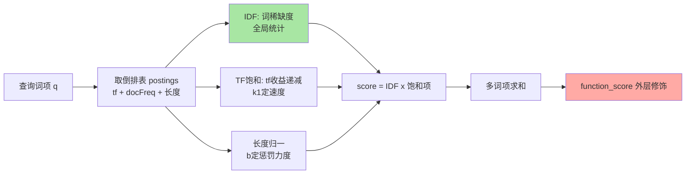
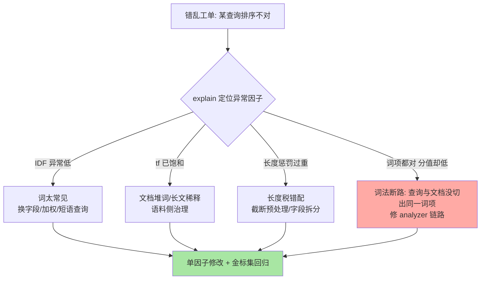
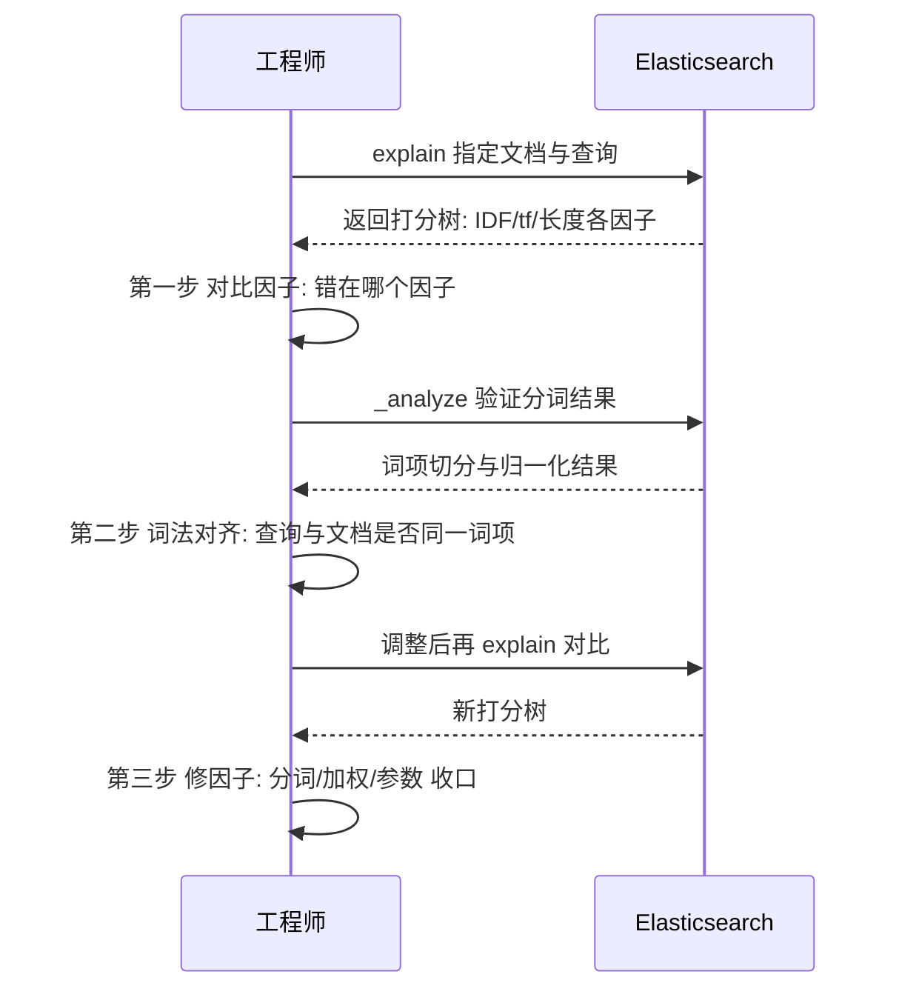

# BM25 相关性打分：公式逐项拆解与错乱排查

> 「为什么这篇文档排第一？」——答不上这个问题，搜索排序的调优就只能靠猜。BM25 的公式只有一行，但每个符号背后都是一个可调的行为旋钮：TF 饱和管「重复词的边际收益」，k1 管「饱和多快到来」，b 管「长文档吃多大亏」。这篇把公式拆到项、把调优落到参数、把错乱排查给到工具。

## 一句话摘要

BM25 打分 = **IDF（词稀缺度）× TF 饱和项（词频收益递减）× 长度归一（惩罚过长文档）**。它与经典 TF-IDF 的分野就在「饱和」二字：词频贡献有上限，堆词不再无脑加分。打分错乱的排查利器是 `explain` API——把每个因子在单篇文档上的取值展开，错在词法、在长度、还是在外部 boost，一眼见底。

## 🎯 本文核心

**核心一句话：BM25 用一条「收益递减」的词频曲线替换了 TF-IDF 的线性堆分——k1 控制曲线多快饱和（默认 1.2），b 控制文档长度惩罚的力度（默认 0.75），IDF 站在乘法外层兜住「常见词压舱、稀缺词抬升」；相关性调优 90% 的战场不在换公式，而在理解这三者对自己语料的实际取值。**

机制链：分词产词项 → 倒排表取 postings（含 tf 与文档长度）→ BM25Similarity 逐词项打分 → 多词项求和（bool 语义）→ function_score 外层修饰 → 排序。全文一句话可重构：「IDF 定稀缺权重，饱和曲线定词频收益，b 定长度税，explain 定错」。

## 前置阅读

- 入门层篇 9《相关性打分》：TF-IDF 与 BM25 的概念对比
- 入门层篇 2《Lucene 与倒排索引》：postings 与统计信息的来源

## 目标导向

本文是什么：BM25 公式的逐项机制拆解 + 生产调优手法 + 错乱排查流程。功能是什么：让「热门内容为什么排不上、长文档为什么吃亏、boost 加了没效果」三问有公式级答案。能得到什么：k1/b 的调参判断依据、function_score 的选型表、explain 排查的完整路径。为什么用：搜索排序质量的日常治理与 bad case 归因，必看。

## 一、边界：入门层讲过什么，本文讲什么

| 内容 | 入门层 | 本文 |
|---|---|---|
| TF-IDF 与 BM25 的概念与历史 | ✅ 讲过 | 不重复 |
| 公式逐项：饱和曲线 / k1 / b 的行为 | 未讲 | **本文核心一** |
| function_score / boost 实战 | 提了 API | **本文核心二：选型与代价** |
| 相关性错乱的排查流程 | 未讲 | **本文核心三：explain 工作流** |
| 分词对打分的影响 | ✅ 篇 5 讲过 | 在排查节引用 |

## 二、公式逐项：每个符号是一个旋钮

BM25 对单个词项在单篇文档上的打分（Lucene 实现口径，省略了常数坐标变换）：

```text
score(q, d) = IDF(term) × (tf × (k1 + 1)) / (tf + k1 × (1 - b + b × fieldLength / avgFieldLength))

IDF(term) = ln(1 + (docCount - docFreq + 0.5) / (docFreq + 0.5))

k1 默认 1.2    —— 词频饱和速度
b  默认 0.75   —— 文档长度惩罚强度
```

逐项拆开：

1. **IDF（逆文档频率）**：词在全库越稀缺，值越大。常见词（「的」「价格」）IDF 逼近 0，天然压舱；稀缺词（型号、错误码）抬升明显。**它站在乘法外层，是全局统计量**——这也是索引陈旧（docCount 变化大）会导致同词分值漂移的原因
2. **TF 饱和项** `(tf × (k1+1)) / (tf + k1 × ...)`：词频从 1 涨到 2 收益明显，从 10 涨到 20 几乎不动——分母里也坐着 tf，这就是「收益递减」的数学形态。堆关键词作弊从此失效：一篇文章把词重复 100 次，得分趋近上限 `k1+1`，不会线性膨胀
3. **k1**：控制饱和多快到来。k1=0 表示完全不看重词频（出现即满分），k1 越大越接近「多给分」的旧直觉。默认 1.2 是对通用文本的折中（业内认知）
4. **b 与长度归一**：`fieldLength / avgFieldLength` 是这篇文档相对平均长度的倍数。b=1 时完全按长度归一（长文档被狠狠压），b=0 时完全不管长度。默认 0.75 的含义：长度要影响打分，但不过分——**长文档多一个词的「稀释税」，由 b 定税率**

**追问：为什么 BM25 敢把词频收益做成递减？** 因为信息论口径下，一个词出现第二次所增加的「这篇文档在讲这个词」的证据，远弱于第一次出现——证据强度天然对数衰减。TF-IDF 的线性 tf 在长文档上系统性偏袒「复读机内容」，BM25 的饱和曲线正是对这一偏差的修正。

**再追问：b 惩罚的「长度」到底是什么长度？** 是该字段的 token 数（分词后的词项数），不是字符数——**分词粒度直接改变长度**：同一篇文档，IK 切出 500 词、standard 单字切出 1500 「词」，avgFieldLength 与 fieldLength 全变。这就是「换分词器 = 重排一遍」的机制根源。



## 三、function_score 与 boost：外层修饰的正确姿势

BM25 管「文本像不像」，业务要的往往是「文本像之外，还应加权」——这个外层就是 `function_score`：

| 函数 | 适用 | 注意点 |
|---|---|---|
| `weight` / `boost` | 静态加权（标题字段查询权重高于正文） | 多子句时按 `score_mode` 组合 |
| `field_value_factor` | 用文档字段值打分（销量、热度） | 必配 `missing` 兜底，缺值文档会整篇丢分 |
| `random_score` | 同分打散（抽签、去尾端重复感） | 配 seed 保证同一用户结果稳定 |
| `script_score` | 上述都不够时的兜底 | 逐文档执行脚本，是性能税最重的选项 |
| `boost_mode` | 内层 BM25 与外层函数怎么合 | multiply 放大差距 / sum 平滑叠加 |

**boost 实战的两条纪律**：

1. **query-time boost 优先于 index-time 加权**：写入期把权重烧进 `_score` 会让「业务策略变更 = 重建索引」，查询期 boost 是可逆的
2. **boost 数值是乘法因子，不是加分**：对标题 `boost: 3` 意味着标题命中得分为 3 倍——与正文命中合并时差距会被放大 3 倍，常用 1.5-2 起步，用 explain 验证后再收放（业内惯例）

**为什么不选「把所有业务权重都塞进 script_score」的反方案？** 脚本逐文档执行，QPS 高的搜索集群里它是最先打穿 CPU 的组件；`field_value_factor` 与 `weight` 是预编译路径，代价低一个数量级（业内认知）。脚本只留作临时验证工具——验证出的公式，最终都应能翻译成函数组合或写入期预处理字段。

**为什么不用「每次调优直接改 k1/b」？** k1/b 是索引级/关闭级的全局旋钮，改它们等于重定义全库打分基准——所有既有排序经验、bad case 结论、A/B 基线全部作废。**业务加权需求走 function_score，公式级参数留给「语料形态根本变化」的时刻**（比如从短标题语料换成长文语料，才值得重新评估 b）。

## 四、源码/关键路径

以 Lucene 主线口径（`org.apache.lucene.search.similarities`）：

- **BM25Similarity**：核心实现——`idfScore` 用 `docCount/docFreq` 计算 IDF，`tf` 部分预计算饱和表（对常见 tf 值缓存计算结果），长度归一在 `score` 里以 `fieldLength/avgFieldLength` 的倒数因子合入
- **统计来源**：`LeafReader` 暴露的 `docCount` / `docFreq` / `sumTotalTermFreq`——IDF 是分段统计的近似（每段各自持有统计量，跨段合并由打分器协调），这解释了「分片少、段大时打分更稳」的现象
- **ES 侧**：`org.elasticsearch.index.similarity.SimilarityService` 负责把 `similarity` 配置装配进 mapper；`function_score` 由 `org.elasticsearch.index.query.functionscore` 包解析为 `ScoreFunction`，在 `FunctionScoreQuery` 里与内层得分按 `boost_mode` 合成
- **explain**：`SearchService` 的 `explain` 能力透传 Lucene 的 `Explanation` 树——每个打分因子都是树上一个节点

阅读建议：读 `BM25Similarity` 时盯住两个「预计算」——饱和表与长度范数缓存，它们解释了 BM25 在百万级文档上的打分开销为什么能保持低位。

## 五、错乱排查：explain 三步工作流

相关性「错乱」的本质是**打分结果与业务直觉的偏差**，归因顺序固定三步：

错乱工单的归因决策树先立起来，再逐层下钻：



**第一步：定位异常因子。** explain 输出里逐项看——IDF 异常低（词太常见，查询该换字段或加权重）、tf 饱和已到顶（文档堆词，查询侧无解，语料侧治理）、长度惩罚过重（长文档，考虑 b 或字段拆分）。大多数「错乱」在这一步就能看见病灶。

**追问：为什么「词项都对、分值却低」要最后排查而不是最先？** 因为词法断路的症状最隐蔽也最容易被误判成「打分问题」——工程师的第一直觉是调打分，而真正的病灶在分词层，调打分的动作全部无效还污染参数基线。把它的排查位次压后，是防止「用打分参数的旋钮去修分词的病」。



**第一步：定位异常因子。** explain 输出里逐项看——IDF 异常低（词太常见，查询该换字段或加权重）、tf 饱和已到顶（文档堆词，查询侧无解，语料侧治理）、长度惩罚过重（长文档，考虑 b 或字段拆分）。大多数「错乱」在这一步就能看见病灶。

**第二步：词法对齐。** 用户 query 与文档字段是否切出同一词项？大小写、同义词、别名、全半角，任何一处没对齐，BM25 根本没机会参与——这类「打分错乱」其实是「召回断路」，占比业内口径接近错乱工单的一半。此时该修的是 analyzer 链路（本系列专题层篇 6 的主战场）。

**第三步：修因子，而不是修感觉。** 每次改动只动一个因子，改完用固定 query 集 explain 对比——「调相关性靠连续试探」会在两周后变成没人敢动的谜团。

## 六、不同量级的思考：相关性治理的档位约束

- **十万级（语料小、词表窄）**：约束来自「统计量噪声」——文档基数小时 IDF 波动大，个别文档的增删就能重排结果；思考方式是「求稳」：固定排序兜底（按时间/热度次级排序）比打磨 BM25 参数更有效。这一档的核心问题是「结果稳不稳」，而不是「公式精不精」
- **百万级（通用搜索起步）**：约束来自「字段异构」——标题/正文/标签的长度与密度差异开始主导错位，multi_match 的字段权重与 b 的字段级覆盖成为主战场；思考方式是「分字段治理」。这一档的核心问题是「字段权重分对没有」，而不是「k1 调多少」
- **千万级（业务加权密集）**：约束来自「业务与文本的张力」——热度、时效、个性化与 BM25 的自然序互相拉扯，function_score 层的策略复杂度指数上升，必须有策略配置化与效果归因体系；思考方式是「分层策略 + 效果度量」。这一档的核心问题是「每个加权有没有效果证据」，而不是「加权列表多长」
- **亿级（多集群/多语料）**：约束来自「统计基准分裂」——同一查询在不同分片/集群上的 IDF 基准不同，跨库合并排序的公平性成为新问题；思考方式是「归一化与集中排序」：打分归一、再排序层收敛。这一档的核心问题是「跨库分值可不可比」，而不是「单库打分准不准」

思考方式总结：十万级靠「求稳」，百万级靠「分字段治理」，千万级靠「分层策略 + 效果度量」，亿级靠「归一化 + 集中排序」——约束分别是统计噪声、字段异构、业务张力、基准分裂。

**自下而上与触发升级**：先看 bad case 的分布再定档——错乱集中在单文档波动（十万级信号）、集中在字段间错位（百万级信号）、集中在业务加权冲突（千万级信号）、集中在跨库排序漂移（亿级信号）。触发升级的信号：固定 query 集的排序稳定性跌穿基线、单字段治理边际收益归零、策略改动无法归因——任一出现，治理手段必须随档位升维。

## 典型场景

- **商品搜索**：标题命中权重 > 类目 > 详情；销量与时效用 `field_value_factor` 做温和外层（log 曲线防头部通吃）——业内最常见的分层打分模板
- **内容/社区搜索**：长文语料对 b 敏感，长度税偏重时新长文普遍吃亏；常用做法是把正文字段长度做上限截断预处理，比调 b 更可控
- **日志检索**：相关性几乎不重要（时间序优先），用 `boost: 0.01` 级别弱化 BM25 或干脆 filter+sort，别让打分开销白花

## 业内惯例

> 💡 **实战提示**：任何相关性改动上线前，先固化一组「金标 query 集」（几十条核心查询 + 期望排序），每次改动跑一遍对比——没有度量集的调优等于开环驾驶，业内惯例是这份集合跟着 bad case 持续生长。

> 💡 **实战提示**：`explain` 输出先看总式再看因子：`sum of: ...` 逐项展开里，第一个异常大的因子就是病灶；把 explain 结果存档进 bad case 工单，错乱归因从「口口相传」变成「证据链」。

> 💡 **实战提示**：`field_value_factor` 必配 `missing` 参数——缺值文档在外层函数直接被剔出候选，表现为「新品/冷门内容永远搜不到」，这是 function_score 最隐蔽的坑。

> 💡 **实战提示**：改 k1/b 只在索引级评估完后对「新建索引」生效验证，滚动 reindex 切换——直接改线上索引 settings 的 similarity 属于高危动作，打分基准变化无法回滚评估。

## 事故复盘两则

**事故一：热门内容集体沉底。** 某内容平台搜索上线后，「热搜词」对应的热门长文普遍排在短文之后，用户侧感知「搜不到热门」。排查路径：explain 显示短文 tf 饱和点低、长度税小，得分系统性高于长文——不是 BM25 错了，是语料长度分布与默认参数错配。处置：正文字段索引前按长度上限截断 + 标题字段提升权重，长文回归合理位置。复盘 Action：新语料接入必须先看长度分布直方图，b 的默认值只对「长度接近均值的语料」友好。

**事故二：销量加权把文本序整个冲垮。** 另一电商集群把销量权重设得过大（`field_value_factor` 线性直乘），头部爆款对任何查询都霸屏——文本相关性被外层完全淹没，「搜 A 出 B」。处置：外层改 log 曲线 + 压低 boost_mode 为 sum 的函数占比，文本分保留主导权。复盘 Action：业务加权的上线标准是「关掉加权后排序变化可控可解释」，加权是修正项不是主序。

## 常见误区

- **「boost 越大越靠前」**：boost 是乘法因子且参与多因子合成，放大过头会把多字段打分结构压成「单字段独裁」——错乱往往不是不够大，而是太大
- **「相关性差就换打分模型」**：BM25 与其他相似度模型的差异，远小于「分词没对齐」「长度税错配」「加权冲垮文本序」这三类常见病灶——先排查再换刀
- **「打分是确定性的」**：IDF 依赖段级统计与索引新鲜度，数据变化会带来分值漂移；跨环境对比分值要同版本同数据，分值本身没有绝对意义
- **「filter 子句也参与打分」**：filter 上下文不打分只过滤——把纯过滤条件放进 query 上下文，既浪费打分开销又可能污染排序，bool 结构里两者必须分清

## Trade-off：文本自然序与业务序的取舍

相关性调优的深层 Trade-off 是「**文本自然序 vs 业务目标序**」：BM25 代表「用户查询与文本的相似度」，业务加权代表「平台的商业意图」。取舍的机制依据是 `boost_mode` 的合成方式——multiply 让业务分放大文本分的差距（强者恒强），sum 让两者独立叠加（文本保底）。业内成熟做法是把业务分压在「修正项」的位置：文本分决定候选序的大形态，业务分在相邻名次间做微调。取舍失衡的代价是双向的：文本序独大会「搜到了但不对」，业务序独大会「不对还搜得到」——后者更危险，因为它透支用户对搜索的信任。

**再追问一层：这个取舍为什么天然存在、无法根除？** 因为两套序的优化目标在数学上不同源——BM25 优化单次查询的文本匹配证据，业务分优化跨周期的转化与经营指标，两者只在「用户恰好想找业务想推的」时重合。成熟团队的解法不是消灭张力而是管理张力：每条业务加权都挂效果证据、设过期时间、定期回收——**加权要像债务一样有台账**，跨周期看加权清单只增不减的团队，排序终将不可维护。这套「加权治理」的跨系统视角（搜索与经营指标系统之间的张力协调）正是相关性工作从调参走向工程治理的分水岭。

设计思想层面，BM25 给所有工程师的启发是「**给收益上界**」：与其让每个信号线性堆分（强者恒强、作弊横行），不如让每个信号都有饱和上限——多信号系统的秩序，来自每个信号的克制。这一思想同样适用于推荐加权、风控评分等一切多信号叠加场景。

## 什么时候用/不用：调优手段决策

- **用 explain 归因**：任何错乱工单的第一动作，明确推荐——先证据后改动
- **用 multi_match 字段权重 + 轻量 function_score**：通用搜索起步，明确推荐；策略可逆、可解释
- **用字段级 similarity 覆盖与 k1/b 调整**：仅当语料形态（长度分布/词表密度）明确偏离通用假设时
- **不用 script_score 做常驻排序**：临时验证可以，常驻排序用函数组合或写入期预处理字段
- **不用「关掉 BM25 只剩业务分」**：那不是搜索，是带查询框的推荐——查询意图需要文本分兜底

## 你们可能会问

**Q1：5.0 之后默认为什么从 TF-IDF 换成 BM25？**
公开口径的核心原因是饱和曲线修正了长文档偏袒与堆词作弊，且多项公开评测显示 BM25 在通用检索质量上稳定占优。对使用者的含义：升级大版本后排序会变，金标 query 集要重新校准。

**Q2：k1、b 到底怎么定，有没有「最优值」？**
没有脱离语料的最优值。实践路径是：先用 explain 看自己语料的 tf 分布与长度分布，再小范围 A/B。业内常见区间 k1 在 1.2 上下微调、b 在 0.6-0.9 之间（业内认知），但「区间」只是先验，语料说了算。

**Q3：为什么同一个查询，重试时分值会轻微变化？**
段级统计的近似性 + 索引刷新带来的段结构变化 + 跨分片合成的合并顺序，都会引入微小漂移。追求逐次一致要用 PIT 固定视图（本系列篇 4 展开）。

**Q4：相关性强不强，除了人工看还有什么指标？**
有标注集就能算：MRR（第一个相关结果的位置倒数）、NDCG（分级相关的折损累计）都是公开口径的标准指标。工程上更常用的是行为代理指标：首屏点击率、零结果率、改写率——便宜、连续、可 A/B。

## 开放问题

- 学习型排序（LTR）与 BM25 的关系正在从「替代」走向「分层」：BM25 作为特征之一进入模型，公式可解释性与模型排序质量的边界如何设计仍在演进
- 语义向量检索兴起后，「文本相关性与语义相关性的融合排序」成为新战场，BM25 分数作为稀疏信号与稠密向量的混合检索是活跃方向

## 🎯 核心带走

- **核心一句话**：BM25 = IDF（稀缺权重）× 饱和词频（k1 定速度）× 长度归一（b 定税负）——调优主战场是字段权重与 function_score 外层，公式参数留给语料形态变化
- **机制链**：分词对齐 → 倒排取 postings → BM25 逐项打分 → 多词项求和 → 外层加权 → explain 验证收口
- **哪里会坏**：分词不对齐（召回断路冒充打分错乱）、长度税错配、加权冲垮文本序、field_value_factor 缺值剔除
- **边界**：本篇管打分与外层修饰；分词链路与同义词在专题层篇 6，分页与快照视图在篇 4

## 📌 数据与事实声明

- 写于 2026-09-17，公式与行为以 Lucene BM25Similarity 实现与 Elasticsearch 官方文档（8.x）为准；Lucene 实现对经典 BM25 论文公式做了坐标与常数变换，本篇给出的是等价简化形态
- 「k1 默认 1.2 / b 默认 0.75 / 词法断路约占错乱工单一半」等均为公开文档或业内经验口径，非实测精确值
- 文中事故均为多来源 anonymized 综合叙事，不指向任何具体公司

## 📚 参考资料

| 类型 | 标题 | 来源 |
|---|---|---|
| 官方文档 | similarity 模块与 BM25 配置 | elastic.co/guide（8.x） |
| 官方文档 | function_score query / explain | elastic.co/guide（8.x） |
| 论文 | The Probabilistic Relevance Framework: BM25 and Beyond（Robertson & Zaragoza） | 公开出版 |
| 原理书 | 《Lucene 实战》（Lucene in Action）相关性章节 | 公开出版 |
| 源码 | apache/lucene（org.apache.lucene.search.similarities.BM25Similarity） | github.com/apache/lucene |
