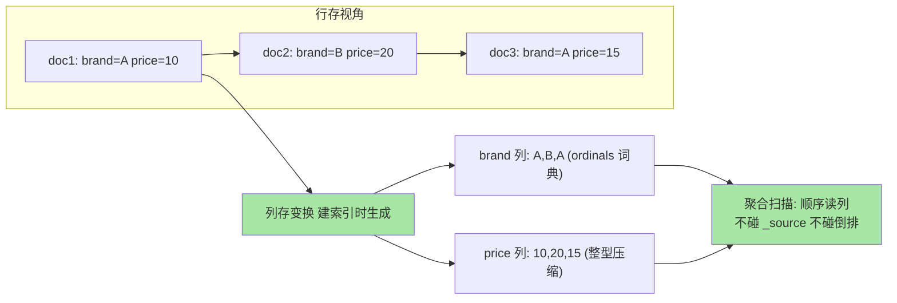
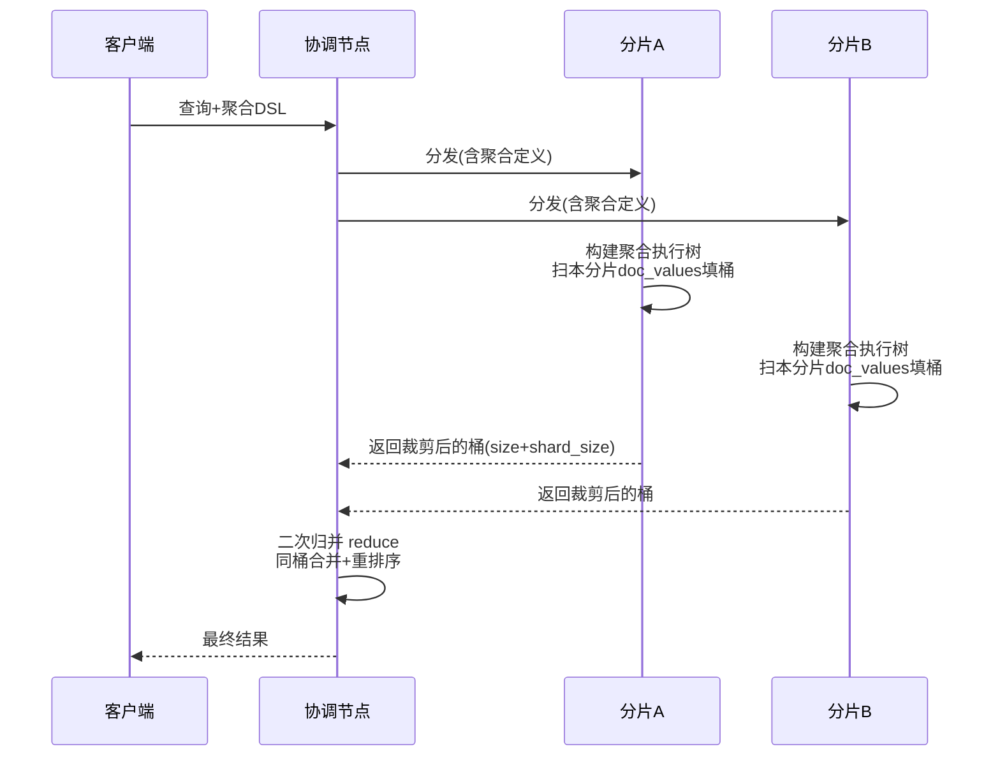
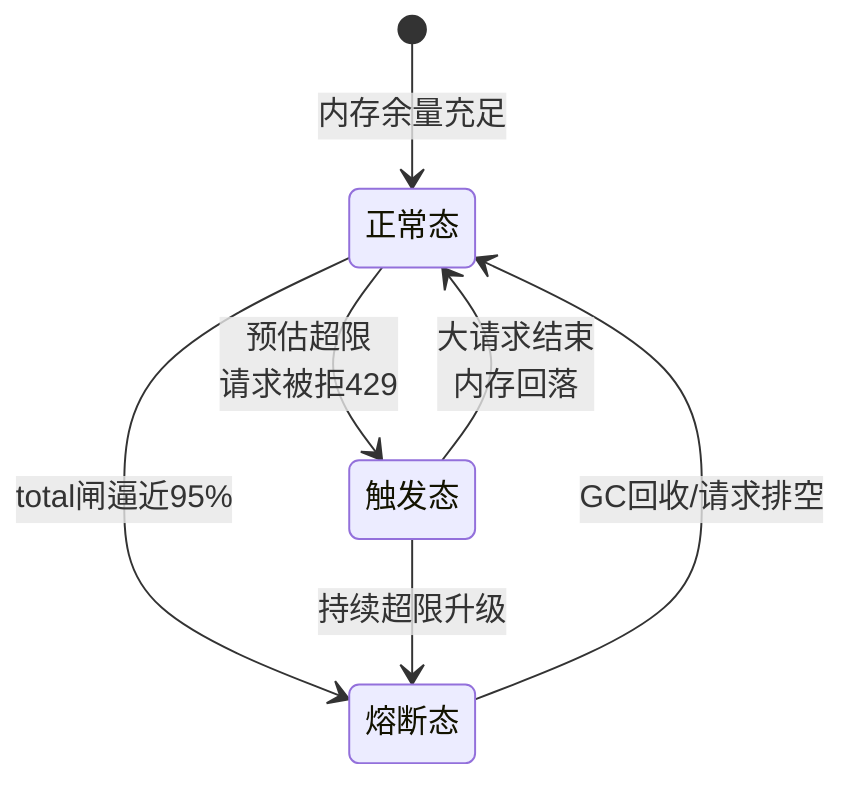

# 聚合执行机制与 doc_values：列存、聚合树与熔断线

> 搜索走倒排，聚合走列存——同一个索引里的两条数据通道。聚合为什么快、深度嵌套为什么能吃光堆内存、熔断器在护什么，答案都藏在 doc_values 的列式布局与聚合器的执行树里。这篇把「桶里套桶」的执行过程拆到数据结构层，把内存风险拆到参数级。

## 一句话摘要

**doc_values 是建索引时预生成的列式存储**（每字段独立、按文档序排列、页缓存友好），聚合沿它做顺序扫描而完全不碰倒排索引与 `_source`。聚合请求在分片层构建「聚合器执行树」逐段消费 doc_values，协调节点做二次归并——**内存风险随嵌套深度与基数相乘放大**，由 circuit breaker 在总量线上拦截。聚合肥大的本质：列存扫描是线性代价，桶的组合是相乘代价。

## 🎯 本文核心

**核心一句话：聚合性能与安全的分水岭在「扫多少行 × 建多少桶」——doc_values 列存把「读」压成线性顺序扫，聚合树把「组合」放大成基数相乘；深度聚合的 OOM 防线不是调堆，而是用基数预估、breadth_first、composite 分页把相乘结构拆回相加结构。**

机制链：请求解析 → 协调节点分发给各分片 → 分片层构建 Aggregator 执行树 → 逐段顺序扫 doc_values 填桶 → 分片返回裁剪后的桶 → 协调节点归并（reduce）→ 返回。全文一句话可重构：「列存管扫的代价，聚合树管组合的代价，熔断器管两者相乘的总账」。

## 前置阅读

- 入门层篇 10《聚合分析》：桶/指标/管道聚合的概念与 DSL 写法
- 入门层篇 13《段合并与存储结构》：段的物理布局（本文列存挂在段上）

## 目标导向

本文是什么：聚合执行的数据结构层拆解 + 内存风险模型 + 熔断参数手册。功能是什么：让「聚合为什么慢、深度聚合为什么 OOM、text 字段为什么不能聚合」三问有结构级答案。能得到什么：doc_values 与 fielddata 的边界判断、深度聚合的降维手法、熔断参数的调优依据。为什么用：报表/看板/日志分析类集群的稳定性治理，必看。

## 一、边界：入门层讲过什么，本文讲什么

| 内容 | 入门层 | 本文 |
|---|---|---|
| 桶/指标/管道聚合的概念与语法 | ✅ 讲过 | 不重复 |
| doc_values 列存的布局与读写路径 | 提了名字 | **本文核心一** |
| 聚合执行树与协调节点归并 | 未讲 | **本文核心二** |
| 深度聚合内存风险与熔断参数 | 未讲 | **本文核心三** |
| terms 聚合的分片误差 | 未讲 | 本文附带讲清 |

## 二、doc_values：建索引时就把聚合要的姿势摆好

倒排索引回答「哪个文档含这个词」，聚合要的是「按文档枚举某字段的全部值」——**读的方向相反**，倒排给不了顺序枚举的效率。doc_values 是答案：每个有聚合/排序/脚本需求的字段，在**建索引时**同步写一份列式结构——按文档号排序、同字段值连续存放、压缩编码（数值用 gcd/offset 等公开口径的整型压缩，字符串用 ordinals 词典编码）。

三个结构性质决定一切行为：

1. **预生成 + 不可变**：doc_values 随段生成，段不可变它也不可变——读时零构建成本，代价是写入时多一份列存体积（`doc_values: false` 可关，代价是该字段从此不能聚合/排序/脚本访问）
2. **页缓存友好**：聚合扫描按列顺序读，OS page cache 命中率天然高；「聚合肥的集群重启后第一次聚合特别慢」就是冷缓存的直接体现
3. **ordinals 词典**：字符串字段聚合实际聚合的是词典序号（int），桶计数在序号空间完成、最后再映射回原词——高基数字段的词典本身成为内存大头

**追问：text 字段为什么默认不能聚合？** text 默认不做 doc_values（要的是倒排，列存只会白占空间）——聚合 text 会走 **fielddata**：查询时把字段全部词项现场加载进 JVM 堆并缓存。这就是那条著名的红线背后机制：fielddata 是堆内、无界、查询时构建的，高基线 text 字段一次聚合就能顶爆堆。**原则上禁用，确需按词聚合走 `keyword` 子字段**——机制层没有例外，只有代价大小。

**再追问：keyword 子字段的聚合就一定安全吗？** 不一定。keyword 只是给了你列存与词典编码，基数本身的风险原样保留——百万级基数的 terms 聚合，词典 + 全局序号表照样可以吃掉数 GB 堆（业内认知）。字段类型安全 ≠ 基数安全，后者只能靠业务侧治理（见第六节）。

## 三、聚合执行树：分片层怎么跑、协调层怎么并

一次带聚合的搜索，两个角色分工明确：

分片层：每个分片按聚合定义构建一棵 **Aggregator 树**（外层桶聚合持有内层子聚合器的引用），匹配到的文档流逐篇「灌」进树——外层桶先按本篇文档的字段值决定进哪个桶，内层聚合器再对桶内文档继续消费。整棵树在**每个分片上独立完整地跑一遍**。

协调层：把各分片返回的部分结果做 **reduce**——同名桶合并、指标重算（avg 要合并 sum 与 count 而不是平均的平均）、重排序后裁剪。**reduce 是二次计算不是简单汇总**，这就是聚合结果的形态必须在 DSL 里完整声明的理由：协调节点只知道你声明的结构。

**terms 聚合的分片误差从这来**：每个分片只返回自己的 top size（实际按 shard_size 返回更多再裁），某桶若在所有分片上都排不进各自头部，全局就会被低估——`doc_count_error_upper_bound` 与 `sum_other_doc_count` 两个字段就是这套机制的诚实披露。**shard_size 调大 = 误差变小 = 协调节点内存变大**，又是一条明码标价的 Trade-off。

**为什么不选「协调节点预扫描全部数据自己聚合」的反方案（ centralized aggregation）？** 那意味着所有原始文档都涌向协调节点，网络与单点内存双双爆炸——分片层预聚合 + 桶裁剪传输，是把「传输量从文档数压到桶数」的关键设计。指标类（avg/sum）因为可交换可合并才适用此法；某些不可合并的指标（如精确 percentile）必须传全量数据或在分片层用可合并的 sketch（如 TDigest，公开口径），**「可合并性」决定一个指标能不能分布式算**——这是理解聚合执行成本的第一性原理。

**追问：聚合扫的是「查询结果集」还是「全部分片文档」？** 两可：无 query 时扫全部文档；有 query 时按匹配集逐篇消费（postings 迭代驱动）。**先过滤后聚合**（filter 上下文收窄集合）因此是聚合优化的第一动作——扫描行数是线性成本的总开关。另有 `execution_hint`（如 terms 聚合的 `map` vs `global_ordinals`）可选执行策略：`global_ordinals` 复用词典全局映射（默认，重复查询快），`map` 现场建哈希（低匹配率时省构建）——hint 的取舍依据就是「词典构建成本 vs 复用收益」。

## 四、深度聚合：内存怎么爆、熔断怎么拦

嵌套聚合的桶数是**各层基数的乘积**：按「省份 × 城市 × 品牌」三层 terms，极端情形桶数 = 基数相乘——扫描还是线性，桶结构是相乘。堆内存、协调节点传输量、reduce 时间全部随乘积走。

ES 的防线是**熔断器组**（circuit breaker，公开口径默认值，7.x 后引入真实内存口径）：

| 配置项 | 默认值 | 护什么 | 为什么这样设 |
|---|---|---|---|
| `indices.breaker.total.use_real_memory` | true | 改用真实内存口径而非堆占比 | 看见堆外引用与页缓存外的真实占用 |
| `indices.breaker.total.limit` | 真实内存口径 95% / 堆口径 70% | 全局总闸：所有 breaker 之和的上限 | 总闸先跳，防单点漏算 |
| `indices.breaker.request.limit` | 60% | 单请求的聚合/排序等中间结构 | 恶意/失误的大聚合第一道闸 |
| `indices.breaker.fielddata.limit` | 40% | fielddata 堆内缓存 | text 聚合的最后防线 |
| `indices.breaker.in_flight_requests.limit` | 100%（真实内存口径下计入总量） | 传输中请求体 | 协调节点收集响应的缓冲 |

熔断触发 = `circuit_breaking_exception` + 429。**熔断器护的是节点不死，不是查询成功**——被熔的请求要靠调用方降级重试。熔断器的运行形态是一个带滞回的状态机：

「触发态」与「熔断态」的区别值得细看：**触发态是单请求被判超限（request 级 breaker 拦截这一个请求），熔断态是节点级总闸拉闸（后续请求普遍被拒）**——前者是查询自身的错，后者是并发总账的错，归因方向完全不同。

**深度聚合的降维手法**（把相乘拆回相加）：

1. **`breadth_first` 收集模式**：terms 聚合先只做第一层桶、裁剪完再下钻内层——`depth_first`（默认）是边灌边递归，`breadth_first` 把内存峰值从「全树」压到「单层」（对高基数第一层收益显著）
2. **`composite` 聚合分页**：以游标方式一页页取桶组合，单请求内存恒定——高基数报表的标准答案
3. **业务侧基数治理**：先 `cardinality` 预估各层基数（近似值，公开口径基于 HyperLogLog），乘积超过预算（业内经验口径：单请求桶预算十万级起步告警）就 redesign 维度
4. ** minimize 桶负载**：内层只放必要子聚合，`min_doc_count` 提前剪枝

**追问：为什么 doc_values 偏要「建索引时预生成」，而不是像 fielddata 那样「查询时按需构建 + 缓存」？** 两代方案的更替本身就是答案：fielddata 的按需构建把成本放在查询期——第一次聚合的用户付全价且付的是堆内存，缓存无界增长；预生成把成本转移到写入期，换来查询期零构建 + 堆外 + 有界。**「把可预计算的成本从读路径挪到写路径」是存储引擎反复出现的母题**——设计思想与写路径的段不可变一脉相承：写一次贵一点，读无数次便宜且安全，这个交换在「读多写少」的搜索场景永远划算；反过来在写多读少的时序场景，业界才发展出「部分字段关 doc_values」的省钱开关。

**为什么不选「把堆调大硬扛」的反方案？** 深度聚合的内存需求随维度组合无上界，堆只是把熔断线往后挪——相乘结构不拆，堆越大死得越晚、GC 停顿越长，反而拖垮同节点的搜索请求。**堆是常数项，聚合结构是指数项，用常数对抗指数是输定了的取舍**。跨周期看更明显：业务维度每年都在长，堆容量不会，靠扩堆续命的聚合体系每一年都比上一年更接近悬崖。

## 五、源码/关键路径

以 ES 主线口径：

- **执行树构建**：`org.elasticsearch.search.aggregations.AggregatorFactory`（各聚合类型的工厂）逐层 `create()` 出 `Aggregator` 树——`search/aggregations/bucket` 与 `metrics` 子包分家
- **文档消费**：`Aggregator#getLeafCollector` 按段收集，桶计数的核心数据结构是 `LongKeyedBucketOrds`（long 槽哈希，doc_values 序号空间）
- **doc_values 读取**：透传 Lucene 的 `org.apache.lucene.index.SortedSetDocValues` / `SortedNumericDocValues` / `NumericDocValues`——列存的词典编码与压缩在 Lucene 的 `codec` 层完成
- **reduce**：`InternalAggregation#reduce` 递归执行——协调节点 `SearchPhaseController` 汇总各分片结果后按聚合定义逐层合并
- **熔断**：`org.elasticsearch.indices.breaker.CircuitBreakerService`——聚合器在分配大结构前 `addEstimateBytesAndMaybeBreak` 预估并请求放行

阅读建议：从 `AggregatorBase#postCollection` 与 `InternalAggregation#reduce` 两个端点读起——一个管「分片层怎么填桶」，一个管「协调层怎么合并」，两者合起来就是聚合执行的完整闭环。

## 六、不同量级的思考：聚合能力的档位约束

- **十万级（数据量小、维度少）**：约束来自「统计噪声」——基数小到 terms 聚合零误差，任何聚合都是亚秒级；思考方式是「自由用」。这一档的核心问题是「指标口径对不对」，而不是「性能扛不扛得住」
- **百万级（报表/看板常态化）**：约束来自「并发聚合的叠加」——单个聚合安全，几十个看板并发同一集群就要算总账；思考方式是「查询治理」：错峰、缓存层（如预聚合表）、慢聚合日志盯防。这一档的核心问题是「并发总账算过没有」，而不是「单条 SQL 快不快」
- **千万级（高基数维度登场）**：约束来自「基数相乘」——维度建模开始决定生死，composite 分页、breadth_first、预聚合（写入期把维度组合算好存成小索引）成为主战场；思考方式是「结构降维」。这一档的核心问题是「相乘结构拆了没有」，而不是「堆给够没有」
- **亿级（日志/时序全量分析）**：约束来自「扫描带宽与新鲜度」——全量聚合的线性扫描成本超预算，架构转向「预聚合 + 下采样 + 冷数据降精度」的分层模型，实时层只留小时级窗口；思考方式是「用写入期预算换查询期自由」。这一档的核心问题是「分析模型分层了没有」，而不是「查询再优化多少」

思考方式总结：十万级靠「自由用」，百万级靠「查询治理」，千万级靠「结构降维」，亿级靠「分层分析模型」——约束分别是噪声、并发叠加、基数相乘、扫描带宽，约束变了思考方式必须跟着换。

**自下而上与触发升级**：先测三个值——慢聚合日志的 P99、单请求桶数、熔断触发频率，实测值决定所在档位。触发升级的信号：慢聚合 P99 破秒、单请求桶数逼近预算、breaker 月触发次数上升——任一出现，治理手段从查询层向结构层升维（结构降维），再向架构层升维（分层模型）。跳档是危险的：百万级就上预聚合体系是过度建设，亿级还在调查询参数是杯水车薪。

## 典型场景

- **运营看板**：固定维度组合、高频刷新——预聚合索引（滚动任务生成）替代在线聚合，查询从秒级到毫秒级（业内常见收益量级）
- **日志分析**：时间 + 低基数字段为主——date_histogram 打底、terms 限高基数，composite 翻页拉明细维度
- **用户画像圈选**：高基数（用户 ID 级）组合——不用在线聚合，走「先 filter 圈集 + 倒排交并」或外部 OLAP 引擎，ES 聚合的舒适区是中低基数

## 业内惯例

> 💡 **实战提示**：所有面向用户的聚合入口，前置一个「维度基数登记表」——每个可聚合字段的近似基数、预期桶数、熔断预算写死在配置里，新维度上线先登记再放流量。业内惯例是这张表由平台方持有，业务方自助申请扩容。

> 💡 **实战提示**：开慢聚合日志（`index.search.slowlog` 的 query 阈值对聚合同样生效），配合 `_nodes/hot_threads` 观察 aggs 相关栈——聚合慢的现场几乎都在扫描与桶构建两段，栈帧直接指路。

> 💡 **实战提示**：`cardinality` 先行是纪律——任何多字段嵌套聚合上线前，先跑一遍各层 cardinality 估算乘积；预算内才放行，超预算回建模讨论。这一步的成本是毫秒级，收益是避免一次熔断事故。

> 💡 **实战提示**：聚合肥大排查先看 `fielddata` 缓存占用（`_stats` 里 `fielddata.memory_size_in_bytes`）——非零且持续增长说明有 text 聚合漏网，顺着聚合日志抓出来改 keyword 子字段，比扩堆治本。

## 事故复盘两则

**事故一：看板新维度打爆整集群。** 某数据分析集群上线一个「按设备型号细分」的看板维度，上线十分钟三个数据节点先后熔断，看板白屏且波及同集群搜索业务。排查路径：breaker 日志定位到 request 熔断 → 慢聚合日志抓到肇事查询 → 复现发现设备型号基数百万级（业内认知口径的「高基数」典型量级），三层嵌套桶数相乘超预算数百倍。处置：维度改 composite 分页 + 预聚合索引，看板响应恢复正常。复盘 Action：聚合维度上线前必须过基数登记表，且看板与在线搜索**分集群部署**——聚合挤兑搜索的事故，第一次就该隔离而不是调参。

**事故二：text 聚合的慢性失血。** 另一集群连续数周「内存缓慢上涨、偶发熔断但找不到大查询」。排查路径：`_stats` 发现 fielddata 缓存持续增长不回落 → 按 fielddata 缓存字段分布定位到一个 text 字段在被脚本聚合（业务侧埋的临时分析代码忘了删）。处置：代码下线，缓存 `fielddata.cache.cleanup` 释放。复盘 Action：fielddata 缓存监控必须进大盘，text 聚合在代码评审清单里列为红线项——慢性泄漏比急性熔断更难归因，靠的是水位趋势而不是单点快照。

## 常见误区

- **「聚合不走内存，和搜索一样走缓存」**：聚合的桶结构是每请求现场构建的，查询缓存只帮到「同查询重复执行」的有限场景——高并发聚合的内存总账必须按并发度估算
- **「avg 的 avg 就是全局 avg」**：协调节点 reduce 要求各分片返回 sum/count 等可合并中间量，误把「分片均值再平均」当正确答案的中间层实现会造成静默的数据错误
- **「熔断阈值调高就安全了」**：调高只是把死线后移——breaker 预估不准的场景（脚本内存）会绕过防线直奔 OOM，总闸 95% 的真实内存口径是最后防线不是万能保险
- **「doc_values 关了省空间不影响查询」**：影响的是排序/聚合/脚本访问三类能力，`sort` 报错往往在上线数周后业务要用时才暴露——关之前确认字段的全生命周期用法

## Trade-off：实时聚合与预聚合的取舍

聚合体系的终极 **Trade-off** 是「**查询期灵活 vs 写入期预算**」：在线聚合保留任意维度组合的自由，代价是每次查询付全价（扫描 + 桶构建 + reduce）；预聚合把常用组合在写入期算好，查询退化为点查，代价是维度组合固化、新鲜度延迟、存储翻份。取舍的锚点是「维度组合的确定性」：看板类组合稳定（预聚合赢），探索式分析组合无界（在线聚合赢）。成熟体系是两者分层共存——预聚合扛固定流量，在线聚合兜长尾探索，**用确定性付低价，把贵的灵活性留给真正需要它的查询**。这条取舍在 OLAP 领域通用，ES 只是它的一个应用现场。

## 什么时候用/不用：聚合方案决策

- **用在线 terms/date_histogram**：基数万级以内、并发可控、结果要新鲜——明确推荐，这是 ES 聚合的舒适区
- **用 composite + breadth_first**：基数十万级到百万级的明细探索，明确推荐；单请求内存恒定是硬保障
- **用预聚合索引/写入期建模**：维度组合固定、流量大的看板与日报，明确推荐
- **不用在线聚合**：基数亿级、全量扫描、多维无界组合——这是 OLAP 引擎的主场，硬用 ES 聚合是把相乘结构硬塞进单机堆
- **不用 text 聚合/fielddata**：任何场景都不推荐，机制上是无界堆内缓存，keyword 子字段是唯一正解

## 你们可能会问

**Q1：doc_values 和列式数据库（如 ClickHouse）的列存是一回事吗？**
设计动机相同（聚合读列比读行快），实现场景不同：doc_values 挂在 Lucene 段上、与倒排共存、随段不可变；独立 OLAP 的列存有更激进的编码与向量化执行。ES 聚合舒适区是「中低基数、交互式」，超大规模全量分析仍是专业列存引擎的主场。

**Q2：为什么有的聚合要开 profile 看很久，有的瞬间返回？**
差异主要在「桶构建成本」：指标聚合只线性扫列（快），桶聚合要维护哈希结构与词典映射（贵）；`global_ordinals` 的首次构建是一次性成本，之后复用。profile 结果里的 `build_aggregation` 与 `collect` 两段占比直接告诉你贵在哪。

**Q3：shard_size 默认多大？调大有副作用吗？**
默认是 `size × 1.5 + 10`（公开口径）。调大降低分片误差、增大协调节点内存与传输——对误差敏感的排行场景（如 top 榜）值得调大，日常报表默认即可，反正 `doc_count_error_upper_bound` 会告诉你误差水平。

**Q4：聚合能和分页搜索组合吗？**
能，同请求内共存——但聚合作用于完整匹配集（不受 from/size 分页影响），这是特性不是缺陷：分页看明细、聚合看全貌，一次请求各取所需。要注意两者的内存成本叠加，超深分页 + 重聚合的请求单独压测。

## 开放问题

- 聚合的向量化执行（批量处理而非逐文档回调）在 Lucene 侧持续推进，聚合执行模型从「回调树」向「向量化管线」演进会重写本篇的成本模型
- 存算分离与物化视图的结合让「预聚合」从工程手法走向产品能力，查询期与写入期的边界正在被重新划分

## 🎯 核心带走

- **核心一句话**：doc_values 列存把聚合的「读」压成线性顺序扫，聚合树把「组合」放大成基数相乘——治理相乘结构（composite/breadth_first/预聚合/基数治理）才是聚合肥大的正解，扩堆只是把死线后移
- **机制链**：DSL 声明 → 分片层 Aggregator 树扫 doc_values → 桶裁剪传输 → 协调节点 reduce → 熔断器兜底
- **哪里会坏**：高基数嵌套乘积爆堆、text 聚合 fielddata 慢性泄漏、看板与搜索同集群挤兑、avg 的 avg 静默算错
- **边界**：本篇管聚合执行与内存；聚合 DSL 语法在入门篇 10，与 OLAP 引擎的体系对比在整合层

## 📌 数据与事实声明

- 写于 2026-09-17，机制以 Elasticsearch 8.x 与 Lucene 公开源码口径为准；熔断默认值为公开文档口径（7.x 引入真实内存口径后 total.limit 默认 95%，堆口径 70%），使用前按所用版本核对
- 「桶预算十万级」「基数百万级属高基数」「看板响应毫秒级」等为业内经验口径，非实测精确值
- 文中事故均为多来源 anonymized 综合叙事，不指向任何具体公司

## 📚 参考资料

| 类型 | 标题 | 来源 |
|---|---|---|
| 官方文档 | aggregations: 执行模式与 composite | elastic.co/guide（8.x） |
| 官方文档 | circuit breaker 设置一览 | elastic.co/guide（8.x） |
| 原理书 | 《Elasticsearch: The Definitive Guide》聚合章节 | 公开出版 |
| 源码 | elastic/elasticsearch（org.elasticsearch.search.aggregations） | github.com/elastic/elasticsearch |
| 源码 | apache/lucene（org.apache.lucene.index.SortedSetDocValues 及 codec） | github.com/apache/lucene |
