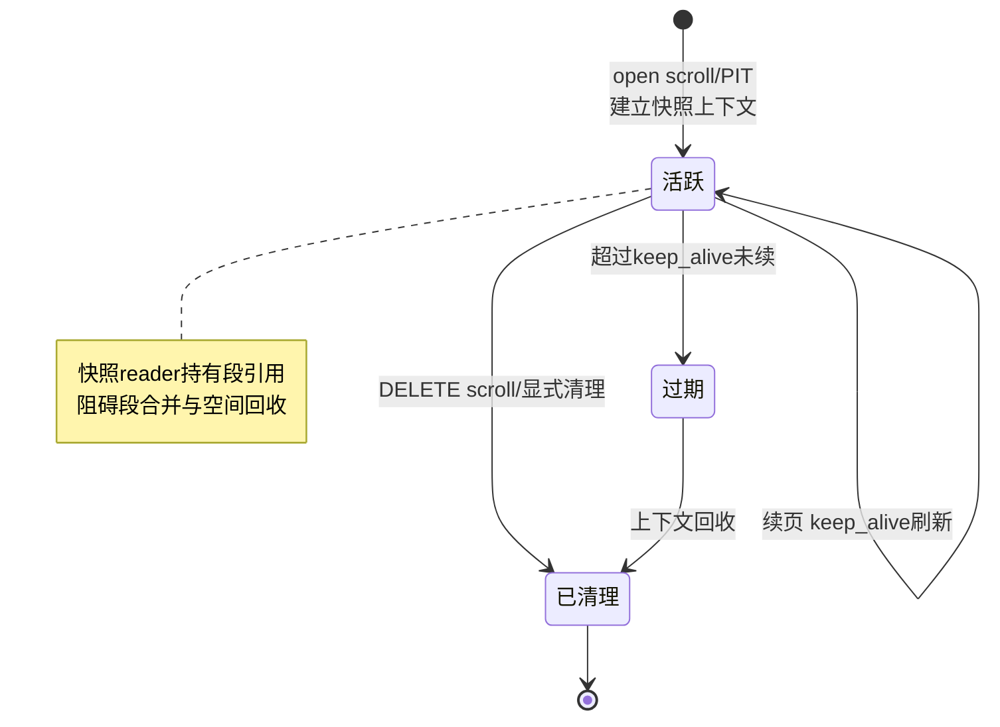
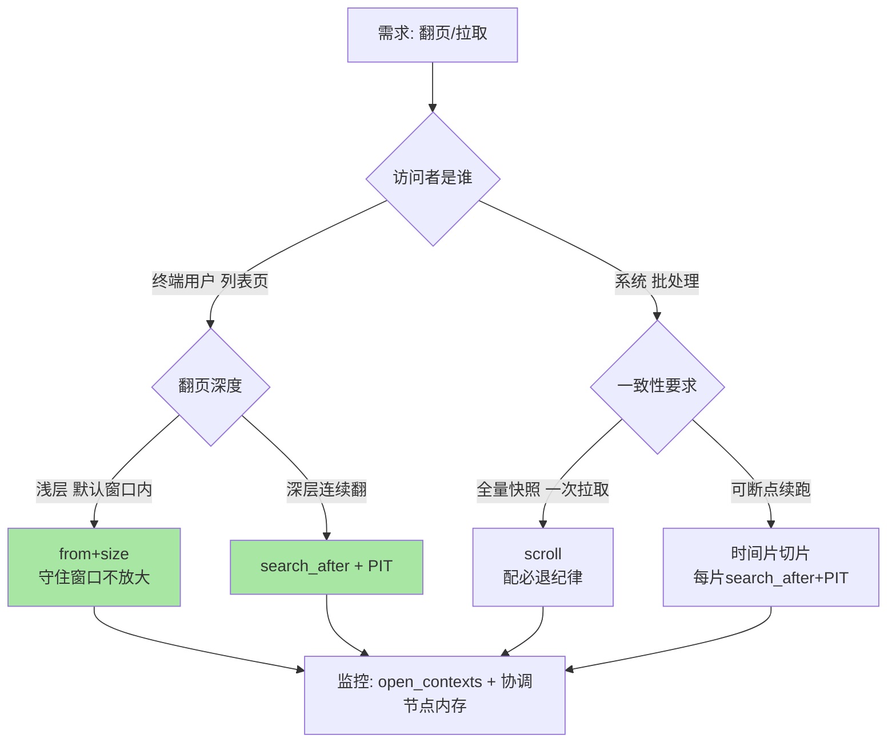

# 深度分页三方案：from+size、search_after 与 scroll 的适用边界

> `from: 10000` 报错的那一刻，很多人第一次意识到「分页」在分布式系统里不是免费操作。from+size、search_after、scroll——三个方案的差异不在 API 形态，而在**「排序结果的快照语义」与「每页的成本曲线」**：谁在翻页期间保持视图、成本随页深怎么涨、状态存在哪。这篇把三方案拆到执行层，给出选型边界。

## 一句话摘要

**from+size 每页全量重排**（每个分片都要吐出 from+size 条给协调节点归并，成本随页深线性涨，`max_result_window` 默认 10000 就是这条成本曲线的硬闸）；**search_after 用排序值做游标**（每页成本恒定、无状态，配 PIT 固定视图解决「翻页期间数据变化」的一致性）；**scroll 持有服务端快照游标**（一次排序多次续页、专为全量导出设计，代价是服务端状态与资源占用）。选型一句话：**用户翻页用 search_after+PIT，系统导出用 scroll，随机跳页在浅层用 from+size**。

## 🎯 本文核心

**核心一句话：深度分页的本质是「排序视图的一致性」与「翻页成本」如何付费——from+size 每页重付排序全价、成本随页深上涨；search_after 把「上一页末尾的排序值」当免费门票、成本恒定但要求结果有序；scroll 用服务端快照把门票变成年卡、成本恒定但要占资源还得记得退卡。三方案没有谁取代谁，是三种一致性语义的商业模型。**

机制链：排序键选择（必须有全序）→ 游标语义（search_after 的 after 值 / scroll 的 context id / PIT 的 reader 租约）→ 视图一致性（实时视图 vs PIT 快照 vs scroll 快照）→ 资源回收（scroll 的 clear 与 keep_alive）。全文一句话可重构：「from+size 付重排税，search_after 付有序约束，scroll 付状态成本」。

## 前置阅读

- 入门层篇 8《查询 DSL》：查询执行与协调节点的初次建立
- 入门层篇 17《集群高可用与一致性》：分片模型（分页成本的分摊逻辑在此）

## 目标导向

本文是什么：三方案执行机制拆解 + 一致性语义对比 + 选型决策树。功能是什么：让「为什么 from 超过一万报错、翻页时新数据乱入怎么破、scroll 把集群拖挂怎么清」三问有执行层答案。能得到什么：三方案的成本模型、PIT 的正确用法、scroll 泄漏的排查手册。为什么用：列表页、导出、同步任务的日常设计与故障处理，必看。

## 一、边界：入门层讲过什么，本文讲什么

| 内容 | 入门层 | 本文 |
|---|---|---|
| from+size 的用法与 10000 报错 | ✅ 讲过 | 不重复，直接进成本模型 |
| search_after / scroll / PIT 的机制与边界 | 未讲 | **本文核心一** |
| 翻页期间数据变化的一致性问题 | 未讲 | **本文核心二** |
| scroll 状态泄漏的治理 | 未讲 | **本文核心三** |
| 分页与聚合同请求共存 | 提了一句 | 特性差异在篇 3 已述 |

## 二、from+size：每页都是一场全量重排

from+size 的成本模型先立起来：


每一页（无论第几页）都是「所有分片全量排序 → 协调节点收 from+size 条 → 扔掉前面 → 返回一页」。**成本随 from 线性上涨，网络传输量是 from+size 与分片数的乘积**。`max_result_window`（默认 10000，公开口径）不是技术极限而是**经济闸门**——它拦的不是「能不能」，而是「值不值」：第 10000 页的查询让整个集群为一个用户的一屏数据做全量排序。

**追问：为什么 ES 不能像单机数据库那样「惰性跳过」前面的页？** 单机 B+ 树可以按索引游标 seek 到偏移量；ES 的数据摊在多个分片上，第 9901-10000 名的全局序要在**所有分片的候选集归并后**才存在——任何分片都无法独自知道「自己贡献哪些才凑成全局这 100 条」，除非大家都把 top 10000 交出来。**全局序是归并的产物，归并必须付全量传输的价**——这是分布式排序的结构性成本，不随实现优化消失。

**再追问：那把 max_result_window 调大不就行了？** 调大是把闸门后移：协调节点堆内存按「from+size × 分片数 × 每条命中体积」线性膨胀，一两个恶意深翻页请求就能把协调节点顶到熔断。业内惯例是把这道闸当 API 契约守住、默认值不动，深翻页需求走游标方案——**改这个参数的团队，几乎都在之后的某个高峰为它付过学费**（业内认知）。

## 三、search_after：把排序结果当游标

search_after 的想法极简：**上一页最后一条的排序值，就是下一页的起点**。

```text
第一页: sort: [price desc, _id asc]  size: 100
第二页: search_after: [上一页第100条的price, 它的_id]  （不再有 from）
```

三个关键点：

1. **排序键必须构成全序**：单字段有并列值时会漏数据/重数据——惯例是组合一个唯一字段（如 `_id` 或业务唯一键）做末位排序键，把「偏序」钉成「全序」。漏这步的翻页 bug 症状是「偶尔丢一条」，极难复现
2. **每页成本恒定**：每分片只需取「排序值之后的前 size 条」，协调节点归并量恒为「size × 分片数」——第 1 页与第 10000 页成本相同，成本曲线被拉平
3. **只能顺序翻**：不能跳页——游标的语义就是「从当前位置继续」，这是为恒定成本付出的表达力代价

**search_after 的一致性缺口**：默认状态下每一页都是独立的实时查询——翻到第 5 页时，前面的数据可能被更新/删除，新数据可能插到你已翻过的位置，**页与页之间没有快照关系**。列表页多数场景不在乎；但「导出对账」「全量比对」场景在乎，这就引出 PIT。

## 四、PIT 与 scroll：给翻页一个固定视图

**PIT（point in time）**：`open_point_in_time` 打开一个轻量视图，服务端固定住底层 Lucene reader 的引用（段快照），`keep_alive` 内后续 search_after 请求带上 PIT id，**所有页都读同一个快照**——一致性语义齐了，成本模型还是 search_after 的恒定页成本。7.10 后官方推荐路径就是「PIT + search_after」（公开口径）。

**scroll**：一次查询 + 持续 `scroll_id` 续页。它在服务端持有完整的搜索上下文（快照 reader + 游标状态），专门为「全量拉取」设计。**scroll 的三个工程红线**：

1. **keep_alive 不是租约自动续**：是「每次续页重置的存活期」——批处理任务卡住超过 keep_alive，上下文照样过期，续页报错
2. **用完必须 `DELETE /_search/scroll`**：上下文不退，快照 reader 引用不释放，底下的段不能被合并回收——**堆外与磁盘的慢性泄漏**，集群级 scroll 堆积的直接后果是段文件膨胀、搜索变慢、最终 OOM
3. **不是给用户翻页用的**：快照语义 + 服务端状态 + 无并行取页能力，让它在这条赛道上全面劣于 PIT + search_after；官方口径也只推荐 scroll 用于类似 reindex 的系统场景（公开口径）



**为什么不选「scroll 当万能分页」的反方案？** 用户翻页的访问模式是「大量用户各自翻几页、随时离开」——scroll 给每个会话挂一个服务端快照，快照 reader 钉住旧段不让合并，高峰期千级并发会话就是千级快照，资源模型完全不匹配。**scroll 的快照是「批处理时间的」，用户会话是「交互时间的」，时间尺度差三个数量级的两类负载不能共享同一状态机制**。PIT 把快照成本降到「共享 reader 租约」级别，才是为交互场景重新定价的方案。

## 五、源码/关键路径

以 ES 主线口径：

- **from+size**：`SearchService#parseSource` 处理 `from/size`，`TopDocsCollector` 按每分片 `from+size` 收集，`SearchPhaseController` 在协调节点做 `TopDocs` 归并——`max_result_window` 的检查在 `SearchService#defaultSize` 附近的校验逻辑
- **search_after**：`SearchAfterBuilder`——把 after 值编码为 Lucene 的 `FieldDoc`，查询时下推为每个分片的 `searchAfter` 起点过滤
- **scroll**：`SearchService#executeScroll` 与 `ScrollContext`——快照 reader 由 `ReaderContext` 持有，`keepAlive` 计时刷新在每次续页；`SearchService#freeAllScrollContexts` 与 `DELETE /_search/scroll` 对应释放
- **PIT**：`RestPointInTimeAction` / `SearchService#openReaderContext`——PIT 本质是「不绑定查询的 ReaderContext 租约」，快照建立后 search_after 请求以 `pit_id` 关联同一 reader
- **监控**：`_nodes/stats` 的 `search.open_contexts`——所有 scroll/PIT 上下文的总闸水位计

阅读建议：`ReaderContext` 是理解「快照持有成本」的最佳切面——scroll 与 PIT 在它之上的差异只是「绑定查询与否、成本几许」，一个类看懂两个方案。

## 六、不同量级的思考：分页选型的档位约束

- **十万级（单索引小数据）**：约束来自「需求形态」——这个量级连深分页需求都很少真实出现，from+size 默认配置全场景够用；思考方式是「不设防」。这一档的核心问题是「需求是真是假」，而不是「方案选哪个」
- **百万级（C 端列表页）**：约束来自「交互延迟与并发」——用户翻页深度集中在头部（业内认知：绝大多数用户只翻前几页），from+size 浅层 + search_after 兜深层的组合即可；思考方式是「按访问深度分层」。这一档的核心问题是「深层翻页是真需求还是产品幻想」，而不是「技术怎么扛」
- **千万级（导出/同步常态化）**：约束来自「全量拉取的资源曲线」——scroll 的状态成本开始可见（open_contexts 水位、段回收延迟），PIT+search_after 或按时间片切批成为标准姿势；思考方式是「把全量拆成增量流」。这一档的核心问题是「全量任务有没有拆片」，而不是「scroll 参数怎么调」
- **亿级（跨集群/跨中心数据面）**：约束来自「全局序的归并成本」——任何「跨全库排序取第 N 页」都在付归并税，架构转向「分区独立分页 + 业务层归并」或游标化的异步导出；思考方式是「消灭全局序」。这一档的核心问题是「能不能不排全局序」，而不是「归并怎么加速」

思考方式总结：十万级靠「不设防」，百万级靠「按访问深度分层」，千万级靠「全量拆增量」，亿级靠「消灭全局序」——约束分别是需求形态、交互并发、拉取资源曲线、归并成本。

**自下而上与触发升级**：先测两个分布——用户翻页深度分布（决定 from+size 的安全层）、导出任务的频率与单次体量（决定游标方案的资源预算）。触发升级的信号：from+size 请求开始触碰窗口上限、open_contexts 持续不回落、导出任务与在线查询出现资源挤兑——任一出现，方案从「单点选型」升级为「分层组合」。跳档的代价：百万级就上亿级的「消灭全局序」是过度设计，亿级还在调 scroll 参数是缘木求鱼。

## 典型场景

- **电商列表页**：产品坚持「跳页」体验——浅层（默认窗口内）from+size + 页码折叠（超过 N 页显示「查看更多」）是业内最普遍的折中
- **对账导出**：按时间片（小时/天）切片，每片 search_after + PIT 顺序拉全——可断点续跑、可并行、可重放
- **索引间同步**：`_reindex` / 远程复制的系统场景，scroll 仍是官方路径；自研同步则按时序游标（自增字段/时间戳）拉增量，完全绕开快照

## 业内惯例

> 💡 **实战提示**：给 search_after 的排序键末位强制拼一个唯一字段并写进团队规范——「偶尔丢一条」的翻页 bug 没有这个规范就是无解之谜。code review 时把「sort 无唯一末位键」当 bug 提。

> 💡 **实战提示**：监控 `search.open_contexts`，设告警阈值（如持续高于百级，业内惯例按集群规模定）——它早于一切 OOM 症状告诉你「有 scroll 没退卡」。

> 💡 **实战提示**：批处理任务的 scroll keep_alive 设得比单页处理耗时大一个数量级（如单页 10s 则 keep_alive 2m），任务 finally 块里无条件 DELETE scroll——这两行纪律合起来，scroll 泄漏事故基本绝迹。

> 💡 **实战提示**：产品提「跳到任意页」需求时，拿翻页深度分布数据对话——业内普遍数据是深度翻页占比可忽略（业内认知），用「页码折叠 + search_after 连续翻」替代全量跳页，产品与工程双赢。

## 事故复盘两则

**事故一：调度任务把集群拖进慢查询泥潭。** 某平台的数据同步任务用 scroll 拉全量，任务异常重试时旧 scroll 不清理直接开新——一周后 open_contexts 涨到数千，快照 reader 钉住大量旧段，段合并停摆，磁盘占用翻倍，在线搜索 P99 翻倍。排查路径：慢查询无规律 → `_nodes/stats` 看到 open_contexts 异常 → `_tasks` 与 scroll 列表对出上千个僵尸上下文。处置：批量 DELETE 全部僵尸 scroll，段合并逐步追上，指标回落。复盘 Action：scroll 使用必须封装成「申请-使用-必退」的工具类，禁止业务代码裸调 API；open_contexts 进监控大盘并告警。

**事故二：翻页「偶尔丢一条」的幽灵。** 某列表页用 search_after 按「更新时间倒序」翻页，测试反馈偶发某条数据消失。排查路径：先怀疑索引问题，无果；用固定数据集复现，发现并列更新时间的数据在两页边界处丢失——排序键无唯一末位键，并列值的顺序在两次查询间不稳定。处置：末位补 `_id` 排序键，问题消失。复盘 Action：翻页全序键规范入库；「偶发、不可复现」类 bug 先查语义边界（并列、空值、时区）再查系统故障。

## 常见误区

- **「max_result_window 是性能参数，调大没关系」**：它是经济闸门不是技术极限，调大等于允许协调节点为任意深页付全量排序成本——高峰期的堆内存账单会说话
- **「search_after 要传上一页最后一条的 _id 就行」**：search_after 的游标是**排序值数组**（每个排序字段一个值），只传 _id 且不在排序键里等于没生效——报错算运气好，静默漏数据才是常态
- **「PIT 是 scroll 的别名」**：PIT 只是固定视图的租约，不携带查询、不持有排序状态、成本远低于 scroll 的完整搜索上下文——「PIT 替代 scroll」替代的是快照语义，翻页本身靠 search_after
- **「scroll 卡住说明要加大 keep_alive」**：先看是任务真的慢（加大有效）还是任务死了在空转（加大只是把泄漏养肥）——续页日志的时间间隔是判断依据

## Trade-off：一致性、成本与表达力的三角

分页方案的 **Trade-off** 是三角结构：**一致性**（页间快照 vs 实时视图）、**成本**（恒定页成本 vs 递增重排成本 vs 服务端状态成本）、**表达力**（跳页 vs 顺序翻）。from+size 全占成本劣势换来跳页自由；search_after+PIT 拿恒定成本与快照一致性，付出「只能顺序翻」的表达力；scroll 有快照与恒定成本，付出服务端状态这个长期负债。取舍的锚点是「访问模式的时间尺度」：交互式访问短平快（选 search_after+PIT），批处理访问长而重（选 scroll 或时序游标），**用访问模式挑付费模型，而不是用一个方案硬套所有模式**。

**打破砂锅问到底：为什么「快照」这件事在三种方案里成本差这么多？** from+size 没有快照，每个查询各自看实时视图，服务端零状态；PIT 的快照是「共享 reader 的租约」——多个会话可以踩在同一个 reader 引用上，边际成本接近零；scroll 的快照是「绑定查询的完整上下文」——排序状态、游标位置、reader 引用一人一份。三档成本对应三种租约粒度，**状态管理的粒度设计决定了快照的定价**——这个视角同样适用于数据库快照读、MVCC 与文件系统快照的对比，跨系统看都是同一套经济学。

## 什么时候用/不用：三方案决策

选型先过决策树，再看各分支的适用细则：



- **用 from+size**：默认窗口内的浅层翻页、需要跳页交互——明确推荐，但守住默认窗口不放大
- **用 search_after + PIT**：深层连续翻页、导出对账、任何「翻页期间不许数据乱入」的场景——明确推荐，这是当前官方主推路径
- **用 scroll**：reindex 类系统任务、已知体量的批处理拉取——可用，但必须封装「必退」纪律
- **不用 from+size 调大窗口硬扛**：任何场景都不推荐，协调节点内存是全集群共享的公共财
- **不用 scroll 服务用户会话**：状态模型不匹配，PIT+search_after 在每个维度都更优

## 你们可能会问

**Q1：search_after 的 after 值怎么传给前端？**
把上一页最后一条的排序值数组原样下发（通常放进响应的扩展字段），前端下一页请求时带回。注意排序值要对序列化稳定（浮点精度、时区），全序键里有字符串唯一键时最稳。也有团队把游标加密/编码成不透明 token，顺带解决「客户端篡改排序参数」的问题。

**Q2：PIT 的 keep_alive 期间，索引一直在写入，快照会膨胀吗？**
快照固定的是「已有段的引用」，新写入进新段、不属于快照视图——快照本身不膨胀；但快照钉住的旧段不能被合并，PIT 长开 + 高写入会让段数量缓慢上升，keep_alive 按需设短（如 30s-1m 级别，公开口径的常见量级）是纪律。

**Q3：能并行拉一个 scroll 的不同区间吗？**
不能——scroll 的游标是顺序续页语义。要并行就换思路：按分片 sliced scroll（公开口径，按分片数切多个子游标）或按业务键分片各自 search_after，每路独立顺序消费。并行度控制在分片数级别，别把拉取做成对集群的压测。

**Q4：跳页需求真的没有办法低成本实现吗？**
低成本跳页的本质是「预先算好页边界」：预生成每页的起始排序值（定时任务把全量结果切片存边界表），跳页查边界表再 search_after。代价是结果集变化时边界表要刷新——组合固定、翻页深的场景（如分页报表）值得，通用列表页不值得。

## 开放问题

- 时序类引擎（如 ES 的 downgrade 到 TSDB 的路径）正在把「无限顺序翻」做成原生能力，游标方案与应用层的边界可能进一步下沉
- 存算分离后「快照」的单位从「节点 reader」变成「共享存储的版本引用」，PIT 的成本模型会再降一档，深度分页的经济结构可能被重新定价

## 🎯 核心带走

- **核心一句话**：from+size 每页付全量重排税（窗口闸门是经济线不是技术线），search_after 拿恒定页成本付「全序键 + 顺序翻」的约束，scroll 用服务端快照换批处理便利付状态负债——PIT+search_after 是交互场景的标准答案
- **机制链**：排序键全序化 → 游标/快照语义选择 → 页成本模型（重排税 vs 恒定 vs 状态持有）→ open_contexts 水位监控兜底
- **哪里会坏**：无唯一末位键的静默丢数据、僵尸 scroll 钉死段合并、调大窗口的堆账单、after 值传错字段
- **边界**：本篇管分页执行与一致性；聚合与分页的成本叠加在篇 3，导入导出的全链路在整合层

## 📌 数据与事实声明

- 写于 2026-09-17，机制以 Elasticsearch 8.x 公开文档与源码口径为准；PIT 自 7.10 引入，`max_result_window` 默认 10000、`shard_size` 等默认值为公开文档口径，使用前按所用版本核对
- 「用户翻页深度集中于头部」「scroll 僵尸上下文致段合并停摆」等为业内经验口径与多来源综合认知，非实测精确值
- 文中事故均为多来源 anonymized 综合叙事，不指向任何具体公司

## 📚 参考资料

| 类型 | 标题 | 来源 |
|---|---|---|
| 官方文档 | paginate search results（from/size、search_after、scroll 对比） | elastic.co/guide（8.x） |
| 官方文档 | point in time API / search sliced scroll | elastic.co/guide（8.x） |
| 官方博客 | Elasticsearch PIT 与 search_after 的推荐路径演进 | elastic.co/blog（公开口径） |
| 源码 | elastic/elasticsearch（org.elasticsearch.search.internal.ReaderContext） | github.com/elastic/elasticsearch |
| 原理书 | 《Elasticsearch 权威指南》分页章节 | 公开出版 |
