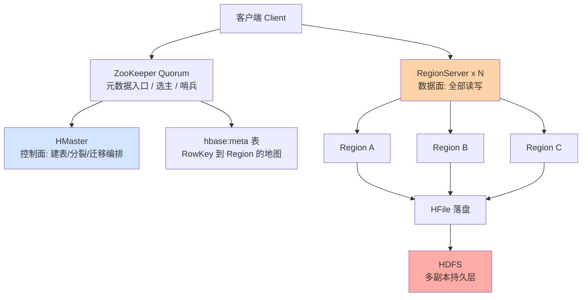
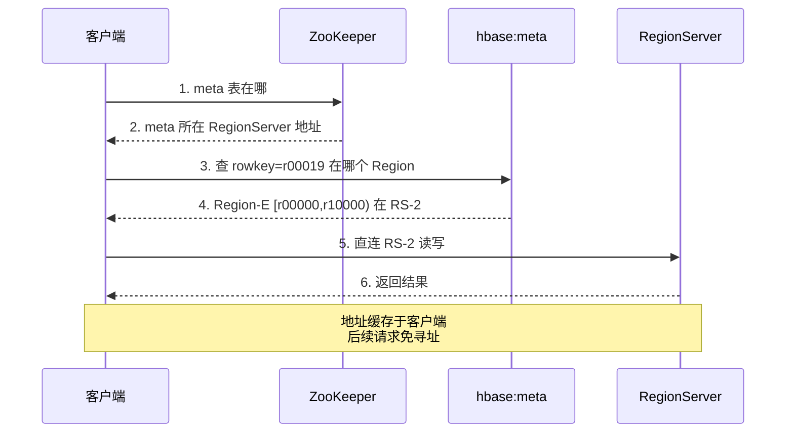
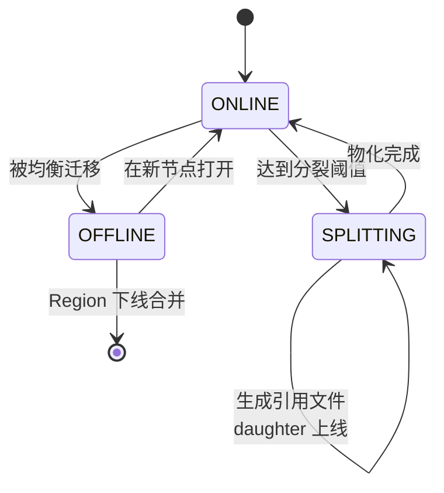
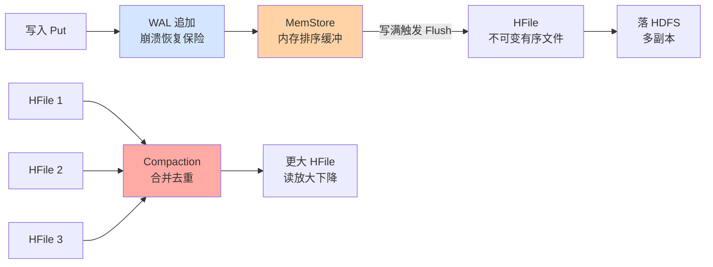

# HBase 架构深度：从 Region 到 ZooKeeper 的分工与协作

> 一句话：HBase 的架构是一条「分工链」——ZooKeeper 管元数据入口与选主哨兵，HMaster 管编排不碰数据，RegionServer 承接全部读写，Region 是数据分布的最小单元，底层 HFile 落在 HDFS 上——每个组件的职责边界，决定了它的一切性能与高可用表现。

## 🎯 本文核心

**核心一句话：HBase 用「控制面与数据面分离」组织整个系统——HMaster 是控制面（只管元数据编排，不在读写路径上），RegionServer 是数据面（全部读写压力都在它身上），ZooKeeper 是仲裁面（元数据入口 + 选主协调 + 存活哨兵），数据最终以 HFile 形态落在 HDFS——理解任何一个 HBase 问题，先定位它在哪一面。**

机制链：客户端问 ZooKeeper → 定位 hbase:meta → 找到目标 RegionServer → 读写 Region（MemStore/HFile）→ 落盘 HDFS。本篇五段全挂这条线。

## 一句话摘要

HBase 是主存分离的分布式宽列存储：**RegionServer** 负责服务若干 **Region**（表按 RowKey 范围切出的连续分片），承接全部读写；**HMaster** 负责控制面编排（建表、Region 分裂与分配、负载均衡、故障 Region 回收），不参与单条读写路径；**ZooKeeper** 承担三重角色——客户端的元数据定位入口、Master 选举的协调者、RegionServer 存活的哨兵。存储引擎是 LSM 变体：写入先进 WAL 与 MemStore，Flush 生成 HFile，后台 Compaction 合并，HFile 最终存于 HDFS 获得三副本容灾。这套架构的取舍：写入吞吐与水平扩展极强，代价是读放大与组件复杂度。

## 一、三个组件的职责边界：谁管什么

### 控制面：HMaster

HMaster 做四件事：表的 DDL 编排（建表/改表/删表）、Region 的分配与迁移（哪个 Region 归哪个 RegionServer）、负载均衡（定期搬移 Region 消除倾斜）、故障接管（RegionServer 宕机后把它的 Region 重新分配到其他节点）。关键设计思想是：**Master 不在读写路径上**——Master 挂了，已有数据的读写照常进行（短窗口内的分裂/迁移操作暂停），这就是「控制面与数据面分离」的哲学。反方案分析：为什么不让 Master 代理所有读写（像很多 proxy 架构那样）？因为 Master 会成为单点瓶颈——集群 50 个 RegionServer 的全部流量过一个节点，性能与可用性都被卡死；HBase 的答案是客户端直连 RegionServer，Master 只做「不常发生的编排」。

### 数据面：RegionServer 与 Region

RegionServer 是唯一承压组件：每台服务几十到几百个 Region，每个 Region 是一张表按 RowKey 连续区间的一段 `[startKey, endKey)`。表变大后 Region 自动分裂（默认策略下单 Region 达到阈值即分裂，公开文档口径），分裂把压力摊到更多机器——**Region 是 HBase 一切扩展性的载体：负载均衡在搬它，故障恢复在迁它，热点治理在预切它**。

追问一层：为什么切分单元是 RowKey 区间（Range），而不是按 Hash 均匀打散？因为 HBase 要保住「RowKey 范围扫描」这个核心能力——Hash 打散能均摊写入，但 `scan [user1, user999]` 就要访问全集群；Range 切分用「局部连续」换「扫描高效」，代价是顺序写热点（补救手段是 RowKey 散列化设计，下一篇读写路径篇展开）。

### 仲裁面：ZooKeeper 的三重角色

ZooKeeper 在 HBase 里的三个角色，每一个都对应一个「如果没有它会怎样」的反事实：

1. **元数据定位入口**：客户端先问 ZooKeeper 拿 hbase:meta 表的位置（早期版本经 -ROOT- 两级寻址，2.x 起简化为 ZooKeeper 直达 meta），再经 meta 拿到目标 RegionServer 地址——ZooKeeper 是「查地图前先问地图馆在哪」的那一步。
2. **选主协调**：HMaster 无内置主备状态，靠 ZooKeeper 的临时节点 + 选举机制保证集群内只有一个 Active Master，Master 容灾不依赖人工切换。
3. **存活哨兵**：每个 RegionServer 在 ZooKeeper 注册临时会话（心跳续租），会话超时即被判定死亡，Master 触发 Region 重分配——RegionServer 故障的发现与接管全靠这条会话。

设计思想穿透：HBase 把「找数据」做成**三级缓存式寻址**（ZooKeeper → meta → 客户端本地缓存），寻址成本只在首次发生；同时把「谁活着」与「谁主事」全部外包给 ZooKeeper，自己不重复造协调机制——**不造轮子的前提是看清哪个轮子是通用问题（协调），哪个是专用问题（存储）**。

## 二、Region 分裂与负载均衡

### 分裂的状态机

Region 分裂不是瞬间完成的复制，是一个两阶段状态流转：先在 HFile 层做**引用切分**（daughter Region 用引用文件指向父 Region 的 HFile 区间，瞬间完成不拷贝数据），后台 Compaction 再把引用文件逐步物化成真实 HFile。

分裂的在线成本常被低估：分裂瞬间 daughter Region 上线但读它要解引用（读放大短暂上升），后台物化又与正常 Compaction 抢 IO——**一次大 Region 分裂 = 一次隐性 IO 风暴**。所以预分区（建表时先切 N 个 Region 摊开写压力）是生产标准动作，让数据从第一天起就分片写入，避免「单 Region 涨到阈值集体分裂」的最坏路径。

### 负载均衡的取舍

Master 的均衡器默认按 Region 数量均摊（公开文档口径），更精细的按负载/请求量均衡需要额外策略。这里有一个反方案分析：为什么不做成「实时动态均衡」（流量一倾斜立刻搬 Region）？因为 Region 迁移本身有成本——关 Region、WAL 切分、新节点打开、客户端缓存失效，高频迁移会让集群陷入「搬家比干活还忙」的抖动。所以 HBase 的均衡是**周期性、保守的**：用预分区+RowKey 散列把倾斜消灭在设计期，而不是靠运行期搬运兜底。

## 三、LSM 树在 HBase 的落位

先给一段演进坐标：Bigtable 论文（2006）提出 SSTable + MemTable 的分层写入结构，HBase（2008 进入 Apache 孵化）把它搬到 HDFS 上实现并定名 HFile；此后十多年这套结构持续演进——WAL 从单文件到多管道、Compaction 策略从单一到分级（DATE_TIERED 等公开策略）、MemStore 从基础实现到减少 GC 压力的变体——但「内存缓冲 + 不可变文件 + 后台合并」这条主干从未变过。理解落位，先理解这条不变的主干。

### MemStore 与 HFile

LSM（Log-Structured Merge）思想在 HBase 的具体落位：每台 RegionServer 一个 **WAL**（预写日志，RegionServer 级共享，崩溃恢复靠重放），每个 Region 的每个列族一个 **MemStore**（内存写缓冲，跳表实现），MemStore 写满触发 **Flush** 生成一个不可变的 **HFile**（排序的 KV 文件，落 HDFS）。读路径要合并「MemStore + BlockCache + 多个 HFile」多个来源（下一篇细讲），写路径则是纯顺序追加——**LSM 用「读时合并多个来源」换「写时零随机 IO」**，这就是它吞吐碾压 B+ 树的底层原理。

追问一层：为什么不可变的 HFile 反而是优势？两个原因——一是不可变文件在 HDFS 上不需要原地更新（HDFS 不擅长随机写），顺序追加+整文件读取正好贴合 HDFS 的强项；二是不可变让缓存与压缩都变简单（文件内容永不失效，BlockCache 缓存干净）。**HBase 选择 LSM 不是单点决策，而是与 HDFS 特性互锁的组合决策**——LSM 的追加性 × HDFS 的顺序性 = 全链路顺序 IO。

### Compaction：合并的代价

Flush 会不断产生小 HFile，读放大随文件数线性增长；**Minor Compaction** 合并若干相邻小文件，**Major Compaction** 把一个 Region 的列族合并成单文件（顺带清理删除标记与过期版本）。取舍在于：不合并则读越来越慢，全量合并则 IO 风暴——生产环境的治理旋钮全在这两者之间（下一篇展开参数与治理）。

### 与 HDFS 的关系：依赖与代价

HFile 存于 HDFS 获得：三副本容灾、容量弹性、数据本地化调度（Region 尽量落在数据所在的 DataNode）。代价是**一层额外的寻址与心跳**：RegionServer 写 HDFS 要经 DataNode 管道，延迟尾部受 HDFS 抖动影响——线上故障里「HBase 读慢」有相当比例最终定位在 HDFS 层（副本损坏、DataNode 满盘、网络抖动，公开运维社区的常见复盘类型）。跨系统架构的模块边界在这里非常清晰：**HBase 管语义（KV/版本/Region），HDFS 管物理（副本/容量/机架感知）**——两层各管各的，故障排查却必须两层连看。

两层之间还有一条容易被忽略的依赖缝：**Region 迁移的本地化率不是免费的**——Region 搬到新节点后，它的 HFile 副本未必就在本地，读要走机架网络直到 HDFS 补齐本地副本或下一次 Major Compaction 重建本地文件；这也是「大规模均衡之后读延迟短暂上升」的底层解释。运维上把「本地化率」当显式指标监控（公开运维惯例），低于阈值先查均衡与 DataNode 健康，再怀疑 HBase 自身。

## 四、不同量级的思考：架构约束驱动解法

量级不是数字标签，是架构约束的边界——每一档的底层约束完全不同，解法不能套用：

- **十万级（单 RegionServer 就够）**：数据与流量小到单机承载，ZooKeeper/Master 都是标准配置的「仪式成本」；思考方式是「单机思维」——这一档的核心问题是「RowKey 设计有没有埋热点隐患」，而不是「集群规模够不够」。约束来源是单机磁盘与内存容量：这个档位乱不了架构，但 RowKey 散列习惯要从此养成。
- **百万级（Region 开始分裂）**：写压力让 Region 走到分裂阈值，预分区从「最佳实践」变成「必选项」；思考方式是「分片意识」——这一档的核心问题是「分片键选对了没有、Region 数量与机器比例是否健康」，而不是「要不要换更牛的存储」。约束来源是单 Region 的内存/文件数上限：MemStore 总量被 RegionServer 全局共享，Region 太多会让每个分到的内存太小、Flush 过频。
- **千万级（集群化 + Compaction 治理）**：多台 RegionServer + 均衡策略 + Compaction 风暴治理进入日程；思考方式是「多机协同」——这一档的核心问题是「分裂/合并/迁移的后台 IO 与前台流量的隔离」，而不是「加机器就完事」。约束来源是后台任务与前台共享同一块磁盘与网络：Compaction 阈值、限流参数在这一档开始决定生死。
- **亿级（机架感知 + 冷热分层）**：单集群多机架部署，HDFS 副本分布与 Region 本地化率成为显式指标；思考方式是「基础设施视角」——这一档的核心问题是「HDFS 层的稳定性与容量规划」，而不是「HBase 参数还有没有可调的」。约束来源是物理世界的机架带宽与跨机房光速：副本放置策略、本地化率、冷数据分离（或转存对象存储）决定成本曲线与延迟尾部。

思考方式总结：十万级靠「单机思维」，百万级靠「分片意识」，千万级靠「多机协同」，亿级靠「基础设施视角」——每一档的约束来源不同（单机容量 → 分片内存 → 后台 IO 共享 → 机架物理），思考方式必须跟着约束换挡。

**自下而上与触发升级**：先测档位再选思考——单表数据量、Region 数量、Flush/Compaction 频率、本地化率四个实测值决定实际站在哪一档，不预支上一档的复杂度，也不滞留在下一档的侥幸里。触发升级的信号：Region 撞分裂阈值、MemStore 频繁阻塞 Flush、读延迟尾部与 Compaction 时间相关——任一信号出现，思考方式必须随档升级。锚点始终是约束来源：物理约束变了，解法才跟着变；业务增长只是信号。

## 五、参数级配置与操作

### 关键参数清单

| 配置项 | 默认值 | 分档推荐 | 为什么 |
|---|---|---|---|
| hbase.hregion.memstore.flush.size | 128 MB | 百万级以上 256 MB | Flush 过频生成小 HFile 拖累读；但过大拉长恢复重放 |
| hbase.hregion.max.filesize | 10 GB | 热表 4-8 GB 预分区 | 阈值越大单 Region 越大、分裂风暴越猛；预分区后可收紧 |
| hbase.hstore.blockingStoreFiles | 16 | 压测后定，常见 16-32 | 超过则阻塞写入等 Compaction——写停读追的熔断闸 |
| hbase.regionserver.global.memstore.size | 0.4（堆占比） | 与 BlockCache 配比 0.4/0.4 | 写多读少可上调 MemStore，读多下调 |
| hfile.block.cache.size | 0.4 | 读多写少 0.4-0.5 | 缓存命中率是读延迟的第一杠杆 |
| zookeeper.session.timeout | 90 秒（公开默认口径） | 网络抖动大的环境适当上调 | 过短误判死亡触发迁移风暴，过长故障接管变慢 |

### 步骤级操作：扩容一台 RegionServer

**前置**：新机与集群同版本、时钟同步、网络连通已验证；HDFS 容量充足；监控面板已接入新节点。

| 步骤 | 命令/动作 | 验证 | 回退 |
|---|---|---|---|
| 1. 启动进程 | hbase-daemon.sh start regionserver | Web UI 出现新节点 | stop regionserver |
| 2. 确认注册 | ZooKeeper ls /hbase/rs 看到新节点 | rs 组内节点数 +1 | 无需回退（自然摘除） |
| 3. 触发均衡 | balance_switch true 后观察移动节奏 | Web UI Region 数渐趋均匀 | balance_switch false 暂停 |
| 4. 观察指标 | 本地化率/延迟/Compaction 队列 | 无劣化且均衡完成 | 下线新节点走 graceful 卸载 |

线上操作纪律：均衡期间盯住 split/compact 队列与 P99 延迟——迁移与 Compaction 共享 IO，叠加就是故障配方。一次生产事故的公开复盘类型：新节点入集群后立刻开启激进均衡，与当晚 Major Compaction 撞车，读延迟翻倍、上游超时重试放大流量，最终靠暂停均衡 + 限流恢复。教训沉淀为流程：**任何后台 IO 动作（均衡/大 Compaction/批量导数）进生产前先查「今晚还有什么在跑」**。

## 六、什么时候用这套架构，什么时候警惕

- **什么时候用**：写吞吐持续高位（ millions 级行/秒，业内认知）、RowKey 点查与范围扫为主、表宽而稀疏、需要版本化——HBase 的分工架构在这些场景全面占优。
- **什么时候警惕**：全表随机读且延迟要求极端严格（读放大是 LSM 的原生税）、需要复杂二级索引/JOIN（要外挂 Phoenix 类组件，复杂度翻倍）、小集群却要运维全套 ZooKeeper+HDFS+HBase（组件运维成本可能超过业务价值——这三件套的运维复杂度是选型时的诚实成本）。

再补一个常被误判的场景：**「总写入量大但每次写都很小、且写后立即可见性要求极高」**——HBase 写路径延迟通常可接受，读也会合并 MemStore 所以可见性没有问题；真正要评估的是故障恢复时 WAL 重放的窗口与写路径 WAL 追加的延迟尾部。对「写入后即刻强一致读」要求极高的交易类场景，这两个点必须专门压测，不能拿吞吐数字直接外推延迟表现——这是选型评估里最容易省略、也最容易出事故的一步。

💡 **实战提示 1**：客户端的 meta 地址缓存要纳入排查视野——「刚迁移完 Region 就读到旧位置」多半是客户端缓存未失效或重试策略问题，先查寻址链路再怀疑存储。

💡 **实战提示 2**：Master 挂了不要慌——读写不受影响，先观察再重启；真正要设告警的是 RegionServer 存活与 ZooKeeper 会话，那才是数据面的事故源。

💡 **实战提示 3**：预分区的 split key 要按真实 RowKey 分布设计——均匀数字分段撞上「前缀集中」的真实分布就是无效预分区；用采样数据算分位点，比拍脑袋等分靠谱得多。

## Trade-off：分工架构的代价账

控制/数据/仲裁三面分离买来了：扩展性（数据面水平扩）、可用性（Master 可挂、单机故障只影响其 Region）、性能（客户端直连无代理层）。代价是：组件数多（三件套运维复杂度）、一致性靠协调（分裂/迁移有中间状态）、读放大原生存在（LSM 与多来源合并）。没有免费的架构，只有「哪笔账你付得起」的判断。

## 开放问题与我的判断

值得讨论的未定论方向：一是云存储（对象存储/云盘）替代 HDFS 作为 HBase 底座（公开的云厂商托管形态）会不会重写「本地化率」这条架构假设——我的判断是本地化计算的价值会持续稀释，但顺序 IO 优先的存储设计哲学不会变；二是 RegionServer 存活判定从 ZooKeeper 会话向更轻的协调机制演进的可能性——尚无定论，但「去 ZooKeeper 化」在多个公开项目里已是明确趋势，值得跟踪。

## 你们可能会问

**Q1：Master 宕机期间表能正常读写吗？**
能。读写路径不经过 Master，已有 Region 照常服务；受影响的只是「新操作」——建表、分裂、均衡、故障接管会暂停。Master 容灾靠 ZooKeeper 选举快速拉起备 Master，控制面中断窗口通常很短（公开文档口径）。

**Q2：为什么 RegionServer 宕机恢复时间可能不短？**
接管流程是重活：ZooKeeper 判死 → Master 切分该机 WAL（按 Region 归属重放日志）→ 重新分配 Region → 新节点打开 Region 并回放数据。WAL 切分是最耗时一步，Region 多、日志大时以分钟计——这正是「预分区控制单机 Region 数」「WAL 滚动大小」这些参数影响故障时长的原因。

**Q3：ZooKeeper 本身挂了 HBase 会怎样？**
存量读写短期照常（寻址有客户端缓存），但系统会逐步失去协调能力：Master 选举无法进行、RegionServer 死活无法判定、新客户端无法寻址。所以 ZooKeeper 集群（3/5 节点奇数部署）是可用性链条上的一等公民，它的监控等级不低于 RegionServer。

**Q4：一个 RegionServer 上放多少 Region 合适？**
没有普适数——约束是 RegionServer 全局 MemStore 要够分：Region × 列族 × flush.size 之和不能逼近全局 MemStore 上限，否则频繁 Flush 甚至阻塞。业内经验口径常见单机几十到三百 Region 区间，具体以「单 Region 内存份额是否够用」反推，而不是拍数字。反方向追问一层：Region 是不是越少越好？也不是——Region 太少，单台宕机恢复时要切的 WAL 大、迁移的 Region 大，故障半径反而放大；Region 数量是「内存份额」与「故障半径」的双重平衡，两头的极端都是坑。

**Q5：列族的个数为什么建议控制在一到两个？**
因为 Flush 与 Compaction 都以「Region 的列族」为最小单位——多个列族意味着多份 MemStore、多组 HFile；一个访问频繁的小列族会拖着冷列族一起 Flush/合并，IO 被放大。公开文档与运维共识都是列族从紧：能合一就合一，真的读写模式差异大再拆。

## 自测三问

1. Master 挂了读写为什么不受影响？（答：控制面/数据面分离，Master 不在读写路径）
2. ZooKeeper 的三个角色分别是什么？（答：元数据定位入口、Master 选举协调、RegionServer 存活哨兵）
3. 分裂为什么先做引用切分再物化？（答：引用切分瞬间完成零拷贝，物化交给后台 Compaction 避免前台停顿）

## 🎯 核心带走

- **三面分工**：HMaster 管编排不在读写路径；RegionServer 承接全部读写；ZooKeeper 管寻址/选主/哨兵
- **Region 是扩展载体**：分裂摊压、均衡搬移、预分区防热点——一切扩展性都落在 Region 这一层
- **LSM × HDFS 互锁**：追加式 LSM 贴合 HDFS 顺序 IO 强项，读放大是买入的税
- **量级换挡**：单机思维 → 分片意识 → 多机协同 → 基础设施视角，约束来源决定思考方式
- **失效点**：分裂与 Compaction 的 IO 叠加、ZooKeeper 会话误判、客户端 meta 缓存——三类高频事故全在「协作缝」上

## 📌 数据与事实声明

- 参数默认值以 Apache HBase 公开文档为准，版本间存在差异，生产以实际版本核实
- Region 数量、恢复时长等经验区间为业内认知与公开运维社区复盘口径，非保证值
- HBase/HP/HDFS/ZooKeeper 均为 Apache 开源项目，技术描述基于其公开论文与文档

## 📚 参考资料

| 资料 | 说明 |
|---|---|
| Apache HBase 官方 Book（Architecture 章） | 组件职责、寻址流程与参数默认值的权威口径 |
| Google Bigtable 公开论文（2006） | LSM/Region/SSTable 思想的原始出处 |
| Apache ZooKeeper 官方文档 | 临时节点/会话/选举机制的原理口径 |
| O'Reilly《HBase: The Definitive Guide》 | 架构与运维实践的系统化整理 |
