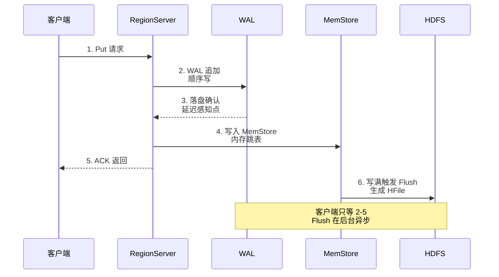
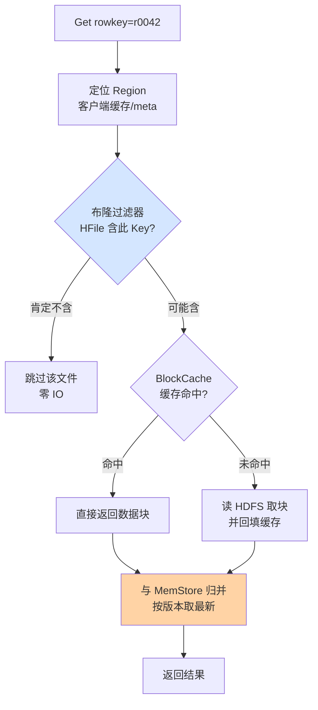
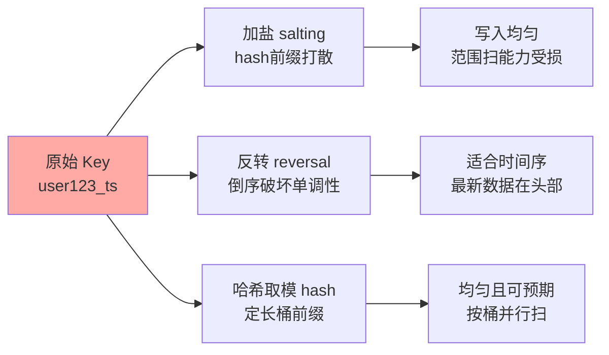

# HBase 读写路径与性能调优深度：从 WAL 到 BlockCache 的全链路

> 一句话：HBase 的性能问题九成出在读写路径的「合并点」上——写路径的瓶颈是 Flush 与 Compaction 抢 IO，读路径的成本是 MemStore + BlockCache + 多 HFile 多来源合并，而 RowKey 设计从第一天就决定了这两条路径的热点分布。

## 🎯 本文核心

**核心一句话：写路径 = WAL 追加 + MemStore 内存写，快在「顺序与内存」，脆在「Flush 落盘时点」；读路径 = 布隆过滤 + 块缓存 + 多文件归并，慢在「文件数与缓存命中」，而这两条路径的一切表现都被 RowKey 设计提前锁死——调优不是调参数，是让路径上的每一段都不互相踩。**

机制链：写入（WAL → MemStore → Flush → HFile）→ 后台（Compaction 合并）→ 读取（布隆剪枝 → 缓存 → 多来源归并）→ RowKey 决定以上一切的分布。本篇五段全挂这条线。

```mermaid
flowchart LR
    A["写入请求"] --> B["WAL 追加"]
    B --> C["MemStore 排序缓冲"]
    C --> D["Flush 生成 HFile"]
    D --> E["Compaction 合并"]
    F["读取请求"] --> G["布隆过滤器剪枝"]
    G --> H["BlockCache 读缓存"]
    H --> I["MemStore + HFile<br/>多来源归并"]
    E -. "文件数决定读放大" .-> I
    K["RowKey 设计"] -. "热点与扫描效率" .-> A
    K -. .-> F
    style C fill:#ffd3a5
    style I fill:#ffd3a5
    style K fill:#ffaaa5
```

## 一句话摘要

**写路径**：RegionServer 先把变更追加到 WAL（顺序写，崩溃恢复保险），再写入目标 Region 的 MemStore（内存跳表），返回客户端——两步内存与顺序操作，所以写吞吐极高；MemStore 写满触发 Flush 生成不可变 HFile。**读路径**：按 RowKey 定位 Region 后，先用布隆过滤器剪掉「肯定不含目标 Key」的 HFile，再从 BlockCache（读缓存）、MemStore（未落盘新数据）、HFile 集合中归并出最新版本。**RowKey 设计**决定写入落在哪些 Region（热点）与扫描是否连续（效率）；**Compaction** 治理读放大但消耗 IO——这四件事的平衡构成 HBase 调优的全部主线。

## 一、写路径：为什么写这么快，代价是什么

### 三步走与两个代价

写入的完整时序与代价点：



写路径的代价有两个，都藏在「快」的背后：**一是 Flush 的时点风暴**——多个 Region 的 MemStore 同时写满同时 Flush，磁盘 IO 瞬间打满，前台写入被阻塞（blockingStoreFiles 触发时写入直接暂停等 Compaction，业内称为「写停读追」）；**二是 WAL 的确认延迟**——客户端 ACK 前要等 WAL 落盘，持久化等级（SYNC_WAL 等，公开文档口径）直接决定写延迟基线，为了吞吐关掉同步刷盘等于裸奔，宕机丢数据。追问一层：为什么 WAL 是 RegionServer 级共享而不是 Region 级？因为独享 WAL 会让小 Region 的写放大成大量小文件（HDFS 的小文件灾难）；共享后恢复时要按 Region 切分重放——**用恢复时间换平时吞吐**，又是一笔跨期取舍。

### MemStore 的全局账本

MemStore 不是无限资源：RegionServer 全局 MemStore 占堆的比例是写死的（默认与 BlockCache 各占约四成，公开文档口径），所有 Region 的所有列族分这同一个池子。Region 太多 → 每个 MemStore 份额太小 → 写一点点就 Flush → 小 HFile 洪流。这就是「单机 Region 数量要克制」的底层算术——**写性能的上限在内存分配表里，不在磁盘速度里**。

从演进视角补一句：这套写路径的参数骨架（flush.size、MemStore 配比、WAL 等级）十多年来变化不大——变化的是外围：WAL 从单管道到多管道并行、MemStore 出现降低 GC 停顿的变体实现、持久化等级更细粒度化（均为公开版本的演进方向）。跨系统地看，写路径的每一环其实都是与上下游的契约：WAL 与 HDFS 的顺序写契约、客户端与 RPC 的批量契约、Flush 与 Compaction 的 IO 共享契约——**写调优的本质是让这些契约互相不打架**，任何一环单方面「优化」（比如关掉 WAL 同步）都是在撕契约，代价由链条上最脆弱的一环承担。

## 二、读路径：布隆、缓存与归并

### 读一次要碰多少东西



读路径的每个环节都对应一类调优：**布隆过滤器**剪枝（行级布隆对 Get 有效，省掉「肯定不在」的文件 IO；对范围扫描帮助有限，因为 Scan 无法预知具体 Key）；**BlockCache** 命中率（热点数据集必须装得进缓存，否则每次读都打 HDFS）；**HFile 数量**（读放大与文件数线性相关，Compaction 是唯一解药）。三件事的优先级在公开运维社区的共识里通常是：先看布隆配置对不对（成本最低），再看缓存命中率（容量问题），最后才动 Compaction 策略（副作用最大）。

追问一层：为什么读要归并多个来源而不能只读 HFile？因为 LSM 的本质是「最新数据可能在内存」——MemStore 里有未 Flush 的新版本，HFile 里有旧版本，删除标记（墓碑）散落在中间任何一层；归并顺序错了就返回脏数据。**LSM 把「写时排序」推迟成「读时归并」，读路径的复杂度是写路径速度的直接账单**。

再追问一层：读延迟的尾部（P99）为什么常比均值差一个数量级？因为归并的代价不是均匀分布的——命中缓存的读走内存，未命中的读要打 HDFS（跨网络 + 可能跨机架），两类请求混在一起，延迟分布天然双峰。这也解释了为什么「平均延迟健康但业务抱怨变慢」的工单很常见：业务感知的是尾部，运维看的是均值——监控上把 P99 与均值分开看，是读写路径排查的第一课。

## 三、RowKey 设计：一切的起点

### 热点从哪来

HBase 按 RowKey 字典序连续分布数据——**单调递增的 RowKey（时间戳开头、自增 ID 开头）会把写入全部砸在同一个 Region 上**，集群其他机器围观一台机器燃烧。热点不是运行期故障，是建表第一天的设计事故。三种公开成熟的散列手法：



三种手法的取舍本质是**「写均匀」与「读连续」的交换**：加盐/哈希让写入铺开，但把逻辑连续的数据物理打散——范围扫描要并发扫多个 Region 再归并；不散列保住扫描连续性，就要接受写入热点。没有两全的手法，只有按读写比例选的侧重。

### 扫描效率的算术

RowKey 还决定 Scan 的代价：RowKey 定长可前缀匹配（如定长时间戳 + 定长用户 ID）能让布隆与索引块效率最高；变长混杂 Key 会让前缀匹配失效，Scan 退化成大范围粗扫 + 过滤。设计纪律：**把「等值查什么、范围扫什么」写进 RowKey 的字节布局里**——高位字段放最常做前缀匹配的维度，这是把查询模式编译进存储布局的设计思想。

## 四、Compaction 风暴治理与预分区

### 风暴是怎么形成的

Compaction 风暴的典型形成链：写入高峰 → Flush 频繁 → 小 HFile 堆积 → 触发 Major Compaction（默认约 7 天周期，公开文档口径）→ 全 Region 文件重写 → 磁盘 IO 与网络（HDFS 副本）打满 → 前台读写延迟飙升 → 上游重试放大流量。治理思路是「削峰 + 错峰 + 分级」三件套：限制 Compaction 的吞吐配额（限流参数，公开配置项）、把 Major 排到业务低谷（手动/定时触发）、用分级策略让冷热文件分批合并（DATE_TIERED 类公开策略）。

### 参数级配置清单

| 配置项 | 默认值 | 分档推荐 | 为什么 |
|---|---|---|---|
| hbase.hstore.compaction.min | 3 | 写入密集 4-6 | 攒够更多文件才合并，减少合并次数；但文件堆积推高读放大 |
| hbase.hstore.compaction.max | 10 | 大表 10-15 | 单次合并参与的文件上限，防止单次合并过大拖垮 IO |
| hbase.majorcompaction | 7 天 | 高峰敏感集群设 0 改手动 | 关掉自动周期，由调度在低谷期手动触发 |
| hbase.hstore.blockingStoreFiles | 16 | 写密集 16-32 | 超限阻塞写入的熔断闸；调高是「多扛一会儿」不是根治 |
| hbase.hregion.memstore.flush.size | 128 MB | 256 MB 起步 | 减少 Flush 次数；代价是恢复重放时间变长 |
| hbase.client.scanner.caching | 1（公开默认口径） | 批量扫描 100-1000 | Scan 一次 RPC 拉多少行；太小 RPC 次数爆炸，太大内存与超时风险 |

### 步骤级操作：一次 Compaction 风暴的治理

**前置**：确认风暴类型（看 Compaction 队列长度、磁盘 util、是大合并还是 Flush 堆积）；确认当前写入来源（导数任务？补偿重放？）；已经打通降级预案沟通。

| 步骤 | 命令/动作 | 验证 | 回退 |
|---|---|---|---|
| 1. 停自动大合并 | major_compact 相关调度暂停 | 队列不再增长 | 恢复调度开关 |
| 2. 限流 Compaction | 调低合并吞吐配额参数 | 磁盘 util 降到 70% 以下 | 配额回调 |
| 3. 源头限流 | 上游写入客户端降速/分批 | 写队列水位下降 | 放开上游限流 |
| 4. 低谷补合并 | 业务低谷手动触发 major compact | 合并完成后文件数下降、读延迟回落 | 无需回退（合并本身安全） |
| 5. 复盘归档 | 记录触发链与处理时序 | 沉淀进值班手册 | - |

一次匿名化的线上复盘：月初批量导数撞上周期性 Major Compaction，磁盘 IO 双峰叠加，读 P99 从十毫秒级飙到秒级，上游超时重试进一步放大写入。当夜处理是「停合并 + 上游限速」双管齐下，次日在调度层把大合并与批量任务的窗口互斥（错峰日历），同类故障未再复发。教训一句话：**Compaction 的 IO 是集群公共预算，任何大 IO 任务进生产前都要查预算表**。

### 预分区：把风暴消灭在设计期

预分区 = 建表时先切出 N 个 Region，让写入从第一天就分散。它的正确打开方式是**按真实 RowKey 分布采样设计 split key**：对时间序列 Key 用时间区间预切，对哈希前缀 Key 按桶边界预切——等分数字区间撞上倾斜分布就是无效预分区。与 RowKey 散列配合使用：散列决定「写到哪几个桶」，预分区决定「桶的边界在哪」，两者是同一套设计语言。反方案分析：为什么不用「自动分裂」代替预分区？自动分裂是被动响应（先集中、撞阈值、再摊开），代价是一次分裂 IO 风暴 + 分裂前单点吃满全量写压；预分区是主动摊开，成本只是建表时的规划——**设计期一小时，换运行期无数个安静的夜晚**。

## 五、不同量级的思考：架构约束驱动解法

每一档量级下，读写路径的主要矛盾完全不同：

- **十万级（单机余量充足）**：读写都不构成压力，默认参数即最优解；思考方式是「设计优先」——这一档的核心问题是「RowKey 有没有埋热点、列族有没有拆多」，而不是「参数怎么调」。约束来源是单机内存与磁盘的宽裕度：这个档位参数调优没有收益，设计错误却会带进下一档。
- **百万级（Flush 节奏开始可见）**：写入让 Flush 与小文件问题显形，MemStore 配比与 flush.size 进入视野；思考方式是「节奏管理」——这一档的核心问题是「Flush/Compaction 的后台 IO 是否与前台流量互相踩踏」，而不是「加缓存还是加机器」。约束来源是全局内存池与磁盘 IO 带宽的共享：所有 Region 分同一池子，节奏错配就是风暴。
- **千万级（缓存命中率主导读体验）**：数据量超出缓存容量，读延迟由命中率决定；思考方式是「命中率经营」——这一档的核心问题是「热数据集与缓存容量的匹配、Scan 与 Get 的缓存污染」，而不是「Compaction 再激进一点」。约束来源是物理内存上限：热点集装不下就要靠业务分层（冷热分离/多级缓存），纯参数无解。
- **亿级（跨组件预算管理）**：HDFS 容量与副本、Compaction 公共 IO 预算、多业务共享集群的隔离性成为主要矛盾；思考方式是「预算治理」——这一档的核心问题是「公共资源（IO/内存/带宽）怎么记账、怎么配额、怎么错峰」，而不是「单表参数还有没有旋钮」。约束来源是物理集群的总量与共享冲突：预算表、错峰日历、配额隔离是这一档的生产工具。

思考方式总结：十万级靠「设计优先」，百万级靠「节奏管理」，千万级靠「命中率经营」，亿级靠「预算治理」——约束来源从单机余量走到公共预算，思考方式必须跟着换挡。

**自下而上与触发升级**：先测档位再选思考——写入吞吐、Flush 频率、缓存命中率、Compaction 队列四个实测值决定实际站在哪一档。触发升级的信号：Flush 出现堆积、写延迟出现毛刺、命中率跌破基线、大合并周期与业务高峰重叠——任一信号出现，思考方式随档升级；锚点始终是约束来源，业务增长只是信号。

## 六、什么时候用这些手段，什么时候不用

- **该动手的信号**：写延迟毛刺与 Flush 时间相关、读延迟与文件数正相关、Scan 吞吐远低于设计预期——按「布隆 → 缓存 → Compaction → RowKey」的顺序排查，别一步跳到加机器。
- **不该动手的场景**：参数在默认区间内且监控无异常时，跟风调优是把集群当试验田——HBase 的默认值经历过大量公开生产验证，没有数据支撑的「优化」大概率是把问题从一个组件搬到另一个组件。
- **RowKey 不可逆的例外**：已上大表的 RowKey 重新设计等于全量重写（新表 + 双写 + 迁移），设计期没做的功课运行期补要按「迁移项目」立项——这也是为什么 RowKey 评审要放在建表之前，而不是性能出问题之后。

排查读写问题时还要守住一条跨系统边界：HBase 的读写路径上、下游各连着一套系统——上游是客户端与 RPC 层（重试风暴、超时配置、批量用法），下游是 HDFS 层（副本、磁盘、机架带宽）。生产环境里相当比例的「HBase 慢」最终定位在上下游：上游重试放大让写入翻倍、下游 HDFS 抖动让读延迟翻倍，而 HBase 自身参数无恙。排查纪律因此是**先看边界再看内核**：上游流量有没有突变、HDFS 层有没有告警，两头的信号确认了，再进 HBase 内部翻参数——顺序反了就是大海捞针。

💡 **实战提示 1**：排查读慢先看三张牌——布隆是否开启（省 IO 最多）、缓存命中率曲线（掉点时间点对齐大合并/导数）、目标 Region 的 HFile 数量——三张牌看完再谈换缓存策略，顺序反了容易白忙。

💡 **实战提示 2**：批量写入用客户端缓冲（公开的 BufferedMutator 类机制）合并小 Put——一秒几千次单条 Put 的 RPC 开销远大于数据本身，生产环境中这类「客户端用法不当」造成的写瓶颈比服务端参数问题更常见。

💡 **实战提示 3**：大合并改手动调度后，务必加「文件数超限告警」兜底——自动合并关掉后，如果调度任务静默失败，小文件会无限堆积直到读延迟爆炸；告警是手动化的保险丝，不是可选项。

💡 **实战提示 4**：把「布隆误判率、缓存命中率、Flush/Compaction 队列、P99 与均值差」四项做成周报基线——性能劣化几乎都是缓慢漂移而不是瞬间崩塌，基线对齐才能在用户感知之前发现拐点；无基线的调优等于闭眼开车。

## Trade-off：每组参数都是一笔跨期账

写路径快（内存+顺序）是向读路径借的（读时归并）；Compaction 激进是拿后台 IO 换读放大；Compaction 保守是拿读延迟换 IO 余量；RowKey 散列是拿扫描连续性换写入均匀；WAL 共享是拿恢复时间换吞吐。调优的实质不是「调到最优」，而是**确认每一笔交换的成本都由付得起的一方承担**。

## 开放问题与我的判断

值得讨论的未定论方向：一是存储层计算下推（服务端过滤/协处理器的更深度演进）会不会改变「读时归并」的成本结构——我的判断是归并的物理必然性不会消失，但过滤下推能把归并的数据量大幅前移；二是新硬件（NVMe/持久内存）会不会让 LSM 与 B+ 树的取舍边界重新划分——公开研究已有重估 LSM 写放大的动向，尚无定论，值得跟踪。

## 你们可能会问

**Q1：MemStore 里的数据还没 Flush 就宕机了，数据会丢吗？**
不丢——ACK 之前 WAL 已经落盘，恢复时按 WAL 重放到 MemStore 再补 Flush。真正会丢数据的是把持久化等级调成异步刷盘还接受宕机窗口：WAL 的确认语义是写路径一切快的前提，动它之前先想清楚愿意丢多少。

**Q2：布隆过滤器既然能省 IO，为什么不所有表默认开？**
布隆有误判率且占存储与内存——对「写入后从不按行点查、只做范围扫」的表，行级布隆几乎不被命中，纯付成本。是否开启取决于读写模式：Get 为主的表开（ROW 或 ROWCOL 级别），纯 Scan 表可省——配置跟着查询模式走，不是默认开就完事。

**Q3：Scan 慢一定是 HBase 的问题吗？**
不一定——Scan 的常见瓶颈在客户端用法：scanner.caching 太小（RPC 次数爆炸）、每次 new 一个 Scan 不复用、宽行大列未裁剪（select 全列族）。先压测客户端批量化改造的收益，往往大于服务端任何参数——「问题在客户端」是 HBase 工单里最常见的结论之一。

**Q4：Region 预分区切多少个合适？**
反推法：目标写入吞吐 ÷ 单 Region 写入能力 ≈ 需要 Region 数，再留增长余量；同时验证「Region 数 × flush.size ≤ 全局 MemStore 可分配额」。业内常见单表几十到几百分区区间（业内认知），核心是让每个 Region 的内存份额够用、写入负载均衡——数字本身没有意义，两个约束满足才有意义。

## 自测三问

1. 写路径客户端 ACK 前发生了什么？（答：WAL 同步落盘 + MemStore 内存写入；Flush 是后台异步）
2. 读路径为什么必须归并多个来源？（答：最新版本可能在 MemStore，删除标记可能在任何一层，LSM 把排序推迟到了读时）
3. 加盐 RowKey 牺牲了什么？（答：范围扫描的物理连续性，Scan 需并发扫多 Region 归并）

## 🎯 核心带走

- **写路径**：WAL 落盘 + MemStore 即返回，Flush 后台异步——快在顺序与内存，脆在 Flush 时点
- **读路径**：布隆剪枝 → 缓存 → 多来源归并——读放大的税由 HFile 数量与缓存命中率决定
- **RowKey 是总开关**：单调 Key 必热点；散列与扫描连续性二选一，字节布局编译查询模式
- **Compaction 治理三件套**：限流配额、错峰调度、分级合并——公共 IO 要有预算表
- **失效点**：blockingStoreFiles 触发的写停、手动化大合并后的告警缺失、客户端 Scan 用法不当

## 📌 数据与事实声明

- 参数默认值（flush.size 128 MB、majorcompaction 7 天等）为 Apache HBase 公开文档口径，随版本变动，生产以实际版本核实
- 单 Region 写入能力、常见分区数量为业内认知与公开运维社区口径，非保证值
- 文中故障场景为行业常见问题的匿名化改写，非特定公司事件

## 📚 参考资料

| 资料 | 说明 |
|---|---|
| Apache HBase 官方 Book（Performance Tuning 章） | 读写路径与调优参数的权威口径 |
| O'Reilly《HBase: The Definitive Guide》 | 读写机制与 RowKey 设计的系统化阐述 |
| LSM-Tree 原始公开论文（O'Neil 等，1996） | LSM 写读取舍的理论出处 |
