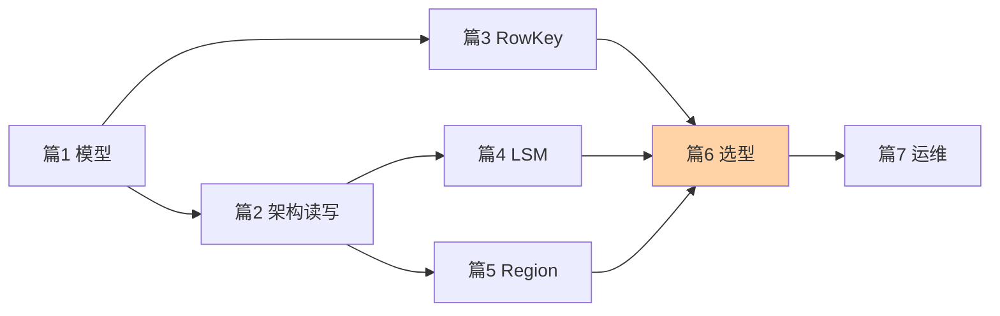

# 从零开始认识 HBase 系列·导读

> **这个目录讲什么**：HBase 入门层 7 篇——宽列数据模型、架构与读写路径、RowKey 设计、LSM 存储、Region 分布、四引擎选型、部署运维，从「是什么」到「怎么用怎么选」的完整入门地图。

## 这个目录下有哪些文章

| 篇 | 主题 | 一句话重点 |
|---|---|---|
| 1 | [HBase 是什么与数据模型](1_HBase是什么与数据模型-入门.md) | 排序稀疏多维 Map：RowKey/列族/列/版本四层坐标 |
| 2 | [架构与读写路径](2_架构与读写路径-入门.md) | 三角色分工 + 写 WAL→MemStore→Flush、读三层合并 |
| 3 | [RowKey 设计](3_RowKey设计-入门.md) | 唯一索引一肩挑分布与访问，盐化/反转/哈希三手法 |
| 4 | [LSM 树与 Compaction](4_LSM树与Compaction-入门.md) | 追加写换吞吐，三大放大账本与两级合并 |
| 5 | [Region 切分与负载均衡](5_Region切分与负载均衡-入门.md) | Split/Balance/Merge 三动作，存储原生分布式 |
| 6 | [与 MySQL/Redis/ES 的区别和选型](6_与MySQL%20Redis%20ES的区别和选型-入门.md) | 四引擎按访问模式分地盘，组合是常态 |
| 7 | [部署运维与生态](7_部署运维与生态-入门.md) | 全家福依赖 + 五项日常操守 |

## 我能得到什么

- 看懂 HBase 的数据模型（为什么「宽表 + 稀疏」适合海量行键场景）
- 推得出一次读写的完整路径与延迟构成
- 会设计 RowKey（热点、三手法、预分区配套）
- 讲得清 HBase 与 MySQL/Redis/ES 的分工边界与组合架构
- 知道日常运维的五件事与依赖全家福的故障传导

## 我想看哪一篇，去看哪一篇

- **按方向**：建模看篇 1/3、排障看篇 2/4、选型看篇 6、运维看篇 7
- **按问题**：「单表到亿级怎么办」→ 篇 6 决策题；「为什么删了数据磁盘不变」→ 篇 4；「写入都砸一台机器」→ 篇 3 热点
- **按阶段**：评估引入 → 篇 1/6；开发设计 → 篇 2/3/4；上线治理 → 篇 5/7

## 📌 维护说明

新增文章时必须更新本导读的导航表与阅读路径图。
