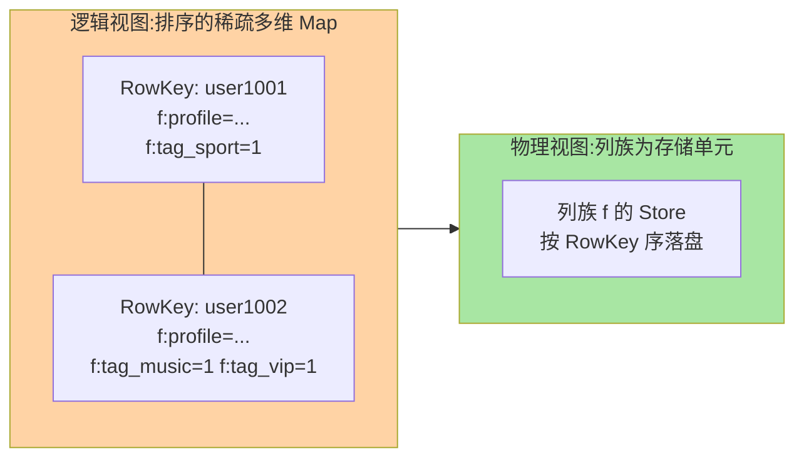

# HBase 是什么与数据模型：稀疏宽表的世界

> 一句话：HBase 是构建在 HDFS 之上的分布式宽列数据库——按 RowKey 排序存储的稀疏多维地图，海量数据下毫秒级点查与范围扫的「大而快」选手。

## 🎯 本文核心

**核心一句话：HBase 的数据模型 = 「排序的稀疏多维 Map」——RowKey 字典序是唯一的物理序，列族是物理存储单元，列名可以行行不同（稀疏），Cell 按 (行, 列, 版本) 定位；一切能力（快、大、宽）与一切约束（无二级索引、无 SQL JOIN）都从这套模型推导。**

组织主线（本篇四段全挂这条线）：

## 一句话摘要

HBase 是 Google Bigtable 的开源实现（Hadoop 生态）：数据按 **RowKey 的字典序**分布在集群上，每行包含若干**列族（Column Family）**，列族下的**列（Column Qualifier）**无需预先定义、可动态添加——同一张表的第一行可以有一百万列、第二行可以只有三列（稀疏）。每个 Cell（行 × 列的交点）按**版本（Timestamp）**多版本存储。它服务「**十亿行 × 百万列**」量级的随机读写：靠 LSM 树与 Region 分布式架构，在海量数据下仍提供毫秒级点查（MySQL 单表到亿级就撑不住的场景）。代价是**没有二级索引、没有 JOIN、不支持 SQL**（需配合 Phoenix 类组件补）——它是「按 RowKey 存取的海量宽表」，不是关系数据库。

## 一、为什么需要 HBase：MySQL 单表撑不住的那一天

典型场景：消息历史（百亿条消息按用户查询）、风控特征库（亿级用户 × 千维特征）、通信详单（运营商级话单）。这些场景的共同画像：**行数十亿级、按主键（用户 ID/号码）点查与范围扫、写入吞吐持续高位**——MySQL 单表亿级后 B+ 树维护成本陡增（页分裂、索引膨胀），分库分表又要自己管路由。HBase 的答案：**数据按 RowKey 哈希/范围分布到多台机器（Region），写入走 LSM 追加路径（顺序写），读取按 RowKey 直达目标 Region**——表大了就加机器，容量与吞吐随节点线性扩展。演进视角：Bigtable（2006 论文）开创此模型，HBase（2008 开源）把它带进 Hadoop 生态，此后十年的「海量 KV + 宽表」场景几乎都收敛到这个形态。

## 5W 速记卡

| 维度 | 一句话 |
|---|---|
| What | HDFS 上的分布式宽列数据库：RowKey 排序 + 列族 + 多版本 Cell |
| Why | 十亿行 × 持续高吞吐写入 + 毫秒点查，超出关系库单表边界 |
| When | 消息/详单/特征库/时序日志等海量按行键访问场景 |
| Where | Hadoop 集群（HDFS + ZooKeeper + HMaster + RegionServer） |
| How | 按 RowKey 读写；列族建表时定义；版本数可控 |

## 二、核心概念：坐标系统逐个看

一次逻辑读写的完整坐标：`(表, RowKey, 列族:列限定符, 版本) → 值`。

**RowKey（行键）**——字节数组，**表内唯一且全局按字典序排序**——它是唯一的「索引」（物理序），一切读写都以它为锚。字典序是按字节比的：`1 < 10 < 100 < 2`（不是数值序）——数字 RowKey 补零（`0001`）或反转才能「按数值有序」，这是新手第一坑。

**列族（Column Family）**——建表时必须定义（建议 1-2 个），**物理存储与配置（TTL/版本数/压缩）的单元**：同列族的数据存在一起，不同列族可以是不同的存储文件。列族的本质是「把一张宽表横向切成几块物理上分家的窄表」——访问模式差异大的列拆不同列族（详情列族 vs 索引列族），读取互不拖累。

**列限定符（Qualifier）与稀疏性**——列族下的具体列，**建表时不用定义、写入时动态出现**。同一列族下行 A 可以有 `f:q1` 到 `f:q1000000`，行 B 只有 `f:q2`——空 Cell 不占任何存储（稀疏）。这是「百万人群标签各不相同」类场景的原生表达：关系库要建几百列大多为 NULL 的宽表，HBase 里每行只带自己的标签。

**Cell 与版本（Version）**——`(RowKey, 列)` 的交点按时间戳（或自定义版本号）存多个值，读取可要最新版或前 N 版。典型用法：存「价格变更历史」（最新价 + 历史）、存「最近 N 次状态」——版本数上限按列族配置（如 `VERSIONS => 3`），超限自动淘汰旧版。

> 💡 **实战提示**
> - RowKey 长度权衡：短省存储（RowKey 在每个存储文件里反复出现），但要保留业务语义（可读性/路由可控）——业内常见 16-50 字节区间
> - 列族越少越好（1-2 个）：列族多 = Store 多 = flush/compaction 的文件数膨胀——「一个列族走天下」是多数表的正解
> - 版本数的默认 1 不是真理：要留历史的列族显式设 `VERSIONS => N`，配合 TTL 控制生命周期
> - 时间戳版本可自定义（写入时传 ts）：用「业务时间」而非「写入时间」做版本，乱序到达的数据也能按业务序保留

## 三、与 MySQL/Redis 的区别：三套模型三种活法

| 维度 | MySQL | HBase | Redis |
|---|---|---|---|
| 模型 | 关系表 + SQL | 排序稀疏宽表（KV 家族） | 内存 KV + 多态结构 |
| 容量 | 单表亿级触顶 | 十亿行级横向扩展 | 内存上限（GB 级） |
| 延迟 | 毫秒级 | 毫秒到几十毫秒 | 亚毫秒 |
| 查询 | 任意条件 + JOIN | 仅按 RowKey（点查/范围） | 仅按 key |
| 持久化 | 磁盘（事务） | HDFS（多副本） | RDB/AOF（尽力） |
| 定位 | 事实源 | 海量行的行键访问 | 热数据的低延迟层 |

分工的直觉：**MySQL 存「结构化的业务事实」，Redis 存「热数据的极速访问」，HBase 存「海量行的键控存取」**——消息历史先写 MySQL（近七天查询）+ 归档 HBase（全量历史），是三件套配合的典型架构（上下游各管一段）。

## 四、典型使用场景

- **消息/动态历史**：亿级用户 × 全量消息按 `用户ID+时间戳` 的 RowKey 查会话历史
- **风控/画像特征库**：稀疏标签（用户有啥标存啥）+ 高吞吐批量灌入 + 点查
- **通信/订单详单**：运营商级话单的长期存储与按号段查询
- **时序数据的冷层**：监控指标的热层在时序库、全量历史归档 HBase（配合按时间前缀的 RowKey 范围扫）

## 五、误区与代价

- ❌ **「HBase 是大数据版 MySQL」**：无 SQL 无 JOIN 无二级索引——把它当关系库用（按非 RowKey 条件查询）每条查询都是全表风暴，架构错位
- ❌ **「列可以随便加所以设计随意」**：列的语义约定（什么列名表达什么含义）必须文档化——稀疏模型的自由是把 schema 责任从数据库移到了应用层
- ❌ **「HBase 查询都是毫秒级」**：点查毫秒级，**范围扫的耗时 ∝ 扫描行数**——扫百万行就是秒级起步，「HBase 很快」只对 RowKey 直达的访问成立
- ❌ **「版本无限留」**：版本数与 TTL 不设的表，存储无限膨胀——版本是特性也是账单

## 六、什么时候选 HBase：三个判定条件

- **什么时候用 HBase**：行数十亿级且访问按 RowKey（点查/范围）、写入吞吐持续高位、列结构稀疏多变——三条件齐备是 HBase 主场，**明确推荐**作为海量行键访问的存储层
- **什么时候不用**：需要复杂条件查询与 JOIN（回 MySQL/ES）、数据量 GB 级（单 MySQL 足够，别为想象中的亿级预付复杂度）、需要强事务（HBase 行级原子但无跨行事务）
- **怎么选与其他库配合**：常见组合是「MySQL 事实源 + HBase 海量历史 + Redis 热层 + ES 检索」——按访问模式分工，而不是一库打天下

## 七、你们可能会问

**Q1：为什么 RowKey 是字典序不是插入序？**
物理序即索引序——按 RowKey 排序存储，点查与范围扫才能走「定位一次、顺读一段」的路径。插入序（如关系库的堆表）对「按行键取一段」的场景毫无帮助——模型为目标服务。

**Q2：没有二级索引，按非 RowKey 查怎么办？**
三路：① 双写「索引表」（目标条件做 RowKey 的另一张表）；② 用 Phoenix 类 SQL 层的二级索引（本质也是自动维护索引表）；③ 把查询需求推给搜索引擎（ES）——代价都是「多一份存储与写入放大」，非 RowKey 查询在 HBase 体系里天生是二等公民。

**Q3：什么信号说明该从 MySQL 迁 HBase 了？**
单表行数持续增长逼近亿级、访问模式收敛为「按主键」、写入吞吐持续压顶——三者同时成立再评估迁移；只有行数大但按主键访问不成立（还有复杂条件查询），答案可能是分库分表或 ES，不是 HBase。

## 八、开放问题

- 云原生时代 HBase 面临两类替代压力：托管化改造（云 HBase/云 HBase 增强）与「对象存储 + 新 LSM 引擎」的重构派——宽列模型仍有生命力，载体在演进
- 存算分离趋势下，HDFS 依赖被对象存储替换（共享存储上的 RegionServer）——HBase 的架构边界在被重新绘制

## 九、自测三问

1. 完整的 Cell 坐标由什么构成？稀疏性指什么、省的是什么？
2. 列族的两个「物理单元」角色是什么？为什么建议 1-2 个列族？
3. 字典序的 RowKey 有什么坑？数字序的需求怎么处理？

下一篇讲「架构与读写路径」：HMaster/RegionServer/ZooKeeper 怎么分工，一次写人与一次读取的完整旅程。

## 🎯 核心带走

- **核心一句话**：HBase = 排序稀疏多维 Map——RowKey 字典序是唯一索引，列族是物理单元，列动态稀疏，Cell 多版本；十亿行键控访问的专用武器，不是关系库
- **主线**：定位 → 坐标系统（RowKey/列族/列/版本）→ 稀疏宽表 → 三件套分工 → 边界
- **哪里会坏**：按非 RowKey 查询、列语义无文档、范围扫当点查、版本无上限
- **边界**：本篇是模型层；架构与读写路径在篇 2，RowKey 设计在篇 3，LSM 存储机制在篇 4

## 📌 数据与事实声明

- 写于 2026-09-11；数据模型以 HBase 官方文档（Apache HBase Reference Guide）与 Bigtable 论文（2006，公开）口径为准
- 「单表亿级触顶」「RowKey 16-50 字节」为业内经验认知，按硬件与版本实测
- 免责：配置与行为随版本演进可能调整，以官方文档为准

## 📚 参考资料

| 类型 | 标题 | 来源 |
|---|---|---|
| 官方文档 | Apache HBase Reference Guide（Data Model 章） | hbase.apache.org/book.html |
| 公开论文 | Bigtable: A Distributed Storage System（Google, 2006） | 公开学术出版物 |
| 系列导航 | HBase 系列目录 | `docs/data/hbase/index.md` |
