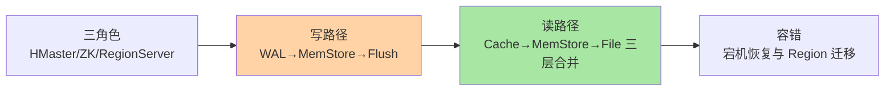
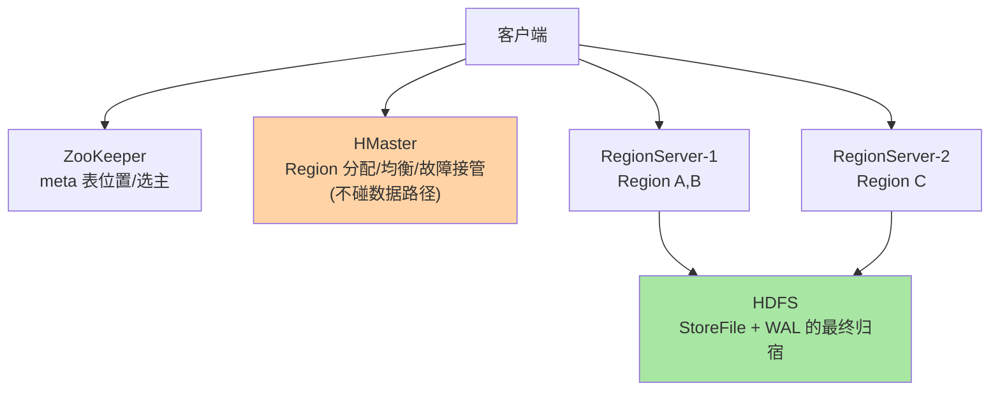
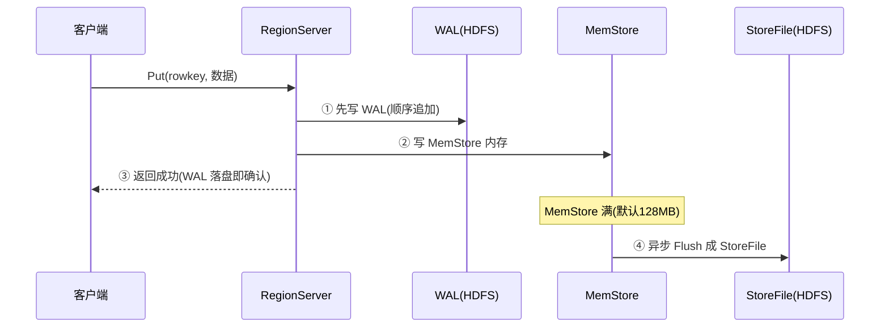

# HBase 架构与读写路径：一次写入与一次读取的旅程

> 一句话：HMaster 管元数据与负载、RegionServer 管数据读写、ZooKeeper 管协调——写入走「WAL 先行 + MemStore 缓冲 + 顺序刷盘」的 LSM 路径，读取走「BlockCache + MemStore + StoreFile」的三层合并。

## 🎯 本文核心

**核心一句话：HBase 架构 = 三角色分工（HMaster 管元数据与 Region 分配、RegionServer 执行读写、ZooKeeper 管协调与寻址入口）+ 读写两条路径——写：WAL 保持久 → MemStore 缓冲 → 异步刷成 StoreFile（顺序写换吞吐）；读：BlockCache → MemStore → StoreFile 三层合并取最新版本（分层换延迟）。**

组织主线：

## 一句话摘要

HBase 的存储架构自上而下：**表按 RowKey 范围横向切成 Region**（分布式与负载均衡的基本单元），每个 Region 由唯一的 RegionServer 承载；**RegionServer** 是数据面的主力（管理若干 Region，每个 Region 的每个列族对应一个 Store，Store 内是 MemStore 内存缓冲 + 一组 HDFS 上的 StoreFile）；**HMaster** 是控制面（Region 分配、负载均衡、故障接管——不参与数据读写，短暂宕机不影响读写）；**ZooKeeper** 存元数据入口与选主（客户端从 ZK 拿 meta 表位置开始寻址）。写入三步：WAL 落盘保持久 → 写 MemStore → 满 128MB（默认）异步刷成 StoreFile；读取三层合并：BlockCache（热数据块缓存）→ MemStore（未刷盘的最新写）→ 各 StoreFile（按版本取最新）。

## 一、三角色分工：控制面与数据面分离

**控制面（HMaster）与数据面（RegionServer）分离**是架构的第一要点：读写不经过 Master（客户端直连 RegionServer），所以 Master 短暂宕机业务无感——这与「一切请求过主节点」的中心化架构（某些老式存储）形成对照。Region 的定位链路：客户端问 ZK 拿到 `meta` 表所在 RegionServer → 查 meta 得「目标 RowKey 在哪个 Region」→ 直连该 RegionServer 并缓存（下次不再问）。这套寻址是三层缓存结构，Region 迁移后缓存失效重走一遍——理解它就理解了「HBase 客户端第一次请求慢、后面快」的现象。

## 5W 速记卡

| 维度 | 一句话 |
|---|---|
| What | HMaster/RegionServer/ZooKeeper 三角色 + Region 分布式切分 + 读写两路径 |
| Why | 海量数据横向扩展需要「数据面无中心」的分布式架构 |
| When | 理解读写延迟构成、容量规划、故障恢复排查 |
| Where | RegionServer（MemStore/BlockCache/WAL）+ HDFS（StoreFile） |
| How | 写：WAL→MemStore→Flush；读：三层合并；恢复：WAL 回放 |

## 二、写路径：WAL 先行的三步

三步的设计哲学：**WAL 先行保持久**（RegionServer 宕机后靠 WAL 回放恢复未刷盘数据——与 MySQL redo 的 WAL 原理同源：顺序写日志换随机写数据页的推迟）；**MemStore 缓冲保吞吐**（攒一批再刷，写入不打散成随机 IO）；**异步 Flush 保延迟**（刷盘不阻塞客户端，成功确认只等 WAL）。由此推出的写放大结构：一次写 = WAL 一份 + StoreFile 一份 + 后续 Compaction 再合并（篇 4 展开）——**吞吐与持久的账由 WAL 与 Flush 的节奏共同决定**。

## 三、读路径：三层合并取最新

读取 `(RowKey, 列)` 的最新值要查三处：**BlockCache**（读缓存，存最近访问的 HDFS 数据块——热点数据的命中层）、**MemStore**（还没刷盘的最新写入）、**各 StoreFile**（已落盘的历史版本）。三处的结果**按版本（时间戳）合并**取最新——因为一次更新可能：新版在 MemStore、旧版还在某个 StoreFile 里。这就是 LSM 读「要查多处」的代价根源（对比 B+ 树一处直达）：**写入快（追加）的对称面是读取要合并**——HBase 用 Bloom Filter（快速判断「这个 RowKey 一定不在该文件」）与 BlockCache 把「查多处」的成本压下来。读路径的延迟构成：缓存全命中时毫秒内，穿透到多个 StoreFile 时毫秒到几十毫秒——**读延迟的波动与 StoreFile 数量正相关**（又是 Compaction 的存在理由）。

> 💡 **实战提示**
> - 写入批量是第一优化杠杆：关闭自动刷（`autoFlush=false`）攒批提交，同一批的多次写合并一次 WAL——批量灌数据的吞吐差距可达一个数量级
> - RegionServer 的堆内三分：MemStore（写缓冲）与 BlockCache（读缓存）共享堆——写多读少与读多写少的比例配置要按负载画像定
> - 「第一次请求慢」是寻址链路（ZK→meta→RegionServer 三跳）的正常现象——连接预热（启动时先探一次）消除冷启动毛刺
> - RegionServer 宕机的影响面：该机器的 Region 全部短暂不可用（检测 + 迁移窗口，默认分钟级）——重要表的 Region 分散度（跨机器）是容量设计的考量

## 四、容错：宕机恢复的剧本

RegionServer 宕机的恢复剧本：ZK 检测到会话失效（心跳超时）→ HMaster 得知 → 把该机的 Region 重新分配给其他 RegionServer → 新节点**回放 WAL**（把未刷盘的写恢复到 MemStore）→ 恢复服务。两个要点：**恢复窗口 = 检测超时 + 迁移 + WAL 回放时长**（WAL 越长恢复越久——又一个「写吞吐 vs 恢复速度」的取舍）；**数据不丢的边界**：已确认的写（WAL 落盘）不丢，宕机瞬间的 MemStore 内容靠 WAL 回放恢复。HDFS 层的副本（默认 3 副本）保 StoreFile 与 WAL 的存储可靠性——**HBase 的可用性依赖 HDFS 的可用性**，这是「构建于 HDFS 之上」的架构含义。

## 五、与 MySQL InnoDB 架构的区别

同为「WAL + 内存缓冲 + 磁盘结构」的形态，哲学不同：InnoDB 的 B+ 树**原地更新**（页内改，索引一处直达），HBase 的 LSM **追加式**（旧版本留档、后台合并）——前者读快写相对慢，后者写快读相对慢（多层合并）。架构分布：MySQL 的分布单元是「主从复制 + 分库分表（应用层路由）」，HBase 的分布是**内建的 Region 自动切分与迁移**（存储层原生分布式）。演进视角：这两个形态的融合（LSM 上的二级索引、B+ 树的分布化）是 NewSQL 们各自的探索方向——理解两端的取舍，才看得懂中间形态。

## 六、什么时候关心哪层：排障决策速查

- **写延迟高**：看 WAL 的 HDFS 同步耗时（`hbase.wal` 相关指标）与 MemStore 的 flush 队列堆积——写路径的两站
- **读延迟高**：看 BlockCache 命中率与 StoreFile 数量（Compaction 跟不上的信号）——读路径的两站
- **请求大量失败**：先查 Region 是否在迁移（`RIT`，Region In Transition）——恢复窗口的正常现象还是卡死，处置完全不同
- **什么时候调堆配置**：读写比例画像明确后（MemStore/BlockCache 的份额），默认配置是通用场景的折中

## 七、典型使用场景（架构视角）

- **高吞吐批量灌入**（风控特征/日志归档）：关闭 autoFlush 攒批 + 合并 WAL——写路径的吞吐形态完全打开
- **热点读的在线查询**（用户最近消息）：BlockCache 预热 + RowKey 前缀聚簇——读路径的缓存层吃到收益
- **写多读少的审计流**（通信详单）：MemStore 份额调大、BlockCache 调小——按读写画像配置堆内三分
- **混合负载的双列族表**（详情 + 摘要）：访问模式不同的列拆列族——架构上就是两个 Store 各自 flush/compact

## 八、误区与代价

- ❌ **「HMaster 挂了业务就挂」**：数据面不经过 Master——短暂宕机读写无感（新分配/均衡暂停），这与许多中心化架构直觉相反
- ❌ **「写返回成功 = 落盘到 StoreFile」**：成功只代表 WAL 落盘，数据还在 MemStore——宕机靠 WAL 恢复，不丢但也不在 StoreFile
- ❌ **「读慢就加缓存」**：先看 StoreFile 数量与 Bloom Filter 配置——文件数多导致的合并开销，缓存治标不治本
- ❌ **「RegionServer 越多越好」**：每台有固定开销（堆/GC/与 HDFS 的连接），小集群堆机器不如按 Region 数量与负载画像规划

## 九、你们可能会问

**Q1：客户端怎么知道数据在哪个 RegionServer？**
三跳寻址：ZK 拿 meta 位置 → meta 表查「RowKey 属于哪个 Region/Server」→ 直连。结果缓存在客户端，Region 迁移后收到异常再重新寻址——「偶尔一次慢」就是重寻址。

**Q2：WAL 会不会成为写瓶颈？**
会——每写一次 WAL 都要 HDFS 同步（默认同步级别可调），高吞吐批量写要攒批合 WAL。配套手段：Multi-WAL（多流水线并行写 WAL）与异步持久化模式（`ASYNC_WAL`，换吞吐降持久等级）——按数据价值选档。

**Q3：读三层合并的「最坏情况」要查多少处？**
一个 Store 的 MemStore + 全部 StoreFile——文件数不控制时几十个都可能有。Bloom Filter 先排除「一定没有该 RowKey」的文件，实际合并的多是少数几个——所以 Compaction 控文件数是读延迟的第一道防线（篇 4）。

## 十、开放问题

- 存算分离改造（RegionServer 计算层 + 共享存储层）在云 HBase 类产品落地，Region 迁移从「搬数据」变「改指向」——恢复窗口与均衡速度被结构性缩短
- offheap 化（堆外 BlockCache/MemStore）持续演进以对抗 GC 停顿——大堆 RegionServer 的 GC 治理是长期能力建设

## 十一、自测三问

1. 三角色各自管什么？为什么 Master 短暂宕机不影响读写？
2. 写路径三步的每步保什么？「返回成功」的语义边界在哪？
3. 读路径三层合并为什么必要？Bloom Filter 与 BlockCache 各压哪块成本？

下一篇讲「RowKey 设计」：唯一索引的设计学——热点、盐化、反转的取舍。

## 🎯 核心带走

- **核心一句话**：三角色分工（Master 管元数据、RegionServer 管数据、ZK 管协调）+ 写走 WAL→MemStore→Flush、读走三层合并——写吞吐由 WAL 与攒批决定，读延迟由缓存命中与 StoreFile 数量决定
- **主线**：三角色 → 写路径 → 读路径 → 容错剧本 → 与 InnoDB 的哲学对照
- **哪里会坏**：MemStore 堆积、BlockCache 命中低、文件数失控、RIT 期间的请求失败
- **边界**：本篇管架构与路径；数据模型在篇 1，RowKey 设计在篇 3，StoreFile 的合并机制在篇 4

## 📌 数据与事实声明

- 写于 2026-09-11；架构组件与读写路径以 Apache HBase 官方文档（Architecture 章）口径为准；MemStore 默认 128MB 为默认配置口径
- 「批量写入差一个量级」「RegionServer 堆三分」为业内经验认知
- 免责：默认值与组件行为随版本演进可能调整，以官方文档为准

## 📚 参考资料

| 类型 | 标题 | 来源 |
|---|---|---|
| 官方文档 | Apache HBase Reference Guide（Architecture / WAL 章） | hbase.apache.org/book.html |
| 公开论文 | Bigtable（Google, 2006）架构章 | 公开学术出版物 |
| 系列导航 | HBase 系列目录 | `docs/data/hbase/index.md` |
