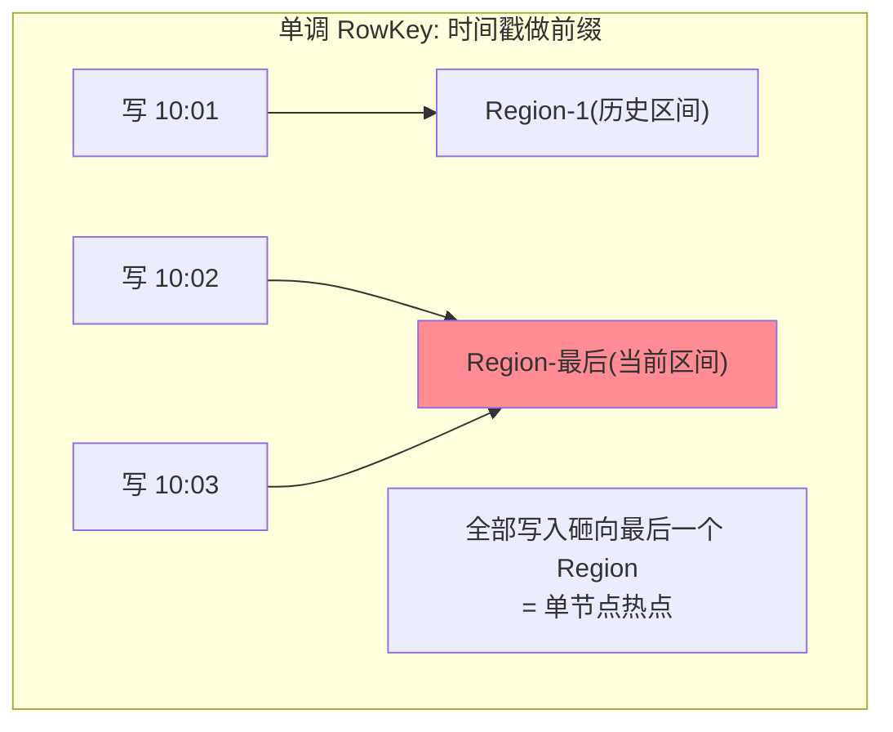

# HBase RowKey 设计：唯一索引的设计学

> 一句话：RowKey 是 HBase 唯一的索引——它同时决定「数据落在哪个 Region（分布）」与「怎么查就怎么快（访问）」，设计的全部艺术是**在均匀分布与查询模式之间找平衡**：盐化打散、反转聚簇、哈希均衡，三种手法各有代价。

## 🎯 本文核心

**核心一句话：RowKey 一肩挑两责——物理分布（前缀决定落哪个 Region，单调递增的尾缀会造成热点）与访问模式（查询条件必须左前缀匹配 RowKey 才能走范围扫）；从架构视角看，它是应用层与存储层的上下游契约：应用按查询模式定义键语义，存储按键序切分 Region 与组织文件，模块边界即 RowKey 本身——「分布要散」与「查询要聚」天然冲突，盐化/反转/哈希三种手法是三种折中，没有全赢的设计，只有按业务查询模式定价的取舍。**

组织主线：

## 一句话摘要

RowKey 设计决定了 HBase 应用的上限：**分布侧**，RowKey 字典序决定了 Region 的切分点——前缀单调递增（如纯时间戳、自增 ID）的写入会持续砸向最后一个 Region（**热点**），单节点扛全表写入；**访问侧**，高效查询要求条件能构成 RowKey 的左前缀（`get` 精确匹配或 `scan` 起止范围）——不满足就是全表扫。三种经典手法：**反转**（把变化的部分放前面，如 `时间反转 + 用户ID`）天然打散但牺牲该维度的范围查询；**盐化**（前缀加随机桶号 `bucket + 原键`）分布均匀但范围查要并发扫所有桶；**哈希**（原键哈希做前缀）均衡且确定（同键同桶），但前缀完全失去业务语义。**设计流程是「先列全查询模式 → 排优先级 → 选满足高频查询的键序 → 用分布手法修热点」**——查询模式没枚举完就动手，是 RowKey 设计的第一大坑。

## 一、两责冲突：热点是怎么形成的

字典序的世界里，「现在」永远排在最后——时间戳前缀的 RowKey 让所有新写入集中到表尾的 Region：该 RegionServer 独扛全部写吞吐（热点），其他节点旁观。**热点是「分布侧」的失败**；对称地，把 RowKey 完全随机化（纯哈希）分布完美，但「查用户 U 的最近消息」不再是一个范围（访问侧失败）——**两责的张力是 RowKey 设计的本体**。

## 5W 速记卡

| 维度 | 一句话 |
|---|---|
| What | RowKey 的分布职责与访问职责 + 盐化/反转/哈希三种手法 |
| Why | 唯一索引的两责天然冲突，设计 = 按查询模式定价取舍 |
| When | 建表前（最重要）、热点排查、范围查询慢的归因 |
| Where | 应用层的设计约定（HBase 不约束 RowKey 语义） |
| How | 查询模式枚举 → 键序排布 → 分布手法修热点 |

## 二、三种手法：折中的三种形态

| 手法 | 做法 | 分布 | 范围查询 | 适用 |
|---|---|---|---|---|
| **反转** | `反转(变化部分) + 稳定部分`（如 `反转时间 + UID`） | ✅ 散 | ❌ 牺牲该维度范围 | 按稳定键点查为主 |
| **盐化** | `随机桶号 + 原键`（bucket 0-N） | ✅ 匀 | ⚠️ 并发扫 N 个桶再归并 | 写入热点重、读可并发 |
| **哈希** | `hash(键)前缀 + 键` | ✅ 匀且确定 | ⚠️ 同盐化（但同键必同桶） | 点查精确、键分布本就不均 |

**反转的典型**：消息表 RowKey = `反转(时间戳) + 用户ID + 消息ID`——反转时间让「最新的时间」字典序反而靠前（打散），同一用户的消息靠 `用户ID` 段聚集……注意这里的反转要按「哪个维度查」重排：核心查询是「某用户的最近消息」，则 `用户ID` 应该做**第一段**（聚集该用户），`反转时间` 做第二段（该用户内部最新在前）——**反转手法常与其他排布组合使用，不是孤立的**。**盐化的代价**要会算：范围查 `scan` 要起 N 个并发（每桶一个范围）归并结果——桶数就是并发与归并成本的倍数；**哈希 vs 盐化**的本质差别：哈希前缀是确定函数（同键永远同桶，「查这个键」先算哈希直达桶），盐化是随机（写入时随机选桶，「查这个键」不知道在哪个桶——**盐化不适合点查为主的表**，这是新手高发的方向性错误）。

> 💡 **实战提示**
> - 设计前写「查询模式清单」：每条业务查询列出「过滤条件的维度与顺序」——高频查询的维度组合决定键序，没枚举完不动手
> - 数字前缀补零定长：`1/10/100` 字典序乱序——定长补零（`001/010/100`）或反转后天然定长
> - 长度与信息量的平衡：RowKey 每个存储文件都重复存——几十字节内装下「路由段 + 业务段」即可，业务详情放列里不塞 RowKey
> - 预分区在建表时配套：RowKey 设计定了分布形态后，`SPLITS` 预分区让初始 Region 就散开——「设计 + 预分区」是一对动作

## 三、与「分库分表分片键」的区别

同为「决定分布的键」，约束力不同：分库分表的分片键由**应用层路由**决定分布，且可以另建异构索引补其他维度查询（MySQL 生态成熟）；HBase 的 RowKey 是**存储层的物理序**，分布与索引一体（Region 按它切分、文件按它排序）——更强的一体性意味着设计错误的修正成本更高（改 RowKey = 全量数据重写）。迁移视角：分库分表经验里的「分片键选择三问」（高频查询带它吗/分布均匀吗/值稳定吗）**完全通用**到 RowKey 设计——学一套用两界。

## 四、典型使用场景

- **消息历史表**：`用户ID + 反转时间 + 消息ID`——用户聚集（第一段）、最新在前（反转时间）、热点由用户 ID 天然打散（亿级用户不集中）
- **话单表**：`号段反转 + 日期 + 序列`——按号段查询聚集、按日期可扫（配合二级索引表补「按号码查」）
- **时序指标冷层**：`指标ID + 反转时间戳`——同指标聚集、新写入因反转而散开
- **用户画像标签**：`用户ID（哈希前缀）+ 标签名`——点查为主选哈希（确定桶直达）

## 五、什么时候选哪个手法：决策速查

- **查询以「固定键点查」为主** → 哈希前缀（同键同桶，点查直达）——明确推荐
- **查询以「某键的范围段」为主（最近 N 条）** → 业务键做第一段 + 反转时间第二段
- **写入热点是主要矛盾、读可并发** → 盐化（桶数 = 并发倍数预算）
- **什么时候不处理热点**：写入吞吐远低于单 Region 承载（如日志型低频表）——别为不存在的热点付查询代价

## 六、误区与代价

- ❌ **「RowKey 里有查询字段就能查」**：必须构成**左前缀**——`UID+时间` 的键查「时间范围」（不带 UID）仍是全表扫，字段在键里 ≠ 可查
- ❌ **「盐化万能」**：盐化毁点查（键不知道在哪个桶）——点查为主的表盐化是方向性错误
- ❌ **「先建表再改 RowKey」**：RowKey 不可原位修改——设计期把查询模式枚举完，重设计的代价是全量迁移
- ❌ **「预分区可以事后补」**：初始热点就在建表那一刻发生——预分区与 RowKey 设计同时定

## 七、你们可能会问

**Q1：怎么验证我的 RowKey 会不会热点？**
压测写入并观察 Region 的请求分布指标（各 RegionServer 的 QPS 曲线是否一边倒）；或离线推演——按设计的 RowKey 生成样例键，看字典序分布是否均匀聚在尾部。

**Q2：高频查询有两个互斥维度（按用户查 + 按商家查）怎么办？**
主表按一方设计，另一方建「索引表」（`商家ID + 时间 + 用户ID` 做键，值为指向主表的 RowKey）——双写维护，读两跳。HBase 的多维度查询本质都是「多表互指」，没有免费的第二索引。

**Q3：RowKey 里放用户 ID 会不会泄露业务信息？**
会——RowKey 会出现在监控、日志、文件名里。敏感场景用哈希后的 ID（不可逆）做路由段，业务明文 ID 放列里——安全与可读性的一个显式取舍。

## 八、开放问题

- 云 HBase 类产品开始内建二级索引与 CQL（类 SQL），「RowKey 一肩挑两责」的设计重担在向产品层转移——但物理模型的两责本质不会消失，只是被封装
- 热点自治（自动检测倾斜 Region 并再切分/迁移）在持续增强，RowKey 设计的容错空间在变大——设计失误的代价在下降，但「查询模式对齐」永远是应用层的功课

## 九、自测三问

1. RowKey 的两责是什么？热点是怎么形成的？
2. 盐化与哈希的本质差别是什么？各自适合什么查询形态？
3. 「字段在 RowKey 里就能查」错在哪？左前缀匹配的完整要求是什么？

下一篇讲「LSM 树与 Compaction」：StoreFile 的生命周期——写快读慢的机械原理。

## 🎯 核心带走

- **核心一句话**：RowKey 一肩挑分布与访问两责——查询模式枚举定键序、分布手法（反转/盐化/哈希）修热点、预分区配套；设计期定终身，修改即全量迁移
- **主线**：两责冲突 → 热点机理 → 三手法对比 → 与分片键的通约 → 决策速查
- **哪里会坏**：非左前缀查询全表扫、点查表盐化、先建表后想、初始无预分区
- **边界**：本篇管键的设计；LSM 存储与文件合并是篇 4，Region 切分均衡是篇 5

## 📌 数据与事实声明

- 写于 2026-09-11；RowKey 语义与热点机制以 Apache HBase 官方文档（RowKey Design 章）口径为准；三种手法为社区通用实践归纳
- 补零定长、哈希不可逆等细节为公开工程共识
- 免责：产品内建索引能力随版本演进，以官方文档为准

## 📚 参考资料

| 类型 | 标题 | 来源 |
|---|---|---|
| 官方文档 | Apache HBase Reference Guide（RowKey Design 章） | hbase.apache.org/book.html |
| 社区沉淀 | HBase RowKey 设计的公开实践（各大厂博客） | 技术社区公开文章 |
| 系列导航 | HBase 系列目录 | `docs/data/hbase/index.md` |
