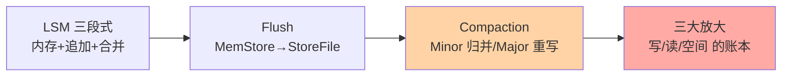
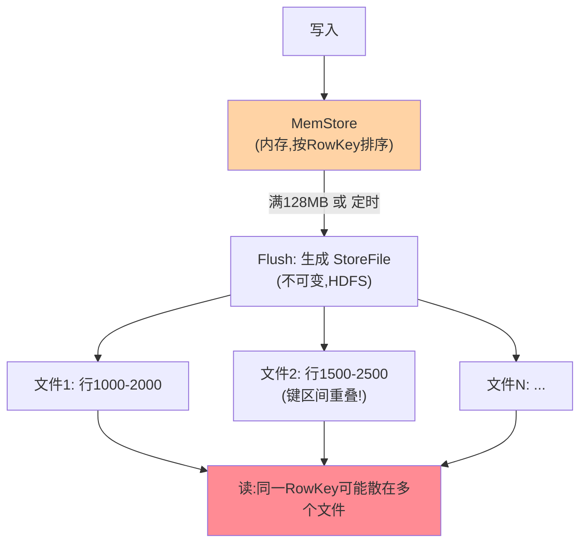

# LSM 树与 Compaction：StoreFile 的生命周期

> 一句话：HBase 写得快的秘密是 LSM 树——只追加不原地改；读得稳的秘密是 Compaction——后台把碎片文件合并重组；写放大、读放大、空间放大的三角账本全在这对机制里。

## 🎯 本文核心

**核心一句话：LSM 树 = 「内存缓冲 + 追加式文件 + 后台合并」三段式——写入只碰 MemStore 与顺序文件（快），代价是读取要合并多文件（慢）与空间存多版本（大）；Compaction（Minor 归并小文件 / Major 全量重写）用后台 IO 换读延迟与空间回收，它的节奏调优就是 HBase 运维的主旋律。**

组织主线：



## 一句话摘要

LSM 树（Log-Structured Merge-Tree）是 HBase 存储引擎的骨架：**写入**先进 MemStore（内存排序缓冲），满 128MB 刷成一个 StoreFile（HDFS 上的不可变文件）——全程只有追加，没有原地修改；**更新与删除**是「写一条新版本 + 打墓碑标记」，旧数据等后台清理；**Compaction** 负责收摊子：Minor Compaction 把若干小 StoreFile 归并成大文件（减少文件数 → 降读放大），Major Compaction 全量重写一个 Store（真正清理墓碑与过期版本 → 回收空间）。三笔账：**写放大**（一次写 = WAL + StoreFile + Compaction 重写，最多三份以上）、**读放大**（一个键要查多个文件）、**空间放大**（多版本与墓碑占空间）——Compaction 的所有调优都是在三笔账之间挪砝码。

## 一、写入到落盘：文件是怎么长出来的



MemStore 是「攒一批排好序再落盘」的缓冲——每个 StoreFile 是**不可变**的有序文件，但**不同文件之间的键区间是重叠的**（同一 RowKey 的多个版本散在各文件）：这是读放大的直接来源（读一个键要查所有可能包含它的文件），也是 Compaction 存在的理由（把重叠区间归并掉）。更新不是改文件——写一条新版本（时间戳更大），读取时取最新；删除也不是擦除——写一个**墓碑标记**（delete marker），读取时跳过被标记的键——**「一切写都是追加」是 LSM 的铁律，真正的物理清除只发生在 Major Compaction**。

## 5W 速记卡

| 维度 | 一句话 |
|---|---|
| What | LSM 三段式（MemStore/追加文件/后台合并）+ Minor/Major Compaction |
| Why | 顺序写换写吞吐，代价（读放大/空间）由后台合并偿还 |
| When | 读延迟调优、写高峰治理、磁盘空间异常增长排查 |
| Where | RegionServer 的 Store 内部（MemStore + StoreFile 组） |
| How | 调 flush 大小/compaction 阈值与窗口/OffPeak 低峰合并 |

## 二、Compaction 两级：Minor 归并与 Major 重写

| 维度 | Minor Compaction | Major Compaction |
|---|---|---|
| 范围 | 选若干**小文件**归并 | 一个 Store 的**全部文件**重写 |
| 做什么 | 合并文件、清除**超版本** | 合并 + **清墓碑 + 清过期（TTL）** |
| 触发 | 文件数/大小阈值自动 | 定时（默认7天周期）或手动 |
| 代价 | 中（IO 与网络在 RS 内） | 大（全 Store 重写，IO 峰值） |
| 频率 | 高（日常持续发生） | 低（周级/手动） |

**Major 是唯一真正物理删除的地方**：墓碑与 TTL 过期的数据在 Major 前一直占着空间——「删了数据磁盘没降」的排查终点几乎总是「Major 没跑或被打断」。Major 的代价也是真实的：全 Store 重写的 IO 峰值可能拖慢读写——**运维的常规动作是把自动 Major 关掉、手动安排在业务低峰**（或用 OffPeak 配置让低峰合并降速跑）——「删除的代价延迟到低峰支付」，这是 LSM 与 B+ 树（原地删除即时生效）的重要行为差异。

> 💡 **实战提示**
> - 读延迟毛刺排查先看 StoreFile 数量曲线：文件数爬升 = Compaction 跟不上写入了——加合并线程/调小合并阈值或扩容
> - 磁盘只涨不降的三个嫌疑：Major 被禁用未手动跑、TTL 配了但 Major 没触发、墓碑堆积（大量删除后没做过 Major）
> - 写高峰的 flush 风暴：MemStore 太小 → 频繁 flush → 小文件泛滥 → Compaction 被打爆——加大 MemStore 上限（`hbase.hregion.memstore.flush.size`）从源头减少文件数
> - Compaction 队列深度进监控：它是「写入压力 vs 合并能力」的晴雨表，持续上涨 = 要么限写要么扩容

## 三、三大放大：LSM 的账本

```text
写放大 = 实际写磁盘量 ÷ 用户写入量
        (WAL 1份 + StoreFile 1份 + Compaction 重写 N 次 → 大于1,典型2-10倍)
读放大 = 一次读取要查的文件数
        (MemStore + BlockCache 未命中的多个 StoreFile)
空间放大 = 磁盘占用 ÷ 逻辑数据量
        (多版本 + 墓碑未清 + 重写期间新旧并存)
```

三笔账的联动：**加大 MemStore** → 文件更大更少 → 读放大与 Compaction 压力降，但写高峰的内存风险升；**提高 Compaction 频率** → 读放大与空间放大降，但写放大与 IO 占用升；**放任 Compaction 滞后** → 短期写吞吐好，读延迟与磁盘先崩——**没有三全的配置，只有按业务读写比例定价的砝码摆放**。这套账本与 RocksDB/LevelDB 等 LSM 家族完全同构（ leveled vs sized 分族的差异在「怎么选文件合并」，账本不变）——学懂 HBase 这份，整个 LSM 家族通吃。

## 四、与 B+ 树（MySQL InnoDB）的区别：机械对照

| 维度 | B+ 树（InnoDB） | LSM（HBase） |
|---|---|---|
| 写入 | 原地更新页（随机 IO） | 追加文件（顺序 IO） |
| 读取 | 树直达一处 | 多文件合并 |
| 删除 | 即时生效 | 墓碑 + Major 延迟清除 |
| 空间 | 紧凑（页内复用） | 放大（版本/墓碑/重写期） |
| 后台维护 | 页分裂/合并（轻） | Compaction（重，需调度） |
| 适合 | 读多写少 | 写多 + 海量 |

对照的直觉：**B+ 树为读优化（写时随机）、LSM 为写优化（读时合并）**——介质与负载决定取舍，两边各自统治自己的地盘（MySQL 的 OLTP 事务负载 / HBase 的海量写吞吐负载），这也是入门层选型判断的机械根基。

## 五、典型使用场景

- **写吞吐型**（日志/详单）：MemStore 调大 + Compaction 阈值放宽——接受读延迟波动换写入吞吐
- **读敏感型**（在线画像查询）：Compaction 勤跑（文件数压低）+ BlockCache 足量——用后台 IO 换读延迟稳定
- **批量导入**（离线灌历史）：导入期关 Compaction（WriteBuffer 攒大批）→ 灌完手动 Major 一次——总量最少的重写
- **合规删除**（GDPR 类）：删除靠墓碑，**必须配套定期 Major** 才是物理删除——「逻辑删了」不等于「合规删了」

## 六、误区与代价

- ❌ **「删了就删了」**：墓碑只是标记，物理空间在 Major 才回收——对「删除后磁盘不变大」惊讶，是没理解 LSM 的删除语义
- ❌ **「Compaction 越勤越好」**：合并本身是重 IO 操作——过度合并让写放大失控（同样的数据反复重写），按文件数阈值自动触发 + 低峰 Major 是稳妥姿势
- ❌ **「MemStore 越大越好」**：写缓冲大 = flush 少文件大，但宕机恢复时 WAL 回放时长也随 MemStore 上限增长——恢复速度与写吞吐的又一个取舍
- ❌ **「读慢全是缓存的锅」**：BlockCache 之外，StoreFile 数量（读放大）常是主因——先看文件数再调缓存

## 七、你们可能会问

**Q1：Compaction 期间读写会阻塞吗？**
Region 级短暂阻塞存在于部分路径（如 flush 时的 `snaps` 机制让 MemStore 可继续接受写）——现代版本的 Compaction 与读写并发为主，但 IO 竞争是真实的（合并抢磁盘带宽，读写延迟抬升）——低峰调度的目的正是减少竞争而非避免锁。

**Q2：为什么不像 MySQL 一样原地更新？**
原地更新 = 随机 IO（找到页、改页、刷页）——机械盘时代随机与顺序差百倍以上，SSD 时代差距缩小但仍在；追加写的吞吐优势是 LSM 在「写密集 + 海量」场景的存在理由——两边的选择都是各自负载下的最优。

**Q3：怎么知道该调 Compaction 参数了？**
三个信号任一持续出现：StoreFile 数量曲线爬升不落（读放大在涨）、Compaction 队列深度持续高位（合并能力到顶）、读 P99 与文件数曲线同步波动（读延迟被文件数绑架）——信号定位到「源头减文件（MemStore/批量）还是下游加合并（线程/阈值）」再动手。

## 八、开放问题

- Tiered vs Leveled 两族合并策略（吞吐优先 vs 空间优先）的融合与自适应切换，是 LSM 家族持续演进的主线——HBase 也在探索基于负载画像的策略选择
- 存算分离后 Compaction 可下推到独立层（不抢数据面 IO）——「合并与读写的资源竞争」这个 LSM 的经典痛点，可能被架构形态的变化结构性解决

## 九、自测三问

1. LSM 三段式是什么？「一切写都是追加」怎么理解更新与删除？
2. Minor 与 Major 的差别？为什么说 Major 是唯一真正的物理删除？
3. 三大放大各自衡量什么？MemStore 大小怎么影响三笔账？

下一篇讲「Region 切分与负载均衡」：表怎么自动分裂、热点怎么迁移、HMaster 的均衡哲学。

## 🎯 核心带走

- **核心一句话**：LSM = 内存缓冲 + 追加文件 + 后台合并——写快（顺序追加）的代价由 Compaction 偿还（合并文件降读放大、清墓碑回收空间）；三大放大的账本决定一切调优
- **主线**：三段式 → 文件生长与键重叠 → 两级 Compaction → 三大账本 → 与 B+ 树的机械对照
- **哪里会坏**：小文件泛滥、Major 缺位磁盘只涨、墓碑堆积、合并 IO 挤占读写
- **边界**：本篇管存储引擎层；Region 的分布与均衡在篇 5，RowKey 怎么减少热点在篇 3

## 📌 数据与事实声明

- 写于 2026-09-11；LSM 机制与 Compaction 行为以 Apache HBase 官方文档（RegionServer 章）与 LSM 论文（1996，公开）口径为准；默认值（128MB flush、7 天 Major 周期）为版本默认配置
- 三大放大的倍数区间为业内经验量级，按负载实测
- 免责：默认值与策略随版本演进可能调整，以官方文档为准

## 📚 参考资料

| 类型 | 标题 | 来源 |
|---|---|---|
| 官方文档 | Apache HBase Reference Guide（Compaction 章） | hbase.apache.org/book.html |
| 公开论文 | The Log-Structured Merge-Tree（O'Neil, 1996） | 公开学术出版物 |
| 系列导航 | HBase 系列目录 | `docs/data/hbase/index.md` |
