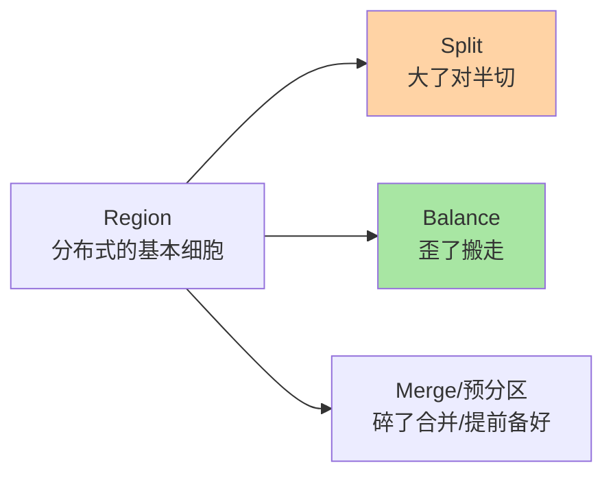
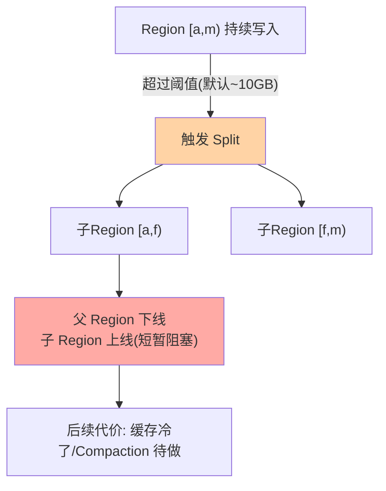

# Region 切分与负载均衡：表的自动生长机制

> 一句话：Region 是 HBase 分布式与均衡的基本细胞——大了自动对半切（Split）、歪了自动搬走（Balance）、挂了自动接管（Failover）——「表自己会长大」的全部机制就在这三个动作里。

## 🎯 本文核心

**核心一句话：Region 体系 = 表按 RowKey 范围横向切片、每片由一个 RegionServer 独占——Split（超阈值对半切，自动但有代价）、Balance（HMaster 按负载搬 Region）、Merge（小 Region 合并）三个动作维持「切片大小均匀 + 节点负载均匀」的双均匀状态；预分区是建表时对「未来生长」的提前干预，免掉冷启动的切分风暴。**

组织主线：

## 一句话摘要

HBase 的表按 RowKey 键区间切成 **Region**（如 `[row000, row100)`、`[row100, row200)`），每个 Region 在任意时刻只由一个 RegionServer 承载——这是「水平扩展」的物理实现：表大就多切 Region，加机器就多放 RegionServer。三个自动动作维持健康：**Split**——Region 大小超过阈值（默认 10GB 级）自动对半切成两个子 Region（切分瞬间有短暂阻塞与后续的缓存/紧凑代价）；**Balance**——HMaster 周期性检查各节点 Region 数与负载，把多余的搬走（迁移 = 关闭 + HDFS 改归属 + 重开）；**Merge**——过度切分的小 Region 合并回收开销。建表时的**预分区**（`SPLITS` 指定切分点）让表一开始就有 N 个 Region 散在多节点——避免「新表从一个 Region 长起」的冷启动热点。

## 一、Split：生长的代价与节奏

Split 的三个代价点：**切分瞬间**该 Region 短暂不可写（秒级）；**切分后**两个子 Region 的缓存是冷的（读延迟先抖一段）；**Compaction 债务**（子 Region 引用父文件，要等下次合并真正物理分家）。三个代价决定了运维口径：**写入量可预估的表用预分区跳过前期频繁 Split**（每次 Split 都是小小的性能税）；Split 风暴（批量导入触发连环切分）的治理是「导入前预分够 + 导入中限流」。什么时候手动切：发现某 Region 明显倾斜（热点前缀集中）——手动指定切分点精准切开，比等自动阈值更及时。

## 5W 速记卡

| 维度 | 一句话 |
|---|---|
| What | Region 切分（Split）/ 负载均衡（Balance）/ 合并（Merge）/ 预分区 |
| Why | 表要自动生长、节点负载要均匀——分布式的自我维持机制 |
| When | 建表（预分区）、写入高峰（Split 风暴）、节点扩缩容（Balance） |
| Where | HMaster 调度 + RegionServer 执行 + ZK 协调状态 |
| How | 建表 SPLITS 预分区；均衡器开关与阈值调参 |

## 二、Balance：HMaster 的搬椅子游戏

HMaster 的均衡器（默认周期 5 分钟）看两个指标：**各节点的 Region 数**（默认策略）与可选的**负载权重**（请求量/存储量）。发现不均（如某节点 40 个 Region、别的 20 个）就发起迁移：关闭源节点的 Region → 在 HDFS 层把它「改挂」到目标节点（StoreFile 不动，只是归属与内存状态重建）→ 目标节点重开 Region 上报 meta。**迁移的代价**：该 Region 在窗口期不可用（秒到分钟级）、目标节点缓存冷启动——所以均衡要「低峰跑、限速度、按需关」（大促前关均衡器是常见动作：此时「不折腾」比「均匀」更重要）。扩容新节点的场景：Balance 自动把部分 Region 搬过来——**加机器即生效**，这是 HBase 横向扩展体验流畅的机制来源。

> 💡 **实战提示**
> - 建表预分区的数量按「目标机器数 × 每节点 Region 数（经验 20-200 区间，过大反增 Master 管理负担）」反推——预分不是越多越好
> - 大促/大批量导入前关均衡器与自动 Split（`balancer_switch false`）：计划性变更优于自动行为的不可预期性
> - RIT（Region In Transition）监控是迁移健康的核心指标：RIT 堆积 = 迁移卡壳（常见原因：某节点长期无响应、meta 表不一致）——处置有专门工具链（hbck 类）
> - 节点下线走 graceful 流程：先摘流量（迁移走 Region）再停进程——直接 kill 逼迫集群走故障恢复路径，代价更高

## 三、Merge 与 Region 数量的双向调节

Split 只会越切越多，**Merge 收回过度切分**：预分过多、数据删除后变小、历史表合并——小 Region 的害处是「每个都有固定元数据与内存开销」，几千个空 Region 能把 Master 与 ZK 拖垮。Region 数量的双向调节逻辑：**大了切（单点压力）、小了并（管理开销）**——均衡点由数据总量与集群规模共同决定。这个「粒度自调节」的思想与分库分表的「逻辑槽映射」（MySQL 专题层篇 4）同构：分布式存储都要回答「切片粒度怎么自适应生长」，HBase 的答案是全自动（Split/Merge），MySQL 分库分表的答案是半自动（逻辑槽 + 人工再平衡）——自动化程度的差异正是「存储原生分布式 vs 应用层分片」的分野。

## 四、与「MySQL 分库分表」的区别

| 维度 | HBase Region | MySQL 分库分表 |
|---|---|---|
| 切分发起 | 存储自动（阈值触发 Split） | 应用/中间件层人工规划 |
| 再平衡 | 自动 Balance | 双写迁移工程（七阶段） |
| 跨片查询 | 多 Region 并发 scan（内建） | 中间件归并或异构索引 |
| 事务 | 行级原子，跨 Region 无 | 单片事务，跨片走分布式事务 |
| 心智 | 「表自己会长大」 | 「分裂是一次大工程」 |

区别的本质：**HBase 把分布式做进了存储内核**（Split/Balance/Failout 原生），MySQL 的分布式在应用层拼装（更灵活但更重）——代价对价：HBase 换来了自动化的省心，付出了「无跨 Region 事务、查询模型受限」的约束。选型时这道对比题永远在最前面。

## 五、典型使用场景

- **新表上线**：按 RowKey 分布预估预分 16-64 区（中等集群）——跳过冷启动的连锁 Split
- **批量导入**：预分到位 + 关自动 Split + 灌完开回——切分债务集中低峰偿还
- **集群扩容**：加 RegionServer → Balance 自动摊 Region——加机器即扩容
- **缩容下线**：graceful 排空 Region 后停机——不触发故障恢复路径

## 六、误区与代价

- ❌ **「Region 越多越并行」**：Region 有元数据与调度开销，空 Region 堆积拖垮 Master——数量按数据量与节点数规划，不是越多越好
- ❌ **「Split 是零成本的」**：切分瞬阻、缓存冷启动、Compaction 债务三笔税——预分区是「提前把税交了」的省心方案
- ❌ **「均衡器随时都该开着」**：大促与导入期关掉——自动行为在关键时刻的不可预期性，比短暂不均更危险
- ❌ **「Region 迁移 = 数据搬家」**：StoreFile 在 HDFS 不动，迁移是「改归属 + 状态重建」——但缓存冷与窗口期不可用是真实代价

## 七、你们可能会问

**Q1：预分区数量怎么估？**
从目标看：让写入一开始就散到多数节点——预分区数 ≈ 节点数 ×（每节点初始 Region 数 2-5）；数据量增长后 Split 自然加密。宁少勿多：切容易（自动）合麻烦（Merge 要手动）。

**Q2：热点 Region 怎么单独治理？**
先确认热点根源（RowKey 前缀集中）：能用 Split 切开的（数据真的多）手动 Split；键本身倾斜的（一个前缀就是热）回 RowKey 设计层改（篇 3 的手法）——Region 层治「分布不均」，治不了「键设计错误」。

**Q3：RegionServer 宕机后 Region 怎么办？**
ZK 心跳超时 → HMaster 把它的 Region 分配给其他节点 → WAL 回放恢复——窗口分钟级（篇 2 的容错剧本）；这与 Balance 迁移同路径，只是「被动触发」——所以扩缩容要主动 graceful（走同样机制但不带故障语义）。

## 八、开放问题

- 基于负载权重（而非 Region 数）的智能均衡在演进——请求倾斜场景下「数量均匀 ≠ 负载均匀」的修正
- 存算分离形态下 Region 迁移退化为「元数据改挂」（秒级），「迁移窗口」这个概念本身在被架构演进消解

## 九、自测三问

1. Region 的三个自动动作各管什么？Split 的三笔代价是什么？
2. 预分区怎么估数量？为什么「宁少勿多」？
3. HBase Region 与 MySQL 分库分表的机制分野是什么？各付出了什么代价？

下一篇讲「与 MySQL/Redis/ES 的区别和选型」：四件套的完整分工地图。

## 🎯 核心带走

- **核心一句话**：Region = 分布式的基本细胞——Split 大了切、Balance 歪了搬、Merge 碎了并，预分区是建表时的提前干预；自动化三动作是「存储原生分布式」对「应用层分片」的核心优势
- **主线**：Region 体系 → Split 代价 → Balance 搬迁 → Merge 双向调节 → 与分库分表的分野
- **哪里会坏**：空 Region 堆积、Split 风暴、大促忘关均衡、kill 直下走故障路径
- **边界**：本篇管分布层；RowKey 热点根源在篇 3，存储内部（文件/合并）在篇 4

## 📌 数据与事实声明

- 写于 2026-09-11；Split/Balance/Merge 机制以 Apache HBase 官方文档（Regions 章）口径为准；默认阈值（Region ~10GB、均衡周期 5 分钟）为版本默认配置
- 「每节点 20-200 Region」「预分 2-5 区/节点起步」为业内经验区间
- 免责：默认值与策略随版本演进可能调整，以官方文档为准

## 📚 参考资料

| 类型 | 标题 | 来源 |
|---|---|---|
| 官方文档 | Apache HBase Reference Guide（Regions / Region Splits 章） | hbase.apache.org/book.html |
| 系列关联 | 本仓库 MySQL《分库分表深度》系列（分野对照） | docs/data/mysql/专题层/ |
| 系列导航 | HBase 系列目录 | `docs/data/hbase/index.md` |
