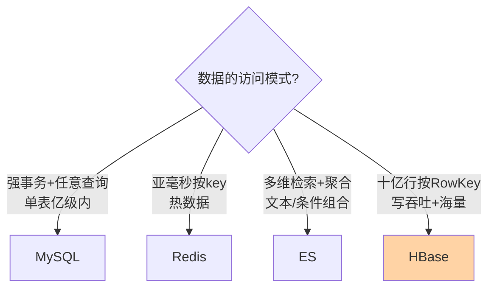
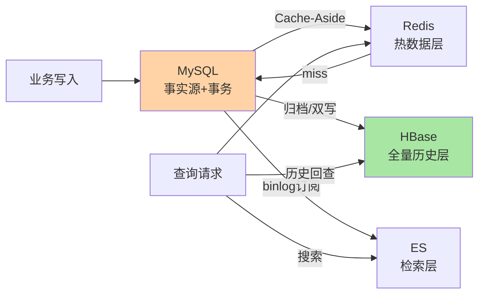

# 与 MySQL/Redis/ES 的区别和选型：四件套分工地图

> 一句话：MySQL 管事务事实、Redis 管热数据极速、ES 管检索聚合、HBase 管海量行键存取——四个引擎没有竞争关系，只有分工边界；选型的本质是「把数据的访问模式翻译成引擎的能力地图」。

## 🎯 本文核心

**核心一句话：四引擎按「访问模式 × 数据量级」分地盘——强事务任意查询（MySQL/单表亿级内）、亚毫秒热键（Redis/内存量级）、多维检索与聚合（ES/倒排索引）、十亿行按行键读写（HBase/LSM 宽表）——一套数据常按访问模式拆进多个引擎（事实源 + 热层 + 检索层 + 历史层），同步链路是组合形态的成本项。**

组织主线：

## 一句话摘要

四个常用存储引擎的能力分野：**MySQL**——关系模型 + 事务 + 任意条件查询（JOIN/聚合/二级索引），单表亿级内的事实源标配；**Redis**——内存 KV，亚毫秒延迟，热数据与原子计数的专用层（贵、易失、无复杂查询）；**ES**——倒排索引 + 列存聚合，多维条件检索与全文搜索的专用层（近实时、无事务、成本高）；**HBase**——LSM 宽表，十亿行级按 RowKey 读写、持续高写入吞吐（无 JOIN 无二级索引、无跨行事务）。真实系统是四者的**组合**：订单数据 MySQL 为源、Redis 缓存热单、ES 供搜索、HBase 存全量历史——**同步链路（双写/binlog 订阅）是组合的成本项与风险项**，引擎选型要做「单一引擎的够用判断」与「多引擎的同步代价」两笔账。

## 一、四维对照表：一张地图看全

| 维度 | MySQL | Redis | ES | HBase |
|---|---|---|---|---|
| 模型 | 关系表 | 内存 KV 多态结构 | 文档 + 倒排索引 | 排序稀疏宽表 |
| 强项 | 事务/任意查询/JAIN | 亚毫秒/原子操作 | 多维检索/聚合/全文 | 海量行/写吞吐/线性扩展 |
| 弱项 | 单表容量/写吞吐上限 | 容量贵/易失/无查询 | 无事务/近实时延迟 | 无 JOIN/仅 RowKey 访问 |
| 数据量级 | 单表亿级内 | GB 级（内存） | TB 级（成本敏感） | 十亿行级 PB 级 |
| 一致性 | 强（事务） | 最终（主从异步） | 最终（刷新窗口） | 行级原子/最终 |
| 典型延迟 | 毫秒 | 亚毫秒 | 毫秒到百毫秒 | 毫秒到几十毫秒 |
| 角色 | 事实源 | 热层/缓存 | 检索层 | 历史层/宽表层 |

**看表的姿势**：先问「这条数据的访问模式」（点查/范围/检索/事务），再对表找强项命中的引擎——而不是「我会哪个就用哪个」。

## 5W 速记卡

| 维度 | 一句话 |
|---|---|
| What | 四引擎能力地图 + 组合架构与同步代价 |
| Why | 没有全能引擎，选型 = 访问模式到能力地图的映射 |
| When | 新业务存储选型、现有架构加层、同步链路治理 |
| Where | 存储层的整体架构设计 |
| How | 访问模式优先 → 单引擎够用判断 → 多引擎同步账 |

## 二、HBase 的进与不进：三个高频决策题

**决策一：MySQL 单表到亿级了，HBase 还是分库分表？**——访问模式裁决：仍是「按主键 + 少量条件查询 + 事务」→ 分库分表（保留关系能力，代价是应用层分片工程）；访问已收敛为「按主键读写 + 写吞吐压顶 + 无 JOIN 诉求」→ HBase（存储原生分布式，省掉分片工程）。中间态（既要事务又要海量）→ 评估 NewSQL（TiDB 类）。**判据一句话：查询形态没变就别换模型，模型换了就要接受它的查询约束**。

**决策二：HBase 还是 ES？**——都要「大数据量」，但访问模式分野明确：按 ID 取详情/取一段（HBase）；任意条件组合筛 + 全文 + 聚合统计（ES）。典型配合：**ES 做检索（拿到 ID 列表）→ HBase 取详情**（ES 存宽字段成本高，HBase 存海量详情便宜）——两跳架构比单引擎硬扛便宜。

**决策三：全量历史放 HBase 还是归档 MySQL？**——按「历史还要查吗、怎么查」裁决：按用户/键随机回查（客服查半年前订单）→ HBase（十亿行下毫秒点查）；纯冷备不查 → 对象存储/文件归档（比 HBase 便宜一个量级）；还要复杂条件分析 → 数仓/ClickHouse（不是 HBase 的活）。

> 💡 **实战提示**
> - 选型评审写「访问模式清单」：每条业务读写列「条件维度/频率/延迟要求/量级」——清单映射到能力地图，选型从拍脑袋变成查表
> - 多引擎组合先算同步账：每加一层引擎 = 一条同步链路（binlog 订阅/双写）+ 一致性窗口 + 一套运维——层数是负债，访问模式撑得住就合并
> - HBase 引入的最小验证场景：确定有「十亿行级 + RowKey 访问」的真实诉求再立项——「未来可能大」不是理由（与分库分表同一纪律）
> - 混合查询需求用「组合拳」而非「找全能引擎」：ES 检索 + HBase 取详情 + Redis 热层是成熟三段式，比等待一个不存在的全能引擎现实

## 三、组合架构：一套数据的四层旅程

订单系统的四层典型：**MySQL**（近 3-6 个月事实源，事务与任意查询）、**Redis**（热单缓存与计数）、**ES**（运营后台的条件筛选）、**HBase**（全量历史按用户回查）。三条同步链路的成本：binlog→ES（检索新鲜度秒级）、归档→HBase（T + 1 或准实时双写）、Cache-Aside（应用层维护）——**每条链路都是「一致性窗口 + 运维组件」的显式代价**，架构评审要把同步链路当一等公民列出（与缓存一致性系列、binlog 订阅篇的纪律同源）。

## 四、典型使用场景（组合形态）

- **消息/Feed 系统**：MySQL（近期消息）+ HBase（全量历史按用户回查）+ Redis（会话热层）——三段按时间窗分工
- **电商商品**：MySQL（商品事实与库存）+ ES（搜索与筛选）+ Redis（详情缓存）+ HBase（价格/库存变更流水，海量追加）
- **风控特征平台**：HBase（亿级用户特征宽表）+ Redis（在线打分热层）——离线灌入 + 在线点查的标准配对
- **订单全生命周期**：MySQL（当期事实源）+ HBase（三年全量）+ ES（客服工单检索）——篇三「四层旅程」的落地形态

## 五、误区与代价

- ❌ **「找全能引擎」**：事务+检索+海量+亚毫秒的引擎不存在——四引擎各守一段是物理规律不是工程妥协
- ❌ **「HBase 能存就能查」**：存进 HBase 的数据只能按 RowKey 取——非 RowKey 查询要靠索引表/ES 配套，「存储成本省的，查询基建还回来了」
- ❌ **「层数越多架构越先进」**：每层引擎是负债（同步/一致性/运维）——访问模式合并得了就减层，减不掉的层才留着
- ❌ **「选型看技术流行度」**：流行度影响招人与生态，不影响物理约束——访问模式的匹配永远是第一判据

## 六、你们可能会问

**Q1：小公司没有四件套的运维资源，怎么裁剪？**
裁剪顺序：先 MySQL + Redis（事实源 + 热层，覆盖 90% 场景）；检索需求真出现再加 ES（或先用 MySQL LIKE/全文索引顶着）；HBase 的引入门槛最高（Hadoop 生态依赖）——量级真到了或直接用云托管版（省运维）。**按需求生长，不为架构完整性预支**。

**Q2：HBase 和 ClickHouse 什么关系？**
访问模式正交：HBase 是「在线的点查与范围扫」（毫秒、按行取）；ClickHouse 是「分析的聚合扫描」（秒级、列式算总量）——宽表分析进 ClickHouse/数仓，行键回查进 HBase，混用是两边都难受。

**Q3：怎么向架构评审论证「该引入 HBase」？**
三件证据：量级预测（单表 N 个月后过亿且持续增长）、访问模式收敛证明（Top 查询都是按主键）、替代方案的成本对比（分库分表工程量 vs HBase 生态依赖）——证据链齐了选型就不是口味之争。

## 七、开放问题

- 云托管正在把「四件套」的运维门槛拉平（托管 MySQL/ES/HBase 类），选型的天平从「运维成本」向「访问模式匹配 + 计费模型」倾斜
- HTAP 与多模数据库持续吞食「组合架构」的边界（一库多引擎）——但物理层的取舍不会消失，只是被封装得更深

## 八、自测三问

1. 四引擎各自的能力强项与物理边界是什么（各一句话）？
2. 「MySQL 亿级，分库分表还是 HBase」的裁决判据是什么？
3. 四层组合架构的三条同步链路各付什么代价？

本篇是入门层选型的收束。下一篇（部署运维与生态）收尾入门层，之后特性层逐个机制深挖。

## 🎯 核心带走

- **核心一句话**：四引擎按访问模式分地盘——MySQL 事务事实、Redis 热层、ES 检索、HBase 海量行键；组合是常态，同步链路是成本；选型 = 访问模式清单映射到能力地图
- **主线**：能力地图 → 三个高频决策题 → 四层组合架构 → 裁剪与论证
- **哪里会坏**：找全能引擎、HBase 当检索用、层数膨胀、按流行度选型
- **边界**：本篇是选型地图；各引擎的机制细节在各自系列（MySQL/Redis 本仓库已有，ES 系列互指）

## 📌 数据与事实声明

- 写于 2026-09-11；各引擎能力边界为公开文档与业内共识的归纳；「四层组合」「ES+HBase 两跳」为业内成熟架构模式
- 量级分档（单表亿级/内存 GB/十亿行）为经验认知，按硬件与版本实测
- 免责：产品能力随版本演进，选型按官方文档核实

## 📚 参考资料

| 类型 | 标题 | 来源 |
|---|---|---|
| 官方文档 | Apache HBase / MySQL / Redis / Elasticsearch 官方文档 | 各官网 |
| 系列关联 | 本仓库 Redis 入门层篇 1（三件套分工）/ MySQL 分库分表系列 | docs/middleware/redis/、docs/data/mysql/ |
| 系列导航 | HBase 系列目录 | `docs/data/hbase/index.md` |
