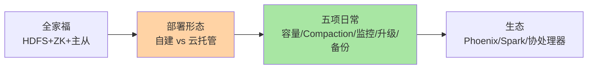
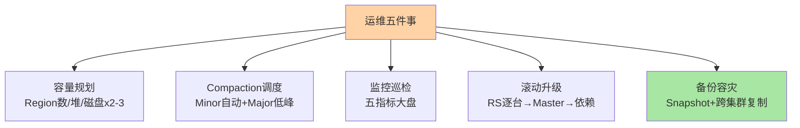

# 部署运维与生态：HBase 的全家福与日常操守

> 一句话：HBase 不是一个人在战斗——HDFS/ZooKeeper/HMaster/RegionServer 的全家福决定部署形态，云托管把全家福装进产品；日常操守五件事：容量规划、Compaction 调度、监控巡检、升级纪律、备份容灾。

## 🎯 本文核心

**核心一句话：HBase 运维 = 管好「全家福依赖」（HDFS 存储 + ZooKeeper 协调 + 自身主从）+ 五项日常（容量按 Region 数与堆规划、Compaction 低峰调度、监控盯五类指标、滚动升级纪律、快照与容灾）——自建的复杂度在全家福，云托管把复杂度换成产品参数，选形态是运维的第一个决策。**

组织主线：

## 一句话摘要

HBase 的运行时依赖一个「全家福」：**HDFS**（文件存储与三副本可靠性——HBase 可用性的地基）、**ZooKeeper**（协调与元数据入口——全家福里最娇贵的单点敏感组件）、**HMaster**（主备，元数据与均衡）、**RegionServer 集群**（数据面主力）。部署形态两选：**自建**（CDH/HDP 类发行版或原生生搭——全家福自己管，运维重但可控）与**云托管**（云 HBase 类产品——全家福被封装成服务，运维换成容量与参数决策）。日常运维五件事：容量规划（Region 数/堆大小/磁盘水位）、Compaction 调度（低峰 Major）、监控巡检（五类核心指标）、滚动升级（先 RegionServer 后 Master 的次序纪律）、备份容灾（快照 Snapshot + 异地复制）。

## 一、全家福：每个成员的角色与脾气

| 组件 | 角色 | 脾气（运维关注点） |
|---|---|---|
| HDFS | 文件存储 + 副本 | NameNode 是其单点敏感区；磁盘与网络是底层容量 |
| ZooKeeper | 协调/元数据入口/选主 | 会话超时参数牵动故障检测速度；ZK 抖动全家抖 |
| HMaster | Region 分配/均衡 | 主备切换秒级；宕机期间新分配暂停 |
| RegionServer | 数据读写 | 堆与 GC 是永恒话题；宕机触发 Region 迁移窗口 |

**依赖链的故障传导**：HDFS 不可用 → 读写全停（WAL 与 StoreFile 都写不了）；ZK 不可用 → 新请求寻址失败 + Master 选不出；Master 不可用 → 存量读写正常、变更暂停——**全家福任何一员出事，HBase 的故障形态都不同**，排查先定位「是哪个成员的病」。这也是云托管的核心价值主张：把三个依赖的健康度打包成 SLA。

## 5W 速记卡

| 维度 | 一句话 |
|---|---|
| What | 全家福依赖 + 部署形态 + 五项日常运维 + 生态组件 |
| Why | HBase 的可用性 = 全家福的乘积，运维管的就是这个乘积 |
| When | 选型部署、容量规划、日常巡检、故障与升级 |
| Where | Hadoop 集群 / 云托管产品 |
| How | 监控五指标、低峰 Compaction、滚动升级、快照备份 |

## 二、五项日常操守

**① 容量规划**：三个口径——Region 总数（经验每节点 20-200，过千过万要警惕 Master 负担）、RegionServer 堆（MemStore+BlockCache 共享，按读写画像配比，大堆要配 GC 调优或 offheap）、磁盘水位（LSM 有写放大与 Compaction 期双份数据——磁盘按逻辑数据量 ×2-3 预留）。**② Compaction 调度**：自动 Minor 保留、Major 手动安排低峰（篇 4 的纪律）；批量导入前后专项处理。**③ 监控巡检**：五类核心——RegionServer 的读写延迟与 QPS、Compaction 队列深度、Region 数与 RIT、堆与 GC 停顿、HDFS/ZK 的健康度（依赖层单列）。**④ 滚动升级**：次序纪律——先升 RegionServer（逐台 graceful 排空）→ 再升 Master → HDFS/ZK 的升级窗口单独排（它们是地基，动作更重）。**⑤ 备份容灾**：Snapshot（表级快照，秒级元数据操作——备份与「回滚到某刻」的基础设施）、Replication（跨集群复制——异地容灾的标准形态）、快照的异地导出（冷备兜底）。

> 💡 **实战提示**
> - 巡检第一眼五指标：Compaction 队列、RIT 数量、RS 堆/GC、读写 P99、HDFS 剩余空间——五张图覆盖 HBase 健康的九成日常判断
> - Snapshot 是「免费的后悔药」：大变更（危险批量操作/大升级）前打快照——元数据级操作秒级完成，出事直接回滚
> - graceful 退役的完整链路：摘流量 → 排空 Region → 停进程——跳过任何一步就是把「计划内变更」变成「计划外故障」
> - 什么时候考虑云托管：专职运维 < 2 人且全家福依赖没人管——自建 HBase 的隐性成本是「三个系统的运维人力」

## 三、生态全家福：四类常用外挂

- **Phoenix**：SQL 层（JDBC + 二级索引 + 类 SQL 查询）——给「想用 SQL 查 HBase」的团队补接口层；代价是引入一层查询协调与索引维护成本
- **Spark/Hive 集成**：批处理与分析（Spark 直接读 HBase 表跑离线任务）——HBase 作在线层、Spark 作分析层的标准搭配
- **协处理器（Coprocessor）**：服务端逻辑下沉（类「存储过程」——Filter 之外的自定义服务端计算）——功能强但出问题拖垮 RegionServer，用前评估隔离性
- **Kerberos/Ranger**：安全体系（认证/授权）——多租户与合规场景的标配外挂

生态的选型口径：**先问「是不是非用不可」**——Phoenix 的 SQL 便利 vs 引入的索引维护成本、协处理器的计算下沉 vs 隔离风险——每个外挂都是一层依赖与一类新故障面，与「多引擎组合」的层数纪律同源。

## 四、与 MySQL/Redis 运维的区别

运维的复杂度画像不同：MySQL 运维围绕「单实例深耕」（参数调优/主从/备份——生态成熟工具链全）；Redis 运维轻（单进程内存库——监控到位基本安稳）；HBase 运维是「分布式系统全家福」（三个依赖系统 × 各自的故障面 × 分布式特有病：RIT/Split 风暴/Compaction 拥塞）——**运维人力成本 HBase > MySQL > Redis**，这个排序在引入 HBase 的立项里必须显式呈现（它不比 License 便宜）。

## 五、典型使用场景

- **初次立项部署**：小规模自建（3-5 台 RegionServer + 共享 HDFS/ZK）验证场景 → 量级起量后迁云托管——两段式降风险
- **日常巡检体系**：五指标大盘 + 告警分级（RIT 非零即告警/Compaction 队列持续高位告警）——与可观测性系列的建盘纪律同源
- **大促备战**：关均衡 + 预分到位 + 低峰 Major 提前做 + 快照兜底——四件套动作清单
- **数据治理**：TTL 到期数据的磁盘回收验证（Major 后空间应下降）——LSM 删除语义的运维侧确认

## 六、误区与代价

- ❌ **「只监控 HBase 不监控依赖」**：HDFS 慢/ZK 抖的故障表现为 HBase 慢——依赖层监控缺位等于瞎了一半
- ❌ **「升级一把梭」**：全家福一起升是大事故剧本——逐组件滚动 + 每步验证，慢就是快
- ❌ **「Snapshot 当备份的完全体」**：快照在同集群（依赖同一份 HDFS 数据）——真正的容灾要快照导出异地或跨集群复制
- ❌ **「协处理器随便上」**：服务端代码没有隔离层——一个死循环拖垮整个 RegionServer 的所有 Region，用前评审隔离与超时

## 七、你们可能会问

**Q1：最小生产集群要多大？**
自建最小可用：3 台 ZK + 2 台 HMaster（主备）+ 3+ 台 RegionServer + HDFS（可与 RS 混部但生产建议分离）——「3 台起步」是多数组件多数派的底线；更小规模用云托管按量起步。

**Q2：怎么判断「该从自建迁云托管」？**
两个信号：运维人力持续不足（全家福故障响应超 SLA）、自建硬件折旧与人力成本超过托管费用——技术形态的迁移是经济决策，量出为入。

**Q3：HBase 升级为什么要那么谨慎？**
数据格式与 RPC 协议的兼容窗口窄（跨大版本常有 StoreFile 格式变化），且全家福组件间有版本匹配矩阵（HBase ↔ Hadoop ↔ ZK）——升级是「矩阵对齐 + 滚动次序 + 回退预案」的工程项目，不是「换二进制」。

## 八、开放问题

- 云原生重造（计算存储分离、对象存储底座、K8s 编排）在托管产品中推进，「全家福依赖」正在被平台吸收——自建 HBase 的形态可能在下一代走向小众
- 存算分离 + 快照即服务让「备份容灾」的形态简化（从工程拼装到产品参数）——运维五件事的清单在持续缩短

## 九、自测三问

1. 全家福四个成员各管什么？依赖链的故障传导怎么定位？
2. 日常五项操守是什么？滚动升级的次序纪律是什么？
3. 自建与云托管的决策信号是什么？生态外挂的引入纪律是什么？

本篇收尾入门层：模型、架构、RowKey、LSM、Region、选型、运维七篇构成 HBase 的完整入门地图——特性层将逐个机制深挖（Bloom Filter、WAL 机制、Compaction 策略、协处理器）。

## 🎯 核心带走

- **核心一句话**：HBase 运维 = 全家福（HDFS/ZK/Master/RS）健康度乘积 + 五项日常（容量/Compaction/监控/升级/备份）——自建重运维、托管换参数，生态外挂按需克制
- **主线**：全家福角色 → 部署形态 → 五项操守 → 生态四外挂 → 运维复杂度排序
- **哪里会坏**：依赖层监控缺位、升级一把梭、快照当容灾完全体、协处理器无隔离
- **边界**：本篇是入门层收束；各机制的深挖在特性层系列，与 MySQL/Redis 运维纪律的通约已标注互指

## 📌 数据与事实声明

- 写于 2026-09-11；组件角色与运维动作以 Apache HBase 官方文档（Getting Started / Ops 章）口径为准；Phoenix/Spark/协处理器为官方生态组件
- 「每节点 20-200 Region」「磁盘 ×2-3 预留」「3 台起步」为业内经验口径
- 免责：产品能力与默认配置随版本演进，以官方文档为准

## 📚 参考资料

| 类型 | 标题 | 来源 |
|---|---|---|
| 官方文档 | Apache HBase Reference Guide（Ops / Snapshots / Rolling Upgrade 章） | hbase.apache.org/book.html |
| 官方生态 | Apache Phoenix / HBase-Spark 连接器文档 | phoenix.apache.org 等 |
| 系列导航 | HBase 系列目录 | `docs/data/hbase/index.md` |
