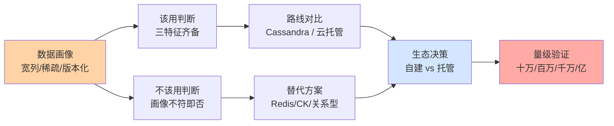
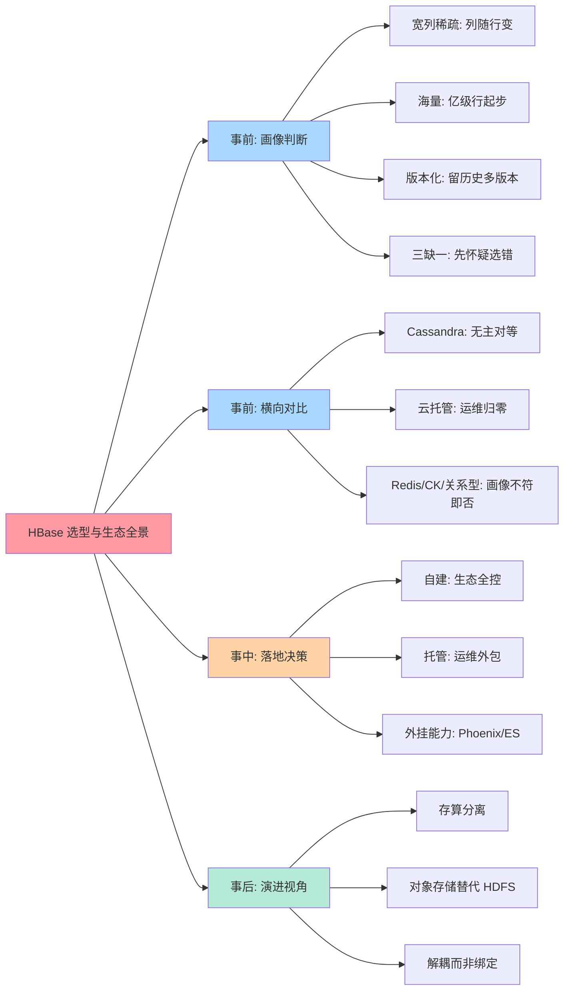
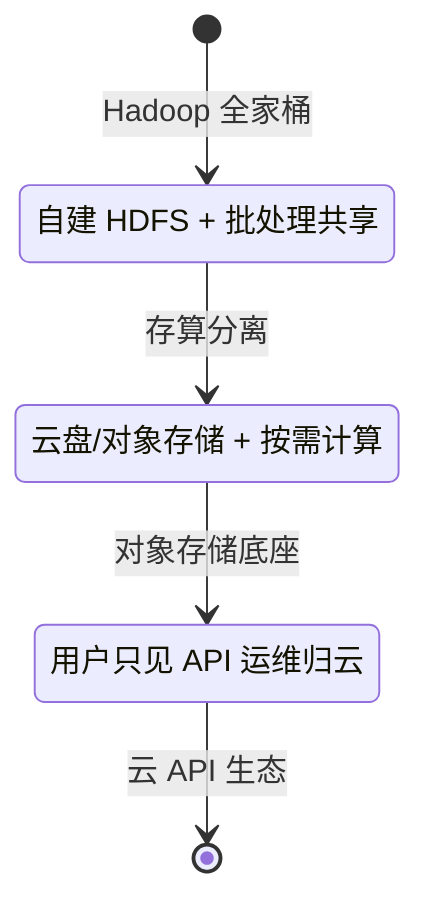
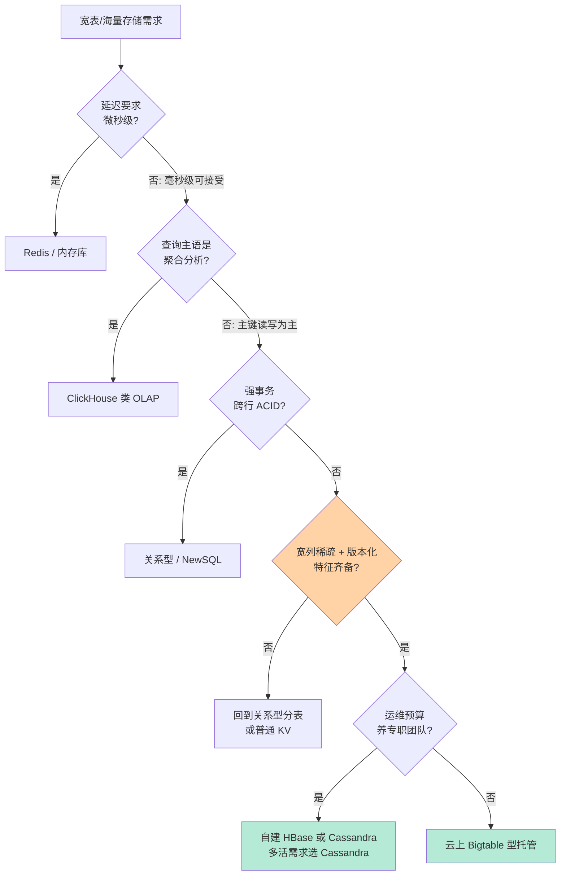
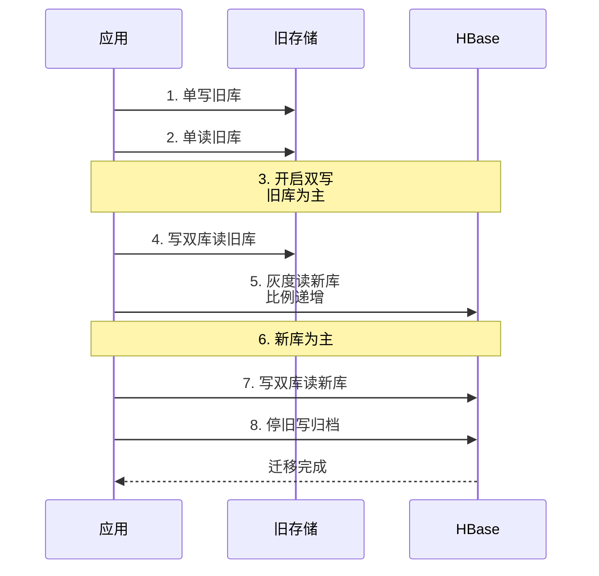

# HBase 选型与生态全景：什么时候选它，什么时候放手

> 一句话：HBase 的选型判断锚在四个字「海量宽列」——海量（亿级行）、宽列（稀疏列可无限扩展）、版本化（多版本历史）三者齐备才是它的主场；低延迟点查属于 Redis、实时分析属于 ClickHouse、强事务属于关系型，而云时代的生态位正在从「Hadoop 伴生」走向「云原生托管」。

## 🎯 本文核心

**核心一句话：选 HBase 不是选一个软件，是选一整套「存储 + 生态 + 运维」的承诺——判断主线是数据画像（宽列稀疏版本化）× 延迟要求（毫秒级非微秒）× 运维预算（自建三件套 or 云托管），而云上 Bigtable 型托管服务的成熟正在把「运维复杂度」这笔最大的隐性账从选型里抹掉。**

组织主线（本篇五段全挂这条线）：数据画像 → 该用/不该用 → 横向对比（Cassandra/云托管）→ 生态耦合与解耦 → 量级与决策树。

## 一句话摘要

HBase 的主场是**亿级行 × 稀疏宽列 × 多版本**的在线存储：消息历史、画像特征、风控明细、时序指标这类「按主键读写、列随行变、留历史版本」的数据。它的边界同样清晰：微秒级低延迟点查是 Redis 的主场，实时 OLAP 聚合是 ClickHouse 的主场，强 ACID 事务是关系型的主场。同类对比上，Cassandra 用无主对等架构换「多机房免运维中心」，HBase 用主存分离换「强一致读 + 与 Hadoop 生态的深度耦合」；云上 Bigtable 型托管产品（各公有云均有对应形态）把运维账抹掉，正在成为新项目的默认起点。**生态层面的大势是解耦**：存储与计算分离、对象存储替代 HDFS、Phoenix/ES 等外挂能力转云托管——「选 HBase = 进 Hadoop 全家桶」的时代正在过去。

## 一、全景脑图：选型判断的四层展开

按方法论主线展开成一张全景脑图——从数据画像出发，经该用/不该用、横向对比、生态决策，最终落到量级验证：

读图方法：事前（画像/对比）决定「选不选」，事中（落地/外挂）决定「怎么落」，事后（演进）决定「会不会后悔」——三层判断共同构成完整的选型闭环，跳过任何一层都会在后续某个深夜补课。

## 二、什么时候选：三个特征齐备

### 主场场景画像

- **海量宽列 + 稀疏**：亿级用户 × 每人几百到几千个特征列，且列集合随业务漂移——关系型的稀疏列是灾难（空列浪费 + 加列要 DDL），HBase 的列动态特性天然匹配。
- **版本化需求**：需要「某字段的历史值」（画像变更轨迹、配置变更历史、余额快照），HBase 的多版本 Cell 是内置能力，关系型要自建历史表或审计表。
- **按主键的高吞吐读写 + 范围扫**：写吞吐持续高位、按 RowKey 点查与范围扫为主——LSM 写路径与 Region 分布的强项区。

判断口诀：**宽列、海量、版本化三个特征齐备 → HBase 几乎是唯一解；缺任何一个 → 先看替代方案再回来**。缺「宽列稀疏」就是普通 KV 需求（HBase 太重）；缺「海量」就是关系型需求（杀鸡用牛刀）；缺「版本化」则多种存储都行（选型自由度反而大）。

追问一层：为什么「特征齐备」比「性能对比」更靠前？因为性能是量级与负载的函数，特征是数据的固有属性——负载会变，属性不会。选型评审里先拿特征过滤，能用一轮提问解决的事，就不要拖到压测三周后才在另一个维度上否掉——排序错的评审流程，是选型会议低效的第一原因。

再追问一层：特征打分谁来定？答案是「数据 + 查询双清单」：数据清单（列数分布、稀疏度、版本保留需求、增长速率）由存储方出，查询清单（点查比例、扫描模式、延迟目标、过滤复杂度）由业务方出——两份清单交叉核对完，特征是否齐备是客观结论，没有争论空间。选型的可复现性来自输入的结构化，而不是评审者的经验权威。

## 三、什么时候不选：三个经典替代

### 边界与替代方案

- **低延迟点查 → Redis**：延迟要求进微秒档、数据量在内存装得下的量级（千万 Key 以内，业内认知）、可接受缓存语义（可重建/可淘汰）——Redis 的单 key 亚毫秒是 HBase 永远给不了的；两者也常组合成「Redis 缓存热数据 + HBase 存全量」的多级形态。
- **实时分析聚合 → ClickHouse 类 OLAP**：查询主语是聚合扫描（分组、求和、多维下钻）而非单 Key 点查——列存向的 OLAP 引擎快 HBase 一个数量级以上；HBase 的 Scan + 协处理器做聚合是「能跑」而非「该跑」。
- **强事务 → 关系型/NewSQL**：跨行跨表 ACID、复杂 JOIN、二级索引密集——这是关系型的宪法领地；HBase 的单行原子是天花板，跨行要靠 Phoenix 事务等外挂（复杂度与限制都高，公开文档口径）。

一个反方案分析常被跳过：**「为什么不用分库分表的 MySQL 硬扛宽表场景」**——分库分表能解决「海量」，解决不了「列随行变」（每次加列要动所有分片）与「版本化」（自建历史表的查询复杂度）；当三个特征里有两个超出关系型舒适区，自建补丁的成本会超过引入新组件的成本。选型比较要拿「总拥有成本」比，不是拿「组件数量」比。

一段真实的行业常见复盘（匿名化）：某内容平台在关系型上硬扛画像宽表两年——列数从几十涨到上千，加列 DDL 从分钟涨到小时级，历史版本用自建 JSON 快照表存，查询端拼 JSON 的逻辑越堆越厚。最终迁移 HBase 的动因不是「MySQL 撑不住量」，而是**每一次业务迭代都在为存储模型的错配交税**：加列成本、历史表 join、补丁代码维护三笔税加起来，超过了迁移本身。复盘结论入档：存储模型的错配是慢性病，账单按业务迭代频率计——它不会让系统宕机，但会让迭代速度逐月变慢，直到有人下决心动手术。

## 四、横向对比：Cassandra 与云托管

### 三方对比表

| 维度 | HBase | Cassandra | 云上 Bigtable 型托管 |
|---|---|---|---|
| 架构 | 主存分离（HMaster+RegionServer） | 无主对等环 | 托管分层（用户只见 API） |
| 一致性 | 强一致读（单 Region 内） | 可调（最终一致为主，公开口径） | 强一致单行 |
| 运维复杂度 | 高（三件套） | 中（无 Master 但需管 repair） | 低（运维归云） |
| 生态耦合 | Hadoop/Phoenix/ES 深度集成 | Spark 连接器为主 | 绑定云 API（迁移成本高） |
| 适合场景 | 已有大数据平台、要强一致读 | 多机房多活、无中心运维团队 | 新项目、不想养运维、量级可预期 |

选型解读：**多机房多活刚需 → Cassandra 的对等架构是结构性优势；已有 Hadoop 平台且要强一致 → HBase 顺手；不想养运维 → 云托管把三件套的运维账整笔抹掉**——云托管正在成为新项目的默认选项，代价是与云 API 的绑定（迁移锁），这笔账要写进五年视角。

### 与 Hadoop 生态：耦合的昨天与解耦的今天

历史上的 HBase 是「Hadoop 生态的在线层」：数据在 HDFS 上，批处理（MapReduce/Spark/Hive）与在线服务共享存储——一套集群两用，耦合是特性不是缺陷。今天的趋势是解耦：**存储层走对象存储或云盘（不再依赖 HDFS 部署形态）、计算层按需拉起（存算分离）、生态外挂逐个云托管化**（公开的云产品演进路径）。跨周期视角的判断：HBase 的核心资产（宽列模型 + LSM 引擎 + Region 分布）会长期活着，但「Hadoop 伴生」这个部署形态的比重会持续下降——选型时绑定的应该是模型与 API，而不是部署形态。

从机制层面理解解耦为什么可行：HBase 对 HDFS 的依赖面其实很窄——顺序读写文件、按块存取、副本容灾，这三件事对象存储与云盘都能承接（性能特性不同但接口语义相同）；耦合的「重」从来不在接口，而在**部署与运维形态**（要养 HDFS 集群、要做版本联排、要管 DataNode 磁盘）。所以解耦的本质不是换接口，是把这层部署形态从用户视野里挪走——挪给云厂商（托管）或对象存储（免运维底座）。理解了依赖面的宽窄，就能判断任何一次「解耦产品发布」的真实含金量：挪走的是接口（伤筋动骨）还是运维（皆大欢喜），看依赖面就够。

### 生态外挂的取舍

HBase 的 SQL 能力靠 Phoenix、二级索引/全文靠外挂 ES、分析靠 Spark——外挂是生态优势也是成本中心：每挂一个组件就多一套运维、多一层一致性缺口（异步同步必有窗口）。生产实践纪律：**外挂数量与团队运维能力成正比**，团队能力存疑时优先选「托管云产品原生组合」，把一致性缝隙交给云厂商的集成层。

追问一层：为什么外挂链路的一致性窗口「不可消除，只能管理」？穿透到机制看：HBase 写提交（WAL + MemStore）与外挂同步（监听 WAL 或双写）是两个独立的事务边界——要么接受异步窗口（快但有缝隙），要么付出分布式事务成本（同步双写，慢且引入级联失败风险）；不存在「又快又无缝」的免费组合，这是分布式系统的基本定理级约束，不是工程不努力。所以管理手段是业务侧的：**读路径容忍窗口**（读新库失败的回源旧库）、**对账兜底**（周期比对双库差异）、**关键校验后置**（资金类字段以旧库为准直到收尾）——把技术缝隙转化为业务流程里可管理的点。

历史上还有一类高频踩坑值得留档：外挂同步任务在 Region 大规模迁移或集群抖动后的「静默断流」——同步管道表面健康（进程活着）实际已丢数据，直到业务发现「搜不到新内容」才暴露。这类故障的防线是**端到端对账而非进程监控**：同步链路的健康定义是「目标端数据完备」，不是「同步进程存活」——监控语义错位是这类事故的共同根因。

## 五、不同量级的思考：架构约束驱动解法

量级决定选型本身——同一个「宽表需求」在不同量级的答案完全不同：

- **十万级（单机即可）**：数据量与吞吐都是单机余量内，MySQL 加索引甚至 SQLite 都能扛；思考方式是「克制引入」——这一档的核心问题是「这个量级真的需要分布式宽列吗」，而不是「哪个分布式宽列更好」。约束来源是单机容量的宽裕度：提前引入 HBase 是负优化（三件套运维成本瞬间超过业务价值）。
- **百万级（关系型仍是默认）**：MySQL 分区/分表仍够用，除非宽列稀疏与版本化特征已齐备；思考方式是「特征核对」——这一档的核心问题是「三个特征齐了几个」，而不是「要不要上分布式」。约束来源是关系型的舒适区边界：特征缺一个，关系型就还能再撑一个量级。
- **千万级（选型真正的分水岭）**：写入吞吐与列扩展压力让关系型补丁成本陡增，HBase/Cassandra/托管的对比进入日程；思考方式是「总拥有成本核算」——这一档的核心问题是「组件成本、运维成本、迁移成本三笔账哪个大」，而不是「谁的性能数字好看」。约束来源是多组件运维的人力带宽：每多一个组件多一份值班负担。
- **亿级（托管或专职团队）**：自建三件套需要专职存储团队兜底，否则云托管是理性答案；思考方式是「组织匹配」——这一档的核心问题是「团队有没有人可以对三件套的深夜告警负责」，而不是「参数还能不能再压一压」。约束来源是组织能力与物理集群的总量：这一档的失败案例多数不是技术失败，是「没有人手承担运维」的组织失败。

思考方式总结：十万级靠「克制引入」，百万级靠「特征核对」，千万级靠「总拥有成本核算」，亿级靠「组织匹配」——约束来源从单机余量一路走到组织带宽，思考方式必须跟着换挡。

**自下而上与触发升级**：先测档位再选方案——数据量、写入吞吐、列扩展频率、运维人力四个实测值决定实际站在哪一档，不预支上一档的组件复杂度，也不滞留在下一档的单机侥幸里。触发升级的信号：单表突破关系型舒适区、列结构变更频率超过 DDL 承受、写入吞吐撞分区上限、值班告警超出人力——任一信号出现，选型结论必须随档重估；锚点始终是约束来源，业务增长只是信号。

## 六、选型决策树与落地验证

### 决策树

### 落地验证与常见报错

选型结论要过一遍 PoC 验证才算闭环，验证点与典型报错：

**前置**：真实分布的采样数据（至少百万行量级）、真实查询模式的用例集、监控面板就绪。

| 验证点 | 方法 | 预期输出 | 典型报错/踩坑 |
|---|---|---|---|
| 写吞吐 | 灌采样数据压测 | 达标且无写停毛刺 | 用均匀分布压测通过、真实倾斜分布热点翻车 |
| 点查延迟 | Get 用例集压测 | P99 在目标内 | 只看均值忽略尾延迟 |
| 范围扫描 | 真实 Scan 用例 | 吞吐与延迟达标 | 加盐 Key 打散后 Scan 变慢未预期 |
| 故障恢复 | 杀一台 RegionServer | 恢复时间可接受 | 未演练 WAL 切分耗时导致 SLA 误判 |
| 外挂链路 | Phoenix/ES 同步验证 | 一致性窗口可接受 | 同步延迟造成业务读旧数据 |

**验证纪律**：任何一项不过关都回决策树重走，而不是原地调参硬凑——PoC 阶段的不过关是选型信号，生产阶段的不过关是事故。

### 选型视角的参数级配置清单

PoC 阶段就要定下的关键配置（配置项/默认值/分档推荐/为什么四要素齐全，迁移前锁定为基线）：

| 配置项 | 默认值 | 分档推荐 | 为什么进选型清单 |
|---|---|---|---|
| hbase.hregion.memstore.flush.size | 128 MB | 写密集 256 MB | 决定单 Region 内存份额，影响 PoC 写吞吐结论的真实性 |
| hbase.regionserver.global.memstore.size | 0.4 | 与读缓存联动配比 | 决定单机可承载 Region 总量，直接影响容量规划账 |
| hfile.block.cache.size | 0.4 | 读多写少 0.4-0.5 | 缓存容量决定点查 P99，PoC 必须按真实配比压测 |
| hbase.hstore.blockingStoreFiles | 16 | 写密集 16-32 | 写停熔断闸的位置，决定写毛刺的出现形态 |
| zookeeper.session.timeout | 90 秒（公开口径） | 网络环境差适当上调 | 决定故障判死速度，影响 SLA 承诺 |
| hbase.client.scanner.caching | 1（公开口径） | 批量扫描调大 | Scan 用例的真实吞吐依赖它，默认值会严重低估 |

这张表的真正用途不是「抄参数」，而是**把配置决策从运行期提前到选型期**——同一套组件，不同参数基线下压测结论可以差一倍；PoC 的参数基线如果不锁定，生产调优就失去了对照组。

### 步骤级操作：从选型到上线的最小闭环

| 步骤 | 命令/动作 | 验证 | 回退 |
|---|---|---|---|
| 1. 特征核对 | 按宽列/海量/版本化三特征打分 | 三项齐备才继续 | 留在关系型 |
| 2. PoC 压测 | 按上表验证点跑 | 全项达标 | 换候选组件 |
| 3. 双写灰度 | 新旧双写 + 对账任务 | 对账差异为零 | 切回单写旧库 |
| 4. 读切换 | 按流量比例灰度读 | 延迟与正确性达标 | 读比例回退 |
| 5. 收尾 | 停旧写、归档 | 监控无异常 | 归档可恢复 |

双写迁移的时序骨架（每一步都有独立的验证与回退点）：

每一步之间停足「一个观察周期」（覆盖业务高峰 + 对账任务跑完），八步走完迁移完成——中间任何一步异常，回退到上一步的比例或主库，因为旧库数据在收尾前始终完整，回退永远有退路。

💡 **实战提示 1**：选型报告里永远写「退出方案」——退出成本（数据导出格式、双写通道、迁移窗口）在选型时最便宜，上生产后最贵；没有退出方案的选型是不完整的选型。

💡 **实战提示 2**：云托管的迁移锁要事前估值——数据导出的格式与带宽成本、API 适配层的工作量，这两笔账决定「上云容易下云难」的下限；API 兼容层（公开的开源兼容接口）可以显著降低绑定，选型时优先确认。

💡 **实战提示 3**：Cassandra 与 HBase 的团队技能差异常被低估——Cassandra 的一致性调优与 repair 机制、HBase 的 JVM 与 HDFS 联排，是两套完全不同的技能栈；「团队会什么」对结果的预测力不弱于「产品哪个强」。

## Trade-off：每条路线都在交换什么

HBase 交换的是「运维复杂度换宽列与强一致读」；Cassandra 交换的是「一致性可调换来去中心化多活」；云托管交换的是「迁移锁换运维归零」；自建交换的是「人力换控制权」。选型没有全能答案，只有「你手里的约束最缺什么、最富余什么」的匹配题——最贵的错误不是选错组件，是用富余的资源去换不缺的东西。

## 开放问题与我的判断

值得讨论的未定论方向：一是宽列模型与 Serverless 形态的结合（按请求计费的托管 KV）会不会吞掉中小量级市场——我的判断是会持续侵蚀，但亿级冷热混合场景仍需要显式容量规划，Serverless 的成本曲线在稳定大流量下未必占优；二是宽列、文档、向量三类模型的引擎层融合——目前公开产品的融合多是「主引擎 + 插件」，真正的存储层融合尚无定论；三是对象存储上的 LSM 引擎（公开的云原生路线）会不会成为宽列引擎的默认底座——方向明确但成熟度仍在爬坡，值得每年重估一次。

## 你们可能会问

**Q1：HBase 与 Cassandra 怎么快速二选一？**
两问定方向：是否多机房多活刚需（是 → Cassandra 的对等架构结构性占优）；是否有 Hadoop 平台与强一致读刚需（是 → HBase 顺手）。两问都模糊时看团队技能栈与运维人力——架构差异最终都会折算成运维差异。

**Q2：已有 Hadoop 平台，新业务还该绑上去吗？**
分情况：平台已托管化（云上 HDFS/对象存储底座）可以继续复用生态红利；平台是老式自建且没有专职团队，新业务优先云托管形态——生态耦合的收益（共享存储/统一调度）在存量分析场景仍真实，但对纯在线新业务的边际收益在下降。

**Q3：从 MySQL 迁移到 HBase 的最大坑是什么？**
不是性能是思维：MySQL 的「二级索引 + JOIN + 事务」思维搬到 HBase 会处处碰壁——正确路径是先按 RowKey 查询模式重新设计数据模型（宽表冗余、预 join），把关系型的「运行期 join」改造成写入期的「结构设计」。迁移项目失败多数败在模型没重设计，而不是数据没搬完。

**Q4：量级多小算「不必引入」？**
一个可操作的粗线：数据量百万行以内、写入峰值万级 TPS 以内、列结构稳定——三个条件都满足时关系型仍是更好的默认（业内认知口径，具体随团队技能浮动）。引入分布式组件的正确时机是「补丁成本超过组件成本」，不是「提前占坑」。反过来验证一次：见过最贵的过早引入案例，是数据不足百万行却上了三件套——半夜 ZooKeeper 会话超时触发 Region 迁移风暴，值班排障三小时，而当时业务一天的查询量用 MySQL 单机毫秒级就能全部扛完；组件引入的运维税从第一天就在交，收益却要等量级涨上去才出现——这笔账的时间差，就是「不必引入」的全部含义。

## 自测三问

1. HBase 主场三特征是什么？（答：宽列稀疏、海量、版本化——齐备才是主场，缺一先看替代）
2. 微秒级点查、实时聚合、强事务分别该选什么？（答：Redis 类内存库、ClickHouse 类 OLAP、关系型/NewSQL）
3. 云托管换走了什么、又付出了什么？（答：运维复杂度归零；付出云 API 迁移锁）

## 🎯 核心带走

- **三特征判断法**：宽列稀疏 × 海量 × 版本化齐备才是 HBase 主场，缺一即看替代
- **三个经典替代**：微秒点查归 Redis、实时聚合归 OLAP、强事务归关系型——边界即选型
- **横向对比锚点**：多活刚需看 Cassandra、生态复用看 HBase、不养运维看云托管
- **生态大势是解耦**：绑定模型与 API，不绑定部署形态；外挂数量与运维能力成正比
- **失效点**：跳过三特征核对的引入、没有退出方案的上线、迁移不重设计数据模型——三个最贵的选型错误

## 📌 数据与事实声明

- 一致性模型、运维复杂度评级为公开文档与业内认知口径，具体产品随版本与部署形态变化
- 量级阈值（百万/千万/亿级）为经验参考线，实际以团队技能与压测结果为准
- HBase/Cassandra/ClickHouse 等均为开源项目名，云托管形态为各公有云公开产品类别的泛称，非商业推荐

## 📚 参考资料

| 资料 | 说明 |
|---|---|
| Apache HBase / Apache Cassandra 官方文档 | 架构与一致性模型的权威口径 |
| Google Bigtable 公开论文（2006） | 宽列模型的理论源头 |
| 各公有云 Bigtable 型托管产品公开文档 | 托管形态的能力边界与兼容接口口径 |
| 《Designing Data-Intensive Applications》 | 分布式存储选型的系统化框架 |
