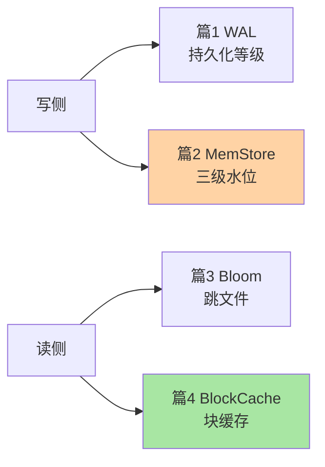

# 深入理解读写路径系列·导读

> **这个目录讲什么**：HBase 特性层 4 篇——把读写路径上的四个机制（WAL/MemStore/Bloom/BlockCache）逐个拆到「参数为什么是这个值、坏了什么现象、怎么调」的深度。

## 这个目录下有哪些文章

| 篇 | 主题 | 一句话重点问题 |
|---|---|---|
| 1 | [WAL 机制与持久化等级](1_WAL机制与持久化等级-深度.md) | 「Put 成功」到底承诺了什么？四档 Durability 怎么选 |
| 2 | [MemStore 与写路径调优](2_MemStore与写路径调优-深度.md) | 写不动怎么归因？三级水位与批量写的杠杆 |
| 3 | [Bloom Filter 与读加速](3_BloomFilter与读加速-深度.md) | get 的读放大怎么打折？ROW/ROWCOL 粒度怎么选 |
| 4 | [BlockCache 与读缓存体系](4_BlockCache与读缓存体系-深度.md) | 读毛刺的 GC 与命中率双变量怎么调？ |

## 我能得到什么

- 写延迟/读延迟的毛刺能按机制归因到具体环节与参数
- 四档持久化、三级水位、采样策略的取舍能讲出依据（不是背配置）
- 建表评审能对齐 Bloom 粒度、blocksize、预分区的配套决策
- 大堆实例的 GC 与缓存容量问题有明确的演进方向（BucketCache/offheap）

## 我想看哪一篇，去看哪一篇

- **按方向**：写侧看篇 1/2、读侧看篇 3/4
- **按问题**：「写阻塞」→ 篇 2 三级水位；「读毛刺」→ 篇 4 双线归因；「丢数据恐慌」→ 篇 1 档位语义
- **按阶段**：建表评审 → 篇 3（粒度是列族属性）；性能专项 → 篇 2/4；容灾建设 → 篇 1

## 📌 维护说明

新增文章时必须更新本导读的导航表与写侧/读侧结构图。
