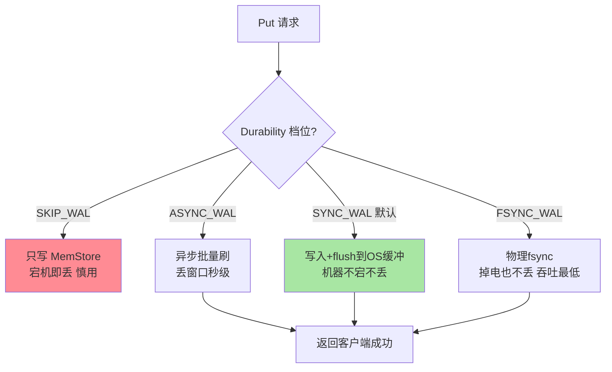
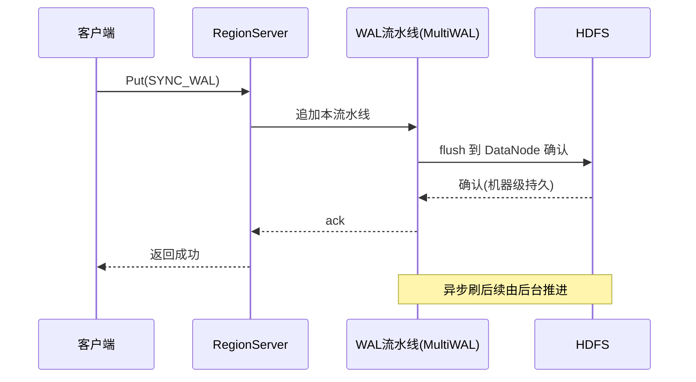

# WAL 机制与持久化等级：写确认背后的可靠性账单

> 「Put 返回成功」那一刻，你的数据在哪？答案在 WAL（Write-Ahead Log）里——它是 HBase 写路径的可靠性基石，也是「持久化等级选错了丢数据」这类事故的案发现场。这篇把 WAL 的结构、四档持久化语义、回放机制与吞吐代价一次讲清。

## 一句话摘要

WAL 是 RegionServer 级的**顺序追加日志**：每次写先落 WAL 再进 MemStore，「成功」的语义边界 = WAL 落盘（数据还不在 StoreFile）。持久化四级（Durability）：**SKIP_WAL**（不写，纯缓存语义）/ **ASYNC_WAL**（异步刷，丢窗口秒级）/ **SYNC_WAL**（刷到 OS 缓冲确认，默认）/ **FSYNC_WAL**（物理刷盘，最稳最慢）。2.0 起默认 **MultiWAL**（多流水线并行写，吞吐翻倍而可靠性不减）；宕机恢复靠 **LogSplitting**（ZK 派发任务、多机并行拆分回放）。

## 🎯 本文核心

**核心一句话：WAL 用「顺序追加 + 分级刷盘」为 LSM 的异步刷盘兜底——确认语义 = 所选 Durability 档位的落盘深度；MultiWAL 把单流水线的写瓶颈并行化；宕机恢复 = LogSplitting 把 WAL 按行键拆回各 Region 回放——「丢多少」不取决于 HBase，取决于你选的档位与底层存储的刷盘语义。**

机制链：写确认语义 → 四档 Durability 的落盘深度 → MultiWAL 并行化 → RollLog 滚动 → LogSplitting 回放 → 与 HDFS 刷盘语义的叠加。全文一句话可重构：「WAL 是承诺书，档位是承诺深度，回放是兑现方式」。

## 前置阅读

- 入门层篇 2《架构与读写路径》：WAL 在写路径中的位置
- 入门层篇 4《LSM 树与 Compaction》：MemStore 与 StoreFile 的生命周期

## 一、写确认语义：「成功」到底承诺了什么

四档的本质是「确认点往哪里放」：**SKIP_WAL** 完全放弃持久承诺（只适合可重建数据，如机器学习特征缓存、会话临时态——用错场景 = 宕机清零）；**ASYNC_WAL** 由后台线程周期性批量刷（默认约 1 秒窗口，公开文档口径），RegionServer 崩溃丢未刷部分；**SYNC_WAL**（表默认）写后同步刷到 HDFS 的 OS 缓冲并等待 DataNode 确认——机器级故障不丢，**掉电级别依赖 HDFS DataNode 的刷盘行为**（这就是为什么 HDFS 侧还有 dfs.datanode.sync 语义叠加）；**FSYNC_WAL** 强制物理落盘。取舍轴只有一条：**丢失窗口从秒级到零，吞吐代价从最小到最大**——与 Redis 持久化篇（入门层）的档位哲学完全同构，学一遍两界通吃。

## 二、MultiWAL：单流水线瓶颈的并行化

1.x 时代每个 RegionServer 只有一条 WAL 流水线——所有 Region 的写入串行过同一日志文件，**顺序写虽快，单文件的 HDFS 追加并发上限成了吞吐天花板**。2.0 起默认 MultiWAL（`hbase.wal.provider=multiwal`，默认 2 条）：Region 按规则分摊到多条独立流水线，各写各的文件——吞吐近乎线性提升而可靠性语义不变（每条流水线自身仍是完整 WAL）。代价清单：更多打开的 HDFS 文件句柄、恢复时多文件并行拆分——资源换吞吐的显式取舍。演进脉络清晰：单流水线（瓶颈）→ MultiWAL（默认双流水线）→ 可调条数，「按 RegionServer 堆规格与写入目标定流水线数」成为容量规划的参数之一。

## 三、RollLog 与 LogSplitting：滚动与兑现

**RollLog（日志滚动）**：单个 WAL 文件滚到阈值（默认约 1GB）或定时（默认 1 小时）即滚动新文件——旧文件里「已全部刷入 StoreFile」的部分可以归档删除（WAL 只需覆盖「未刷盘」的写入）。**LogSplitting（宕机回放）**：RegionServer 宕机后，其 WAL 里还压着「MemStore 未刷盘」的写入——恢复剧本：ZK 创建 split 任务 → 其他 RegionServer 认领并行拆分 → 按 RowKey 归属把记录拆成目标 Region 的「recovered.edits」文件 → Region 重新上线时回放。**拆分是并行的**（多台机器分担），但回放是串行的（每个 Region 顺序重放）——大 WAL 文件直接拉长恢复窗口，这就是「WAL 滚动阈值不宜过大」的恢复侧理由（写吞吐与恢复速度的取舍又见一次）。

> 💡 **实战提示**
> - 什么时候用 ASYNC_WAL：数据可重建（缓存/特征/会话态）且写入吞吐压顶——丢失窗口与吞吐的交换必须写进方案评审
> - 资金/状态类永远 SYNC_WAL 起步：FSYNC 只在「连 OS 缓冲丢失都不能容忍」时启用——先量化业务能容忍的丢失窗口再选档
> - MultiWAL 条数压测定：默认 2 条覆盖多数场景；写入目标冲到百万级 TPS 再按 benchmark 调
> - 恢复演练必须含「WAL 回放窗口」观测：kill RegionServer 计时——回放时长与 WAL 积压量的关系要用数字说话

## 业内惯例

> 💡 **实战提示**
> - 什么时候选 ASYNC_WAL：数据可从事实源重建且写入吞吐是硬指标的表（特征/缓存预热）——丢失窗口与吞吐的交换写进方案即可
> - 什么时候升 FSYNC_WAL：掉电级零丢失且事务量小（关键状态表）——大吞吐表开了就是灾难
> - 恢复演练怎么观测 WAL：kill RegionServer 计「检测+split+回放」三段时长，WAL 积压量与回放时长线性关系的实测数字就是恢复 SLA
> - 选型决策一页纸：按表的数据价值分档（可重建=ASYNC/状态=SYNC/资金=SYNC+HDFS刷盘对齐）——档位是按数据价值定价的

## 四、与 MySQL redo log 的机制对照

同为 WAL，两点关键差异：**①确认语义的粒度**——MySQL redo 与事务提交绑定（prepare/commit 两阶段），HBase WAL 与「单次写 API」绑定（Durability 档位决定深度），后者把持久化粒度交给了调用方；**②回放的目标**——MySQL 重放到数据页（恢复页状态），HBase 拆分回放到 MemStore（恢复未刷写入），所以 **HBase 的恢复时长与 WAL 积压强相关，MySQL 与 checkpoint 位置相关**——两套机制「日志先行」的哲学一致，兑现方式的差异源于存储结构（B+ 树页 vs LSM 分层）。跨系统架构视角：这也是「随机写优化的页式引擎」与「顺序写优化的追加引擎」在日志层的必然分叉。

## 五、典型场景

- **高吞吐日志/特征灌入**：ASYNC_WAL + 批量 Put——丢窗口可接受的写密集场景吞吐拉满
- **状态/余额类**：SYNC_WAL + 关注 HDFS 同步指标——默认档的正确用法
- **大 RegionServer 宕机演练**：观测 LogSplitting 时长与 WAL 积压的线性关系——恢复 SLA 的依据
- **跨机房容灾**：WAL 的 Replication（同步到备集群）与 Snapshot 异地导出构成容灾双保险

## 六、常见误区

- **「Put 返回成功 = 数据已在 HDFS 的 StoreFile」**：成功 = 达到所选档位的落盘深度——数据大概率还在 MemStore，宕机恢复靠 WAL 回放而非「读文件」
- **「FSYNC_WAL 万无一失所以全表开」**：每写一次物理 fsync 的吞吐代价极大（数量级级）——全表开 FSYNC 是用吞吐给「其实不需要的场景」买单
- **「SKIP_WAL 是性能开关」**：它删除的是持久承诺——用于「丢了也不心疼」的数据是特性，用于业务数据是事故
- **「WAL 文件可以手动清理」**：未回放的 WAL 删了 = 未刷盘数据永久丢失——WAL 生命周期由 HBase 管理，人工介入前先确认「已全部刷入」

## 七、你们可能会问

**Q1：SYNC_WAL 下掉电会不会丢？**
写已到达 HDFS DataNode 的内存并获确认——掉电时 DataNode 侧的刷盘行为（是否 fsync）决定边界。要消除这一层，除 FSYNC_WAL 外还需 HDFS 侧刷盘语义配合——「确认链的每一环都要对齐」是持久化语义的完整解法。

**Q2：MultiWAL 的条数越多越好吗？**
不是——每条流水线是独立的 HDFS 文件流，句柄、内存缓冲、恢复拆分成本都随条数线性涨；默认 2 条是吞吐与开销的平衡点，加条数前先压测确认单流水线真是瓶颈。

**Q3：LogSplitting 期间该 Region 的读写怎么办？**
不可用（Region 未上线）——这正是「RegionServer 宕机窗口」的主体构成；缩短窗口的两条路：控制 WAL 积压（及时 flush）+ 分布式拆分提速（篇 5 的 Region 迁移机制承接恢复后的再均衡）。

## 八、自测三问

1. 四档 Durability 各自的确认点在哪？丢失窗口怎么排？
2. MultiWAL 解决什么瓶颈？代价清单有哪些？
3. LogSplitting 的流程是什么？为什么「WAL 越大恢复越慢」？

## 开放问题

- 云 HBase 类产品把 WAL 下沉到共享存储层（免拆分直接按 Region 定位），LogSplitting 这个经典痛点可能被架构演进消解——自建与托管的能力分野值得持续跟踪
- 「持久化档位能否按表/按列族细粒度自动化」（按数据价值动态选档）在社区有讨论，当前仍是调用方显式指定

## 🎯 核心带走

- **核心一句话**：WAL = 顺序追加的承诺书，四档 Durability 定承诺深度（SKIP 丢弃/ASYNC 秒窗/SYNC 默认/FSYNC 物理落盘），MultiWAL 并行化吞吐，LogSplitting 兑现恢复——「丢多少」由档位与底层刷盘语义共同决定
- **机制链**：确认语义 → 四档对比 → MultiWAL → RollLog → 拆分回放 → HDFS 语义叠加
- **哪里会坏**：档位选错（业务数据用 ASYNC/SKIP）、全表 FSYNC 吞吐崩、手动清 WAL、恢复窗口超 SLA
- **边界**：本篇管 WAL 机制；MemStore 侧的写调优在篇 2，读侧加速在篇 3/4

## 📌 数据与事实声明

- 写于 2026-09-11；Durability 枚举、MultiWAL 默认行为、滚动阈值以 Apache HBase 官方文档与源码公开口径为准（2.0+ MultiWAL 默认开启）
- 「ASYNC 约 1 秒窗口」「FSYNC 数量级代价」为公开文档与业内经验口径，按版本与硬件实测
- 免责：参数与默认值随版本演进可能调整，以官方文档为准

## 📚 参考资料

| 类型 | 标题 | 来源 |
|---|---|---|
| 官方文档 | Apache HBase Reference Guide（WAL / Durability 章） | hbase.apache.org/book.html |
| 官方源码 | redis…hbase（hbase-server 的 wal 包、FSHLog） | github.com/apache/hbase |
| 系列关联 | 本仓库 Redis 入门层篇 9（持久化档位哲学对照） | docs/middleware/redis/ |
| 系列导航 | HBase 系列目录 | `docs/data/hbase/index.md` |
