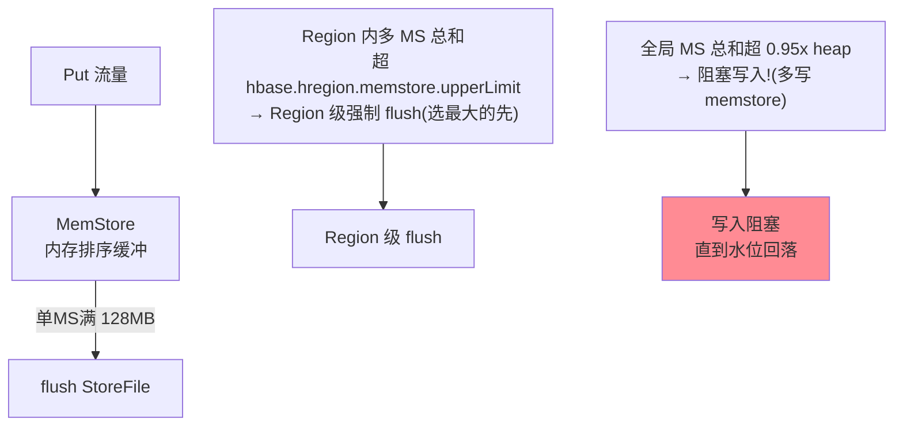
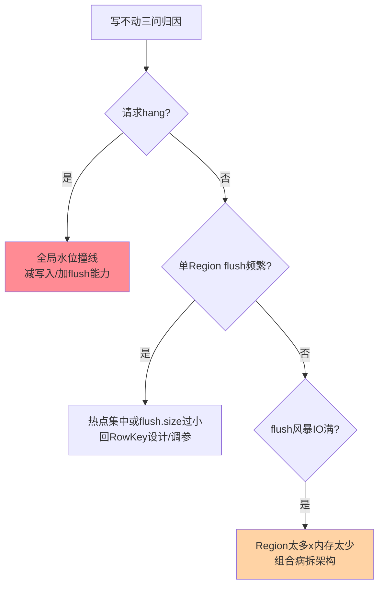

# MemStore 与写路径调优：从 Put 到 Flush 的吞吐工程

> 写入吞吐上不去、flush 风暴、全局写阻塞——HBase 写路径的三类高频故障，根源全在 MemStore 的配置与节奏。这篇把 MemStore 的内部结构、flush 的触发体系、批量写的调优杠杆一次讲全，让你能从「写不动」直接归因到具体参数。

## 一句话摘要

MemStore 是 Region 内每列族一个的**内存排序写缓冲**：写入按 RowKey 排好序攒着，攒满（默认 128MB）或按策略触发就 **flush 成一个 StoreFile**。写吞吐的三组杠杆：**flush 参数**（单 MemStore 大小 / Region 级阻塞线 / 全局阻塞线——三级水位决定「写多快会撞墙」）、**批量语义**（autoFlush 关闭 + Put 列表攒批，客户端侧合并网络往返与服务端 WAL）、**In-memory Compaction**（2.0+ 在 MemStore 内部先做预合并，减少 flush 出去的小文件）。

## 🎯 本文核心

**核心一句话：写吞吐工程 = 三级水位不撞墙（MemStore 128MB 刷盘线 → Region 级阻塞线 → 全局阻塞线）+ 批量化摊薄（客户端攒批降低 WAL 与 RPC 次数）+ 预合并降小文件（In-memory Compaction）——写不动时按「水位撞哪条线、flush 是否风暴、批次是否太小」三问归因。**

机制链：MemStore 内部结构 → 三级水位与阻塞语义 → flush 触发体系 → 批量写杠杆 → In-memory Compaction 演进 → 全局写阻塞事故的归因树。全文一句话可重构：「水位定节奏，批量定吞吐，预合并定文件数——写调优三板斧」。

## 前置阅读

- 入门层篇 2《架构与读写路径》：MemStore 在写路径的位置
- 特性层篇 1《WAL 机制与持久化等级》：WAL 与 MemStore 的配合

## 一、MemStore 内部：排好序的写缓冲

MemStore 不是「来一条存一条」的乱堆——它内部是**按 RowKey 排序的结构**（2.0 前 ConcurrentSkipListMap，2.0 后演进为 CellChunkMap 等分段结构，公开口径），写入时保持有序，flush 时**顺序输出成 StoreFile**（这就是「LSM 写是顺序写」的来源：排序在内存完成，落盘天然有序）。2.0 的 **In-memory Compaction** 是这个环节的演进：MemStore 内部先做「段内合并」（把接近 flush 的段预合并、清过期），flush 出去的文件更「干净」——**把部分 Compaction 工作提前到内存做**，减少下游小文件与读放大（底层编码篇的自适应哲学在内存层的延续）。

## 二、三级水位：写吞吐的撞墙地图

flush 触发体系是一张**三级水位图**，写调优的第一步是搞清「撞了哪条线」：

| 水位 | 配置 | 触发动作 | 阻塞? |
|---|---|---|---|
| 单 MemStore | `flush.size`（默认 128MB） | 该 MemStore flush 成一个 StoreFile | 不阻塞 |
| Region 级 | `upperLimit`（默认 0.95×单 Region 堆份额） | Region 内**挑最大的 MemStore** 强制 flush（连锁到水位回落） | 不阻塞但 flush 风暴 |
| 全局级 | `global upperLimit`（默认 0.95×RS 堆 ×MemStore 占比） | **RegionServer 全局阻塞写入**，直到多线 flush 把水位打下来 | **阻塞！写挂** |

「写不动」的归因三问由此而来：**① 客户端看延迟**——若是阻塞（请求 hang），大概率全局线撞了；**② 看单 Region 的 flush 频率**——单 MS 128MB 秒满说明写入热点集中（回 RowKey 设计）或 flush.size 过小；**③ 看 flush 风暴**——Region 级连锁 flush 打爆 IO，是「Region 太多 × 单 Region 内存太少」的组合病。每问对应一组参数与架构动作，这就是「按撞线归因」的完整打法。

## 三、批量写：客户端侧的第一杠杆

服务端调参之前，客户端的批量化常常是数量级收益：**关闭 autoFlush**（`Put` 攒在客户端缓冲，`flushCommits` 时一次提交——N 次往返合并为 1 次，服务端 WAL 也按批合并）+ **Put 列表批量提交**（`table.put(List<Put>)`，服务端按 Region 分组一次处理）。两笔账：**网络往返**从 N 次降到 1 次（与 Redis Pipeline 同构，入门层篇 13 的结论跨系统成立）；**WAL 追加**从 N 次降到一批（服务端同批写合并刷盘）。**边界**：批里混多个 Region 时服务端按 Region 拆分处理（路由分段），批越大跨 Region 越多——「单批大小 × Region 分布」决定真实收益，常见批 1000-10000 条起步压测。

> 💡 **实战提示**
> - 写吞吐压测的标准动作：固定行键分布，扫三组参数——autoFlush 开关 × 批大小 × flush.size——三曲线一出，瓶颈自现
> - 全局阻塞的紧急处置：临时调大全局上限换缓冲空间是缓兵之计，**根因几乎总是「flush 能力跟不上写入」**——要么减写入（限流/削峰）要么加 flush 能力（更多 RS/更快的 HDFS）
> - In-memory Compaction 开启前提：2.0+ 且堆内 MemStore——它用少量 CPU 换更少小文件，写吞吐敏感场景压测对比后再上
> - 监控三指标绑定写大盘：memstore 水位曲线、flush 队列深度、blocked 写入次数（`updatesBlockedTime` 类指标）——三级水位各有一条线

## 业内惯例

> 💡 **实战提示**
> - 批量参数怎么选：autoFlush 关 + 批 1000-10000 + flush.size 三者联动压测——单改一个常把瓶颈挤到相邻层级
> - 什么时候开 In-memory Compaction：读写双高（flush 出的文件被反复读）——纯导入场景收益小
> - 全局阻塞的治本路径：恢复水位（紧急）→ flush 能力扩容（中期）→ 写入画像治理（长期）——只做第一步下次还会撞线
> - offheap MemStore 的决策点：堆 32GB+ 且 GC 停顿与 MemStore 体量正相关——中小集群不必追

## 四、与「Redis 写缓冲」的机制对照

同为内存写缓冲，设计目标不同：Redis 的客户端缓冲是「**传输层攒批**」（省网络往返，数据到后端立即处理）；HBase 的 MemStore 是「**存储层蓄水**」（攒成有序文件落盘，flush 是存储结构的转换）。前者缓冲的是「在路上」，后者缓冲的是「在等待落盘时机」——理解这层差别，就明白为什么 MemStore 有一整套水位与阻塞语义而 Redis 客户端缓冲只有大小限制：**蓄水池的容量管理天然比传输管道复杂**。

## 五、典型场景

- **离线批量灌历史**（TB 级初始化）：autoFlush 关 + 大批 + 预分区 + 关自动 Split——四件套把灌入拉满
- **在线高并发写**（消息/计数）：autoFlush 保持 + 适度批（延迟敏感不能攒太大）+ 盯全局水位
- **写倾斜表**（少数行键极热）：先回 RowKey 设计（篇 3 盐化/打散），MemStore 参数救不了键倾斜
- **堆紧张集群**：offheap MemStore（2.0+ 堆外选项）——用堆外内存换 GC 压力，大堆实例的演进方向

## 六、常见误区

- **「flush.size 调大就一定快」**：单 MS 越大文件越大（好事），但 Region 级/全局线不变时反而更容易撞上级水位——三级是联动的，单调一个常把瓶颈挤到下一级
- **「阻塞写是故障」**：全局阻塞是**保护机制**（防 OOM），它触发说明容量或 flush 能力确实不足——处置是「恢复水位」而不是「关掉保护」
- **「批量越大越好」**：客户端缓冲内存、单批超时、失败重试成本都随批量涨——批大小压测定，不是无限大
- **「autoFlush 关了不影响读」**：未 flush 的数据读时要合并 MemStore（读路径多一层）——写优化的代价在读侧，读写画像要一起看

## 七、你们可能会问

**Q1：写阻塞时第一步看什么指标？**
全局 MemStore 水位与 flush 队列深度——水位打满且队列堆积 = flush 能力不足；水位不高但阻塞 = 看是否 HDFS 慢拖住 flush。两步分完，处置路径完全不同。

**Q2：In-memory Compaction 什么时候值得开？**
写多 + 读也多（flush 出的文件会被反复读）的场景收益明显——预合并减少了读放大；纯写完即弃（导入型）收益小。压测对比「开/关」的读 P99 与文件数曲线即可裁决。

**Q3：MemStore 溢写到堆外（offheap）值得吗？**
大堆 RegionServer（堆 32GB+）GC 停顿明显的场景值得——堆外 MemStore 绕开 GC 扫描，停顿显著下降；代价是堆外内存管理与版本要求（2.0+）。GC 问题不存在的中小集群不必追。

## 八、自测三问

1. 三级水位各自的配置与触发动作是什么？哪一级会阻塞写？
2. 批量写的两笔收益账怎么算？边界条件是什么？
3. In-memory Compaction 把什么工作提前了？换来了什么？

## 开放问题

- offheap 化（堆外 MemStore/BlockCache）的覆盖面持续扩大，「JVM GC 是否还是大堆 HBase 的主要矛盾」在版本演进中逐渐改写
- 存算分离形态下 flush 语义被存储层接管（MemStore 直写共享存储），水位体系可能被存储服务的容量语义替代

## 🎯 核心带走

- **核心一句话**：写吞吐工程 = 三级水位不撞墙 + 批量化摊薄 + 预合并降小文件——写不动按「撞哪条线、flush 是否风暴、批次是否太小」三问归因，全局阻塞是保护机制不是故障
- **机制链**：内部结构 → 三级水位 → flush 触发体系 → 批量杠杆 → In-memory Compaction
- **哪里会坏**：单调 flush.size 挤爆上级水位、无限批、全局阻塞当故障处理、autoFlush 一关了之
- **边界**：本篇管写侧；WAL 档位在篇 1，读侧加速（Bloom/BlockCache）在篇 3/4

## 📌 数据与事实声明

- 写于 2026-09-11；MemStore 结构、三级水位参数（128MB/0.95 系列默认值）、In-memory Compaction 以 Apache HBase 官方文档与源码公开口径为准（2.0+ 特性已标注）
- 「批 1000-10000 起步」「吞吐差距一个数量级」为业内经验量级，按负载压测
- 免责：参数名与默认值随版本演进可能调整，以官方文档为准

## 📚 参考资料

| 类型 | 标题 | 来源 |
|---|---|---|
| 官方文档 | Apache HBase Reference Guide（MemStore / Performance Tuning 章） | hbase.apache.org/book.html |
| 官方源码 | apache/hbase（hbase-server 的 memstore 包） | github.com/apache/hbase |
| 系列导航 | HBase 系列目录 | `docs/data/hbase/index.md` |
