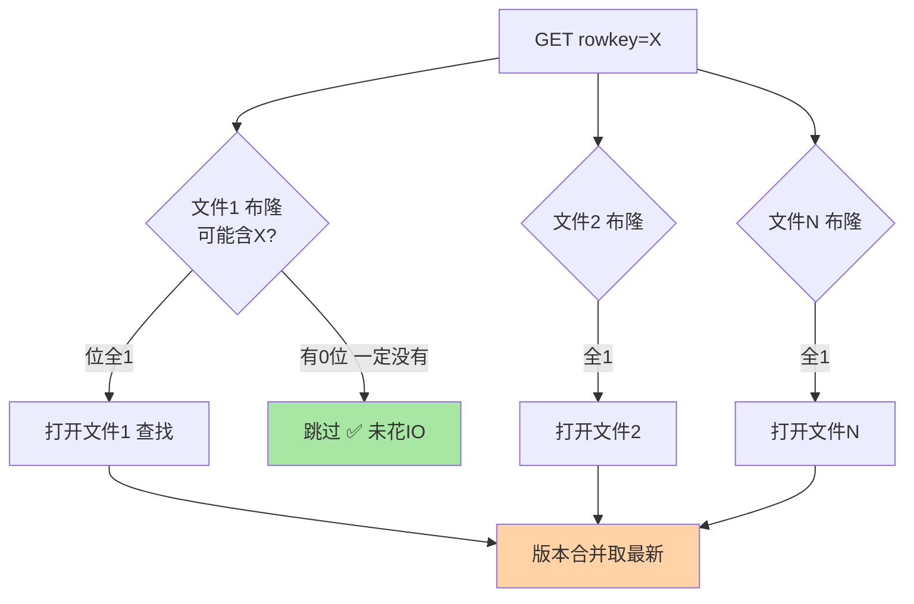
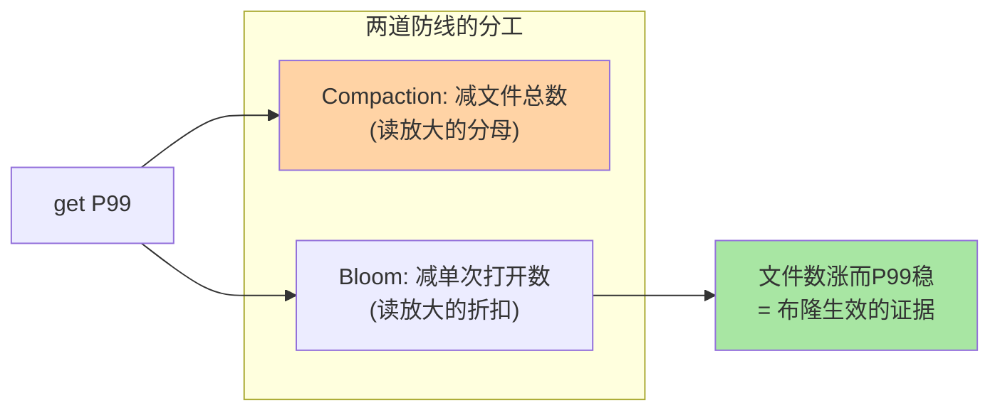

# Bloom Filter 与读加速：跳过「一定不存在」的文件

> 读一个 RowKey 要查 N 个 StoreFile——文件越多读越慢。Bloom Filter 是 HBase 读路径的「快速否决器」：让大多数文件在**不打开**的情况下被证明「一定没有这个键」。这篇讲透 HBase 布隆的两种粒度（ROW/ROWCOL）、误判与内存的定量账、以及「get 密集才开」的适用边界。

## 一句话摘要

HBase 的每个 StoreFile 可携带一个 **Bloom Filter 块**（建文件时生成，随数据块加载）：查询时先问布隆——**任一位为 0 = 该文件一定不含此 RowKey，直接跳过**；全 1 才真正打开文件查。两种粒度：**ROW**（按 RowKey 判定，服务 get）与 **ROWCOL**（按 RowKey+列判定，get 单列时更精准——可跳过「行在但该列不在」的文件）。原理与 Redis 布隆同源（位数组 + k 哈希），工程差异在**粒度选择与存储位置**（bloom 数据驻内存，按文件常驻）——get 密集的表开 ROW 几乎免费赚读放大缓解，scan 密集的表收益趋零。

## 🎯 本文核心

**核心一句话：Bloom Filter 把「读放大」从「查所有文件」降为「查布隆放行的少数文件」——「一定不存在」的确定语义让跳过是安全的；ROW vs ROWCOL 的粒度选择 = get 模式（整行 vs 单列）的定价；它的内存驻留成本与对 scan 零收益是两个使用边界。**

机制链：读放大的文件遍历问题 → 布隆的快速否决 → ROW/ROWCOL 粒度 → 误判与内存账 → 建表配置与适用边界。全文一句话可重构：「get 的救星，scan 的路人——布隆按文件粒度买读放大折扣」。

## 前置阅读

- 入门层篇 4《LSM 树与 Compaction》：读放大与 StoreFile 的关系
- 本系列篇 2《MemStore 与写路径调优》：flush 出的文件如何累积

## 一、读放大的问题与布隆的位置

无布隆时，`get` 要对 Store 目录**所有 StoreFile** 做定位查找（文件多时是「每个都开」的真 IO）；有布隆时，每个文件先用常驻内存的布隆块做一次 O(k) 判定——**「有 0 位 = 一定不在」的确定语义**让大多数文件零 IO 跳过。文件数越多、命中率差异越大：20 个文件的 Store，布隆常把实际打开数压到 1-2 个——**读放大的折扣直接体现在 get 的 P99 上**（Compaction 减文件与布隆减打开是同一问题的两道防线，互不替代：Compaction 减文件总数，布隆减单次打开数）。

## 二、两种粒度：ROW 与 ROWCOL

| 粒度 | 判定单位 | 服务的查询 | 内存开销 | 适用 |
|---|---|---|---|---|
| **ROW** | RowKey | `get` 整行 | 低 | 行级 get 为主 |
| **ROWCOL** | RowKey+列限定符 | `get` 指定列 | 高（每列都要判定） | 行宽大 + 常按单列取 |
| NONE | 不建 | — | 零 | scan 为主 |

ROWCOL 的价值场景：**宽表 + 单列 get**——「这一行的 profile 列在不在文件 3」用 ROW 粒度只能说「行可能在」，ROWCOL 能精确到「这行的这一列不在」（跳过该文件里这行的其他列数据块）。代价是布隆条目数从「每行一个」变「每行×每列」，内存与构建开销按列数放大。**选型口诀：get 整行选 ROW、宽表单列选 ROWCOL、scan 为主选 NONE**——三句话覆盖九成决策。

> 💡 **实战提示**
> - 建表即定，事后补要重写文件：Bloom 粒度是**列族属性**（`BLOOMFILTER => 'ROW'`），改粒度需要 Major Compaction 重写全部文件——设计期定，别指望在线改
> - get P99 与文件数联动监控：布隆开了 P99 仍随文件数涨 = 误判率偏高或 scan 混入——分层归因再动手
> - 布隆内存常驻要算账：每个 StoreFile 的布隆块驻 RegionServer 内存（堆内）——海量小文件 + ROWCOL 的组合会吃掉可观堆内存，与 BlockCache 抢资源
> - 误判不用调优：HBase 布隆的误判率由实现内定（约几百分点量级），误判的代价只是「多打开一个文件」——它与 Redis 布隆「防穿透」的用法不同，这里误判无害

## 三、与「Redis 布隆过滤器」的用法区别

同为布隆，**架构位置与误判语义完全不同**：Redis 布隆是「独立防线」（挡穿透，误判 = 放行一次无效查询，无害）；HBase 布隆是「文件索引的优化器」（减打开，误判 = 多读一个文件，无害）。前者误判影响**外部行为**（放过/拦住请求），后者只影响**内部性能**（打开几个文件）——同构的数据结构、完全不同的工程角色。跨系统架构视角：布隆的「确定不存在」语义在哪层部署，就解决哪层的「无效遍历」——学会原理，每个存储里都能认出它的变体。

## 源码与实现关键路径

以 8.0 主线口径：布隆按 StoreFile 组织——`BloomFilterWriter` 在文件写出时构建布隆块、`CompoundBloomFilter` 承载查询判定（ROW/ROWCOL 两个模式分支）；读取路径上 `StoreFileScanner` 在打开文件前先问布隆，命中判定才初始化文件扫描器。阅读建议：带一条 `get` 走「布隆判定 → 文件打开 → 键定位」三步，观察哪些文件被拦在扫描器初始化之前——布隆的全部价值就在被跳过的那些 IO 上。

## 业内惯例

> 💡 **实战提示**
> - 什么时候用 ROW：get 密集列族建表即配——内存小块、收益立现，近乎无脑项
> - 什么时候升 ROWCOL：行宽大（百列）+ 按单列取——条目数按列数放大，压测内存增量后再定
> - 什么时候选 NONE：scan/范围扫为主的列族（时序/消息流）——布隆对 scan 零收益，开了纯占内存
> - 生效验证联动监控：文件数上涨而 get P99 稳 = 布隆在干活；两者同涨 = 误判偏高或 scan 混入，分层归因

- **布隆内存常驻进巡检**：海量小文件 + ROWCOL 的组合会吃掉可观堆内存，与 BlockCache 抢资源——内存账要一起算

## 四、典型场景

- **点查密集表**（用户画像/详情查询）：`BLOOMFILTER => 'ROW'` 建表标配——get 是主负载时收益立现
- **宽表单列读**（特征平台取单标签）：ROWCOL 粒度——行宽大时精准跳过
- **时序/日志表**（范围扫为主）：NONE 即可——scan 不经过布隆判定，开了白占内存
- **文件数临时高的过渡期**：Compaction 追不上时布隆兜住 get 延迟——给「文件治理」争取时间

## 五、什么时候开什么粒度：决策速查

- **什么时候开 ROW**：get 为主的列族，建表即配——无脑收益，成本仅内存小块
- **什么时候升 ROWCOL**：行宽大（百列级）且查询按单列取——用内存换更精准的跳过，压测内存增量后定
- **什么时候 NONE**：scan/范围扫为主的列族（时序、消息流）——开了零收益纯成本
- **怎么验证生效**：监控布隆的「负命中」（跳过文件数）与 get P99 的联动——布隆生效时文件数涨而 P99 稳

## 六、常见误区

- **「布隆能加速 scan」**：scan 是范围遍历，不经过布隆的「单键判定」——scan 密集表开布隆是纯内存浪费
- **「ROWCOL 一定比 ROW 好（更精确）」**：精确的代价是条目数按列数放大——行窄的表 ROWCOL 内存翻数倍而收益趋零
- **「误判会导致数据错」**：误判只多打开一个文件（最终查无此键返回空）——正确性零风险，它只是性能优化器
- **「在线改粒度立即生效」**：粒度变了但旧文件还是旧布隆——要 Major 重写后全量生效（设计期定的理由）

## 七、你们可能会问

**Q1：布隆数据存在哪、会丢吗？**
StoreFile 的元数据块随文件存 HDFS，打开文件时加载进 RegionServer 内存常驻——文件在布隆在，无丢失语义；内存紧张时它不参与淘汰（常驻），这是内存账必须算的原因。

**Q2：为什么 HBase 不默认全开 ROW？**
历史与内存考量：海量表的文件 × 布隆常驻内存是可观开销，scan 型工作负载（HBase 的传统重仓）无收益——「默认最小、按需开启」与 HBase 一贯的保守配置哲学一致；get 密集的新业务建议主动开。

**Q3：布隆和二级索引（如 Phoenix 全局索引）什么关系？**
互补不同层：布隆是「文件级的快速否决」（减 IO，不提供新查询能力）；二级索引是「新查询维度的实现」（让非 RowKey 条件可查）——前者优化已有路径，后者开辟新路径，架构里常同时存在。

## 八、自测三问

1. 布隆在读路径的哪个环节起作用？「确定不存在」为什么让跳过是安全的？
2. ROW 与 ROWCOL 的判定单位与代价差异是什么？选型口诀是什么？
3. 为什么说「误判无害」？它与 Redis 布隆的误判语义差在哪？

## 开放问题

- 更省内存的过滤器变体（Xor/Binary Fuse Filter 族）在社区被讨论用于替换经典布隆——同等误判率内存减半的演进方向
- 「布隆常驻内存」在 offheap 化浪潮下的归属（堆外驻留）是版本演进的具体工程议题

## 🎯 核心带走

- **核心一句话**：HBase 布隆 = StoreFile 级的快速否决器——「一定不存在」让 get 跳过大多数文件；ROW/ROWCOL 按 get 模式定价，scan 为主选 NONE；误判无害，内存是唯一账单
- **机制链**：读放大问题 → 快速否决 → 粒度选择 → 内存与误判账 → 建表配置
- **哪里会坏**：scan 表白开、ROWCOL 内存失控、在线改粒度错觉、海量小文件布隆吃堆
- **边界**：本篇管 get 加速；另一道防线 Compaction（减文件总数）在入门层篇 4，读缓存在篇 4（BlockCache）

## 📌 数据与事实声明

- 写于 2026-09-11；Bloom 粒度（ROW/ROWCOL）与列族属性配置以 Apache HBase 官方文档口径为准；误判率量级为实现内定口径（公开文档未承诺具体值）
- 「20 文件压到 1-2 个」为机制推算示例，实际随键分布浮动
- 免责：粒度选项与内存行为随版本演进可能调整，以官方文档为准

## 📚 参考资料

| 类型 | 标题 | 来源 |
|---|---|---|
| 官方文档 | Apache HBase Reference Guide（Bloom Filters 章） | hbase.apache.org/book.html |
| 关联系列 | 本仓库 Redis 入门层篇 7（布隆原理底座） | docs/middleware/redis/ |
| 系列导航 | HBase 系列目录 | `docs/data/hbase/index.md` |
