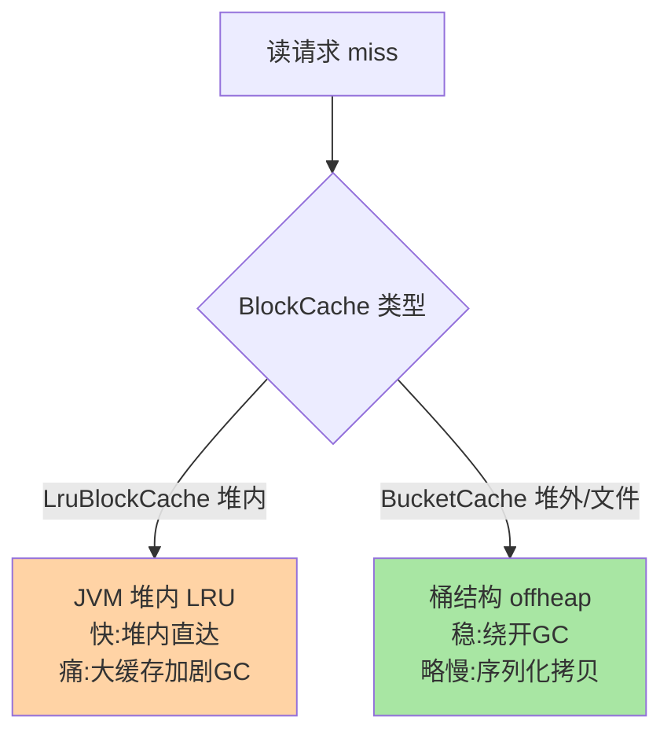
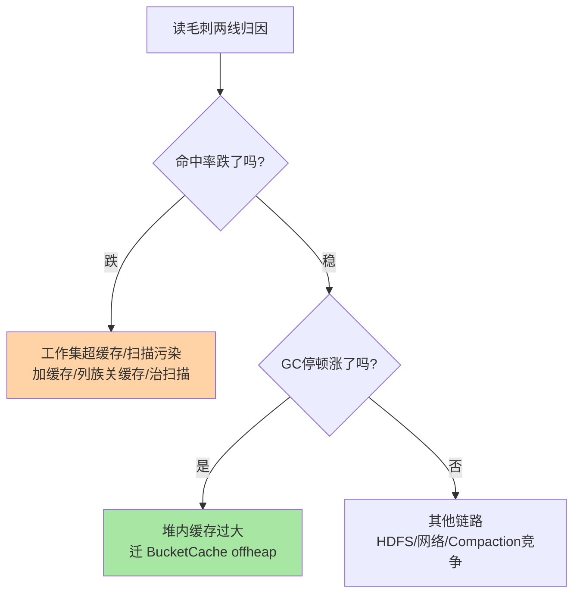

# BlockCache 与读缓存体系：HBase 读延迟的调节台

> 读请求的三层合并里（篇 2），BlockCache 是第一层也是命中率的调节台——热点数据块的驻留策略直接决定读 P99 的稳定性。这篇讲透两代缓存（LruBlockCache→BucketCache）的机制、堆内/堆外的取舍、缓存块的生命周期与调参矩阵。

## 一句话摘要

BlockCache 缓存的是 **HDFS 数据块（默认 64KB 的 block）**而非整行：读路径先查缓存，未命中才穿透到 HDFS。两代实现：**LruBlockCache**（堆内 LRU——快但大缓存加剧 GC，配三段分级：hot/ient/-tiny 的访问频率分区）与 **BucketCache**（2.0 起默认方向——堆外内存/文件桶，按块大小分级存放，**绕开 GC**，大缓存的正解）；生产主流是**组合模式**：小堆内 L1（热索引与元数据）+ 大 BucketCache L2（数据块），`combinedcache` 联动工作。读延迟的稳定性 = 命中率（容量与工作集匹配）× GC 停顿（堆内缓存的隐患）——两代实现的演进就是围绕这两点的取舍。

## 🎯 本文核心

**核心一句话：BlockCache 缓存 64KB 数据块、读路径第一站——LruBlockCache（堆内 LRU，快但 GC 压力大）演进到 BucketCache（堆外/文件桶，按块大小分桶驻留，绕 GC，大缓存正解），生产主流是 L1+L2 组合；读延迟稳定性的两个变量是命中率（工作集 ≤ 缓存）与 GC 停顿（堆内缓存的代价）。**

机制链：缓存块与读路径位置 → LRU 三段分级 → BucketCache 分桶 → L1+L2 组合模式 → 命中率与 GC 双变量调参。全文一句话可重构：「缓存的是块不是行，堆内快而抖、堆外稳而略慢——容量与 GC 的取舍决定架构」。

## 前置阅读

- 入门层篇 2《架构与读写路径》：BlockCache 在读三层合并的位置
- 本目录篇 1/2：写侧机制（本篇转入读侧）

## 一、缓存的是块：粒度决定一切行为

BlockCache 的缓存单位是 **HDFS 数据块粒度的 block**（列族可配 `blocksize`，默认 64KB）——不是「一行」也不是「一个 StoreFile」：一次 get 命中会把这个键所在的**整个 block** 载入缓存，相邻的行随之受益（**局部性红利**：RowKey 相邻的数据在同一 block 里）。这带来两个推论：**① blocksize 是缓存粒度与读放大的旋钮**——调小（如 8KB）随机读更精准（载入冗余少）但索引元数据占比升，调大适合顺序扫描；**② RowKey 设计影响缓存效率**（篇 3 的聚簇原则）——局部性好的键分布让「一次 block 载入服务多次查询」，局部性差（随机键）则每次都 miss 新 block。**缓存的效率一半在配置、一半在键设计**——这是 BlockCache 调优最容易被忽略的另一半。

## 二、两代实现：LruBlockCache 与 BucketCache

**LruBlockCache（一代，堆内）**：标准 LRU 队列 + 三段分级（按访问频率分 **single/multi/hot** 三区——首次访问进 single 区，再次访问晋升 multi，极热区 hot——防止「一次全表扫描冲掉全部热点」，与 MySQL Buffer Pool 的新旧子链同思想）。痛点：缓存越大堆内驻留越多，**GC 扫描与停顿随缓存体量恶化**——大堆实例（几十 GB 缓存）的读毛刺常源于此。**BucketCache（二代，堆外/文件）**：内存切成**按块大小的桶**（不同 bucket 容纳不同 block 尺寸），缓存数据驻堆外内存或 SSD 文件——**彻底绕开 JVM GC**，命中率与容量不再受堆约束；代价是访问多一次序列化/拷贝（堆外读写），单次略慢。取舍一句话：**堆内快而抖，堆外稳而略慢——缓存上 GB 后稳压倒快**。

## 三、生产主流：L1 + L2 组合模式

BucketCache 不是「替代」而是「分层组合」：`hbase.bucketcache.ioengine=offheap` + 组合开关后，**堆内小块 L1（默认占 10%）缓存热点元数据与索引块（快、可接受的小体积），堆外 L2（占大头）缓存数据块**——读路径先查 L1、miss 落 L2、再 miss 穿透 HDFS。这套「小而快的 L1 + 大而稳的 L2」与 CPU 的多级缓存设计同构：**贵的用小的（堆内贵在 GC）、便宜的用大的（堆外/文件）**。容量规划的口径随之变化：缓存总容量可以远超 JVM 堆（offheap 不占堆），「大缓存实例」的堆反而不用设太大——堆小缓存大，是 BucketCache 时代的健康形态。

> 💡 **实战提示**
> - 读毛刺排查先分两条线：命中率下跌（工作集超缓存/被扫描污染）与 GC 停顿（堆内缓存过大）——两条线的处置完全不同，第一条加缓存或治扫描，第二条换 BucketCache
> - 什么时候必须 BucketCache：缓存需求 > 数 GB 或堆 GC 停顿与缓存体量正相关——大缓存实例的默认演进方向
> - 缓存命中率不是越高越好管理：命中率稳但 P99 抖 = 查 GC；命中率波动大 = 看工作集变化与扫描流量——双指标联动归因
> - 预热不可省：重启后缓存全空读延迟飙升——`hbase.rs.cacheblocksonwrite`/预热脚本把热块提前载入（与 MySQL Buffer Pool 预热同纪律）

## 四、与「Redis/MySQL 缓存」的对照

三套缓存的粒度与治理画像：**Redis** 整个库就是缓存（key 级、易失语义、淘汰策略治容量）；**MySQL Buffer Pool** 页级缓存（LSN/checkpoint 体系绑定，堆内-JVM 之外的 C++ 无 GC 之扰）；**HBase BlockCache** 块级缓存（读路径的第一站，分堆内堆外双轨）。共同哲学：**缓存工作集必须 ≤ 缓存容量，否则命中率必跌**；差异在治理重心——Redis 治「淘汰策略与内存水位」，MySQL 治「命中率与 checkpoint 联动」，HBase 治「命中率与 GC 双变量」。缓存三课学完，第四个引擎的缓存体系只是换名字。

## 业内惯例

> 💡 **实战提示**
> - 什么时候用 BucketCache：缓存需求上 GB 或 GC 停顿与缓存体量正相关——大缓存实例的默认演进方向，不必等故障发生
> - 点查表怎么配 blocksize：小 blocksize（如 8-16KB）+ Bloom 组合——载入冗余少且跳文件准
> - scan 重列族关缓存：列族级 `BLOCKCACHE => false`——扫描污染的精准防御，别让离线任务冲掉在线热点
> - 重启预热进 SOP：缓存全空的冷启动读延迟飙升——预热脚本把热块提前载入再接流量

## 五、典型场景

- **读密集在线查询**（画像/详情）：BucketCache offheap + 合理 blocksize——命中率与 GC 双稳
- **scan 重负载**（离线导出与在线混部）：blocksize 调大 + 缓存开关按列族关闭（scan 不值得缓存）——防扫描污染（`BLOCKCACHE => false` 列族级可配）
- **大堆大缓存实例**：堆 16-32GB + offheap 缓存几十 GB——BucketCache 时代的典型形态
- **混合读写**：L1 保元数据热点 + L2 保数据块 + MemStore 占比协调——读写画像决定堆内三分

## 六、常见误区

- **「缓存命中率 99% 就万事大吉」**：命中率只管「平均」，**GC 停顿打的是 P99**——堆内大缓存的实例命中率漂亮但毛刺不断，单看命中率会误判健康
- **「blocksize 默认 64KB 通用」**：随机点查密集时 64KB 的块载入大量冗余行（一行 100B 的键值表尤其浪费）——小 blocksize + Bloom 是点查表的经典组合
- **「缓存调大必然降延迟」**：工作集小于缓存后再调大无收益——先量「热数据集」大小（命中率曲线的拐点）再定容量
- **「所有列族都该缓存」**：scan 重的列族开缓存 = 扫描污染缓存冲掉真热点——列族级 `BLOCKCACHE => false` 是精细治理工具

## 七、你们可能会问

**Q1：BucketCache 的 offheap 和 file 模式怎么选？**
offheap（堆外内存）延迟更低适合内存充裕；file（SSD 文件）容量大成本低适合「缓存需求超内存」——内存预算与缓存需求的账各算各的，组合（小 offheap + 大 file）也支持。

**Q2：怎么量「热数据集」到底多大？**
命中率-容量曲线法：缓存从大到小逐级缩减（或观测历史），命中率开始下跌的容量点 = 当前工作集——热数据集不是算出来的，是压出来的。

**Q3：缓存的 block 与 HDFS 的 block 是一回事吗？**
不是——HBase 的 block（64KB，列族可调）是缓存与文件内的**逻辑读单元**；HDFS block（128/256MB）是文件系统的**物理副本单元**。一个 HDFS block 内含成千上万个 HBase block——两层「block」同名不同物，排查时先分清说的是哪层。

## 八、自测三问

1. BlockCache 缓存的单位是什么？局部性红利怎么影响缓存效率？
2. LruBlockCache 与 BucketCache 的核心取舍是什么？组合模式怎么分工？
3. 读毛刺的两条归因线是什么？各怎么处置？

## 开放问题

- offheap 化的终局讨论：MemStore 与 BlockCache 全堆外后，「JVM 堆」退守为元数据层，GC 停顿这个 HBase 经典毛刺源可能被结构性终结
- 缓存的自适应分层（按访问模式自动在 L1/L2/淘汰间移动）是 BucketCache 的演进方向，人工调参的空间在缩小

## 🎯 核心带走

- **核心一句话**：BlockCache = 64KB 数据块的读缓存第一站——LruBlockCache 堆内快而抖、BucketCache 堆外稳而略慢，L1+L2 组合是生产主流；读延迟稳定 = 命中率（工作集≤缓存）× GC 双达标
- **机制链**：块粒度与局部性 → LRU 三段分级 → BucketCache 分桶 → 组合模式 → 双变量调参
- **哪里会坏**：堆内大缓存 GC 毛刺、扫描污染、blocksize 与访问模式错配、重启不预热
- **边界**：本篇管读缓存；布隆（减打开）在篇 3、写侧（WAL/MemStore）在篇 1/2——读写四篇合成完整读写路径系列

## 📌 数据与事实声明

- 写于 2026-09-11；LruBlockCache 三段分级、BucketCache 模式与组合开关以 Apache HBase 官方文档与源码公开口径为准（BucketCache 为 2.0+ 默认推荐方向）
- 「64KB 默认 blocksize」「L1 占比 10%」为版本默认配置口径
- 免责：缓存行为与参数随版本演进可能调整，以官方文档为准

## 📚 参考资料

| 类型 | 标题 | 来源 |
|---|---|---|
| 官方文档 | Apache HBase Reference Guide（BlockCache 章） | hbase.apache.org/book.html |
| 官方文档 | offheap caching（BucketCache 配置） | hbase.apache.org/book.html |
| 系列导航 | HBase 系列目录 | `docs/data/hbase/index.md` |
