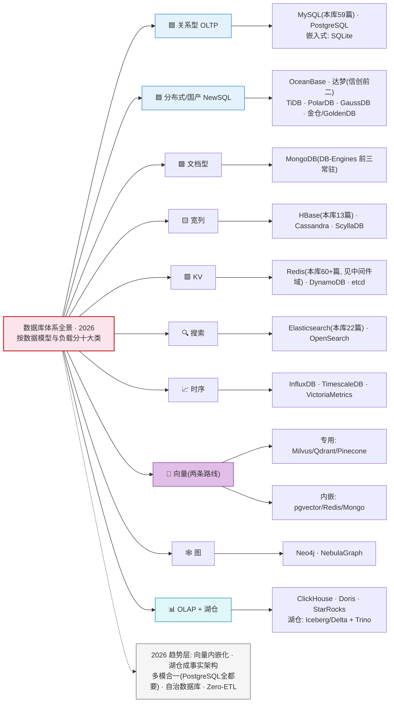
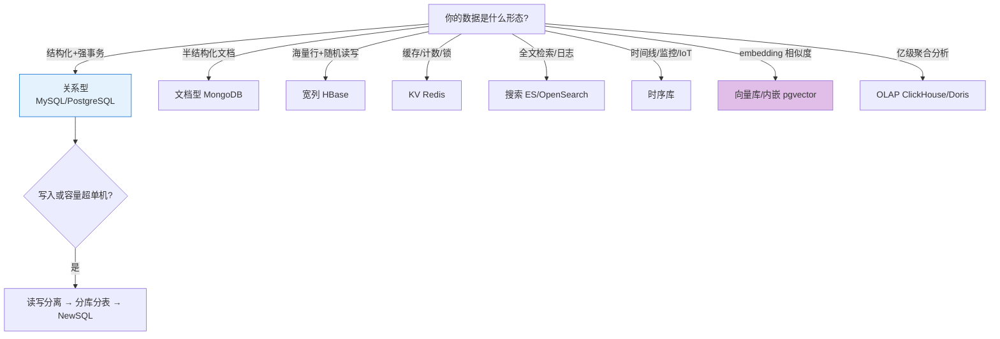

# ▥ 数据存储

> MySQL、PostgreSQL、MongoDB、Elasticsearch 等数据存储与检索。

## 一句话摘要

数据域覆盖关系型（MySQL/PostgreSQL）、文档（MongoDB）、宽列（HBase）、搜索（ES）、分析（ClickHouse）与向量库——本页全景图给版图，各系列给原理与实战。

## 5W 速记卡

| 维度 | 一句话 |
|---|---|
| What | 数据库体系十大类的学习与选型入口 |
| Why | 数据形态决定存储选型——选错库的代价在架构级 |
| When | 新项目选型 / 存量扩容 / 遇到瓶颈时查图定位 |
| Where | 全景图 → 各库系列 → 专题层选型深度 |
| How | 按数据形态定大类 → 按硬诉求收窄 → 看本库积累决定学习深度 |

## 🎯 本文核心

**组织主线**：数据域 = 十大类数据库 × 每类「本质特征 → 代表产品 → 本库积累」——全景图给版图与取舍，各系列给原理与实战。数据形态决定选型大类，硬诉求（一致性/扩展性/运维能力）决定类内产品，本页是这条决策链的起点。

## 🗺 数据库体系全景图（2026 · 十大类）

> 一张图看清数据库版图：每类标注代表产品与本库已有积累；选型口诀收尾。深入讲解见《从零认识数据库体系系列》（成文中）。

**怎么用这张图**：先按数据形态定大类（结构化强事务→关系型；海量宽行→宽列；时间线→时序；embedding→向量）；再按三条硬诉求收窄（一致性/扩展性/团队运维能力）；最后看「本库已有积累」列——同域系列互指，学一个库时顺带看它与邻库的边界。数据截至 2026-09（检索核验：PostgreSQL 登顶挑战 / 向量两条路线 / 湖仓事实架构）。

**一句话摘要**：这张全景图把数据库版图按「数据模型 + 工作负载」分成十大类，每类给出代表产品、本库积累与选型第一问——它随 2026-09 时效核验更新，替代旧的「只有 MySQL/ES/HBase 三家」的窄版图。

**架构取舍的跨期视角**：数据库版图的演变方向是「合」——向量内嵌进通用库、湖仓统一分析栈、PostgreSQL 什么都要管；但每一次「合」都以运维复杂度或性能特异性为代价，「分」与「合」的轮回是数据库五十年的主旋律。选型时记住：今天的专用库可能就是明天的内嵌特性，押注标准化接口（SQL/pgvector 协议）比押注单一产品更抗周期。

## 📌 数据与事实声明

- 数据截至 2026-09（时效核验：PostgreSQL 登顶挑战 / 向量两条路线 / 湖仓事实架构，检索来源见 trend-radar/2026-09）
- 本库积累篇数为 gate 统计口径，随批次更新
- 免责：产品能力随版本演进，选型前以官方文档为准

## 📚 参考资料

| 类型 | 标题 | 来源 |
|---|---|---|
| 站内 | 数据库体系总论系列（成文中） | `data/整合层/从零认识数据库体系系列/` |
| 站内 | 各库系列入口 | 本页 TocOverview |
| 趋势 | DB-Engines / 中国数据库流行度榜（2026） | 公开口径 |

## 深入原理的入口

看懂「是什么」之后，按这个路径深入「为什么」——每个库的架构图、每个方案的底层支撑，在各系列「特性层/专题层」展开（图解优先：原理一律先图后字）。

看懂「是什么」之后，按这个路径深入「为什么」——每个库的架构图、每个方案的底层支撑，在各系列「特性层/专题层」展开（图解优先：原理一律先图后字）。

## 自测三问

1. 十大类里，你当前项目用了哪几类？边界清晰吗？
2. 什么信号告诉你该换库/加库了？（容量/延迟/一致性/团队运维能力）
3. 「分与合的轮回」指什么？对你选型有什么约束？

<TocOverview filter="data" />## Trade-off：图上每一类都是一种取舍

## Trade-off：图上每一类都是一种取舍

关系型买的是一致性与生态，付出的是扩展天花板；宽列/文档买的是水平扩展与灵活 Schema，付出的是跨行事务与 JOIN；时序买的是写入吞吐与降采样，付出的是通用查询能力；向量买的是相似度检索，付出的是存储与索引成本。**没有全胜的类，只有错位的需求**——全景图的价值就是把这些取舍摊在同一张桌面上。

