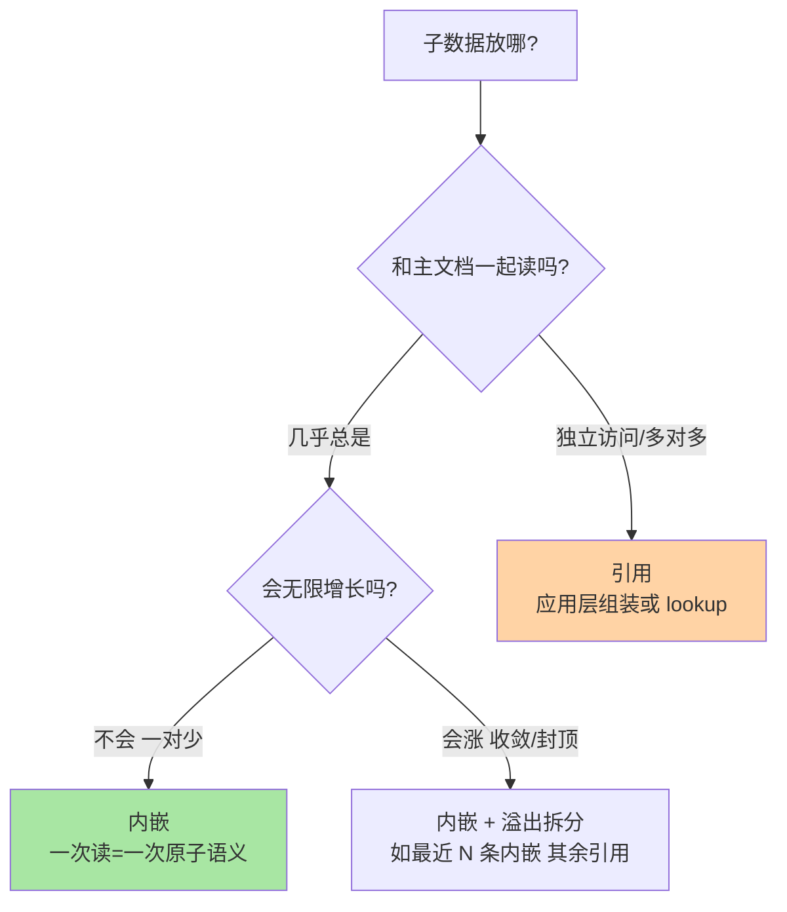

# MongoDB 是什么与文档模型：BSON、内嵌与引用的建模思维

> 一句话：MongoDB 用 BSON 文档（可嵌套、可含数组）替代「行」，用集合替代「表」，schema 由应用定义而非数据库强制——建模思维的核心问题从「怎么规范化拆表」变成「这个数据以什么形态被读写」（内嵌还是引用）。

## 🎯 本文核心

**核心一句话：文档模型的本质是「按访问形态建模」——把一个业务实体（含它的子对象与历史记录）内嵌成一个文档，一次读拿到一次事务语义；与关系型的「按关系规范化建模」相对，两者不是先进与落后之分，而是「读聚合体」与「写一致」两种约束下的各自最优。MongoDB 常年霸榜文档型数据库（公开口径），根源是这条建模思维匹配了互联网业务「实体聚合、快速演进」的主流形态。**

组织主线（一张图看懂本系列四篇）：


本篇回答「文档模型解决什么」：先讲 BSON 的机制与类型，再拆「内嵌 vs 引用」这对建模决策，最后解释它为什么能长期稳居流行度榜单前列（公开口径）。

## 一句话摘要

MongoDB 是文档型数据库：数据单位是 BSON（Binary JSON）文档——在 JSON 之上扩展了 ObjectId、Date、Decimal128、嵌套文档、数组等类型，存储与网络传输都走二进制；文档聚在集合（collection）里，集合不强制统一 schema（同一集合里的文档可以有不同字段），结构演进由应用层掌控。建模的核心决策是**内嵌 vs 引用**：一对少（订单-订单项）、一对多但随主文档一起读（用户-地址）、内容随生命周期收敛（文章-评论的前 N 条）优先内嵌——一次读就是原子的；多对多、无限增长的子集、需要独立访问的实体用引用——用应用层两次查询或 `$lookup` 拼装。机制上有两条硬边界要记：**单个文档上限 16MB**；**单文档操作天然原子**（跨文档事务到 4.0 才有且有代价，第 4 篇详讲）——这两条边界直接塑造了建模惯例。流行度上，MongoDB 长期稳居 DB-Engines 总榜前五、文档型数据库第一（公开口径，数据截至 2026-09）。

## 5W 速记卡

| 维度 | 一句话 |
|---|---|
| What | BSON 文档 + 集合 + 灵活 schema 的文档型数据库 |
| Why | 实体聚合体一次读、字段演进不停机——匹配快速迭代的业务形态 |
| When | 商品/用户画像/内容管理类聚合体场景；强关系约束场景慎选 |
| Where | 库（database）→ 集合（collection）→ 文档（document）三层 |
| How | 建模三问：一起读吗？会无限涨吗？要独立查吗？——答完内嵌/引用自定 |

## 一、BSON 文档：比 JSON 多了什么

BSON 不是「JSON 换个存法」，四要素具体值：

1. **类型系统**：在 JSON 的 string/number/bool/null 之上加了 ObjectId（12 字节：4 字节秒级时间戳 + 5 字节随机值 + 3 字节递增计数器，天然趋势递增）、Date（64 位毫秒）、Decimal128（精确定点数，金额场景用这个而不是 double——业内共识）、32/64 位整数、嵌套文档与数组。
2. **遍历结构**：二进制带长度前缀，可跳过不需要的字段定位——服务端扫描与网络序列化都比纯文本解析便宜（业内认知）。
3. **长度上限 16MB**：硬编码的文档上限——不是存储限制而是设计边界：逼你把「无限增长的部分」拆出去（拆引用或拆集合），防止文档无界膨胀拖垮读写。
4. **原子边界**：一条文档的读改写（即使涉及内部数组多个元素）是天然原子的——这条边界比 16MB 更深地塑造建模：**把一起变的东西放进一个文档，事务语义就免费了**。

```javascript
// 一个商品文档: 标量 + 嵌套 + 数组共存 (mongosh 真实形态)
{
  _id: ObjectId("651f3a2c9d8b4e001a2b3c4d"),
  name: "示例无线耳机",
  price: NumberDecimal("299.00"),          // 金额用 Decimal128
  tags: ["electronics", "audio"],
  spec: {                                   // 嵌套文档
    battery_hours: 30,
    weight_g: 210
  },
  stock_by_warehouse: [                     // 数组内嵌套文档
    { wh: "BJ01", qty: 120 },
    { wh: "SH02", qty: 80 }
  ],
  created_at: ISODate("2026-09-24T00:00:00Z")
}
```

**追问：schema 灵活（同一集合字段可不同）到底是优点还是事故源？**
反方案分析：灵活 schema 的真实价值不是「随便塞」，是**演进权在应用手里**——加字段不用 ALTER、老文档不用批量回填（读到老文档按缺失字段给默认值即可），发版不停机。事故源在「没人管」：字段命名漂移、同名不同义、类型混杂。业内惯例是**灵活 schema + 应用层约束**：用 ORM/文档校验器（JSON Schema validation，MongoDB 支持 collection 级 validator）兜住底线。代价与收益都来自同一个机制，区别只在团队有没有立规矩。

## 二、内嵌 vs 引用：文档建模的核心决策

关系型建模先问「怎么规范化消除冗余」，文档建模先问「这个数据以什么形态被读写」。决策靠三问：



| 形态 | 推荐 | 反例（别这么做） |
|---|---|---|
| 订单-订单项（一对少，整单读） | 订单项内嵌进订单文档 | 拆集合再 lookup 拼装（多一次往返还丢了原子性） |
| 用户-收货地址（一对几个） | 内嵌数组 | 单独集合加 user_id 引用（杀鸡用牛刀） |
| 商品-评论（无限增长） | 引用集合 + 按商品索引；首页前 N 条可内嵌快照 | 全部评论内嵌进商品（撞 16MB 上限只是时间问题） |
| 学生-课程（多对多） | 两侧引用 + 关联集合 | 双向内嵌（更新一处要改 N 处，一致性噩梦） |

**设计思想**：内嵌的本质是「把读聚合体的代价前置到写时」——写时多冗余一点快照数据（如评论者昵称快照），读时零拼装；引用的本质是「把一致性留给更新唯一真相」——代价是读要拼。**冗余换读、引用换一致**，这条 trade-off 线贯穿所有文档建模决策，与关系型的规范化直觉恰好方向相反，是 MySQL 背景读者最需要换的脑子。

**再追问：内嵌数组多大规模会出问题？**
打破砂锅看机制：无界数组是文档建模第一大反模式——数组越长，更新越慢（定位与重写成本涨），索引越肥（多键索引给每个元素建项），逼近 16MB 后连更新都失败。业内认知的经验线：数组元素预期超过几百个就不要整体内嵌；「最近 N 条内嵌 + 全量外置」是标准妥协形态。

## 三、为什么它能常驻榜单前列（公开口径）

把机制和流行度连起来看，三条公开口径的原因（数据截至 2026-09）：

- **形态匹配主流业务**：互联网业务的核心数据（用户、商品、内容、订单）大多是「实体聚合体」——文档模型让 ORM 层的阻抗失配消失，对象怎么定义文档就怎么存。
- **迭代速度红利**：schema 演进不停机、水平扩展内建（副本集与分片是产品能力而非外挂中间件，第 2 篇详讲）——这两条对快速变化的业务是架构级红利。
- **开发者体验**：JSON 形态与主流语言对象天然互转，mongosh 交互式即写即查，学习曲线平缓——Stack Overflow 年度开发者调查中 MongoDB 长年在数据库选项中位居前列（公开口径）。

**真相是**：这三条都是「业务侧收益」，不是「数据管理侧收益」。强约束、复杂关联、重分析场景，文档模型要付的代价一分不少（第 4 篇专门讲边界）——榜单反映的是业务形态的分布，不是数据库的优劣排序。

## 四、典型使用场景

- **商品/内容管理**：不同品类属性不同、页面整实体读——内嵌文档一次取全，schema 随品类演进。
- **用户画像与配置中心**：字段随业务野蛮生长，灵活 schema + 文档校验兜底。
- **事件与埋点类写入**：事件形态多变、按时间写按实体读，文档形态免去事件表的大宽表改造。
- **物联网/日志型数据**：设备上报字段不齐、量级大，分片能力承接水平扩展（业内认知的中等量级首选形态，超大规模另议）。
- **量级分界一句话**：十万级文档量、单集合形态稳定，关系型与 MongoDB 都能做；千万级且形态持续演进，文档模型的演进红利开始明显；亿级写入型负载，分片架构（第 2 篇）从可选变必选——量级决定的是架构动作，不是选型本身。

## 五、与关系型建模的区别（MySQL 背景读者专节）

| 维度 | MySQL（规范化建模） | MongoDB（访问形态建模） |
|---|---|---|
| 第一问 | 怎么消除冗余（范式） | 怎么让读一次到位（内嵌） |
| 关联 | JOIN 数据库做 | 应用层拼 / $lookup（尽量少） |
| 冗余 | 贬义词（反范式是妥协） | 常规武器（快照字段换读性能） |
| 事务边界 | 跨行跨表天然支持 | 单文档原子，跨文档要 4.0+ 事务 |
| 演进 | ALTER TABLE（大表是负担） | 应用侧加字段即刻生效 |

一对最易混的概念：**集合 ≠ 表**。表强制所有行同构，集合只是文档的分组容器——把「一张表一个实体」的习惯原样搬过来（每类对象一集合、全靠引用关联），等于用 MongoDB 写关系型，把它的建模红利全丢了；反过来把所有东西塞一个集合，约束与检索也全乱了。集合的粒度跟「读写形态的边界」走，不跟「实体划分」走。

> 💡 **实战提示**
> - 💡 建模先画读路径再定结构：把业务 Top 10 读请求列出来，标注「需要几个实体一起」，聚在同一读请求里的就内嵌——文档建模是读驱动的，与关系型写驱动（先保一致）相反
> - 💡 金额一律 Decimal128，不用 double——浮点精度问题在资金相关字段是资损级事故源（业内共识）
> - 💡 给集合配 JSON Schema validator（schema 校验规则）再交给应用层：灵活 schema 的底线由数据库守，上层再怎么演进也不会塞进脏形态

## 六、常见误区与代价

- **误区一：按关系型习惯全面引用**。代价：该一次读的变成 N 次往返或 lookup，把 MongoDB 用成「没有 JOIN 优化的 MySQL」——性能与开发体验双输。
- **误区二：无界数组内嵌**。代价：文档逼近 16MB 后更新直接失败，且失败发生在业务高峰（数据最多的时候）——线上排查过公开社区高频同款：商品文档评论数涨到临界点，更新报错 DocumentTooLarge，复盘后拆出评论集合才收敛。
- **误区三：把灵活 schema 理解为「不设计」**。代价：字段漂移与类型混杂在半年后变成无账可算的技术债，schema 治理成本随文档量线性上涨——灵活是演进机制，不是免设计通行证。
- **误区四：指望单文档原子性覆盖跨文档场景**。库存扣减涉及「订单文档 + 库存文档」两个文档时，单文档原子帮不了你——4.0 之前的方案是建模规避（合成一个文档）或应用层补偿，4.0 之后才有多文档事务（第 4 篇讲代价）。

## 七、你们可能会问

**Q1：为什么 _id 能当主键用，会不会重复？**
ObjectId 由 12 字节构成：4 字节秒级时间戳 + 5 字节随机值（每进程一份）+ 3 字节递增计数器——随机值区分进程、计数器区分同秒内多次生成，碰撞概率在工程上可忽略（公开机制口径）。趋势递增的形态对索引写入也友好（新文档落在 B 树右侧，与自增主键的写优化同理）。

**Q2：已有 MySQL 的表想迁到 MongoDB，建模怎么翻译？**
不要「表对集合直译」。先按读路径重新聚合：把「主表 + 一对少子表」合成文档；多对多保留引用；超大文本与大字段评估拆分。翻译的正确单位是「读场景」，不是「表结构」——直译出来的系统两头不占：既丢了关系约束，又拿不到内嵌红利。

**Q3：灵活 schema 下怎么做统计与数仓？**
聚合管道（第 3 篇详讲）负责库内即席统计；重分析走 CDC 把文档流出 to 分析型存储——生产惯例是「MongoDB 管业务读写，分析卸载到专用系统」，不要在业务库上跑重聚合（业内认知）。

## 八、什么时候用/不用与 Trade-off

| 场景 | 推荐 | 不推荐 |
|---|---|---|
| 实体聚合体 + 快速演进 | MongoDB（内嵌红利） | 强关系约束交易核心 |
| 字段形态持续变化 | 灵活 schema + validator | 需要库级强 schema 治理的合规场景 |
| 多对多复杂关联 | 关系型 | MongoDB 全引用硬拼 |
| 跨实体强一致事务 | 关系型（或 4.0+ 慎用事务） | 依赖单文档原子外推 |

Trade-off 的锚点是**一致性归属**：文档模型把一致性边界画在文档内（内嵌则文档内一致免费），跨文档的一致性要么靠建模合并、要么靠 4.0+ 事务（有性能代价）、要么应用层兜——关系型把一致性交给数据库全局保证。选 MongoDB 是选择「用建模能力兑换一致性边界」，兑换的筹码是你的团队能不能把读路径想清楚。业内认知的稳健形态是混合：交易核心在关系型，聚合体与演进型数据在 MongoDB，两边共存（第 4 篇展开）。

## 开放问题

- 文档数据库的事务能力边界（4.0 到现在的演进）持续外扩，「建模换事务」的兑换比会不会被逐步改写，值得跟踪
- 灵活 schema 的治理会不会从应用层约定收敛为数据库级标准能力（validator 之外），决定大规模团队的落地成本

## 🎯 核心带走

- **核心一句话**：文档模型 = 按访问形态建模——内嵌换一次读的原子语义，引用换更新唯一真相；16MB 上限与单文档原子两条硬边界塑造全部惯例
- **建模三问**：一起读吗？会无限涨吗？要独立查吗？——三问答完，内嵌/引用自定
- **哪里会破**：关系型直译（全面引用）、无界数组、灵活 schema 不设防、单文档原子外推到跨文档
- **取舍锚点**：一致性归属——数据库全局保证（关系型）vs 文档边界自管（文档型）

## 自测三问

1. 「订单-订单项」与「商品-评论」分别内嵌还是引用？为什么？——答出「一对少整单读内嵌 / 无限增长引用 + 前 N 条快照」算过。
2. 16MB 与单文档原子两条边界分别塑造了什么惯例？——答出「拆出无限增长部分 / 一起变的东西放一个文档」算过。
3. ObjectId 为什么趋势递增？对写入有什么好处？——答出「时间戳在前，B 树右侧写入」算过。

## 📌 数据与事实声明

- 写于 2026-09-24，BSON 类型系统、ObjectId 结构、16MB 上限、单文档原子性以 MongoDB 官方文档为基准
- 流行度表述（DB-Engines 总榜前五、文档型第一；Stack Overflow 调查）为公开口径，数据截至 2026-09，非精确统计
- 数组规模经验线、 Decimal128 金额惯例为业内认知/业内共识，非官方规定
- 误区案例为公开技术社区常见问题模式的匿名化复述，不指向任何特定公司

## 📚 参考资料

| 类型 | 标题 | 来源 |
|---|---|---|
| 官方文档 | MongoDB Manual: Documents / BSON Types / Document Limits | mongodb.com/docs/manual/ |
| 官方文档 | MongoDB Manual: Schema Validation | mongodb.com/docs/manual/ |
| 公开口径 | DB-Engines Ranking | db-engines.com/en/ranking |
| 系列内链 | 本系列：副本集与分片架构 | [2_副本集与分片架构-入门.md](2_副本集与分片架构-入门.md) |
| 系列内链 | MySQL schema 设计与数据类型（建模对照侧） | [../../../mysql/入门层/从零开始认识MySQL系列/4_schema设计与数据类型-入门.md](../../../mysql/入门层/从零开始认识MySQL系列/4_schema设计与数据类型-入门.md) |
