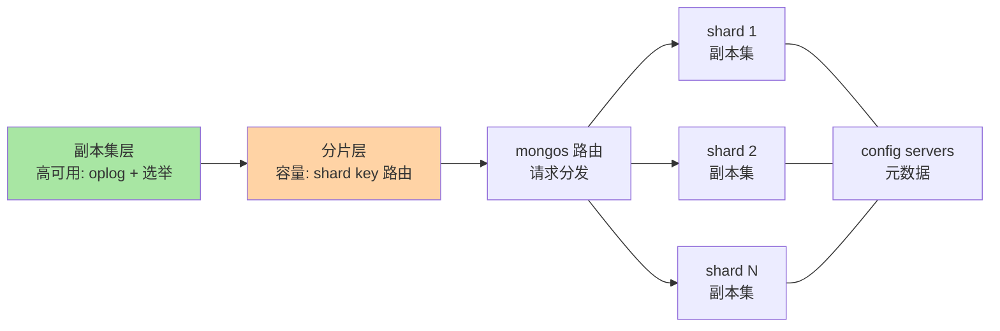
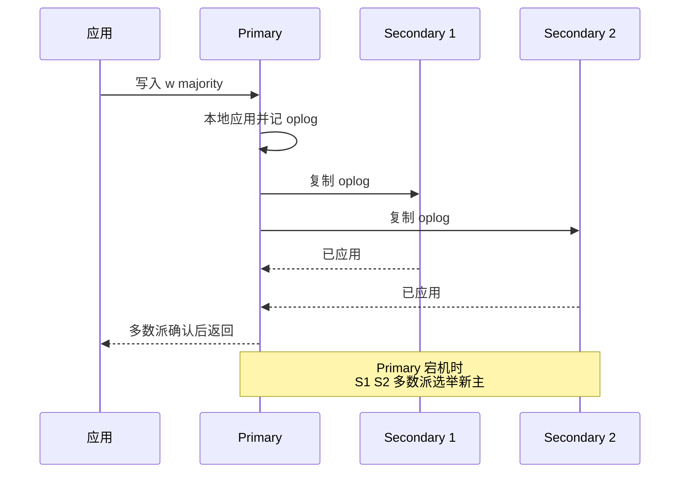

# 副本集与分片架构：oplog、选举与 shard key 的取舍

> 一句话：副本集（一主多从 + oplog 同步 + 自动选举）解决高可用，分片（shard key 把集合横向切开）解决容量与吞吐——扩展能力是产品内建而非外挂中间件，这是它与 MySQL「主从 + 分库分表」架构路线最大的形态差。

## 🎯 本文核心

**核心一句话：MongoDB 的高可用与水平扩展是同一套产品内建能力——副本集靠 oplog（类似 binlog）同步 + 多数派选举自动换主（MySQL 要靠外部工具或 MGR 才有等价物），分片靠 shard key 路由（mongos 分发 + chunk 迁移），而 shard key 一旦选定几乎不可改（近年版本有演进，以官方文档为准）——所以分片架构的全部智慧都压在「选 key」这一个决策上。**

组织主线（一张图看懂两层架构）：



本篇先拆副本集（对照 MySQL 主从），再拆分片（对照 MySQL 分库分表），最后把「key 选错」的典型病灶摆出来——分片架构的事故几乎全部源于这一个决策。

## 一句话摘要

**副本集**（replica set）= 一个 Primary 承接写 + 多个 Secondary 通过 oplog 异步重放保持同步；Primary 宕机时具备投票权的节点基于多数派协议自动选举新主（公开始于 MongoDB 复制协议版本 1，类 Raft 思路），应用通过驱动自动发现新主——故障转移内建，无需外部切换工具。客户端可用 readPreference 控制读走向（primary/secondaryPreferred/nearest 等）、writeConcern 控制写确认级别（w:1 到 w:majority）。**分片**（sharding）= 集合按 shard key 切成 chunk 分布到多个分片（每个分片本身是一个副本集），mongos 路由层按 key 把请求转发到目标分片，balancer 在后台迁移 chunk 均衡负载。对照 MySQL：主从复制 + MHA/Orchestrator 类外部切换 + 应用层分库分表中间件（ShardingSphere/Vitess 类，公开口径）的组合能力，MongoDB 用「副本集 + 分片」两个产品内建概念覆盖——代价是分片键的强约束（选了基本不换）与集群组件的运维面。

## 5W 速记卡

| 维度 | 一句话 |
|---|---|
| What | 副本集（oplog 同步 + 自动选举）+ 分片（key 路由 + chunk 迁移）两层架构 |
| Why | 高可用与水平扩展内建——免除外部切换工具与分库分表中间件两套负担 |
| When | 副本集是生产底线（单机仅限开发）；分片等量级与单机瓶颈信号 |
| Where | mongos → shard（副本集）→ config servers 元数据三层 |
| How | key 选择先定哈希/范围与基数，writeConcern 按业务分级，对照 MySQL 主从+分库分表理解 |

## 一、副本集：oplog 同步与自动选举

四要素具体值：

1. **oplog**：固定大小（capped）的操作日志集合，记录「使数据变化的操作」——角色对齐 MySQL binlog：从库拉取重放。注意形态差异：oplog 是幂等形态记录（如精确到位置的实际结果），binlog 三种格式（statement/row/mixed）语义不同（公开机制口径）。
2. **成员角色**：Primary（唯一写入口）+ Secondary（可配置：纯数据副本/可读从节点/延迟节点用于误操作兜底/隐藏节点/仲裁节点 priority 0 不存数据只投票——投票与数据职责分离）。
3. **选举**：Primary 失联后，健康且有投票权的节点在心跳超时后发起选举，**多数派存活才能选出新主**（防止脑裂——少数派分区连主都选不出，自然不可写）；Priority 影响当选资格（0 永不当选，高优先级倾向当选），选举协议 PV1 自 MongoDB 3.2 起为默认（公开机制口径）。
4. **客户端语义**：writeConcern（w:1 主库落内存即确认 / w:"majority" 多数派持久化才确认，j:true 附加日志落盘）与 readConcern（local 读本机最新含未多数派确认的 / majority 读多数派已确认的 / snapshot 读一致快照，配合事务）分级搭配——「写多强、读多新」由应用按业务声明，数据库不再替你默认。

```javascript
// 查看副本集状态的常用命令 (mongosh)
rs.status()        // 成员健康度/选举状态/同步滞后
rs.conf()          // 成员配置: priority/votes/hidden
db.hello()         // 当前谁是 Primary (旧 isMaster)
```



**追问：有了自动选举，MySQL 为什么还要外部工具？**
反方案对照：MySQL 的复制是「从库重放 binlog」的单向流，没有内建的「谁来当主」共识——MHA/Orchestrator 类工具在库外做检测与切换（本库 MySQL 高可用篇详讲），MGR 才把共识协议搬进内核。MongoDB 从设计起就把「副本集 = 复制 + 共识」绑成一个概念。这不是能力差距而是路线差：MySQL 保持组件解耦，MongoDB 收成整体——整体换来的运维简单，付出的灵活代价。

**再追问：选举期间业务什么感受？**
打破砂锅说透：选举窗口内没有 Primary，写入不可用（默认秒级到十秒级量级，取决于检测阈值配置，业内认知）；多数派不满足时连读一致性都可能降级（readConcern majority 无数据可读多数派确认）。所以 writeConcern 的分级不是可选项：核心写入至少 w:majority，否则 failover 瞬间可能丢「主库已确认但未复制出去」的写——这个问题的底层原理与 MySQL 半同步同构，只是表达成了声明式参数。理解这套机制背后的共识协议根源，比背参数更重要。

## 二、分片：shard key 决定一切

分片把一个集合横向切开，四要素具体值：

1. **shard key**：文档的一个（或复合）字段，一旦选定不可更换（ MongoDB 5.0 起支持在线 refine/reshard，能力有限制且代价高，以官方文档为准）——所有查询的路由、数据分布、热点形态全由它决定。
2. **切分策略**：范围分片（range，键值相邻的数据相邻——范围查询友好但自增键会热点集中到最后一个 chunk）、哈希分片（hashed，哈希打散——写入均匀但范围查询要扫全分片）。二选一或复合权衡，是 key 决策的第一层。
3. **chunk 与均衡**：数据按 key 切成 chunk（默认上限配置化管理，MongoDB 6.0 起从 64MB 调整为 128MB 量级，以官方文档为准），balancer 后台在各分片间迁移 chunk 均衡——单个 chunk 超 上限后标记 **jumbo chunk**，balancer 无法搬走，需要手动拆分或处理（经典运维坑）。
4. **路由**：mongos（无状态路由进程）查询 config servers 的元数据，把带 key 的请求精确转发到目标分片（单分片命中）；**不带 key 的查询广播到全部分片再聚合**——这是分片性能的第一杀手。

```javascript
// 对集合启用分片并指定 hashed shard key (真实命令形态)
sh.enableSharding("shop")
sh.shardCollection("shop.orders", { user_id: "hashed" })
// 查看分布与 jumbo
db.orders.getShardDistribution()
sh.status()
```

**追问：shard key 为什么选「几乎不可改」？**
设计取舍：key 变更意味着全量数据重分布——每一个文档的路由都要重算迁移，在「保持在线服务」约束下这是最昂贵的操作形态。MongoDB 把它做成重活（5.0 前 = 导出重灌），倒逼团队在建分片前把 key 想透：**这是一次不可逆级决策，与 MySQL 分库分表「选分片键」的谨慎度完全同源**——两个世界的从业者在这个问题上流过同一种泪。

**再追问：什么样的 key 是好 key？**
打破砂锅给清单：基数高（值够多才散得开）、写入均匀（避免单调递增热点）、高频查询携带（让请求单分片命中）——三条天然互相牵制（如 user_id 高频但头部用户数据倾斜）。业内认知的常见落点：复合键（如 user_id + order_id 哈希）或 hashed user_id 之类的「业务热点与均匀性折中」。**没有完美 key，只有为查询形态定制的关键取舍。**

## 三、与 MySQL 主从 + 分库分表的架构对照

| 维度 | MongoDB | MySQL |
|---|---|---|
| 高可用单元 | 副本集（复制 + 选举一体） | 主从复制 + 外部切换工具 / MGR |
| 复制载体 | oplog（capped 集合） | binlog（三种格式） |
| 写确认分级 | writeConcern 声明式 | 半同步 / lossless 半同步参数 |
| 水平拆分 | 分片内建（mongos + shard key） | 应用层中间件（ShardingSphere/Vitess 类）+ 自管分片键 |
| 数据再均衡 | balancer 自动迁 chunk | 扩容迁移自管（双写/停写方案） |
| 跨片查询 | 广播聚合（性能红线） | 中间件归并（同样红线） |

**「与 MySQL 的区别」的架构本质**：MySQL 把「复制、切换、拆分」当作三件独立工具，胶水在应用与运维侧；MongoDB 把它们收进产品内核，胶水在配置层。前者换来每个环节可自选自换，后者换来开箱一致——**组件化 vs 一体化**，与第 1 篇「插件引擎 vs 单一内核」是同一条哲学线在不同层的投影。

线上排查过一则公开社区高频同款案例：订单集合分片后，大促期间写入延迟陡增，排查发现 shard key 用了单调递增的时间前缀字段做范围分片——所有写入集中打在最后一个 chunk 所在分片，其余分片围观；复盘后改 hashed 复合键重灌数据（当时版本不支持在线 reshard），代价是一次迁移窗口。教训与 MySQL 分库分表「自增键做分片键=写热点」完全同款——**分片键的错，两个世界都要用重灌来还。**

## 四、典型使用场景

- **副本集起步（生产底线）**：任何生产部署至少三节点副本集（一主两从，公开口径的常见最小形态），P-S-S 与 P-S-A（带仲裁节点）是常见拓扑取舍（仲裁省资源但降低多数派冗余度）。
- **读写分离**：readPreference secondaryPreferred 把容忍陈旧的读（报表/导出）分到从库——与 MySQL 读写分离同思路，但要警惕「读自己写」场景（写后立读要走 primary 或因果一致性会话，业内认知）。
- **分片的触发信号**：单副本集容量/WPS 逼近硬件天花板、工作集（热数据）装不进内存、单集合写入明确倾斜——三条信号齐了再分片。**能不分片就不分片**是两边共同的铁律：分片的运维复杂度（chunk 治理、广播查询、跨片一致性）是永久税。
- **量级分界一句话**：十万到千万级文档量、工作集内存装得下，副本集就是终态；亿级或写入持续倾斜，分片进入议程；跨片事务与广播查询一旦成为常态，先重新审视建模与 key，而不是继续加分片。

> 💡 **实战提示**
> - 💡 writeConcern 分级落进代码规范：核心资金/库存路径 w:majority，日志类可 w:1——统一最高级别会白付延迟，统一最低级别会在 failover 时丢数据，两级都要有
> - 💡 分片前用真实查询日志验证 key：统计 Top 查询是否携带候选 key、基数够不够、头部值倾斜多少——用数据选 key，不用直觉
> - 💡 监控三件：复制滞后（从库 oplog 应用延迟）、chunk 分布均衡度、jumbo chunk 计数——分片集群的事故前兆基本都在这三处先亮灯

## 五、常见误区与代价

- **误区一：单机直上生产**。无副本集 = 无高可用也无多数派安全，MongoDB 生产底线是副本集（业内共识）——对应 MySQL 「单主无从」的反模式。
- **误区二：为了「均匀」全部用哈希键，范围查询全变广播**。代价：运营后台的按时间段查询拖全分片——哈希与范围的取舍要对着查询形态，不是对着强迫症。
- **误区三：不带 shard key 的查询当「慢一点而已」**。广播 + 归并的代价随分片数线性涨，高并发下是集群级放大器——监控里这类查询要单列告警。
- **误区四：把 jumbo chunk 当小事**。失衡 + 无法迁移会让单分片持续过载，处理窗口越拖越贵——出现即拆（pre-split）或调整策略，不积压。
- **误区五：跨片事务当常规武器**。可用但昂贵（两阶段提交语义 + 锁持有时间，业内认知），频繁跨片事务先回头改建模（第 1 篇的内嵌三问）——事务是逃生舱不是架构支柱。

## 六、你们可能会问

**Q1：仲裁节点（Arbiter）到底能不能用？**
它是「资源紧张时凑多数派」的妥协件：不存数据只投票，让两数据节点 + 一仲裁构成三票。代价是多数派冗余度下降（一台数据节点挂了只剩单数据副本）与运维争议（公开口径的社区态度偏保守）。资源允许时 P-S-S 三数据节点是更稳的默认形态。

**Q2：延迟节点（Delayed Secondary）能当备份用吗？**
它是「误操作缓冲垫」：延迟 N 小时重放 oplog，误删集合时从这里捞数据——但它是缓冲不是备份：节点故障、oplog 覆盖、逻辑错误同步这三类它都防不住。oplog 是 capped 会滚动覆盖（默认大小按容量配置），**备份体系（快照 + oplog 增量）仍是独立必需品**，与 MySQL「复制不替代备份」完全同理。

**Q3：mongos 挂了怎么办？**
mongos 无状态、可水平多布（应用连接串配多个路由地址）——它挂是部署问题不是数据问题。config servers 才是要命件（存元数据），生产形态是三节点副本集化部署（公开机制口径）——监控优先级里 config servers 健康度高于一切。

## 七、什么时候用/不用与 Trade-off

| 场景 | 推荐 | 不推荐 |
|---|---|---|
| 生产部署底线 | 三节点副本集起步 | 单机/双节点（多数派弱） |
| 核心写入 | w:majority + 监控复制滞后 | 全量 w:1 裸奔 |
| 分片时机 | 三信号齐备 + key 验证过 | 未验证 key 跟风分片 |
| 跨集合强一致 | 重新建模优先 | 4.0+ 事务当日常武器 |

Trade-off 的锚点是**一体化与组件化的代价交换**：MongoDB 内建扩展省掉的是「中间件选型 + 切换工具 + 再均衡方案」三套自建负担，付出去的是分片键的强约束与集群组件的绑定运维；MySQL 组合式保住每个环节的替换自由，付出去的是胶水层的自研与维护。两条路线的代价表刚好镜像——选型本质是选择「代价以什么形态出现」。量级分界一句话：十万级单副本集 + 默认参数即可；千万级开始做读写分级与滞后监控；亿级写入或工作集超内存，分片 + key 验证是必答题，且要按「不可逆决策」的规格做评审。

## 开放问题

- 在线 reshard/refine 能力（近年版本持续演进，公开口径）能不能把「分片键不可逆」变成「可逆决策」，将直接改变分片架构的决策规格——从 2022 年前后的初版能力到现在，这条演进线的每一步都在降低选分片键的后悔成本
- 云托管 MongoDB 把 mongos/ balancer 全托管后，「分片运维税」还剩多少落在用户侧，值得用真实成本重新评估分片时机

## 🎯 核心带走

- **核心一句话**：副本集 = oplog 同步 + 多数派选举（高可用内建），分片 = shard key 路由 + chunk 均衡（扩展内建）——key 三问（基数/均匀/查询携带）决定分片成败，且几乎不可逆
- **写读分级**：writeConcern/readPreference/readConcern 是应用向数据库声明一致性需求的接口——核心路径 w:majority，读自己写走 primary
- **哪里会破**：单调键范围分片写热点、无 key 广播查询、jumbo chunk 积压、选举窗口裸奔 w:1
- **取舍锚点**：一体化（MongoDB）与组件化（MySQL）的代价镜像——分片键评审按不可逆决策规格做

## 自测三问

1. oplog 与 binlog 的角色对应关系？选举为什么要求多数派？——答出「复制载体对应 / 防脑裂双主」算过。
2. shard key 的三条标准是什么？为什么单调递增键不能做范围分片键？——答出「基数/均匀/查询携带，写热点集中末尾 chunk」算过。
3. 分片的触发信号有哪些？为什么「能不分就不分」？——答出「容量/倾斜/工作集三信号，运维复杂度是永久税」算过。

## 📌 数据与事实声明

- 写于 2026-09-24，副本集选举协议、writeConcern/readConcern 语义、chunk 上限、在线 reshard 能力以 MongoDB 官方文档当前版本为准
- 选举窗口时长、chunk 默认大小等数值为业内认知或官方默认口径，随版本可能变化
- MySQL 对照侧（binlog 格式、半同步、ShardingSphere/Vitess 类中间件）以 dev.mysql.com 与各项目官方文档为准
- 分片热点案例为公开技术社区常见问题模式的匿名化复述，不指向任何特定公司

## 📚 参考资料

| 类型 | 标题 | 来源 |
|---|---|---|
| 官方文档 | MongoDB Manual: Replication（副本集与选举） | mongodb.com/docs/manual/replication/ |
| 官方文档 | MongoDB Manual: Sharding（shard key/chunk/balancer） | mongodb.com/docs/manual/sharding/ |
| 官方文档 | MongoDB Manual: Write Concern / Read Concern | mongodb.com/docs/manual/ |
| 系列内链 | MySQL 主从复制（复制机制对照侧） | [../../../mysql/入门层/从零开始认识MySQL系列/12_主从复制-入门.md](../../../mysql/入门层/从零开始认识MySQL系列/12_主从复制-入门.md) |
| 系列内链 | MySQL 分库分表与扩展（拆分对照侧） | [../../../mysql/入门层/从零开始认识MySQL系列/14_分库分表与扩展-入门.md](../../../mysql/入门层/从零开始认识MySQL系列/14_分库分表与扩展-入门.md) |
| 系列内链 | 本系列：场景选型与边界 | [4_场景选型与边界-入门.md](4_场景选型与边界-入门.md) |
