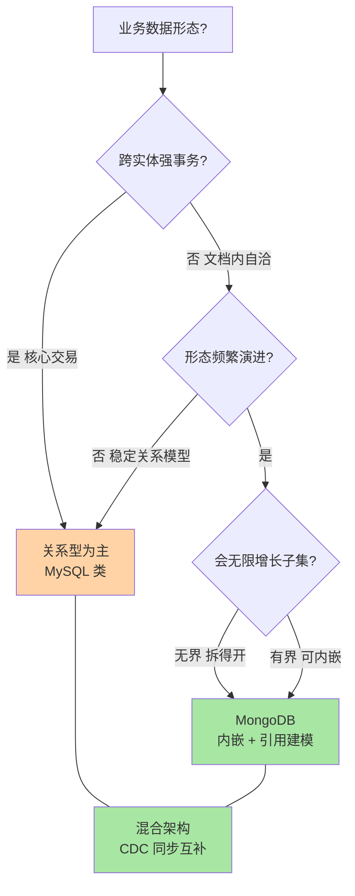
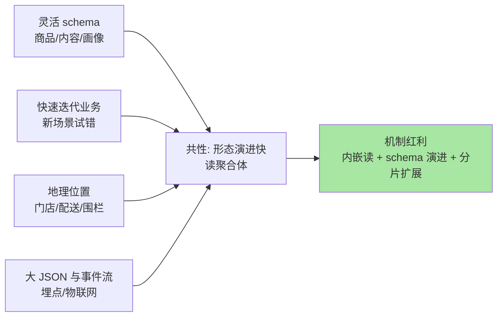
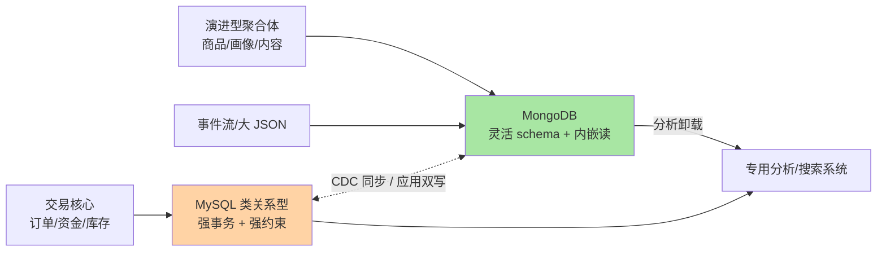

# 场景选型与边界：什么时候选 MongoDB，什么时候别选

> 一句话：选 MongoDB 的场景共性是「形态灵活 + 读聚合体 + 水平扩展」；别选的共性是「跨文档强事务 + 复杂 JOIN + 重报表聚合」——4.0 之后多文档事务存在但昂贵，它补的是逃生通道不是能力短板，混合架构（关系型管交易核心 + MongoDB 管演进形态）是多数团队的终态。

## 🎯 本文核心

**核心一句话：MongoDB 的选型边界由三个机制事实决定——单文档原子（内嵌建模的红利边界）、多文档事务可用但昂贵（4.0 副本集/4.2 分片支持，两阶段提交语义 + 性能代价）、$lookup 有限（无优化器级 JOIN 重排）——三条边界画出的安全区是「实体聚合体 + 快速演进 + 水平扩展」，危险区是「跨实体强一致 + 复杂关联 + 重分析」；真实系统的答案往往不是二选一，而是混合架构。**

组织主线（一张图看懂选型决策树）：



本篇先讲安全区的四类典型场景，再逐条拆危险区的机制原因（事务/JOIN/聚合的边界），最后给混合架构的落地形态与迁移判断。

## 一句话摘要

**选 MongoDB 的场景**：①形态灵活快速迭代——商品/内容/画像类字段持续演进，灵活 schema + validator 兜底；②读聚合体——文档内嵌让整实体一次读回，事务语义免费；③地理位置类——2dsphere 原生服务近邻/围栏；④大 JSON 与高写入型——事件/埋点/物联网形态多变且量大，分片承接水平扩展。**别选的场景**：①跨文档强事务是主路径——4.0 起有多文档事务（副本集 4.0、分片 4.2，公开机制口径），但两阶段提交的锁持有与性能代价业内认知显著高于关系型的本地事务，它是逃生舱不是日常；②复杂 JOIN 主导——$lookup 无优化器重排，多表关联是关系型的主场；③重报表聚合——亿级列式扫描场景列存引擎优势不可替代，MongoDB 管不了分析末梢。多数中大型系统的落地形态是**混合架构**：MySQL 类关系型守住交易核心的一致性，MongoDB 承接演进型聚合体，CDC/应用层双写打通——按数据形态分而治之，而不是给一个数据库塞全部形态。

## 5W 速记卡

| 维度 | 一句话 |
|---|---|
| What | MongoDB 的场景安全区（灵活/聚合/地理/大 JSON）与危险区（事务/JOIN/重聚合）边界 |
| Why | 边界由单文档原子、多文档事务代价、$lookup 有限三个机制事实决定 |
| When | 新业务形态探索期进 MongoDB；强一致交易核心留关系型 |
| Where | 混合架构里 MongoDB 通常承载「演进型聚合体」这一层 |
| How | 按数据形态分库 → CDC/双写打通 → 各自做各自擅长的读写 |

## 一、什么场景选 MongoDB：安全区四类

四类场景逐一对照机制红利，确认「为什么是它」：



- **形态灵活类**：字段每周在加（属性、标签、配置开关），关系型大表 ALTER 与 NULL 列蔓延是慢性负担——MongoDB 的演进权在应用侧（第 1 篇讲过的机制），validator 守底线。
- **读聚合体类**：详情页一次取全（商品 + 规格 + 库存快照 + 首评），内嵌文档零拼装——这类「整读整取」是文档模型的教科书场景。
- **地理类**：附近门店、配送范围判断、电子围栏——2dsphere 索引 + 地理查询操作符原生闭环；PG 的 PostGIS 更专业（投影/拓扑），但「中等规模地理 + 文档形态共存」时 MongoDB 一套库更省。
- **事件与大 JSON 类**：埋点事件字段不齐、设备上报形态随固件版本漂移——灵活 schema 是刚需不是福利；写入型负载用分片横向接（第 2 篇的三信号触发）。

**追问：这些场景 MySQL 真做不了吗？**
反方案分析：都不是做不了——MySQL 的 JSON 列 + 虚拟列索引能补大半（本库 MySQL schema 篇对照过），分库分表也能扩。真正的差异是**惯用路径成本**：形态演进在 MongoDB 是零 DDL，在 MySQL 是持续 ALTER + 应用适配；聚合体读取在 MongoDB 是一次 find，在 MySQL 是多表 JOIN 或宽表冗余。选型比较的不是「能不能」，是「惯用路径的长短」——路径每短一截，迭代的团队速度就复利一层。

## 二、什么场景别选：危险区的机制原因

**场景一：跨文档强事务是主路径**。机制边界要说透：

| 事务形态 | 支持起点 | 代价（业内认知口径） |
|---|---|---|
| 单文档原子 | 一直支持 | 免费——建模红利 |
| 多文档事务（副本集） | 4.0 | 两阶段提交语义，锁持有时间变长 |
| 多文档事务（分片） | 4.2 | 跨分片协调更贵，回滚与超时治理复杂 |

4.0 之后「MongoDB 不支持事务」的说法已过时，但「事务便宜」的说法更危险：事务持有锁的时间与参与文档数成正比，高并发下冲突等待与吞吐下滑都是真实代价（业内认知）。这背后的设计哲学要说透：关系型的本地事务是架构地基，MongoDB 的多文档事务是架构逃生舱——为什么这么设计？因为文档模型的性能地基是「无锁的内嵌读写」，事务机制是后加的护栏而非承重墙。**地基当逃生舱用，或者逃生舱当地基用，都是错位。**

**追问：既然 4.0 有事务了，交易核心能不能直接搬过来？**
再追问一层：搬不搬的决定因素不是「有没有事务」，是「事务在访问路径中的密度」。交易核心（扣减、对账、状态机流转）几乎每条写路径都跨实体——事务密度高，代价按密度放大；而 MongoDB 的建模红利（内嵌）恰恰鼓励「把跨实体合成单文档」来回避事务——两条逻辑绕一圈又回到建模能力上：**能靠建模合并的，事务密度就低，可以搬；合并不了的（天然多实体强一致），事务密度高，留在关系型。**

**场景二：复杂 JOIN 主导**。$lookup 是管道内左外连接，没有优化器级 JOIN 重排与算法选择（第 3 篇讲过），三表以上关联 + 复杂条件的场景，关系型优化器的自动找路能力无可替代——BI 取数、多域关联分析是 MySQL/分析库的主场。

**场景三：重报表聚合**。亿级行的列式扫描与压缩，列存引擎的架构优势（业内认知量级差）不是管道调优能追的——MongoDB 的聚合管道适合「业务内的即席统计」（第 3 篇的预聚合习惯），分析末梢（多维 OLAP、即席大扫描）要卸载到专用系统。

**场景四：库级强 schema 治理的合规场**。监管或行业规范要求数据库层强制结构与类型约束的场景，validator 的能力面窄于关系型 DDL + 约束体系——这类场景别硬上灵活 schema。

## 三、4.x 事务的边界怎么用才对

给一个可执行的分级用法（业内认知的工程惯例）：

```javascript
// 多文档事务: 逃生舱用法 (副本集 4.0+ / mongosh 形态)
const session = db.getMongo().startSession()
session.startTransaction({
  readConcern: { level: "snapshot" },
  writeConcern: { w: "majority" }
})
const coll = session.getDatabase("shop").orders
coll.updateOne({ _id: oid }, { $set: { status: "cancelled" } })
session.getDatabase("shop").stock.updateOne(
  { sku: sku_code }, { $inc: { qty: 1 } }
)
session.commitTransaction()   // 失败则 abortTransaction
session.endSession()
```

- **首选**：建模层消解（第 1 篇三问）——一起变的合成一个文档，原子免费。
- **次选**：应用层幂等补偿（重试 + 对账）——形态合并不了但冲突率低时，补偿的复杂度可能低于事务的性能代价；业内两种路线都成熟，按冲突率选。
- **兜底**：多文档事务——冲突率高、补偿语义复杂、一致性要求硬的场景才动用，且要给事务设超时与监控（事务时长指标）。

线上排查过一则公开社区常见同款案例：团队把下单流程的三个集合更新套进多文档事务，大促压测吞吐只有非事务形态的两成，锁等待堆积拖垮整库；复盘结论是「订单 + 库存」本可合成单文档（库存按 SKU 快照进订单行），改建模后事务只在真正的跨实体对账路径保留。**事务是贵的安全，建模是便宜的安全——顺序不能反。**

## 四、与关系型共存的混合架构

多数中大型系统的终态不是「换」，是「分层共存」：



| 数据层 | 归属 | 判断依据 |
|---|---|---|
| 交易核心（强一致跨实体） | 关系型 | 事务密度高，本地事务是地基 |
| 实体聚合体（整读整取、演进快） | MongoDB | 内嵌红利 + 零 DDL 演进 |
| 事件/埋点/大 JSON | MongoDB（或专用流存储） | 形态多变 + 写入型扩展 |
| 分析末梢 | 专用分析/搜索 | 列存/倒排的专项优势 |

打通方式两条：**CDC**（变更数据捕获，把关系型变更流向 MongoDB 形成只读副本视图）或**应用层双写**（各自主写自己的一侧，弱一致但简单）——业内认知 CDC 是更稳的主流形态（少一类应用侧不一致 bug）。

**「与 MySQL 的区别」在选型语境下的最终表述**：MySQL 与 MongoDB 不是新旧之争，是**一致性边界画在哪**之争——关系型把一致性边界画在数据库全局（事务与约束全局保证），MongoDB 画在文档边界（边界内免费、边界外自管）。理解双方的设计目标，就明白混合架构为什么成立：两种边界各有主场，让每份数据住进边界形态与它匹配的库里，这个设计取舍成立的前提是团队有测绘数据形态的能力。

## 五、典型使用场景（混合视角全景）

- **电商**：订单/库存/资金在关系型；商品详情、营销页面配置、用户行为在 MongoDB；搜索与报表在专用系统——三段各归其位。
- **内容平台**：文章/评论（前 N 条内嵌）在 MongoDB，用户账号与权限关系在关系型，全文检索外挂。
- **物联网**：设备最新状态快照在 MongoDB（灵活形态 + 按设备读），时序明细进时序库，控制指令与资产关系在关系型。
- **量级分界一句话**：十万级以下文档量、形态稳定，一套关系型全包反而最省；千万级且形态持续演进，混合架构的固定成本开始被摊薄；亿级写入型负载，MongoDB 分片 + 专用分析末梢的组合是常态形态——**混合架构本身也有固定成本（两套运维 + 同步链路），量级撑不起时不值得配。**

> 💡 **实战提示**
> - 💡 选型评审先画「事务密度地图」：把核心写路径逐条标注「涉及几个实体、冲突率多高」——密度低的区域才考虑 MongoDB，这张图比任何选型清单都诚实
> - 💡 混合架构的同步链路要有一致性对账任务：CDC 也可能丢消息，定期对账（抽样 + 计数比对）是把「弱一致」变成「可验证的最终一致」的最低成本手段
> - 💡 给 MongoDB 划定「三年边界」：预期三年内不会长到需要分片/专用化的场景才进——边界的判断写在引入评审里，别让后人拿着今天没有的规模假设收拾昨天超配的架构

## 六、常见误区与代价

- **误区一：「MongoDB 现在有事务了，可以全换」**。代价：事务密度高的交易核心搬过来，性能与治理成本双升（第 3 节的机制与案例）——事务能力是补短板不是换主场。
- **误区二：「混合架构 = 双倍工作量，不如单库硬扛」**。反向误区同样常见：形态演进的压力全部灌给关系型（万列宽表/JSON 文本列滥用），单库硬扛到改无可改——该分层时分层的成本低于不分离的慢性成本。
- **误区三：选型只看功能清单不看运维归属**。引入 MongoDB 却没人管副本集/分片运维（第 2 篇的三件监控没人盯），故障时才发现「选型」和「养得起」是两回事。
- **误区四：把「灵活 schema」延伸成「不要数据治理」**。字段漂移、类型混杂在混合架构下还会通过同步链路污染下游——灵活层一样要有 validator 与命名规范，治理只是换了阵地。

## 七、你们可能会问

**Q1：新项目一开始就该混合架构吗？**
不是。起步期用一套关系型全包，形态压力真实出现（ALTER 频率、JSON 列蔓延、读路径拼装爆炸）再演进分层——混合架构的固定成本在业务形态未定时是纯负担。业内认知的节奏：先单一后混合，分层动作跟着形态信号走，不跟着架构审美走。

**Q2：已经把强事务场景搬进 MongoDB 了，怎么止损？**
三步：先画事务密度地图识别高危路径；能建模合并的合并（消解事务）；合并不了的逐步迁回关系型或降级为异步补偿（按一致性容忍度分级）。止损的关键动作是「降事务密度」，不是「调事务参数」。

**Q3：怎么评估一个「要不要选 MongoDB」的争议？**
回到三条机制事实做判断：数据是否文档内自洽（内嵌红利）、事务密度是否低（边界）、形态是否持续演进（schema 红利）——三条占两条以上支持，选 MongoDB 的胜算大；三条全不支持，争议本身就不存在。判断的输入是业务数据形态，不是技术流行度。

## 八、什么时候用/不用与 Trade-off

| 场景 | 推荐 | 不推荐 |
|---|---|---|
| 新业务形态探索期 | 单库起步（MySQL 或 Mongo 按形态） | 上来就混合架构 |
| 详情页聚合体读 | MongoDB 内嵌 | 多表 JOIN 实时拼 |
| 交易核心跨实体强一致 | 关系型本地事务 | MongoDB 多文档事务当日常 |
| 亿级报表分析 | 专用列存/分析系统 | MongoDB 管道硬扛 |
| 事件/埋点/大 JSON | MongoDB（分片） | 关系型宽表 + JSON 文本列 |

Trade-off 的锚点是**边界与自由度的交换**：选 MongoDB，用「文档边界外的一致性自由」换「边界内的建模自由」——自由范围由你的建模能力决定；选关系型，用「schema 与关联的灵活性」换「全局一致性与优化器托管」——省心范围由优化器能力决定。混合架构则是拒绝交换、按形态分配——代价是两套体系与同步链路的固定成本。没有免费选项，只有与数据形态匹配的付费方式。量级分界一句话：小量级单一形态选谁都行（选熟的）；中量级多形态混合架构开始划算；大量级必然走向「按形态分系统」的专业分工——选型问题的终点是数据形态的测绘能力，不是数据库的名气。

## 开放问题

- 多文档事务的性能边界会不会随存储引擎与协议演进大幅逼近本地事务——若成真，「事务密度」这条选型硬线会被重画
- CDC 生态的标准化程度持续提升，混合架构的同步成本曲线持续下探，「按形态分库」与「一库多模」两条路线十年后的胜负，取决于成本曲线交叉点的移动方向

## 🎯 核心带走

- **核心一句话**：选型边界 = 三个机制事实（单文档原子/多文档事务昂贵/$lookup 有限）画出的安全区（灵活/聚合/地理/大 JSON）与危险区（强事务/JOIN/重聚合）；多数系统的终态是混合架构——关系型守交易核心，MongoDB 承接演进型聚合体
- **事务用法分级**：建模消解（首选）→ 应用补偿（次选）→ 多文档事务（兜底）——事务是贵的安全，建模是便宜的安全
- **哪里会破**：事务密度高的核心硬搬、混合架构无人运维、同步链路不对账、灵活 schema 不设防
- **取舍锚点**：一致性边界画在哪（全局 vs 文档边界）——混合架构按形态分配边界，不交换、按形态付费

## 自测三问

1. 「4.0 有事务了能不能全换」错在哪？——答出「事务是逃生舱不是地基，按事务密度判断」算过。
2. 多文档事务的三级用法顺序是什么？为什么顺序不能反？——答出「建模消解→补偿→事务，成本递增」算过。
3. 混合架构的固定成本有哪些？什么时候才开始划算？——答出「两套运维+同步链路，中量级多形态摊薄」算过。

## 📌 数据与事实声明

- 写于 2026-09-24，多文档事务支持范围（副本集 4.0、分片 4.2）、$lookup 语义、validator 能力以 MongoDB 官方文档为基准
- 事务性能代价（两成吞吐等量级表述）、CDC 与双写的取舍为业内认知，非基准测试结论
- MySQL 对照侧（本地事务、DDL、JSON 列）以 dev.mysql.com 官方文档为准
- 压测与排查案例为公开技术社区常见问题模式的匿名化复述，不指向任何特定公司

## 📚 参考资料

| 类型 | 标题 | 来源 |
|---|---|---|
| 官方文档 | MongoDB Manual: Transactions（边界与用法） | mongodb.com/docs/manual/core/transactions/ |
| 官方文档 | MongoDB Manual: Schema Validation / $lookup | mongodb.com/docs/manual/ |
| 公开口径 | MongoDB Production Notes（生产部署建议） | mongodb.com/docs/manual/production-notes/ |
| 系列内链 | 本系列：MongoDB 是什么与文档模型 | [1_MongoDB是什么与文档模型-入门.md](1_MongoDB是什么与文档模型-入门.md) |
| 系列内链 | 本系列：副本集与分片架构 | [2_副本集与分片架构-入门.md](2_副本集与分片架构-入门.md) |
| 系列内链 | MySQL 事务与隔离级别（事务对照侧） | [../../../mysql/入门层/从零开始认识MySQL系列/6_事务与隔离级别-入门.md](../../../mysql/入门层/从零开始认识MySQL系列/6_事务与隔离级别-入门.md) |
