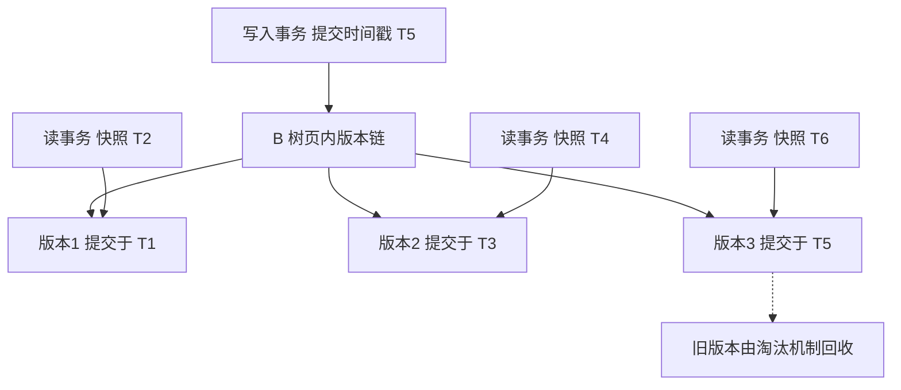
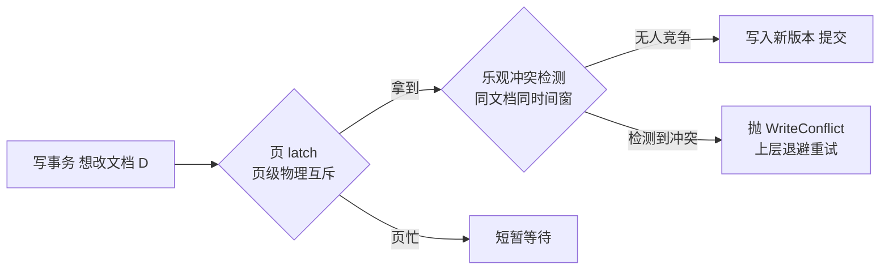
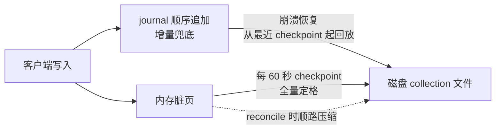

# WiredTiger 存储引擎深度：MVCC、文档级并发、checkpoint 与 journal

> 一句话：WiredTiger 把 MongoDB 从「集合级锁 + 内存映射文件」的时代带到了「文档级并发 + MVCC 快照 + checkpoint/journal 双层持久化」的时代——同一集合里的两个文档互不阻塞，读写互不阻塞，宕机后从最近一次 checkpoint 加 journal 回放恢复。本篇把这条机制链逐段摊开，顺带讲清 cache 这半个参数体系到底在调什么。

## 一句话摘要

WiredTiger 是 MongoDB 3.2 起的默认存储引擎（官方文档口径），核心机制可以压成四句话：**① 一切修改都是「新版本」**——B 树页内的文档更新不改旧值，而是追加新版本，事务按快照时间戳（snapshot timestamp）读到属于自己的那个版本，这就是 MVCC；**② 并发控制分两层**——页级 latch 管「同一页谁来改」，事务级乐观冲突检测管「同一文档谁来改」，冲突了抛 WriteConflict 由上层重试，这就是文档级并发的真实含义；**③ 持久化分两层**——journal（预写日志）兜住两次 checkpoint 之间的写入，checkpoint（默认每 60 秒）把内存里的一致性快照刷成磁盘上的完整状态，宕机恢复 = 最近 checkpoint + journal 回放；**④ cache 有默认账本**——WiredTiger cache 默认拿「物理内存减 1GB 的一半」，剩余留给文件系统缓存，两层缓存各司其职。压缩在写入路径顺路完成：集合块压缩默认 snappy（可选 zstd/zlib），索引走前缀压缩。

## 5W 速记卡

| 维度 | 一句话 |
|---|---|
| What | B 树 + MVCC 快照 + 乐观并发 + checkpoint/journal 的可插拔存储引擎 |
| Why | 读写不互斥、文档级并发压榨多核、宕机恢复有确定边界 |
| When | 绝大多数 MongoDB 场景的默认引擎；只有读旧版本数据才需要考虑别的方案 |
| Where | 进程内嵌库：数据落 collection*.wt 文件，索引落 index 文件，journal 独立目录 |
| How | 调优三件事：cache 大小、压缩算法、checkpoint 间隔——多数场景默认值已够 |

## 🎯 本文核心

**核心机制一句话**：WiredTiger 用「页内多版本 + 快照时间戳」实现 MVCC，用「页级 latch + 乐观事务冲突」实现文档级并发，用「journal 兜增量 + checkpoint 兜全量」实现持久化——三层机制共享同一套时间戳体系，cache 参数只决定这套体系在内存里留多深。

**机制链（全文按这条链展开）**：

写入怎么落页（页内多版本与并发冲突）→ 脏页怎么变磁盘页（reconcile 与压缩）→ 两次落盘之间靠什么兜底（journal）→ 全量一致态怎么定格（checkpoint）→ 恢复时怎么拼（checkpoint + journal 回放）→ 内存给谁分多少（cache 账本与调参）

## 一、边界：入门层讲过什么，本篇挖什么

| 内容 | 已有篇目 | 本篇 |
|---|---|---|
| 存储引擎是什么、WiredTiger 与 MMAPv1 之分 | 入门篇 1 | 不重复 |
| 副本集/分片的整体形态 | 入门篇 2 | 不重复（oplog 细节留给本系列篇 2） |
| **MVCC 快照与 WT 时间戳怎么工作** | 未讲 | **本文核心一** |
| **文档级并发与 WriteConflict 重试** | 未讲 | **本文核心二** |
| **checkpoint 与 journal 的配合** | 未讲 | **本文核心三** |
| **压缩算法与 cache 调参** | 未讲 | **本文核心四** |

## 二、MVCC：一切修改都是「新版本」

### 2.1 页内多版本与快照时间戳

传统直觉里「更新一行」是原地改值；WiredTiger 的底层做法不同——每个文档的更新在 B 树页上追加一个**新版本**，每个版本带提交时间戳（commit timestamp）。读事务开始时拿到一个**快照时间戳**，读路径沿版本链找到「提交时间 ≤ 快照」的最新版本返回。于是：一个正在跑的读事务永远不会看到它开始之后发生的写入；一个还没提交的事务对别人不可见。这就是快照隔离，也是 readConcern 各级别能落到实处的物理基础——本系列篇 2 会展开 readConcern 与副本集时间戳的联动，本篇先记住「读一致性由时间戳体系支撑」这半句。

### 2.2 旧版本的回收：为什么长事务危险

版本不能无限堆：checkpoint 与页面 reconcile 时，比「当前系统里最老的活跃读快照」更早的旧版本才会被回收。最老活跃事务的快照时间戳（机制上叫 oldest timestamp 一族）钉住了回收的下界——**一个跑几小时的读事务，会让这几小时内所有被它扫过的页都堆住旧版本**，cache 被旧版本撑大、淘汰压力飙升。业内多起「一个报表长查询把实例 cache 利用率顶满」的复盘都指向这个机制。追问一层：**为什么不主动杀长事务？** 因为存储层无法替业务判断事务该不该活——它只把代价做显式（cache 增长可观测），杀不杀是应用层超时设置的职责。这个边界是「机制不给业务兜底」的设计思想。

**再深一层：MVCC 写放大在哪？** 每次更新 = 新版本追加 + 未来某次 reconcile 把旧版本折叠掉——一次逻辑写可能在页上经历「写新版本 → 读旧版本 → 折叠清理」三次工作。高频原地更新（计数器类）的集合，页会频繁触发折叠与分裂，这是「热点文档更新慢」的底层原因之一——解法不是调参数，是改建模（拆文档、换累积方式）。

## 三、文档级并发：latch 管页，乐观管事务

### 3.1 两层并发控制的分工

「文档级并发」这个词常被简化成「文档级锁」，机制上不准确——WiredTiger 没有按文档挂锁，而是两层协作：

- **页级 latch**：同一物理页同一时刻只有一个写入者，管的是「页结构的完整」——毫秒级持有，绝不跨事务持有；
- **事务级乐观检测**：两个事务同时改同一文档时，后提交者在提交阶段发现自己读的版本已被推进，冲突成立——MongoDB 层捕获 WriteConflict，做指数退避后整体重试。

### 3.2 追问：为什么选乐观而不是悲观行锁

反方案分析：**为什么不用 MySQL InnoDB 式的行锁？** 行锁意味着锁表管理、死锁检测、锁等待队列三件套，代价在「绝大多数写并不冲突」的场景是纯开销。互联网负载的实测共识（业内认知）是同文档并发冲突占比很低，乐观路径在无冲突时零成本——赢在常态，输在冲突：冲突风暴时（秒杀热点行）重试会放大 CPU 消耗。MongoDB 的取舍是「乐观为主、热点交给建模层化解」，这条设计哲学和很多 CAS 系统同源：**把冲突当成异常而不是常态来设计**。

**打破砂锅：重试有上限吗？** WriteConflict 重试不设硬上限，靠退避控制雪崩；但如果重试期间事务持有时间过长，会触发 maxTransactionLockRequestTimeoutMillis 一类的超时保护（公开口径，参数语义以官方文档为准）。生产上真正要盯的不是重试次数，是「WriteConflict 频率突增」这个信号——它意味着你的负载从「乐观友好」漂移到了「热点争抢」，参数救不了，要改访问模式。

**实践叙事一**（行业常见模式匿名化）：某商品库存集合在秒级活动期间延迟飙高，排查路径：db.serverStatus 的 writeConflicts 类指标环比暴涨，锁等待并不高——排除「锁住」直觉，确认是同文档乐观冲突重试风暴；复盘方案不是调引擎参数，而是把「单文档计数」改成「分桶计数 + 汇总」，热点被打散后冲突率回落。复盘结论：**乐观并发的故障形态不是「排队慢」，是「CPU 白烧」——看到 writeConflicts 高就往建模上想。**

## 四、checkpoint 与 journal：双层持久化

### 4.1 journal 兜增量

每次写事务先落 journal（预写日志）再改内存页，这是 WAL 原则。journal 按组提交攒批刷盘，默认提交间隔约 100ms（storage.journal.commitIntervalMs，官方文档口径）；写关注带 j:true 时该笔写入等待 journal 落盘确认。journal 自身也做压缩。崩溃时，「最后一次 checkpoint 之后、崩溃之前」的写入全靠 journal 回放找回——**journal 的价值是把「丢了多少数据」的答案变成「几乎不丢」**。

### 4.2 checkpoint 定格全量

journal 不能无限长——回放太慢、体积太大。checkpoint 负责把当前内存里的一致状态完整刷成磁盘文件，默认每 60 秒一次（storage.wiredTiger.engine config 里 checkpointIntervalSecs，官方文档口径）。checkpoint 生成的是**一致性快照**：检查点时刻之前提交的写入完整落盘，之后的不出现。代价集中在触发瞬间：脏页批量 reconcile + 写盘，表现为磁盘写入的周期性毛刺。

### 4.3 追问：为什么不只靠 journal，或者只靠 checkpoint

反方案分析，两头都不成立。**只靠 checkpoint（不写 journal）**：两次 checkpoint 之间崩一次丢最多一分钟写入——对 MongoDB 这种「默认就承诺几乎不丢」的系统不可接受。**只靠 journal（不建 checkpoint）**：journal 无限增长，启动回放从开业第一天算起，恢复时间不可控。双层的分工本质是 **RTO 与吞吐的折中**：journal 付顺序写的钱换「几乎不丢」，checkpoint 付周期性刷盘的钱换「恢复有确定边界」。追问一层：**checkpoint 间隔调小更好吗？** 单次刷盘量变小、毛刺变矮，但频率升高总开销上升——这个参数只该在有明确「毛刺伤业务」证据时动，默认值是多年的平衡点（业内惯例）。这里的设计取舍值得记：**持久化体系里每个机制都在为「崩溃恢复」这个唯一目标分工，别让单个参数背上全部期望。**

**实践叙事二**：某实例夜间磁盘写入曲线每隔一分钟出现尖峰，白天查询延迟跟着抖。排查动作：对齐时间戳发现尖峰与 checkpoint 周期同频，且 cache 里脏页比例长期偏高（写入太猛、淘汰跟不上）；处置是把写入侧削峰 + 磁盘升级，而不是调 checkpoint 间隔。复盘沉淀：**checkpoint 毛刺是「症状」，脏页积压才是「病」——先看 eviction 与脏页指标，再谈引擎参数。**

## 五、压缩：写入路径上顺路完成的省钱术

WiredTiger 的压缩发生在页面 reconcile 落盘那一刻，读路径上则要解压还原，所以它永远是一笔 Trade-off：**磁盘与 IO 省，CPU 花**。三套方案：

| 对象 | 默认 | 可选 | 机制要点 |
|---|---|---|---|
| 集合数据块 | snappy | zstd、zlib | 按块压缩，块是 reconcile 的输出单位 |
| 索引 | 前缀压缩（默认开） | 可关 | 相邻键共享前缀，压缩重复开头 |
| journal | snappy（公开口径） | — | 顺序追加日志的轻量压缩 |

选型口诀：**CPU 富余、磁盘敏感的日志/流水类集合上 zstd；写延迟敏感的热点集合保 snappy 甚至不压**。集合级可单独指定压缩算法（建集合时 storageEngine 选项），不必全库一刀切——「按集合的读写画像配压缩」是生产实践里性价比很高的动作。追问一层：**索引前缀压缩为什么对 _id 索引收益小？** _id 单调且不重复，前缀共享度天然低；收益集中在复合索引里重复出现的前导列——机制理解到这一层，压缩率差异就不用背口诀了。

## 六、cache 账本：wiredTigerCacheSizeGB 在调什么

### 6.1 默认值背后的两层缓存设计

默认 cache 大小 = **max( 物理内存 - 1GB 的一半, 256MB )**，即「(RAM - 1GB) / 2 与 256MB 取大」（官方文档口径，3.4 起）。另一半内存去哪了？留给**文件系统缓存**——磁盘文件页由 OS 缓存，读路径可以先吃文件缓存再进 WT cache。两层缓存各管一段：WT cache 管「B 树页与多版本」的工作集，文件系统缓存管「压缩块」的读加速。这条分工解释了老问题「为什么 cache 用量到 95% 不算异常」——cache 内部有自己的淘汰水位线（接近触发线开始激进淘汰，回落到目标线，公开口径），接近上限本身是机制内正常态，要警惕的是**脏页占比与淘汰跟不上的持续态**。

### 6.2 追问：默认 50% 为什么不是 90%

反方案分析：**为什么不用把 cache 拉满？** 因为 WiredTiger 的压缩数据在文件系统缓存里本来就是「热」的——两层缓存重复缓存同一批热数据，边际收益递减；而全给 WT 会挤压 OS 与其他进程，内存紧张时交换（swap）对数据库是灾难。50% 是「单层工作集」的保守账，不是拍脑袋。再追问一层：**什么时候该调大？** 工作集（热数据 + 索引）实测接近或超过默认 cache、且机器内存充裕、且文件缓存命中率已经够高——三个条件同时成立才动。调参之前先用 cache 与 page fault 类指标证明「cache 确实是瓶颈」，业内反复验证的纪律：**参数是最后手段，指标先行**。

### 6.3 参数速查与失效形态

| 参数 | 默认 | 为什么是这个值 | 失效形态 |
|---|---|---|---|
| wiredTigerCacheSizeGB | (RAM-1GB)/2，下限 256MB | 留一半给文件系统缓存与 OS | 调到 90% 引发 swap；容器内超配 OOM |
| checkpointIntervalSecs | 60 | 恢复时间与刷盘毛刺的平衡点 | 调大=恢复变慢；调小=总开销升高 |
| journal 间隔 | 100ms | 组提交攒批的吞吐/延迟折中 | 强行调小，写放大明显 |
| 压缩算法 | snappy | CPU 与压缩率的折中 | 热点集合上 zstd 可能拖写延迟 |

容器化部署的额外提醒：cache 默认值看的是**机器可见内存**，cgroup 限额与宿主机内存不一致时会算错账——容器里显式设置 wiredTigerCacheSizeGB 低于限额（留余量），是业内通行的容器化惯例。

## 七、不同量级的思考：架构约束驱动解法

- **十万级（热数据远小于默认 cache）**：约束来自「全工作集常驻内存」——引擎参数几乎不用碰，这一档的核心问题是「建模有没有明显反模式」，而不是「cache 调多大」；思考方式是「建模审核」驱动
- **百万级（工作集与 cache 接近同量级）**：约束来自「cache 命中率开始波动、页故障增多」——cache 账本与压缩选型进入视野，这一档的核心问题是「热数据画像是什么」，而不是「把 cache 调大 20%」；思考方式是「指标画像」驱动
- **千万级（多版本与脏页持续积压）**：约束来自「写路径的页级工作量（折叠/分裂/reconcile）成为瓶颈」——长事务治理、热点建模改造、磁盘升级都在这一档，这一档的核心问题是「写放大被什么放大了」，而不是「再加大 cache」；思考方式是「写路径预算」驱动
- **亿级（单实例磁盘与恢复时间都到边界）**：约束来自「单机容量与 checkpoint/journal 恢复边界」——解法在架构层：分片把数据摊开（本系列篇 3），引擎层已无解，这一档的核心问题是「这个数据量还该单实例吗」，而不是「哪个参数能扛住」；思考方式是「绕开单机」驱动

思考方式总结：十万级靠建模审核，百万级靠指标画像，千万级靠写路径预算，亿级靠架构绕开——约束来源从「钱和参数」逐级上移到「物理与拓扑」，思考方式必须跟着迁移。

**自下而上与触发升级**：先用 cache 命中率、脏页占比、writeConflicts 三组指标定位当前档位，再决定动作——不预支上一档的架构改造。触发升级的信号：cache 命中率持续走低（进百万档）、writeConflicts/脏页积压常态化（进千万档）、磁盘容量或恢复时间逼近业务红线（进亿档）——信号出现即换思考方式，滞留旧档是在赌下个季度的运气。

## 八、源码与关键路径：模块级穿透

WiredTiger 以独立开源库内嵌在 MongoDB（上游仓库名 wiredtiger，模块级穿透按库内目录走）：

| 机制 | 关键路径 | 说明 |
|---|---|---|
| 版本链与快照 | wt 库 txn/ 模块（事务与时间戳管理） | 快照判定、提交时间戳分配 |
| 页写入与折叠 | wt 库 btree/ 与 reconcile 模块 | 脏页变磁盘页、旧版本折叠、压缩挂载点 |
| checkpoint | wt 库 conn/ 下的 checkpoint 驱动 | 周期触发、一致性快照元数据 |
| journal | wt 库 log/ 模块 | 组提交、恢复回放 |
| MongoDB 侧适配 | 源码 src/mongo/db/storage/wiredtiger/ 下 record store 与 index 接口实现 | WriteConflict 重试在这里被上层消化 |
| cache 淘汰 | wt 库 evict/ 模块 | 触发线/目标线驱动的页淘汰 |

读法建议：从「一次 update 的旅程」切入——MongoDB 层入口 → 写 journal → 页内加新版本 → 冲突则重试 → reconcile 落盘 → checkpoint 收口。走完这条链，参数语义不用背，自然长在机制上。

## 九、业内惯例与生产实践

- **cache 用量 90%+ 不等于告警**：淘汰水位线机制内的正常态；告警该盯脏页占比、淘汰延迟与 page fault 趋势——直接对 cache 总量告警是业内反复复盘过的误报源。
- **长事务治理进日常**：给读事务设应用层超时，报表类长查询走从节点（配合本系列篇 2 的 readPreference）——旧版本积压的第一来源就是无人管的长事务。
- **压缩按集合画像配**：流水/日志集合 zstd，热点交易集合 snappy——全局一刀切要么浪费磁盘要么伤延迟。
- **容器里显式设 cache**：cgroup 与宿主机内存不一致是 cache 算错账的高发场景，上线 checklist 固化这一条。
- **版本升级看引擎变更**：WiredTiger 自身也在演进（压缩算法支持、淘汰策略调整），大版本升级前跑读写基线对照——引擎也是代码，也有行为变化。

## 💡 实战提示

- 💡 **看到 writeConflicts 飙升先想建模再想参数**：乐观并发的冲突是建模信号（热点文档），分桶/打散是正解，重试上限与超时只是止损。
- 💡 **journal 保证「几乎不丢」，checkpoint 决定「多久能起来」**：恢复时间诉求明确的服务，把 checkpoint 间隔纳入评审，而不是崩了才看回放时长。
- 💡 **磁盘写入毛刺先对齐 checkpoint 周期**：尖峰与 60 秒周期同频，先查脏页积压与淘汰压力，别急着调间隔——毛刺是症状不是病。
- 💡 **容器部署显式设 wiredTigerCacheSizeGB**：默认公式在 cgroup 限额下会算错账，限额减余量显式写进配置。
- 💡 **zstd 给冷数据，snappy 给热点**：压缩算法按集合的读写画像单独配，收益立竿见影且零侵入。

## 什么时候用/不用：引擎参数决策表

| 场景 | 推荐动作 | 不建议 |
|---|---|---|
| 常规业务负载 | 全默认，指标巡检兜底 | 凭感觉调 checkpoint/淘汰参数 |
| 工作集实测超 cache 且内存富余 | 显式调大 cache 并观察命中率 | 无指标证据直接加 50% |
| 日志/流水类大集合 | 集合级 zstd 压缩 | 全库 zstd 一刀切 |
| 热点文档高频更新 | 建模分桶打散热点 | 调引擎参数硬扛冲突 |

明确推荐一句话：**默认配置起步，指标证据驱动，先改建模后动参数，分片是容量问题的最终答案**——引擎层参数解决的是「最后一成」的问题，不是「第一成」。

## Trade-off：三层机制的账单

| 机制 | 收益 | 代价 | 反噬场景 |
|---|---|---|---|
| MVCC 多版本 | 读写互不阻塞、一致性读 | 旧版本占用 cache、写放大 | 长事务钉住旧版本不回收 |
| 乐观并发 | 无冲突零开销 | 冲突风暴 CPU 放大 | 热点文档争抢 |
| journal 组提交 | 几乎不丢、顺序写高效 | 攒批引入微秒级延迟窗口 | 极致单笔延迟敏感场景 |
| checkpoint 周期 | 恢复边界确定 | 周期性刷盘毛刺 | 脏页积压时毛刺放大 |
| 块压缩 | 磁盘省、IO 省 | CPU 开销、读时解压 | CPU 紧张机器上雪上加霜 |

## 你们可能会问

**Q1：文档级并发是不是说 MongoDB 没有锁？**
不是。页级 latch 一直存在，事务级是乐观冲突检测——「文档级」指的是冲突粒度到文档，不是「无锁」。两个事务改同一文档依然会有一方重试，只是互不相关的文档完全并行。

**Q2：cache 用量长期 90%+ 要不要扩内存？**
先看命中与淘汰指标。接近上限是常态；若伴随命中率下滑、页故障上升、脏页难降，才是真瓶颈。扩 cache 只是手段之一，先把长事务和工作集画像搞清楚。

**Q3：w:majority 写入在引擎层发生了什么？**
本篇的 journal/checkpoint 机制在每个副本节点上独立运转；w:majority 是复制层语义（本系列篇 2 展开）——引擎层保证单节点持久，复制层把「单节点持久」升级成「多数派持久」，两层各管各的承诺。

**Q4：checkpoint 挂起（ suspending）期间写入会被阻塞吗？**
checkpoint 采用「快照式」实现，业务写入不长时间停摆，代价是 checkpoint 期间的写入走 journal 延后落盘（机制细节以官方文档为准）。生产上可观测的是周期性 IO 变化，而不是写入卡顿。

**Q5：为什么我的 zstd 集合压缩率比预期低？**
压缩率取决于数据本身：随机值多、前缀共享少的数据天然难压；另外单块内部重复度才是压缩的原料——块越小重复度越低。先看数据画像再谈参数。

## 开放问题

- WiredTiger 社区在多层存储/新压缩算法上的演进节奏，会如何改变「cache 一半」这条默认账？值得每年对照一次官方变更。
- 云盘（高 IOPS 网络盘）普及后，journal 与 checkpoint 的默认配比是否应该重估——「平衡点」是物理底座的函数，底座变了平衡点也会漂。

## 🎯 核心带走

**30 秒复述**：WiredTiger = 页内多版本（MVCC 快照）+ 两层并发（页 latch 管物理、乐观检测管逻辑冲突）+ 双层持久化（journal 兜增量、checkpoint 每 60 秒定格全量）+ 两层缓存（cache 拿 (RAM-1GB)/2，文件系统缓存拿另一半）+ 写路径顺路压缩（集合 snappy/zstd，索引前缀压缩）。**失效点**：长事务积压旧版本、热点文档冲突风暴、脏页积压放大 checkpoint 毛刺、容器内存算错账。金句带走：

> **存储引擎的三层承诺——读一致、写不丢、崩了能回来——分别由时间戳、journal、checkpoint 三个机制买单。**

> **乐观并发的世界里，冲突不是锁问题，是建模问题。**

## 自测三问

1. 一个跑两小时的读事务，对 cache 和旧版本回收各有什么影响？（答：钉住 oldest timestamp 下界，旧版本无法回收，cache 膨胀——见 2.2）
2. journal 和 checkpoint 各兜住什么？只留一个会怎样？（答：journal 兜增量、checkpoint 兜全量；只留 checkpoint 崩溃丢窗口数据，只留 journal 恢复时间不可控——见 4.3）
3. writeConflicts 指标持续走高，第一反应该是什么？（答：热点文档建模问题，分桶打散，而不是调引擎参数——见 3.2 实践叙事）

## 📌 数据与事实声明

- 版本口径：WiredTiger 自 3.2 起为默认引擎、MMAPv1 于 4.2 移除、cache 默认 (RAM-1GB)/2 下限 256MB、checkpoint 间隔 60 秒、journal 提交间隔 100ms、集合压缩默认 snappy（zstd 4.2+）、索引前缀压缩默认开——均出自 MongoDB 官方文档（截至 2026-09）。
- 淘汰触发线/目标线、journal 压缩算法等实现细节为公开口径；性能影响与冲突占比为行业认知经验值；两则实践叙事为行业典型模式的匿名化重建，不含真实公司与生产数据。

## 📚 参考资料

| 来源 | 内容 |
|---|---|
| MongoDB 官方文档 Storage / Journal / WiredTiger 章节与 Performance Best Practices | 引擎机制、默认参数与调优口径 |
| WiredTiger 开源仓库（github.com/wiredtiger/wiredtiger） | 事务/日志/淘汰模块结构与实现 |
| 《MongoDB 权威指南》（第 3 版）存储引擎章节 | 引擎演进与机制综述 |
| MongoDB 博客与 ENGINEERING 公开文章 | checkpoint、压缩机制的官方解读 |
| 关联篇目：本系列篇 2《副本集 oplog 与选举深度》、篇 3《分片架构与 chunk 治理深度》 | 复制层与集群层机制承接 |
