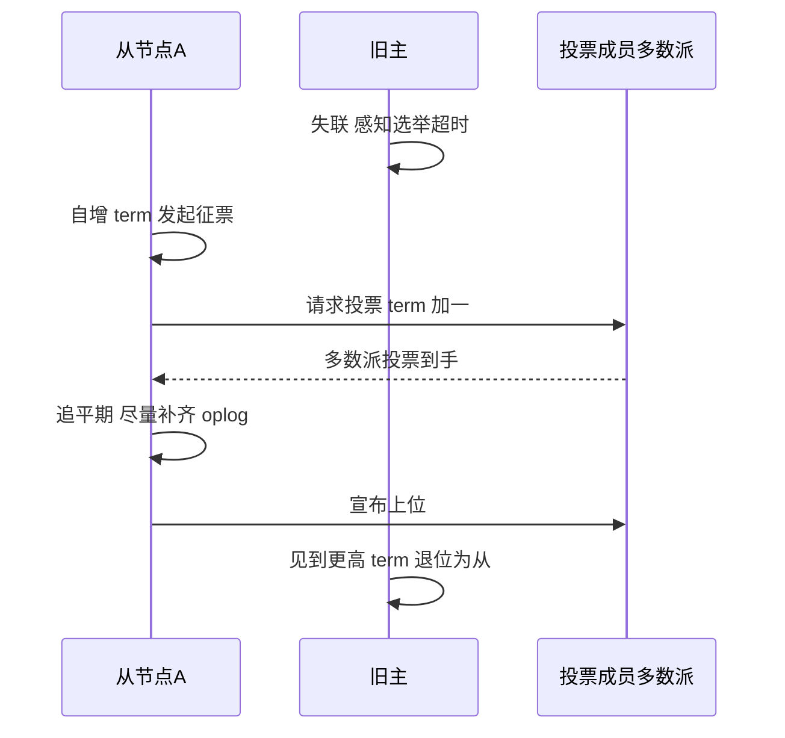
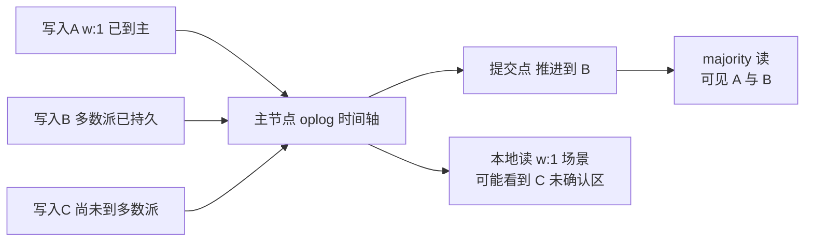

# 副本集 oplog 与选举深度：环形日志、Raft-like 协议与读语义

> 一句话：副本集的一切承诺——数据同步、故障切换、读什么算「已确认」——都挂在两个东西上：oplog 的环形覆盖写入，和 term + 多数派投票的选举协议。入门层讲过「oplog 同步 + 自动选举」是什么；本篇拆开讲它为什么幂等、term 为什么不可倒退、w:majority 到底承诺了什么、readPreference 五种模式各自在赌什么。

## 一句话摘要

副本集的机制主线可以压成四句：**① oplog 是环形覆盖写的有界日志**——固定容量（默认约 5% 可用磁盘，有下限，公开口径）、写满从头覆盖，记录的不是「操作意图」而是「幂等的结果形态」（自增转终值、集合运算转结果集），重放 N 次结果一致，这是从节点能安全追平的根基；**② 选举是 Raft-like 的 term + 多数派**——每轮选举 term 单调递增，拿到多数派投票者（最多 7 个投票成员）才能上位，旧主看到更高 term 立即退位，这套协议保证了同一 term 内只有一位主；**③ w:majority 定义了「确认线」**——写入被多数派持久才算确认，多数派提交点（commit point）之前的数据才对 majority 读可见，回滚只会发生在确认线之外；**④ 读语义由 readPreference × readConcern 两个正交旋钮决定**——前者选「谁读」（五种模式），后者选「读到哪个版本」（本篇重点讲与提交点联动的 majority 读），因果一致性会话用 afterClusterTime 把读写串成因果链。故障切换快不快，看选举超时与追平（catchup）阶段的赛跑。

## 5W 速记卡

| 维度 | 一句话 |
|---|---|
| What | oplog 环形日志 + term 多数派选举 + 提交点读语义 + 五种读偏好 |
| Why | 高可用自动切换、数据不丢由多数派定义、读扩展有边界 |
| When | 生产默认三节点 PSS（两数据 + 一投票）；arbiter 只是凑票工具不是数据副本 |
| Where | local.oplog.rs 集合；term 与提交点贯穿副本集所有节点 |
| How | 读扩展用 secondary 类读偏好 + maxStalenessSeconds；强一致用 majority 读 |

## 🎯 本文核心

**核心机制一句话**：oplog 用「幂等结果记录」保证追平安全，选举用「term 单调 + 多数派投票」保证同一任期内唯一主，w:majority 用「提交点」把多数派持久翻译成读可见性——三件事共享同一套时间戳体系，读偏好的选择只决定「谁读」，永远不改变「读到什么算一致」。

**机制链（全文按这条链展开）**：

同步靠什么（oplog 结构与幂等转换）→ 主挂了谁接（选举协议与 term）→ 什么才算「写成功」（writeConcern 与提交点）→ 读从哪读、读到多新（readPreference 与 readConcern）→ 前后一致怎么保证（因果一致性会话）

## 一、边界：入门层讲过什么，本篇挖什么

| 内容 | 已有篇目 | 本篇 |
|---|---|---|
| 副本集是什么、oplog 同步与自动选举的直觉 | 入门篇 2 | 不重复 |
| WiredTiger 引擎层持久化 | 本系列篇 1 | 不重复 |
| **oplog 为什么必须幂等、环形覆盖的代价** | 未讲 | **本文核心一** |
| **选举协议细节：term、多数派、追平** | 未讲 | **本文核心二** |
| **w:majority 的读语义与提交点** | 未讲 | **本文核心三** |
| **readPreference 五模式与因果一致性会话** | 未讲 | **本文核心四** |

## 二、oplog：环形覆盖写的幂等日志

### 2.1 结构与环形语义

oplog（local.oplog.rs）是一个固定上限的封顶集合：写入顺序追加，写满上限后**从头覆盖最老记录**——「环形」就是这个意思。每条记录带时间戳（秒 + 序号的组合键，保证同秒内有序）、term、操作类型（插入/更新/删除/DDL 等）与命名空间。从节点拉取 oplog 逐条本地重放，重放进度与主保持在一个可比较的时间轴上。环形覆盖的代价直接明了：**追不上就出局**——如果从节点落后太多，它需要的 oplog 段已被覆盖，只能触发初始全量同步（resync），这是运维里最贵的一种恢复。所以「oplog 窗口」（最老与最新记录的时间跨度）是容量规划的一部分：窗口必须大于「最慢从节点的最大可容忍落后时间」，业内惯例是给大批量作业留出足够的窗口余量。

### 2.2 幂等转换：重放 N 次结果一致

oplog 不记「$inc 加了 1」，而记「这个字段此刻等于几」——数值更新被转换成写入终值，集合类运算（加元素去重类）被转换成写入完整结果集。这样重放一次和重放 N 次结果完全相同（幂等），从节点中途崩溃重连、某条重放两次都不会错。

追问一层：**为什么不直接重放增量，省得转换？** 反方案分析：增量重放要求「重放次数恰好一次」的精确一次语义，而分布式日志拉取天然是「至少一次」（拉取进度与日志写入之间没有跨机事务）。与其给传输层造精确一次，不如让记录本身幂等——把复杂性从协议挪进记录格式，这是整套同步机制里最聪明的一笔设计思想：**用数据形态消化传输语义的不可靠**。

再深一层：幂等转换也有账单——「写终值」意味着主节点要保留更新前后的上下文，某些大文档的局部更新会在 oplog 里留下比操作本身更大的记录（公开口径的已知形态），oplog 窗口的容量规划要按记录体积估算而不是按操作条数。

## 三、选举协议：term、多数派与追平赛跑

### 3.1 协议骨架

MongoDB 3.2 引入、旧协议在 4.0 移除的复制协议（PV1，官方文档口径），形态上是 Raft 的同族——这套协议的演进方向很清晰：把「能看懂」放在第一位（Raft 论文的设计初衷），term 与多数派的骨架从引入至今保持稳定。**term 单调递增 + 多数派投票决定主**。流程：候选者自增 term 发起征票 → 多数派投票者（一个副本集最多 7 个投票成员，公开口径）各投一票且一个 term 只投一次 → 收获多数派者上位 → 上位前有一段追平期，尽量把落下的 oplog 从旧主或更完整的成员补齐。旧主一旦看到比自己更高的 term，立即退位为从——同一 term 内不可能有两个主，这就是「数据不会裂写」的协议根基。

### 3.2 追问链：参数背后的取舍

**追问一层：选举超时为什么默认 10 秒（electionTimeoutMillis，官方文档口径）？** 它是一场赛跑的发令枪：太短——网络抖动一次就换主，切换风暴伤业务；太长——真故障时业务干等。10 秒是「误判率 × 等待时长」的经验平衡点，高敏感业务可下调但必须先确认网络质量。

**再追问一层：为什么不选优先级最高的立刻上位，而要先追平？** 上位者的 oplog 越新，需要回滚的数据越少。追平期是「新可用性」与「旧数据保住」之间的缓冲带；优先级接管（priority takeover）机制允许高优先级成员在追平后接管，而不是跳过追平直接抢——顺序不能反，这是协议层写死的取舍。

**打破砂锅：投票成员为什么最多 7 个？** 投票成员越多，征票轮次与故障域越大，收益（可用性投票池）边际递减；7 个是协议定死的工程上限（公开口径），多于 7 个成员只能做无投票的数据节点。由此推出经典部署：**PSS 三节点（两数据一投票）是最小多数派安全的省本形态；PSA（一投票仲裁者挂数据侧）要小心 w:majority 在仲裁者失联时的确认延迟**——arbiter 没有 data，它只贡献票数。为什么不默认全用三数据副本？成本与多数派安全的平衡—— arbiter 的存在是成本约束下的反方案，有条件时业内惯例是回归纯数据节点投票。

## 四、w:majority 与读语义：什么才算「确认」

### 4.1 提交点：多数派持久的读可见性翻译

写关注（writeConcern）是写入方的承诺选择：w:1 表示主节点收到即可，w:majority 表示多数派成员已持久（配套本系列篇 1 的 journal 语义）。复制层把「已有多数派持久的最晚时间」维护成**提交点（commit point）**，它单调推进。readConcern majority 的读约束就是一句话：**只读提交点之前的数据**。于是三个承诺自动成立：majority 读不会读到未确认写入；已确认写入不会被 majority 读「看到又消失」；回滚只发生在提交点之外的区间。

### 4.2 追问：w:majority 是不是万能

反方案分析：**为什么不用所有写都 w:majority？** 每笔写都要等多数派确认，延迟下限被「跨节点 RTT」钉死；仲裁者失联或网络分区时，多数派凑不齐，写入直接不可用——可用性换了一致性。业内惯例是按数据分级：资金与状态类写 majority，埋点与日志类 w:1 甚至 w:0。**这不是孰优孰劣，是「这笔数据能接受回滚吗」的问题。** 再追问一层：**w:majority 一定不回滚吗？** 提交点内的数据理论上不受单次选举回滚影响；但「写入已确认」与「业务已读回」之间存在窗口，极端故障序列（多数派重建、备份恢复点选择）仍可能有业务层可见的丢失——**w:majority 把概率压到极低，不把「备份与对账」从清单上划掉**，这是生产复盘里反复出现的纪律。

## 五、readPreference：五种「谁读」的赌注

| 模式 | 读谁 | 赌注与代价 |
|---|---|---|
| primary | 只读主 | 一致性最强，主挂时读不可用 |
| primaryPreferred | 主优先，主不可用读从 | 平时一致，故障时悄悄降级到可能滞后的从 |
| secondary | 只读从 | 读扩展，但必然接受复制滞后 |
| secondaryPreferred | 从优先，无从读主 | 最常用的读扩展姿势 |
| nearest | 就近（含主） | 低延迟优先，读到谁「随缘」，一致性最弱 |

配套两个限位器：**maxStalenessSeconds**（给从节点的最大可容忍滞后设闸，下限 90 秒，官方文档口径）与 **tag set**（按机房/角色标签圈定读目标）。延迟窗口由驱动侧 localThresholdMS（默认 15 毫秒，公开口径）控制——「就近」的近是相对延迟，不是绝对距离。追问一层：**为什么 secondary 读默认不被推荐用于「读写分离提速」的万金油场景？** 因为它赌的是「滞后无感」：写后立即读的场景，从节点还没重放到那笔写，业务直接读丢——这就是「主从延迟读丢失」事故的标准成因。所以正确姿势是**按会话一致性需求拆读流**：写后立读走 primary（或因果一致会话），容忍滞后的报表与全文检索走 secondary 系。

**实践叙事一**（行业常见模式匿名化）：某内容平台把评论列表读切到 secondaryPreferred 上线当晚，客服收到「刚发的评论刷新就没了」类反馈。排查动线：对比主从复制滞后指标，发现高峰期滞后秒级，而产品流是「发完立刻看列表」的写后立读形态；处置是把评论列表读回 primary、只把检索与聚合读留在从节点，滞后投诉归零。复盘结论：**读偏好的选择不是性能问题，是「业务流对滞后的容忍度」问题——先画写后立读链路，再谈读写分离。**

**实践叙事二**：某集群 arbiter 与数据节点混布在同可用区，一次机房级故障中 arbiter 与一位数据成员同时失联，w:majority 写入全部阻塞、业务写不可用。复盘把部署矩阵改成「三数据节点分三可用区」，arbiter 退役；复盘沉淀：**投票成员的故障域必须与多数派数学对齐——arbiter 是票，不是可用性。**

## 六、因果一致性会话：把读写串成一条因果链

分布式读扩展的最后一公里是「跨节点的前后一致」：用户改了昵称，下一个请求被路由到滞后的从节点，看到旧昵称——单次读都没错，连起来却是矛盾的。因果一致性会话（causally consistent sessions，官方文档口径）的机制：会话内的每个操作都携带集群时间戳，读操作声明「必须读到因果链上不早于此点」（afterClusterTime 语义），驱动把主从路由与等待逻辑接起来。配套约束：读关注需用 majority 一档起步，写关注 w:1 起步——用「等待提交点推进」换「读自己的写、单调读、写后读、单调写」四条保证。代价同样是明码的：每次读可能要等目标节点追到指定时间点，延迟上浮；写后立读强场景，等待等价于复制滞后的上限。回望这段机制的演变轨迹：从「应用自己容忍滞后」到「平台层给会话因果序」，是分布式数据库把一致性责任逐步上收的典型一跃。

设计思想层面，这套机制和 oplog 幂等是同一哲学的两次落地：**不给每笔请求造全局强一致，而是把「一致」拆成会话内的因果序 + 跨会话的最终一致**——大多数业务矛盾只发生在同一用户的操作序列内，为这一段付强一致的账就够了。

## 七、不同量级的思考：架构约束驱动解法

- **十万级（读压几乎全在主上）**：约束来自「读扩展需求还没出现」——默认 primary 读 + 一次选举参数评审就够，这一档的核心问题是「哪些读是写后立读」，而不是「要不要读写分离」；思考方式是「链路画像」驱动
- **百万级（读 QPS 开始压垮主）**：约束来自「主从滞后变成常态」——secondary 系读偏好 + maxStalenessSeconds + 写后立读链路识别是标配动作，这一档的核心问题是「哪些流能容忍秒级滞后」，而不是「再挂几个从节点」；思考方式是「容忍度分级」驱动
- **千万级（故障切换与多数派成为可用性瓶颈）**：约束来自「跨可用区 RTT 进入写入延迟与选举计算的乘法」——部署拓扑（数据节点分可用区、arbiter 退役）与 w 级别按数据分级是主战场，这一档的核心问题是「每类数据的确认线该多高」，而不是「选举超时再调小一点」；思考方式是「确认线定价」驱动
- **亿级（副本集单写点封顶）**：约束来自「一切写都过主节点」——复制再漂亮也只有一个可写点，容量与写吞吐的解在分片（本系列篇 3），这一档的核心问题是「这个写量还该单副本集吗」，而不是「主节点还能再优化吗」；思考方式是「绕开单写点」驱动

思考方式总结：十万级靠链路画像，百万级靠容忍度分级，千万级靠确认线定价，亿级靠绕开单写点——复制层解决「高可用」，永远不解决「写容量」，这是这一层的边界。

**自下而上与触发升级**：先用「主从滞后曲线 + 写后立读链路清单」定位当前档位，再决定动作。触发升级的信号：读延迟投诉出现「刚写的东西不见了」（进百万档）、跨可用区部署后 w:majority 延迟明显抬升（进千万档）、主节点写入吞吐逼近上限且无优化空间（进亿档）——信号出现即换档思考，别在复制层找分片层问题的答案。

## 八、源码与关键路径：模块级穿透

复制与选举逻辑在 MongoDB 主仓库（源码目录按仓库根相对路径）：

| 机制 | 关键路径 | 说明 |
|---|---|---|
| oplog 写入与幂等转换 | src/mongo/db/repl/ 下 oplog 相关实现 | 更新转终值的记录生成 |
| 选举状态机 | src/mongo/db/repl/ 顶层的 elect 与 topology 协调实现 | term 管理、征票、多数派计算 |
| 提交点推进 | src/mongo/db/repl/ 的复制协调模块 | 多数派持久到读可见的翻译层 |
| 从节点拉取重放 | src/mongo/db/repl/ 的 sync 源反馈实现 | 拉取进度与重放进度分离 |
| 读偏好路由 | 驱动侧（各语言驱动）+ mongos/服务层 maxStaleness 逻辑 | 五种模式的选择算法在驱动 |

读法建议：顺着「一笔 w:majority 写入的生命周期」走——主节点 oplog 落笔 → 从节点拉取重放 → 多数派确认回执 → 提交点推进 → majority 读可见。这条链串起 oplog、选举、提交点三个模块，比孤立读协议文档扎实得多。

## 九、业内惯例与生产实践

- **PSS 三数据节点为默认**：条件允许时不省这笔钱，arbiter 只留给「票够、数据贵」的成本敏感场景——多数派数学不该为省钱让路。
- **oplog 窗口纳入容量规划**：大批量作业（历史归档、批量更新）前估算 oplog 消耗，窗口余量不足先扩——resync 是最贵的恢复路径。
- **选举超时按网络质量定**：跨机房部署适当上调，单机房低延迟环境可下调——10 秒默认值不是普适答案，误判与等待的平衡点因部署而异。
- **读偏好按业务流拆**：写后立读走 primary 或因果一致会话，检索/报表/风控扫描走 secondary 系——「一刀切读写分离」是滞后事故的高发配置，这个教训在读写分离架构的多年演变里被反复验证。
- **w:majority 之外仍有备份与对账**：确认线降低回滚概率，不豁免「定期演练恢复」的义务。

## 💡 实战提示

- 💡 **监控三件套：复制滞后、oplog 窗口、writeConflicts 之外的 relect/选举事件流**——副本集故障几乎都先在这三个指标上留痕，再看应用侧症状。
- 💡 **arbiter 部署前先画故障域矩阵**：投票成员与数据成员的可用区分布决定多数派在哪些组合故障下还活着——票数数学不对齐拓扑，arbiter 就是负资产。
- 💡 **写后立读链路单独标注**：code review 与设计评审里把「写完立刻读」的路径显式标出来，它们是读偏好选型的第一约束。
- 💡 **w 级别按数据分级**：资金状态 majority、日志埋点 w:1——全库 majority 是延迟税，全库 w:1 是回滚赌注。
- 💡 **选举演练进例行**：定期主动触发主节点切换，验证应用的重连、重试与幂等——切换能力不用就等于没有。

## 什么时候用/不用：读写语义决策表

| 场景 | 推荐配置 | 不建议 |
|---|---|---|
| 常规业务（读写混布主上） | primary 读 + 默认 w:1 或按敏感度 majority | 无脑全链路 majority |
| 报表/检索读扩展 | secondaryPreferred + maxStalenessSeconds | 把写后立读流也切去从节点 |
| 资金/库存状态写入 | w:majority（+j 视持久化诉求） | w:0 或 w:1 裸奔 |
| 跨用户实时协作场景 | 因果一致会话兜住会话内因果 | 期望跨会话全局线性一致 |

明确推荐一句话：**PSS 三数据起步、读流按容忍度拆分、写按数据分级选确认线、切换演练例行化**——副本集的可靠性是「配置 + 演练」的乘积，缺一项都是空转。

## Trade-off：读语义与确认线的账单

| 选择 | 收益 | 代价 | 反噬场景 |
|---|---|---|---|
| w:majority | 几乎不回滚、majority 读语义完整 | 延迟抬升、多数派失联写阻塞 | arbiter 故障域错配时全库写不可用 |
| w:1 | 写延迟最低 | 主切换可能回滚 | 用户已见数据「消失」 |
| secondary 读 | 读吞吐横向扩展 | 滞后读丢失风险 | 写后立读链路被误切 |
| 因果一致会话 | 会话内四条因果保证 | 读等待上浮、仅会话内有效 | 被当成全局线性一致用 |
| arbiter | 省数据成本凑多数派 | 无数据冗余、故障域易错配 | 混布同可用区形同虚设 |

## 你们可能会问

**Q1：oplog 被覆盖导致 resync，能提前预知吗？**
能。oplog 窗口时长与从节点滞后时长是可以持续对比的两个指标——滞后逼近窗口就该告警，而不是等覆盖发生了再救。批量作业前做「窗口消耗预估」是更低成本的做法。

**Q2：w:majority 写入确认了，为什么还要备份？**
确认线承诺的是「集群内多数派持久」，不覆盖「多数派被逻辑损坏」（误删库、错误批量写）与「恢复点选择」这类故障——备份防的是另一类故障，两者是并列关系不是替代关系。

**Q3：因果一致会话和事务是什么关系？**
会话解决「读写顺序的可预期」，事务解决「多文档原子提交」——正交能力，可以组合使用。因果会话保证你读得到自己刚写的，事务保证一组写要么全有要么全无（事务的细节在入门篇 4 有边界讨论）。

**Q4：nearest 模式适合什么业务？**
对「读到多新」完全无感、对「延迟」极度敏感的读流——典型如灰度抽样、健康探测类只读流量。一旦业务存在「写后要看到」的路径，nearest 就是事故选项。

**Q5：选举期间写入和读取分别发生什么？**
无主窗口内写入不可用（没有主可写）；读取决于读偏好——primary 读直接报错重试，secondary 系读继续服务。这也是「把所有读压在主上」的业务在切换期全量可感的机制原因。

## 开放问题

- 可调写关注与「用户可感知确认」的映射是否应该下沉到中间件层统一治理——各业务自选 w 级别的自由度与全局延迟预算之间的矛盾，业内尚无标准答案。
- 因果一致性会话的「会话边界」与微服务调用链的天然错位（一次用户操作跨多个服务进程）如何优雅承接，值得在架构层继续观察。

## 🎯 核心带走

**30 秒复述**：oplog 是环形覆盖的幂等日志（写终值不写增量，追不上就 resync）；选举是 term 单调 + 多数派投票 + 追平期赛跑（同一 term 唯一主）；w:majority 把「多数派持久」翻译成提交点，majority 读只看提交点内的数据；readPreference 五模式只决定「谁读」，读一致性由 readConcern 与因果会话兜住。**失效点**：oplog 窗口被批量作业吃穿、arbiter 故障域错配、写后立读误切从节点、把 majority 读当全局线性一致。金句带走：

> **oplog 幂等化是用数据形态消化传输不可靠——分布式系统里最便宜的可靠性，是把一次性的要求从协议里删掉。**

> **readPreference 决定读得快不快，readConcern 决定读得对不对——两个旋钮，别用一个去赌另一个。**

## 自测三问

1. oplog 为什么记终值而不记增量？不这么记会出什么事？（答：重放是至少一次语义，增量重放需要精确一次；记终值使重放 N 次结果一致——见 2.2）
2. 提交点是什么？majority 读和它什么关系？（答：多数派已持久的最晚时间且单调推进；majority 读只见提交点之前的数据——见 4.1）
3. 「刚发的评论刷新就没了」这类问题，排查第一步看什么？（答：先确认读流是否写后立读被切到滞后从节点，再看复制滞后曲线——见 5 的实践叙事）

## 📌 数据与事实声明

- 版本口径：PV1 协议 3.2 引入且旧协议 4.0 移除、投票成员上限 7、electionTimeoutMillis 默认 10000、oplog 默认约 5% 可用磁盘、maxStalenessSeconds 下限 90 秒、localThresholdMS 默认 15 毫秒、因果一致会话要求 majority 级读关注——均出自 MongoDB 官方文档（截至 2026-09）。
- 复制滞后与延迟影响量级为行业认知经验值；两则实践叙事为行业典型模式的匿名化重建，不含真实公司与生产数据。

## 📚 参考资料

| 来源 | 内容 |
|---|---|
| MongoDB 官方文档 Replication / Read Preference / Causal Consistency / Write Concern 章节 | 协议、参数默认值与语义口径 |
| MongoDB 官方博客：Replica Set Elections 与 Raft 相关公开文章 | 选举协议的设计解读 |
| Raft 共识论文（In Search of an Understandable Consensus Algorithm, 公开论文） | term/多数派机制的学术原型 |
| 《MongoDB 权威指南》（第 3 版）复制章节 | oplog 与副本集机制综述 |
| 关联篇目：本系列篇 1《WiredTiger 存储引擎深度》、篇 3《分片架构与 chunk 治理深度》 | 引擎层持久化与集群层扩展承接 |
