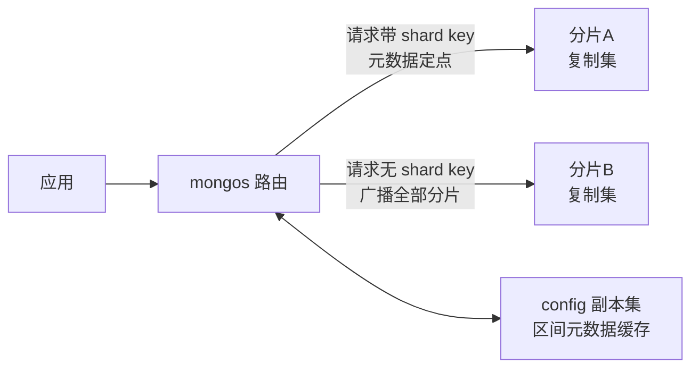
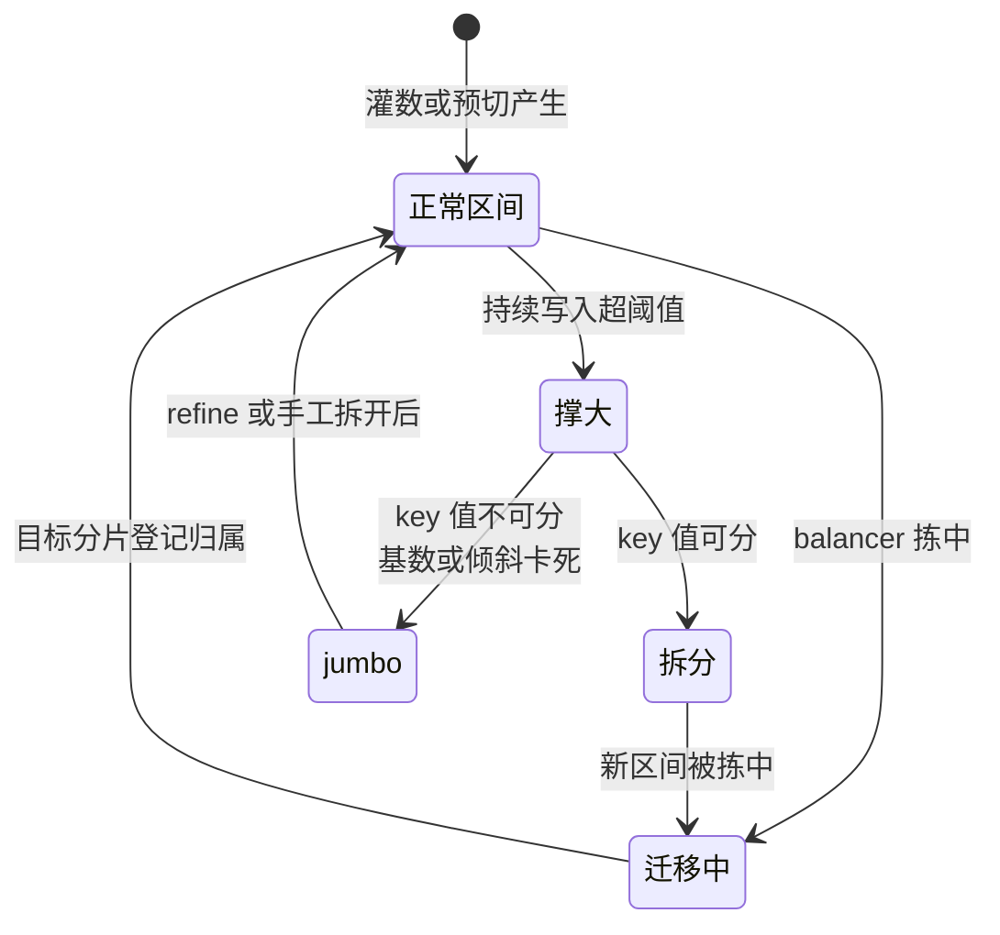
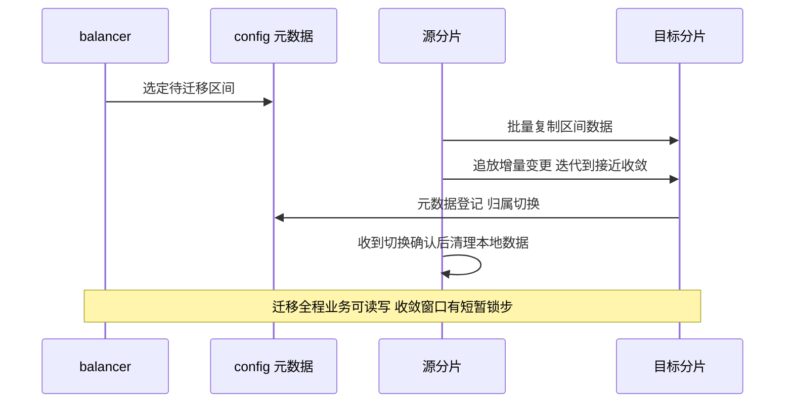
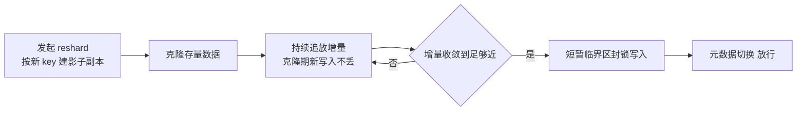

# 分片架构与 chunk 治理深度：路由、shard key、jumbo chunk 与 reshard

> 一句话：分片层的一切问题——查询打到哪、数据歪在哪、迁移卡在哪——都能追溯到两个决策：shard key 怎么选，chunk 怎么管。入门层讲过「shard key 决定一切」的结论；本篇拆开讲 mongos 怎么定位、ranged 与 hashed 各自赌什么、jumbo chunk 事故怎么解、balancer 窗口怎么排、reshard 与 pre-split 两条后路各自通向哪里。

## 一句话摘要

分片架构是三件套的分工：**mongos 做无状态路由**（带 shard key 的请求定点投递，不带的广播全分片——targeting 一词定生死），**config server 副本集存元数据**（集合怎么分、每个区间在哪个分片，全在这里），**shard 就是复制集**（本系列篇 2 的机制在每个分片内独立运转）。数据被按 shard key 切成一个个区间（chunk，新版本口径也叫 range）分布到各分片，balancer 在后台搬移区间维持均衡。机制层面的三个关键取舍：**① shard key 选 ranged 还是 hashed**——前者保范围查询的定点能力但写热会集中到单一分片，后者打散写入但把范围查询变成广播；**② chunk 会膨胀成 jumbo**——单个区间超过阈值且拆不开时 balancer 跳过它，数据歪斜从这里开始；**③ 后路有两条**——5.0 起的 reshardCollection 可以在线换 shard key（克隆 + 追增量 + 短暂封锁切换），建集合初期的 pre-split 则让数据从第一天就摊开，避开「全写进一个初始 chunk 再靠拆分追赶」的经典泥潭。

## 5W 速记卡

| 维度 | 一句话 |
|---|---|
| What | mongos 路由 + config server 元数据 + 分片级复制集的三件套横向扩展层 |
| Why | 单副本集写吞吐与容量封顶之后，唯一的产品内建扩容路径 |
| When | 写吞吐或数据量逼近单实例边界才上——分片是成本不是荣誉 |
| Where | mongos 接应用、config 副本集存 chunks/collections 元数据、shard 存数据 |
| How | shard key 三问：查询模式匹配吗？写会热集中吗？基数够大吗？ |

## 🎯 本文核心

**核心机制一句话**：分片层的性能 = 路由的「定点率」（多少请求能带 shard key 直达目标分片）× 均衡的「流畅度」（chunk 拆得开、搬得动）——shard key 决定前者，chunk 治理决定后者，reshard 与 pre-split 是两条分别修复「选错」与「没预判」的后路。

**机制链（全文按这条链展开）**：

请求怎么找到分片（mongos 路由与 targeting）→ 数据怎么切开分布（ranged vs hashed 与 chunk）→ 均衡怎么维持（balancer 与迁移流程）→ 均衡怎么卡死（jumbo chunk 事故）→ 选错了怎么改（reshard）→ 上线前怎么避免（pre-split）

## 一、边界：入门层讲过什么，本篇挖什么

| 内容 | 已有篇目 | 本篇 |
|---|---|---|
| 分片是什么、shard key 决定一切的直觉 | 入门篇 2 | 不重复 |
| 复制集内部机制（oplog/选举） | 本系列篇 2 | 不重复 |
| **mongos 路由的 targeting 细节** | 未讲 | **本文核心一** |
| **hashed vs ranged 的机制取舍** | 未讲 | **本文核心二** |
| **jumbo chunk 与 balancer 治理** | 未讲 | **本文核心三** |
| **reshard 与 pre-split 的流程与代价** | 未讲 | **本文核心四** |

## 二、三件套与路由：targeting 定生死

### 2.1 一次请求的旅程

mongos 自己不存数据：启动后从 config 副本集拉取元数据缓存（区间边界与归属），后续按请求里的 shard key 条件做「区间定位」——一步直达持有该区间的分片；路由层多年演变的主线就是让缓存更准、切换更平滑。没有 shard key 条件的请求无法定位，只能**广播**给所有分片再把结果汇聚（scatter-gather）：延迟由最慢的分片决定，资源开销按分片数放大。更隐蔽的一类是「shard key 前缀不全」：复合 shard key 只带了第二个字段的查询同样无法定点——**定点能力按 shard key 的前缀匹配打折**。

### 2.2 追问：为什么不在 mongos 做更聪明的查询改写

反方案分析：**为什么不让 mongos 自动改写查询、兜住没带 shard key 的请求？** 因为「哪个分片有这行数据」的答案在元数据里，而元数据只按 shard key 组织——不带 key 的条件在元数据层面无解，任何「聪明」都只是把广播换了个说法。这个边界是分片体系的第一条设计思想：**路由的成本模型在写入那一刻（选 key）就已经定价，查询时无解**。生产上可观测的对应物是 explain 输出里 targeted vs 广播的形态标注——定时巡检「广播查询占比」，是分片集群健康度检查的第一项（业内惯例）。

## 三、shard key：ranged 与 hashed 的对赌

### 3.1 两种切法的机制形态

| 维度 | ranged（范围切分） | hashed（哈希切分） |
|---|---|---|
| 切分依据 | key 的取值区间 | key 哈希后的取值区间 |
| 写入分布 | 随 key 分布，单调 key 热集中 | 均匀打散，写入热点天然消解 |
| 范围查询 | 定点直达，效率高 | 退化为广播（哈希打乱顺序） |
| 点查 | 定点 | 定点 |
| 典型场景 | 时间序列冷热分层、按租户隔离 | 高并发写入的流水/日志类 |

两种切法是同一张表的两面：**ranged 赌「查询按范围来」，hashed 赌「写入要摊平」**。选错不是性能差一点的事，是定点率塌方或写入热点二选一的事。

### 3.2 追问链：单调 key 的热点机制

**追问一层：为什么自增时间戳做 ranged key 一定写热？** 所有新写入的 key 都落在区间轴的最右端——永远命中持有「最右区间」的那一个分片，balancer 搬得再勤也只是在追着热点搬家，写入永远集中。机制上这与分片数无关，是 key 分布形态决定的。

**再追问一层：那 hashed key 一劳永逸吗？** 它的代价在查询侧：范围条件（时间段查询）在哈希轴上是随机散点，只能广播；另外 hashed 单字段 key 的第二个问题是「基数与倾斜」——key 取值种类太少（比如状态字段），哈希也救不了低基数。所以业内沉淀的复合 key 惯例（公开口径的常见模式）是「哈希字段打散写入 + 附加字段保基数」，或反过来「范围字段服务查询 + 高基数字段防倾斜」——**组合的优先级取决于你的读写画像，不存在通用最优解**。

**打破砂锅：能不能先 ranged 后期再改 hashed？** 传统上 shard key 建了就不能改，只能导出重灌（最贵的一条路）；5.0 起 reshardCollection 提供了在线换 key 的通道（下文第六节）。但 reshard 不是免费的后悔药——它的成本与停写窗口风险都真实存在，选 key 的第一版仍然值得认真，而不是「反正能 reshard」。

## 四、chunk 治理：balancer、迁移与 jumbo 事故

### 4.1 区间的生命周期

数据按 shard key 切成区间（早期口径叫 chunk；6.0 起文档口径以 range 为主，chunk 尺寸默认也有上调，公开口径以官方文档为准）。从 chunk 到 range 的术语演变，本身就是这套元数据机制多年演进的注脚。区间不是静态的，它有完整的生命周期：

balancer 的目标是「分片间区间数均衡」，可以配置在业务低谷窗口运行（balancingWindow），6.0 起均衡器改为按集合并发迁移（公开口径），大集合的均衡不再被小集合阻塞。

### 4.2 jumbo chunk：均衡的卡点

迁移有尺寸上限：超过阈值的区间无法在一次迁移里完成，且拆分条件不满足（所有文档 shard key 值相同）时，会被标记为 **jumbo**——balancer 直接跳过。于是出现「区间数均衡了、数据量没均衡」的歪斜：某个分片上挂着一个巨型 jumbo，读写压力独木桥。这个故障的标准成因高度收敛：**shard key 基数不足或倾斜**（比如用「城市」做 key，超大城市聚成一个拆不开的区间）。

**实践叙事一**（行业常见模式匿名化）：某集群按业务日期字段做 ranged key，运行一年后热分片磁盘占用远超其他分片，均衡器显示「无待迁移区间」。排查动线：检查均衡器状态发现大量 jumbo 标记，定位到「某几个热点日期 + 固定业务前缀」的区间内 key 值高度重复、无法拆分；临时手段是手工拆分点 + 清除 jumbo 标记，根治是后续用 refineCollectionShardKey（5.0+，给既有 key 追加后缀字段提升基数）改造。复盘结论：**jumbo 不是运维事故，是 key 设计事故的延迟显形——看到 jumbo 先审 key 基数，别只忙着清标记。**

### 4.3 追问：为什么不在迁移时把大区间切开再搬

反方案分析：**为什么不让 balancer 边搬边拆？** 拆分是写路径上的元数据操作，迁移本身已是「复制 + 追增量 + 元数据切换」的重流程，两者叠加会把失败半径放大（拆一半 + 搬一半的状态修复极其复杂）。机制选择是**关注点分离**：拆分归拆分（写路径触发）、迁移归迁移（均衡器驱动）、jumbo 是两者失配时的显式报警——宁可卡住让人看见，不做自动化里的隐性复合事务。这个设计取舍背后是元数据系统的铁律：**config 元数据的每次变更都必须原子且可回滚，复合操作是它的天敌**。

## 五、balancer 窗口与迁移节流：把搬运成本管起来

迁移不是免费的：源分片要读出数据，目标分片要写入，两边都耗 IO 与 cache（本系列篇 1 的页压力机制在此叠加），追增量阶段还拉长 oplog 消耗（窗口规划连接本系列篇 2）。三个治理旋钮：

- **balancingWindow**：把均衡搬移动到业务低谷，代价是白天积累的歪斜要等到窗口才收敛——突发倾斜的响应延迟要纳入评估；
- **迁移节流参数**：控制迁移占用的资源上限，避免均衡本身把业务打伤——「均衡器伤业务」的告警多数是节流没配；
- **按集合启停均衡**：新集合灌数期临时关均衡（配合 pre-split 先摊平），避免 balancer 与灌数流互相踩踏。

**实践叙事二**：某集群夜间批量 ETL 与 balancer 窗口重叠，凌晨磁盘 IO 打满、ETL 时长翻倍。排查动线：IO 曲线与迁移日志时间戳对齐，确认是迁移流量与批处理挤兑；处置是把窗口后移 + 给迁移加节流，ETL 时长回落。复盘沉淀：**balancer 是个「勤劳但不看路况」的工人——窗口与节流就是你替它看的路况。**

## 六、reshard 与 pre-split：两条后路

### 6.1 reshardCollection：在线换 key

5.0 起的在线 reshard 流程（官方文档口径）是一条「影子副本 + 追增量 + 切换」的状态机：

收益明显：不停机换 key。代价同样要记账：全程需要约双倍存储空间、克隆期 oplog 消耗陡增、临界区时长取决于收敛进度（key 选得越差、写入越猛，临界区越长）。为什么不选导出重灌（另一种做法）：重灌要停写 + 全量迁移 + 回切验证，周期以天计；reshard 把它压缩成「后台跑 + 秒级到分钟级临界区」——但**大集合的 reshard 依然是要提前报备的重操作，不是随手执行的日常维护**。7.x 版本线上还补上了反向操作（把分片集合退回非分片形态的 unshard 能力，公开口径按版本确认），reshard 家族的拼图在补全。

### 6.2 pre-split：上线前先摊平

新建分片集合时数据从单个初始区间开始生长：ranged key 场景下全量写入先挤在一个分片，靠自动拆分 + balancer 追赶摊平——追赶期就是热分片期。pre-split 的做法是灌数前按预估的 key 分布**预先划好区间边界**（或配合哈希预切分/zone 方案），让写入从第一天就分散到各分片。它的适用边界也很清楚：**适合「可预估 key 分布」的初始灌数**（历史数据迁移、新集群上线）；对不可预估的渐增数据，盲目 pre-split 只是徒增元数据——此时默认的「写入 + 自动拆分」反而更诚实。为什么不用「先灌完再靠 balancer 搬」（另一种做法）：灌数期的写热点会让单分片承压到瓶颈，balancer 的迁移速度追不上写入速度，追赶期被拉长数倍——预判比追赶便宜，这是分片治理里最值得内化的一句。

### 6.3 zone sharding：定向放置的补充解

zone（区域/分区间）机制给「数据该住在哪」提供了定向表达：按 key 区间打标签并绑定到指定分片子集——多机房部署的数据就近、冷热分层（热数据上好盘）、多租户隔离，都是 zone 的标准用法。它与 balancer 的关系：均衡器只在 zone 内部维持均衡，不跨 zone 搬——**zone 是把「均衡」升级成「先定向、再均衡」**。

## 七、不同量级的思考：架构约束驱动解法

- **十万级（单实例尚有余量）**：约束来自「分片的固定成本（mongos/config/运维复杂度）还没被摊薄」——这一档的核心问题是「还有单实例优化空间吗」，而不是「分片参数怎么调」；思考方式是「延期判断」驱动
- **百万级（刚上分片或准备上）**：约束来自「key 选择一次性定价」——读写画像分析、ranged/hashed 决策、pre-split 预案都在这一档做完；这一档的核心问题是「这个 key 两年后还成立吗」，而不是「先分了再说」；思考方式是「画像定价」驱动
- **千万级（数据量与迁移成为日常摩擦）**：约束来自「chunk 生命周期管理的持续成本」——jumbo 监控、balancer 窗口、灌数期的均衡启停是例行功课；这一档的核心问题是「歪斜被什么指标第一时间暴露」，而不是「又该手工搬哪个区间」；思考方式是「指标巡检」驱动
- **亿级（单集群也到边界）**：约束来自「元数据规模与跨分片广播的物理上限」——解法在应用层：更细的租户拆分、按业务域再分集群、查询侧收敛广播；这一档的核心问题是「这个规模该是几个集群」，而不是「再加分片」；思考方式是「拓扑拆分」驱动

思考方式总结：十万级靠延期判断，百万级靠画像定价，千万级靠指标巡检，亿级靠拓扑拆分——分片层的约束从「要不要用」逐级上移到「怎么拆才不后悔」，越早的决策权重越大。

**自下而上与触发升级**：用「广播查询占比 + 分片间数据量方差 + jumbo 计数」三个指标定位当前档位。触发升级的信号：广播占比持续走高（key 与查询画像脱节，进百万档档位复查）、jumbo 出现且增长（进千万档，审 key 基数）、单集群元数据或广播延迟逼近业务红线（进亿档，讨论拓扑拆分）——别跳档救火，先让指标告诉你身处哪一档。

## 八、源码与关键路径：模块级穿透

分片相关实现按 MongoDB 主仓库目录（模块级穿透）：

| 机制 | 关键路径 | 说明 |
|---|---|---|
| mongos 路由 | src/mongo/s/ 目录（路由服务层） | targeting、广播汇聚、元数据缓存 |
| 元数据目录 | config 库的 collections/chunks/shards 集合 | 区间边界与归属的真相源（6.0 起按 range 组织，公开口径） |
| 均衡器 | src/mongo/s/balancer/ 相关实现 | 迁移决策、窗口与节流执行 |
| 迁移协议 | src/mongo/db/s/ 下的迁移命令族 | 克隆、追增量、临界区切换三阶段 |
| reshard | src/mongo/db/s/resharding/ 相关实现 | 影子副本、追增量、切换状态机 |
| 拆分与 jumbo 标记 | 拆分命令与元数据维护路径 | 拆分条件判定、jumbo 标记落库 |

读法建议：顺着「一次广播查询为什么慢」与「一个区间从生到灭」两条线各走一遍——前者把 mongos 与元数据读通，后者把拆分/迁移/均衡读通，分片层的模块边界自然清晰。

## 九、业内惯例与生产实践

- **广播查询占比纳入周报**：分片集群的第一健康指标——占比抬头先查「谁在绕过 shard key 查询」，而不是先扩容。
- **key 上线前过三问评审**：查询模式匹配？写入会热集中？基数是否够大？三问有一问答不上来就先补数据画像——key 是分片层最贵的决策。
- **jumbo 计数告警**：出现即审 key 基数，清标记只是手段不是终点；基数不足时 refineCollectionShardKey（5.0+）是比重灌便宜的根治路径。
- **灌数与均衡互斥**：大批量灌数期间关闭该集合均衡 + pre-split 预摊，灌完再开——balancer 与灌数流的踩踏是可预见的坑，不值得现场踩一遍。
- **reshard 当重操作报备**：双倍存储、oplog 消耗、临界区风险三项进变更单，宁可流程重也不裸奔。

## 💡 实战提示

- 💡 **explain 先看 targeted 还是广播**：分片集群里每条慢查询的第一分叉就是路由形态——广播型慢查询调索引是白费劲，先让请求带上 shard key。
- 💡 **复合 key 的字段顺序按读写画像排**：查询等值字段在前、打散/防倾斜字段殿后——顺序错了定点率与打散度一起塌。
- 💡 **单调递增字段做 ranged key 必热**：时间戳/自增主键这类 key，要么 hashed 打散、要么复合 key 掺入离散字段——没有第三种侥幸。
- 💡 **zone 是就近与分层的正解**：多机房就近、冷热分层别再用 balancer 硬调，zone 定向放置一次配平。
- 💡 **balancer 窗口与批处理错峰**：迁移 IO 与 ETL/备份的挤兑是可预见的，窗口规划表里给彼此留位。

## 什么时候用/不用：分片与 key 决策表

| 场景 | 推荐路径 | 不建议 |
|---|---|---|
| 数据量/写吞吐未到单实例边界 | 不分片，继续纵向与索引优化 | 「提前分片图安心」——固定成本白付 |
| 高并发写入 + 点查为主 | hashed key（或含哈希字段的复合 key） | 单调字段 ranged——写热锁死 |
| 范围/时间段查询为主 | ranged key + 冷热 zone 分层 | hashed key——范围查询全广播 |
| key 选错且集合巨大 | reshard 报备执行，选低峰窗口 | 导出重灌当第一选择、reshard 裸奔无报备 |
| 新集群历史数据灌入 | pre-split 预摊 + 灌数期关均衡 | 先灌完等 balancer 慢慢搬 |

明确推荐一句话：**不提前分片、key 按画像定价、jumbo 当 key 设计事故对待、reshard 走报备**——分片层的每一条惯例都在替你省「最贵的回头路」。

## Trade-off：分片层每个选择的账单

| 选择 | 收益 | 代价 | 反噬场景 |
|---|---|---|---|
| ranged key | 范围查询定点、冷热分层友好 | 单调 key 写热集中 | 时间序列热分片独木桥 |
| hashed key | 写入天然摊平 | 范围查询广播、有序扫描失效 | 报表时段查询全量扫射 |
| 均衡窗口 | 迁移避开高峰 | 白天歪斜延迟收敛 | 突发倾斜等到窗口才救 |
| reshard 在线换 key | 不停机纠错 | 双倍存储 + 临界区风险 | 大集合 + 写入高峰期执行 |
| pre-split | 上线即摊平 | 依赖 key 分布可预估 | 盲目预切徒增元数据 |
| zone 定向 | 就近/分层/隔离 | 规划复杂度上升 | zone 划分与流量画像脱节 |

## 你们可能会问

**Q1：mongos 挂了怎么办，要不要部署很多个？**
mongos 无状态（元数据从 config 拉），可以随应用或独立部署多个做负载均衡——挂一个路由层不影响数据层，应用侧连接串配多个 mongos 即可。它的部署数量对齐应用连接规模，不是对齐数据规模。

**Q2：jumbo 标记清掉后 balancer 就会搬它吗？**
不一定。清标记只是解除「跳过」状态，能否迁移仍受尺寸上限约束——超限区间要么先拆分、要么 refine key 提升基数让拆分可行。清标记之前先回答「它现在拆得开吗」。

**Q3：reshard 期间业务能感知到什么？**
克隆与追增量期正常读写；收敛后的临界区有一次短暂写封锁（通常秒到分钟级，取决于收敛进度）。提前报备 + 选低峰窗口 + 预估临界区时长，是把它变成「无感」的三件事。

**Q4：shard key 能用业务上会更新的字段吗？**
不建议（机制上部分场景受支持但代价大）：更新 shard key 值意味着文档可能跨分片搬家，单次更新被放大成「删旧 + 写新 + 元数据变更」的迁移语义。key 选「业务身份恒定」的字段（租户、归属、不可变标识）是惯例。

**Q5：config 副本集挂了集群还能跑多久？**
mongos 有元数据缓存，短时依赖缓存服务；涉及元数据变更的操作（拆分、迁移、DDL）与缓存失效后的新路由会受阻。config 副本集是「分片层的多数派」——它的可用性治理直接套用本系列篇 2 的副本集纪律。

## 开放问题

- 6.0 起的 range 化元数据与按集合并发均衡改变了 chunk 治理的不少细节，「chunk」这个词正在被「range」替代——治理口径随版本漂移，实践文档需要标注版本锚点。
- 在线 reshard 的临界区能否被「双写切换」类应用层方案进一步压缩——平台能力与应用层兜底的分界线，值得在大集合场景继续验证。

## 🎯 核心带走

**30 秒复述**：分片三件套里 mongos 只做路由（targeting 定点率定生死），config 存元数据，shard 是复制集；shard key 在 ranged（范围定点、单调写热）与 hashed（写入摊平、范围广播）之间对赌；chunk 治理的卡点是 jumbo（key 基数事故的延迟显形），balancer 靠窗口与节流管住搬运成本；选错 key 用 reshard 在线纠（双倍存储 + 临界区），上线前用 pre-split 预摊。**失效点**：广播占比失控、单调 key 热分片、jumbo 堆积、灌数与均衡踩踏。金句带走：

> **路由的成本在选 key 那一刻定价，查询时无解——分片层的性能问题，多数是 key 的问题。**

> **预判比追赶便宜：pre-split 一次配平，胜过 balancer 追着热点跑一年。**

## 自测三问

1. 带 shard key 与不带 shard key 的查询，路由成本差在哪？（答：定点直达 vs 广播全分片汇聚，延迟与开销按分片数放大——见 2.1）
2. jumbo chunk 的根因通常是什么，第一动作是什么？（答：key 基数不足或倾斜；第一动作是审 key 基数，而不是清标记——见 4.2 实践叙事）
3. reshard 与导出重灌怎么选？（答：默认 reshard 报备执行，重灌只留给 reshard 前置条件不满足的场景——见 6.1）

## 📌 数据与事实声明

- 版本口径：reshardCollection 自 5.0 起提供、refineCollectionShardKey 自 5.0 起提供、6.0 起元数据按 range 组织且均衡器支持按集合并发（新版本区间默认尺寸有上调）、unshard 能力按版本线确认——均出自 MongoDB 官方文档（截至 2026-09）；「chunk 尺寸默认 64MB 时代口径」为历史公开资料。
- 迁移耗时、临界区时长等量级为行业认知经验值；两则实践叙事为行业典型模式的匿名化重建，不含真实公司与生产数据。

## 📚 参考资料

| 来源 | 内容 |
|---|---|
| MongoDB 官方文档 Sharding / Shard Keys / Balancer / Resharding 章节 | 三件套机制、参数与流程口径 |
| MongoDB 官方博客：resharding 设计解读系列公开文章 | 在线 reshard 状态机与临界区设计 |
| 《MongoDB 权威指南》（第 3 版）分片章节 | 分片机制与运维实践综述 |
| Percona 等公开技术博客的分片运维实践文章 | jumbo chunk 与 balancer 治理案例（行业公开口径） |
| 关联篇目：本系列篇 1《WiredTiger 存储引擎深度》、篇 2《副本集 oplog 与选举深度》 | 引擎层与复制层机制承接 |
