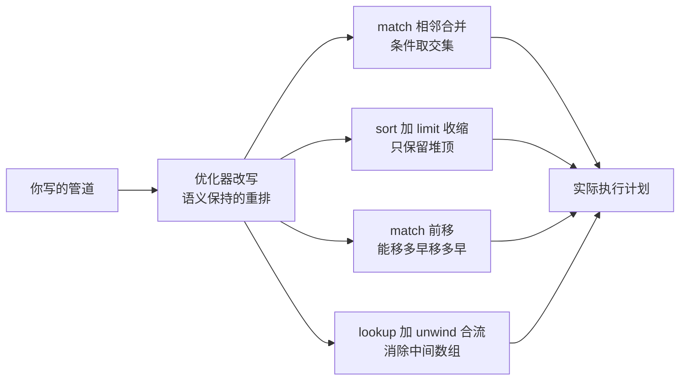
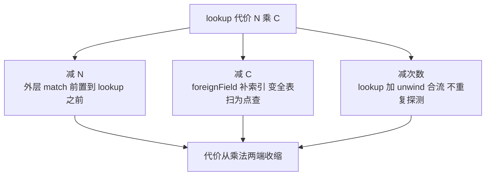

# 聚合管道性能与索引协同：下推、allowDiskUse、$lookup 代价与分批策略

> 一句话：同一条聚合管道，快与慢的分水岭不在阶段数量，而在「引擎拿到的是什么」——$match 能不能带着索引去筛、$sort 能不能沿着索引序免排、$lookup 每一次探测有没有索引可打。本篇把管道的优化器改写、内存红线、JOIN 代价形态与大数据量的分批套路一次讲透。

## 一句话摘要

聚合管道的性能机制可以压成四句：**① 优化器先改写、引擎再下推**——相邻 $match 合并、$sort+$limit 收缩、$match 尽量前移，改写后的 $match/$sort 交给查询子系统按索引执行（下推），剩下的阶段才在管道引擎里逐文档流过；**② 阻塞阶段有 100MB 内存红线**——$group/$sort 这类「看完全量才能出结果」的阶段超线即报错，allowDiskUse 打开落盘临时文件的后门，代价从内存换磁盘 IO；**③ $lookup 的代价是乘法**——外层每个文档触发一次对被关联集合的子查询，被关联字段没索引就是「外层数量 × 全表扫」的灾难，有索引则是「外层数量 × 索引点查」，$lookup+$unwind 还有专门的合流优化；**④ 索引协同的天花板是覆盖查询**——查询与投影只用被索引字段时完全不用回表（文档检查数为 0），配合 ESR 建索引法（等值、排序、范围），这是聚合提速的第一优先级。数据量再往上，单管道管不了就按区间分批跑：$merge 存检查点、批间可续跑，把「一次巨型聚合」拆成「一串有界小聚合」。

## 5W 速记卡

| 维度 | 一句话 |
|---|---|
| What | 管道优化器改写 + 引擎下推 + 内存红线 + JOIN 乘法代价的执行体系 |
| Why | 管道写法决定优化器有多少「变快」的余地，索引决定下推值不值 |
| When | 报表/导出/实时看板都可能用到聚合；数据量大时先谈下推与分批 |
| Where | $match/$sort 下推查询子系统；$group/$lookup 等跑在管道执行层 |
| How | 先 explain 形态定分叉：没下推补索引改写法，超内存分批或开落盘 |

## 🎯 本文核心

**核心机制一句话**：聚合管道的性能 = 改写余地 × 下推深度 × 代价形态——写法给优化器留多少改写空间（阶段顺序），索引让多少阶段下沉到树搜索（不用回表最好），阻塞与 JOIN 类阶段按「内存红线与乘法」计价；三者都不够用时，分批是最后的、也是最稳的兜底。

**机制链（全文按这条链展开）**：

管道先被怎么改写（阶段重排与合并）→ 改写后什么能下沉（$match/$sort 下推与覆盖查询）→ 下沉不了怎么办（100MB 红线与 allowDiskUse）→ $lookup 为什么是乘法（代价形态与索引解）→ 量级封顶怎么办（$merge 检查点分批）

## 一、边界：入门层讲过什么，本篇挖什么

| 内容 | 已有篇目 | 本篇 |
|---|---|---|
| 聚合管道五阶段是什么、explain 三层怎么读 | 入门篇 3 | 不重复 |
| ESR 与索引类型基础 | 入门篇 3 | 不重复 |
| **优化器改写与阶段下推的机制** | 未讲 | **本文核心一** |
| **100MB 红线与 allowDiskUse 的账** | 未讲 | **本文核心二** |
| **$lookup 的代价形态与优化** | 未讲 | **本文核心三** |
| **覆盖查询与大聚合分批策略** | 未讲 | **本文核心四** |

## 二、优化器先动刀：管道改写与阶段下推

### 2.1 改写规则：顺序不是你写的顺序

管道按书写顺序「看起来」逐阶段流动，但优化器在执行前会先做一轮语义保持的改写（官方文档口径的优化阶段）：

四个高频改写：相邻 $match 合并成一个条件文档；$sort 后紧跟 $limit 时收缩为「保堆顶」的排序（内存占用与耗时同降）；$match 在语义允许时向管道头部移动（越早过滤，后续每个阶段的基数越小）；$lookup 后紧跟按关联字段 $unwind 时合流为单次关联（不再物化中间数组）。**写管道时的阶段顺序是给优化器的提示，不是给执行器的命令**——但改写有边界：$match 里含管道表达式（$expr 重计算类条件）时不可前移，因为条件的求值依赖上游阶段的输出。这条边界就是「为什么有的 $match 前移了有的没有」的机制答案。

### 2.2 下推：哪些阶段能沉到索引层

改写之后，$match 与 $sort 若满足条件会被推入查询子系统：$match 命中索引则按索引区间扫描（FOUND 型下推），$sort 若排序键与索引序一致则免排序（直接沿索引顺序输出）。更进一步，管道头部的 $sort + $group 组合在索引支持时可以走 DISTINCT_SCAN 形态——每组只取一个代表文档完成去重/首条类聚合，扫描量从「全表」塌缩到「每组一条」。判断下推是否发生，看 explain 输出里管道头部是否已经变成查询子系统的执行树（$cursor 打头），而不是裸的阶段列表。

追问一层：**为什么 $group 不像 $match 那样普遍下推？** $group 是阻塞阶段——要看到全部输入才能聚合完，索引只能帮它「少看」（配合前移的 $match）或「按序看」（DISTINCT_SCAN 特形），无法改变「必须物化分组结果」的本质。这是「流式阶段可下推、阻塞阶段只能减负」的机制分界，也是 2.3 节内存红线的来源。

## 三、100MB 红线与 allowDiskUse：阻塞阶段的内存账

### 3.1 红线的机制

每个阻塞阶段（$group、$sort、不带索引的 distinct 类）默认有约 100MB 的内存上限（公开口径，以官方文档为准），超线即报错中止——**这是保护机制不是故障**：没有红线，一条失控的管道就能把实例内存吃穿，拖垮同实例的所有业务。allowDiskUse 打开后，超线的排序/分组数据落盘临时文件（排序类溢写、分组类用临时文件辅助），用磁盘换内存把管道跑完。

| 维度 | 不开 allowDiskUse | 开 allowDiskUse |
|---|---|---|
| 超线行为 | 报错中止 | 落盘续跑 |
| 代价形态 | 无额外代价，但要先减少数据量 | 磁盘 IO + 临时文件管理，耗时显著上升 |
| 索引序 $sort | 免排序不受影响 | 允许无索引溢写排序 |
| 适用场景 | 常规线上聚合 | 报表/导出类后台任务 |

### 3.2 追问：为什么不干脆全局开 allowDiskUse

反方案分析：**为什么不用把 allowDiskUse 设成默认开？** 因为落盘是「让管道能跑完」的后门，不是「让管道跑得快」的优化——全局打开等于告诉所有写管道的人「内存超了也没关系」，失控管道从「报错」变成「默默把磁盘打满」，故障从显式变隐性。**报错是便宜的失败，打满磁盘是贵的失败**——默认关是故障面取舍的设计思想。正确姿势：交互式查询不开（超线先改写法/加索引/加阶段过滤），批处理任务在会话级打开。再追问一层：**开了落盘性能还有救吗？** 有——先让 $match 更狠（减少进入排序/分组的量）、给 $sort 配索引序（免排序就不落盘）、必要时上分批（第六节）。落盘是兜底不是终点，业内复盘里「开了 allowDiskUse 就不管了」的管道，多数在数据翻倍后变成磁盘 IO 事故。

**实践叙事一**（行业常见模式匿名化）：某报表聚合平时 20 秒出结果，某天后开始超时。排查动线：explain 发现 $sort 阶段从「索引序输出」退化成「内存排序 + 落盘」——上游新增了一个管道表达式条件，把 $match 变成了不可下推的形态，进入排序的文档量翻了数倍；处置是把该条件拆回可下推形态并给排序字段补齐复合索引，耗时回到秒级。复盘结论：**管道慢化的第一嫌疑人是「下推失效」，先对比改写前后的 explain 形态，再谈算力。**

## 四、$lookup：把 JOIN 的乘法管住

### 4.1 代价形态：外层基数 × 单次探测

$lookup 的执行形态是「对外层输入的每个文档，执行一次对被关联集合的子查询」——代价乘法天生存在：外层过滤后剩 N 个文档，单次探测成本 C，总代价 N × C。C 的大小全看被关联字段有没有索引：有索引时 C 是一次树点查；没有索引时 C 是一次全表扫——N 万级外层 × 全表扫，就是这个机制的灾难形态。所以 $lookup 优化的第一定律：**被关联字段（localField 对应的 foreignField）必须有索引**，这条在 explain 的子查询形态里可以直接验证。

### 4.2 三个减法

减 N：$match 放在 $lookup 之前（或依赖优化器前移），先筛后关联——顺序写反是最常见的写法事故。减 C：foreignField 索引兜底。减次数：$lookup + $unwind 合流优化（官方文档口径）在「一对一关联 + 按关联字段展开」的形态下，把「探测 + 物化数组 + 展开」压成单次探测。另外子管道里不带外层关联条件的形态（无关联子查询）结果会被缓存复用（公开口径），跨外层文档只执行一次——写复杂报表管道时，能改成无关联形态的子查询尽量改。

追问一层：**为什么 $lookup 不做成数据库内核里的 hash join？** 反方案分析：管道模型里 $lookup 是「逐文档的子管道执行」，天然适配任意子管道（嵌套聚合、多级关联）；hash join 需要两边都是「可完整物化的输入」，与「子管道可包含任意阶段」的通用性冲突。执行引擎的演进（新执行引擎对等值关联的加速，公开口径）正在填补性能差，但「通用性优先、特形加速跟进」这条路线不会变——理解这一点，就不会对「$lookup 永远比关系型 JOIN 慢一截」感到意外，也不会把「能用关系型就别在 MongoDB 里硬 JOIN」这条边界建议当成敷衍。

## 五、索引协同的天花板：覆盖查询与 ESR 复核

### 5.1 覆盖查询：文档检查数为 0

查询（或管道阶段）需要的全部字段——含投影、过滤、排序——都被同一个索引覆盖，且投影显式排除了 _id（或 _id 在索引里）时，执行完全在索引上完成，explain 的文档检查数为 0。这是「索引协同」的满级形态：回表次数归零，纯顺序扫索引。聚合管道里的 $project 提前声明需要的字段，就是给覆盖查询创造条件——**投影不是给输出减肥的，是给执行器减负的**。

### 5.2 ESR 复核与索引交集的陷阱

复合索引字段顺序按 ESR（等值 → 排序 → 范围）排布，是下推收益的前提；ESR 排错（范围字段放在排序字段前）会让索引只能服务等值、排序退化为内存排序。另一个陷阱是索引交集：多个单字段索引理论上可以求交集服务查询，但优化器很少选（交集成本高，业内共识），**为一个高频管道建一个对的复合索引，胜过堆一堆单字段索引等交集**。覆盖查询也有边界：数组字段与多键索引的覆盖语义受限（官方文档口径），别在多键场景硬凑覆盖。

## 六、大聚合的分批策略：把巨型管道拆成有界循环

单管道的三个物理天花板——阻塞阶段内存、单次执行时长（会话超时与锁步）、扫描对 cache 的冲刷——在数据量上亿后全部显形。分批策略的核心思想：**把「一次全量聚合」改写成「按区间推进的一串有界聚合」，用检查点记录进度，批间可续跑**：

四个实施要点：**分批键选唯一且单调的字段**（_id 或时间 + 序的组合），批次间不重叠不遗漏；**每批带 $sort + $limit** 让每批都是有界排序（不触发落盘）；**用 $merge 把批结果写进目标集合**（服务端收口，幂等可重跑）；**检查点（本批最大键）落在一个进度集合里**，中断后从检查点继续，不用推倒重来。为什么不选「调大内存上限硬扛」（另一种做法）：管道内存上限不是客户端可随意放宽的参数（服务端配额口径），且就算放宽，单次执行越长，失败重跑的代价越大——**分批把失败半径从「整条管道」缩到「一个批次」**，这是它比一切参数都可靠的原因。

追问一层：**分批会不会比单管道更慢？** 单批视角看，多了一圈次查询开销；总量视角看，每批都能吃满索引下推、不落盘、不冲刷 cache，吞吐反而更稳。慢的假象来自「单次等待时长」，快的真相在「总资源消耗」——批处理任务的正确指标是总时长与资源曲线的平稳度，不是单笔延迟。

**实践叙事二**：某历史数据归档任务用单条全量聚合 + 落盘导出，运行四小时后被会话超时打断，从头重跑仍失败。排查动线：发现管道中段 $group 在亿级输入上落盘，且每次中断都从零开始；改造为按月区间 + $merge 检查点的分批形态后，单批分钟级、中断即续跑，当晚完成。复盘沉淀：**「能续跑」是批处理的第一设计目标——检查点没有落盘之前，任何长任务都是一次性的赌博。**

## 七、不同量级的思考：架构约束驱动解法

- **十万级（管道随手写都够快）**：约束来自「全量数据在内存里翻一遍也不疼」——写法规范（$match 前置、投影收紧）即可，这一档的核心问题是「有没有明显的写法反模式」，而不是「要不要分批」；思考方式是「写法审核」驱动
- **百万级（慢查询开始出现）**：约束来自「下推与索引开始决定生死」——explain 形态分析、ESR 复核、覆盖查询是主战场，这一档的核心问题是「哪个阶段没吃到索引」，而不是「加机器加缓存」；思考方式是「形态分析」驱动
- **千万级（阻塞阶段频繁触线）**：约束来自「内存红线与 $lookup 乘法成为常态摩擦」——allowDiskUse 会话级开启、foreignField 索引兜底、分批预案建立，这一档的核心问题是「这条管道的物理预算够吗」，而不是「再等等就好了」；思考方式是「预算管理」驱动
- **亿级（单管道物理不可行）**：约束来自「单次执行的时长与资源都越界」——$merge 检查点分批成为标配，更上层的解法是预聚合（写路径物化结果，本系列篇 3 的宽表思路同理），这一档的核心问题是「这个结果该不该查询时算」，而不是「怎么算得动」；思考方式是「绕开计算」驱动

思考方式总结：十万级靠写法审核，百万级靠形态分析，千万级靠预算管理，亿级靠绕开计算——约束从「写法」逐级上移到「物化」，与关系型世界的演进路径殊途同归。

**自下而上与触发升级**：先跑 explain 看「下推形态 + 阶段内存用量 + 文档检查数」三组证据，定位档位再动手。触发升级的信号：交互查询偶发超线报错（进千万档预警）、报表管道稳定依赖落盘（进千万档）、单管道执行时长越过批处理窗口（进亿档，先分批再谈预聚合）——信号出现即升级，滞留旧档就是把「能不能算出来」交给运气。

## 八、源码与关键路径：模块级穿透

聚合执行相关实现按 MongoDB 主仓库目录（模块级穿透）：

| 机制 | 关键路径 | 说明 |
|---|---|---|
| 管道解析与优化 | src/mongo/db/pipeline/ 目录 | 阶段定义、改写规则（合并/前移/收缩）落在这里 |
| 下推判定 | src/mongo/db/pipeline/ 与查询子系统接口 | $match/$sort 能否变成查询树的判定 |
| 阻塞阶段与落盘 | 排序/分组算子实现（pipeline 与执行引擎两侧） | 100MB 红线、临时文件溢写逻辑 |
| $lookup 执行 | src/mongo/db/pipeline/ 的 lookup 算子（含新执行引擎的等值关联加速路径，公开口径） | 逐文档子查询、子查询缓存、合流优化 |
| $merge/$out | src/mongo/db/pipeline/ 的写出口阶段 | 批处理收口与检查点落地的服务端原语 |
| explain | 查询与聚合统一的解释输出 | 下推形态、阶段内存、文档检查数的观测入口 |

读法建议：从 explain 的输出结构反向进源码——「这棵执行树是谁生成的」对着 pipeline 目录的改写代码读，「这个阶段的内存计量在哪」对着阻塞算子读，比正着啃目录结构快得多。

## 九、业内惯例与生产实践

- **explain 三看进 code review**：一看头部是否 $cursor（下推成立）、二看文档检查数（覆盖与回表）、三看阻塞阶段内存估计——三看过关再上线，是聚合管道的上线纪律。
- **allowDiskUse 只在批处理会话开**：交互查询超线一律回炉改写法/索引；全局打开属于「把报错改成静默故障」的反模式。
- **$lookup 前置 $match 是铁律**：先筛后关联写进团队管道模板；foreignField 索引检查进上线 checklist。
- **报表管道按量级分档**：百万内单管道直跑，千万级分批 + $merge，亿级预聚合物化——档位与写法在评审时对齐，不靠运行时惊喜。预聚合物化本质是架构动作（把计算从读路径挪进写路径），要跟写侧变更流程一起评审。
- **执行引擎演进保持关注**：新版执行引擎对聚合与关联的加速随版本推进（公开口径），大版本升级前对核心管道做基线对照，旧结论不跨版本复用。

## 💡 实战提示

- 💡 **管道慢化先对比 explain 形态**：把「改写前的理想形态」与「当前形态」并排看，下推失效点一眼可见——比盯耗时数字猜快得多。
- 💡 **$sort 想不落盘，先看索引序**：排序键与某个复合索引的序一致时免排序；给高频管道的排序键配索引，是性价比最高的单点优化。
- 💡 **$lookup 的 foreignField 没索引就是事故预备队**：外层数量增长会让它线性恶化，索引检查写进模板而不是等慢了再补。
- 💡 **$merge + 检查点是长任务的唯一稳妥形态**：可重跑、可续跑、失败半径单批——从第一天就按这个形态写批处理管道。
- 💡 **投影收紧是为了覆盖查询**：$project 提前声明字段，给执行器制造「不回表」的条件，输出整洁只是副产品。

## 什么时候用/不用：管道策略决策表

| 场景 | 推荐路径 | 不建议 |
|---|---|---|
| 交互式聚合超内存报错 | 改写法：前移过滤、补索引、收紧投影 | 全局打开 allowDiskUse |
| 报表导出（后台任务） | 会话级 allowDiskUse + 分批 | 单管道硬扛亿级输入 |
| 一对一关联展开 | $lookup + $unwind 依赖合流优化 | 手工双层展开循环 |
| 定时统计看板 | 预聚合物化 + 增量更新 | 每次实时全量聚合 |
| 历史数据归档 | 分批键区间 + $merge 检查点 | 全量单管道 + 落盘中途重跑 |

明确推荐一句话：**先形态后算力、先索引后落盘、先分批后预聚合**——三句按顺序用，聚合优化的路就不会走反。

## Trade-off：聚合性能手段的账单

| 手段 | 收益 | 代价 | 反噬场景 |
|---|---|---|---|
| 阶段前移/改写友好写法 | 下推成立、基数收缩 | 写法受限（可下推形态约束） | 无——纯收益，靠评审保证 |
| 覆盖查询 | 回表归零 | 索引变宽、写放大上升 | 为了覆盖堆字段拖累写路径 |
| allowDiskUse | 超线也能跑完 | 磁盘 IO、耗时数倍 | 全局开启掩盖失控管道 |
| $lookup 子查询缓存 | 无关子查询只跑一次 | 缓存占用、语义必须真无关 | 误判「无关」导致结果错误 |
| 分批 + $merge | 失败半径小、可续跑 | 批次调度与检查点维护成本 | 分批键选择不当造成批次倾斜 |
| 预聚合物化 | 查询时零计算 | 写路径复杂度、一致性维护 | 明细口径频繁变更时物化失效 |

## 你们可能会问

**Q1：$match 写在管道开头和写在中间，语义一样为什么性能差很多？**
开头（或可前移位置）的 $match 有机会被推入索引扫描，基数在源头收缩；写在 $group 之类的阶段后，只能对已物化的中间结果逐条过滤——索引完全帮不上。语义等价、执行成本天差地别，这正是改写规则存在的意义。

**Q2：allowDiskUse 开了之后排序还能用索引吗？**
能。索引序可用的 $sort 根本不会走到溢写那一步——落盘只在「无索引序可用且超内存」时发生。开了 allowDiskUse 不是放弃索引，是给「索引救不了的那部分」留后路。

**Q3：$lookup 关联的集合也是分片的，会有什么额外代价？**
分片集合做被关联侧时，子查询的路由形态更复杂（按关联键能否定点决定广播与否，版本间行为有演进，公开口径）。生产上的稳妥策略：高频 $lookup 的被关联集合要么数据量小到广播无感，要么关联键设计成可定点——两难时考虑冗余字段替代关联。

**Q4：怎么判断该分批了还是该预聚合了？**
看查询的时效要求：结果可以延迟（T+1、小时级）就走预聚合，把计算挪进写路径；结果必须基于当下全量且数据量大到单管道跑不动，就走分批。两者也可组合——预聚合打底 + 分批重算纠偏。

**Q5：文档检查数为 0 但查询还是慢，还有什么嫌疑？**
看索引键扫描数（keys examined）——覆盖查询免了回表，但如果索引区间选择不紧（低选择性），扫的键依然海量。覆盖解决「回表成本」，选择性决定「扫描成本」，两者是独立的变量。

## 开放问题

- 新执行引擎对管道与关联的加速边界还在推进（公开口径），「管道写法规范」会随引擎能力漂移——写法约定需要随版本复核，旧铁律不保证永远铁。
- 预聚合与实时管道的分界随硬件与引擎演进不断移动，「多大数据量必须物化」这个答案的历史变动率很高，值得每年重估一次而不是当成常数。

## 🎯 核心带走

**30 秒复述**：聚合管道的执行分三层——优化器先做语义保持的改写（合并 $match、收缩 $sort+$limit、前移、合流），改写后 $match/$sort 下推进索引层（覆盖查询是回表归零的满级形态），下不了的阻塞阶段背着 100MB 红线（allowDiskUse 是批处理的后门不是默认项）；$lookup 的代价是「外层基数 × 单次探测」的乘法（foreignField 索引与合流优化做减法）；量级封顶后按「分批键 + $merge 检查点」拆成可续跑的有界循环。**失效点**：管道表达式条件杀死下推、$lookup 被关联侧无索引、allowDiskUse 全局开启掩盖失控、长任务无检查点一断全废。金句带走：

> **管道写法给优化器留余地，索引给引擎付利息——性能是写法与索引的联名账户，单边存不进去。**

> **分批的本质不是跑得快，是失败得便宜——检查点落盘之前，长任务都是一次性的赌博。**

## 自测三问

1. 为什么有的 $match 被前移有的没有？（答：含管道表达式、依赖上游输出的条件不可前移——见 2.1）
2. allowDiskUse 的正确打开方式是什么？（答：批处理会话级开启，交互查询超线先改写法与索引——见 3.2）
3. 亿级归档管道的标配形态是什么？（答：单调分批键 + 每批 sort+limit + $merge 收口 + 检查点续跑——见第六节实践叙事）

## 📌 数据与事实声明

- 版本口径：管道优化规则（$match 合并/前移、$sort+$limit 收缩、$lookup+$unwind 合流）、阻塞阶段约 100MB 内存上限、allowDiskUse 语义、$merge 原语、无关联子查询缓存、覆盖查询与多键索引的覆盖限制——均出自 MongoDB 官方文档（截至 2026-09）；新执行引擎对聚合/关联的加速范围为公开口径随版本演进。
- 性能量级（耗时、内存表现）为行业认知经验值；两则实践叙事为行业典型模式的匿名化重建，不含真实公司与生产数据。

## 📚 参考资料

| 来源 | 内容 |
|---|---|
| MongoDB 官方文档 Aggregation Pipeline Optimization / allowDiskUse / $lookup / $merge 章节 | 改写规则、参数语义与原语口径 |
| MongoDB 官方文档 Query Optimization 与 explain 输出章节 | 下推形态与覆盖查询判定 |
| 《MongoDB 权威指南》（第 3 版）聚合章节 | 管道机制与性能实践综述 |
| Percona 等公开技术博客的聚合调优实践文章 | $lookup 与分批策略的案例口径（行业公开资料） |
| 关联篇目：本系列篇 1《WiredTiger 存储引擎深度》、篇 3《分片架构与 chunk 治理深度》 | cache 压力与分片广播的承接机制 |
