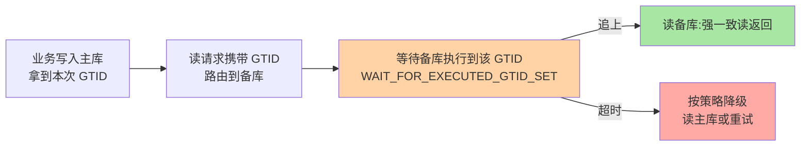

# 主从延迟治理：四段链路逐段归因

> 「备库延迟了！」——延迟不是单一指标，是四段链路中最慢一段的**出水量**。治理延迟的第一步不是调参数，是归因：这段链路到底堵在哪。这篇给出逐段归因模型、高频根因清单与对应的治理动作。

## 一句话摘要

主从延迟 = 「主库执行+落盘 → 网络传输 → relay 落盘 → SQL 重放」四段链路中**最慢一段的持续水位**；生产上的大头几乎总在**第四段（重放）**——大事务、DDL、无主键表更新、单线程瓶颈四类根因贡献了绝大多数延迟事件。**归因优先于调参**：每类根因对应一个确定动作，治理才有抓手。

## 🎯 本文核心

**核心一句话：延迟是四段链路最慢一段的水位——生产大头在第四段重放（大事务/DDL/无主键/并行度），归因靠各段时间戳比对而不是猜；写后读一致用 GTID 等待解决，终极解在架构层（分组拆库/单元化）而非参数层。**

治理链：四段归因模型 → 第四段高频根因清单（五类各配一个动作）→ 无索引批量 UPDATE 的重放放大事故 → 监控口径（事务差距 + 突增斜率）→ 写后读一致的 GTID 方案。全文一句话可重构：「先归因到段，再归因到根因，最后才是动作——顺序反了就是调参玄学」。

## 前置阅读

- 特性层《深入理解主从复制系列》：三线程链路与 MTS 机制——本文是其运维视角
- 本目录篇 2《并行复制与半同步调优》：重放提速的参数组合拳

## 目标导向

本文是什么：延迟的链路归因模型与治理手册。功能是什么：把「延迟了」变成「第几段、哪类根因、哪个动作」。能得到什么：归因决策树、高频根因清单、监控口径与治理组合。为什么用：延迟告警值班响应、读扩散架构评审、大促前健康检查，必看。

## 一、四段链路归因模型

排查动作：比对各段时间戳（binlog 事件时间 vs relay 落盘时间 vs 重放完成时间），**堵点自己会现形**。生产分布的经验规律：②③ 段在同机房几乎免责，① 段问题通常表现为主库先出症状，**④ 段承担了大多数「只有备库延迟」的事件**。

## 二、第四段的高频根因清单

| 根因 | 机制 | 治理动作 |
|---|---|---|
| 大事务 | 一个事务几十万行，重放端一次性执行 | 业务侧分批提交（事务瘦身） |
| DDL | 大表 ALTER 执行数小时，重放端同样执行 | 在线 DDL 工具（gh-ost/pt-osc）替代直改 |
| 无主键表更新 | ROW 格式下逐行全表定位，重放放大数倍 | 全表显式主键——规范红线 |
| 重放并行度不足 | 单线程追不上多线程写入 | MTS：worker + WRITESET（参数见篇 2） |
| 从库自身负载 | 读流量/备份任务抢 I/O 与 CPU | 读扩散分流、备份错峰、规格对齐主库 |

其中「无主键表」值得单说：ROW 复制按行变更传播，无主键时每行重放都要全表定位——一行 UPDATE 放大成一次全表扫，千万行大表更新能把延迟顶到小时级。**这也是「所有表显式主键」在复制语境下的第二重理由**（第一重是 WRITESET 依赖，见特性层篇 2）。

## 三、事故推演：一条无索引批量 UPDATE 的延迟风暴

某运营后台跑批量改价，`UPDATE goods SET price=? WHERE category_name='x'`——category_name 无索引（表有主键但条件没走它）。主库侧全表扫执行 8 分钟完成；备库重放时，ROW 事件的每一行都要按主键定位更新，8 分钟的事务在重放端被放大到 40 分钟以上，期间读扩散流量读到的是 40 分钟前的价目——**运营侧看到「改完了」，客服侧报价全是旧价**，资损争议由此而起。

三条沉淀：

1. **主库慢 ≠ 备库慢的比例关系**：重放放大系数可以远大于 1（无主键/无索引场景），「主库都只跑 8 分钟」不是安全论据
2. **延迟的业务可见性是间接的**：读到旧数据的不是 DBA 而是下游业务——延迟监控必须与业务一致性承诺挂钩（哪些读容忍延迟、哪些必须写后读一致）
3. **变更入口治理**：运营后台的批量操作走审批 + 强制走主键/索引条件 + 大批量分批——把风险挡在入口而不是靠 DBA 拦截

**Trade-off 视角**：给 category_name 补索引能救这次事故，但也增加写放大——**批量操作的索引需求与常驻索引的写代价之间，业内默认按「变更频率 × 表量级」决定：高频批量走索引，一次性操作走临时方案（分批按主键扫）**。

## 四、监控口径与告警设计

- **指标选型**：`Seconds_Behind_Master` 只做粗看（时钟与空转干扰多），**事务差距才是硬指标**——GTID 集合差（`Retrieved_Gtid_Set` 与 `Executed_Gtid_Set` 的差）或位点差，配合事件时间戳双维度
- **告警分层**：持续 >N 秒（阈值按业务一致性承诺定）告警；延迟**突增斜率**单独告警——斜率比绝对值更早暴露大事务/DDL
- **归因信息随告警携带**：告警里带上「堵在第几段」的自动判断（各段时间戳已在采集），值班同学从归因开始而不是从「看看日志」开始

**量级演进视角**：写入 1k QPS 时延迟治理=治大事务；1w QPS 时=MTS 参数工程；10w QPS 时单实例复制在数学上追平困难，架构答案转向分组拆库/单元化——**延迟问题的终极解在架构层，不在参数层**。

## 业内惯例

> 💡 **实战提示**
> - 值班响应第一动作「看堵在第几段」：告警自带各段时间戳差——④段看最近重放的事务（大事务/DDL 命中即破案），①②③段才轮到看主库与网络
> - 延迟突增斜率比绝对值先配告警：斜率抖升几乎总对应大事务或 DDL 上线，比「延迟超阈值」早几分钟暴露
> - 什么时候给批量操作补索引：变更频率 × 表量级——高频批量走常驻索引，一次性操作按主键分批扫，别为一次运营操作给热表永久加写放大
> - 延迟从库（REPLICATE_DELAY 数小时）是成本最低的误删保险：与备份独立、与复制并存，新集群搭建时顺手就配

- **「写后读自己」用 GTID 等待**：关键业务写后查询走 `WAIT_FOR_EXECUTED_GTID_SET` 确认备库已追到本事务——业内成熟的读写一致性方案，比「祈祷延迟小」可靠：

- **延迟从库做误删逃生舱**：故意 `REPLICATE_DELAY` 数小时的从库，是数据误操作的最后一道保险——成本极低、收益巨大，业内标配
- **大表 DDL 一律走在线工具**：直改大表既是主库风险也是延迟风暴源，变更平台强制路由到 gh-ost/pt-osc
- **备库规格不低于主库**：重放端硬件倒挂 = 结构性追不平，容量评审的常识红线（特性层篇 1 的结论在此兑现）

## 你们可能会问

**Q1：延迟忽高忽低但均值正常，要不要管？**
要看「毛刺对业务的一致性承诺是否破防」。读扩散场景下毛刺意味着偶发旧读——若业务有写后读一致要求，毛刺就是事故预备役；纯报表从库则可容忍。**指标容忍度由业务语义定，不由 DBA 定**。

**Q2：为什么备库换了更强的机器延迟反而没改善？**
八成堵点不在硬件在事务形态（大事务/DDL/无主键）——先跑归因模型确认堵点，再谈加资源。归因前置能省下大量无效扩容。

**Q3：延迟追平时能直接切流量吗？**
计划内切换可以（配合只读锁定 + GTID 追平确认，见本目录篇 3）；**日常读扩散不叫切换**——它按秒级滞后容忍运行。两件事的语义边界要分清。

## 五、自测三问

1. 复述四段链路归因模型，生产上大头堵在哪段？
2. 无主键表在 ROW 复制下为什么放大重放？双重理由是什么？
3. 延迟监控为什么用事务差距而不是只用秒数？写后读一致的正确方案是什么？

## 开放问题

- MySQL 8.0.22+ 的异步复制可靠性改进与组复制（Group Replication）路线，「经典主从 + 治理」与「集群化自动容错」两条路线的成本模型仍在演变。
- 读扩散架构下「延迟容忍」正在从 DBA 域走向应用域（框架级 GTID 路由），一致性承诺的表达与执行逐步下沉为中间件能力。

## 🎯 核心带走

- **核心一句话**：延迟 = 四段链路最慢段的水位，大头在重放段——归因（时间戳分段）→ 根因（五类清单）→ 动作（各配一药），写后读一致用 GTID 等待
- **治理链**：四段模型 → 根因清单 → 重放放大事故 → 监控双维度 → GTID 一致性读
- **哪里会坏**：无主键表重放放大、大表 DDL 堵队列、运营无索引批量改、备库规格倒挂
- **边界**：本篇管「延迟怎么治」；三线程与 MTS 机制在特性层复制系列，参数组合拳在本目录篇 2，切换与校验在篇 3/4

## 📌 数据与事实声明

- 写于 2026-09-08，机制以 MySQL 8.0 为基准；`Seconds_Behind_Master` 的估算口径、GTID 等待函数为官方文档口径
- 事故推演为公开技术社区高频案例模式的匿名化复述；阈值与放大系数为经验口径，需按环境实测
- 免责：参数与行为以 dev.mysql.com 官方文档为准

## 📚 参考资料

| 类型 | 标题 | 来源 |
|---|---|---|
| 官方文档 | Replication Implementation / Delayed Replication | dev.mysql.com/doc/refman/8.0/en/ |
| 开源工具 | gh-ost / pt-online-schema-change | github.com/github/gh-ost、percona.com |
| 实战书 | 《高性能 MySQL（第 4 版）》复制章 | 公开出版 |
