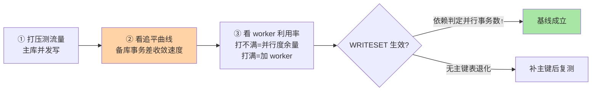

# 并行复制与半同步调优：从参数基线到降级演练

> 机制原理（AFTER_SYNC、MTS 三代分发）在特性层已经讲透，本篇是它的**运维手册**：一套可落地的参数基线、压测验证方法、高频误配案例与降级演练 SOP——让「调优」从背参数变成走流程。

## 一句话摘要

并行复制与半同步的调优 = **基线配置 + 压测验证 + 误配防御 + 降级演练**四件事：参数基线给出「为什么是这个值」的可解释组合；压测验证确认 worker 数与 WRITESET 生效；误配防御挡住「timeout 过大变同步阻塞」「preserve_commit_order 关闭致读扩散脏读」两类高频事故；降级演练确保半同步退化为异步时，容灾决策链路早已演练过。**机制是「它为什么行」，本篇是「怎么让它稳」**。

## 🎯 本文核心

**核心一句话：调优 = 「配置—验证—防御—演练」四步闭环——每个参数值都写成「带理由的决策记录」，压测确认并行度真生效，误配案例挡住四类高频翻车，降级演练保证半同步挂掉时决策链路有人会走。**

闭环链：参数基线（决策记录化）→ 压测三看（追平斜率/worker 利用率/WRITESET 生效）→ 四类误配（timeout 巨大/worker 堆砌/关保序/无主键退化）→ 降级演练六步 → 跨机房 RTT 账。全文一句话可重构：「参数全是代价交换，基线是决策记录，演练让降级不是首演」。

## 前置阅读

- 特性层《深入理解主从复制系列》篇 2：AFTER_SYNC/MTS 三代机制——本文全部参数的「为什么」
- 本目录篇 1《主从延迟治理》：归因模型——调优动作挂在归因结论之后

## 目标导向

本文是什么：MTS 与半同步的参数基线、压测与演练手册。功能是什么：给 DBA/业务负责人一套「配置—验证—防御—演练」闭环。能得到什么：可解释的参数基线表、压测脚本思路、四类误配案例、演练清单。为什么用：新集群初始化、延迟专项治理、容灾评审，必看。

## 一、参数基线：每个值都能讲出理由

| 参数 | 建议值 | 为什么 |
|---|---|---|
| `rpl_semi_sync_master_wait_point` | AFTER_SYNC | 无损语义（机制见特性层篇 2） |
| `rpl_semi_sync_master_timeout` | **默认 10s 起步，按机房 RTT 倍数定** | 过大变同步阻塞（见误配一），过小常降级 |
| `rpl_semi_sync_master_wait_for_slave_count` | 同城 1 / 跨城按容灾等级 | 「至少 N 备收到」的承诺强度 |
| `replica_parallel_workers` | 8~16 起压测 | 并行度受冲突集约束，超配空转 |
| `replica_parallel_type` | LOGICAL_CLOCK | 组提交级并行起点 |
| `binlog_transaction_dependency_tracking` | WRITESET（全表有主键前提） | 打破主库提交节奏限制 |
| `replica_preserve_commit_order` | ON（接读流量的从库必开） | 备库提交顺序 = 主库顺序，写后读一致的前提 |
| `replica_preserve_commit_order` 相关监控 | worker 利用率 + 追平事务差 | 验证并行是否真生效 |

**基线的本质是「决策记录」**：每个值的理由写成注释进配置管理，环境漂移时 diff 的不是值而是理由——这是配置治理从「记值」到「记因」的演进。**Trade-off 视角**贯穿整张基线表：AFTER_SYNC 用提交延迟换无损语义、preserve_commit_order 用一点并行度换顺序可见、worker 数用调度开销换追平速度——参数选择全是代价交换，没有免费的性能。

## 二、压测验证：调优不是抄作业

基线抄完必须验证三件事：



验证要点：**追平曲线看斜率不看单点**——写入爬坡过程中备库事务差的「最大堆积量」与「清空时间」两个数；worker 利用率长期低于三成说明冲突集不足（回特性层篇 2 的并行度来源问题），高于八成才考虑加 worker。

## 三、高频误配：四个真实翻车姿势

**误配一：timeout 配成小时级，半同步变「同步阻塞」**。某团队为「避免降级」把 `rpl_semi_sync_master_timeout` 调到 1 小时——某日备库网络抖动，**主库所有提交挂起等待 ACK，全站写入冻结**。半同步的降级机制是特性不是缺陷：timeout 的意义是「承认备库不可信时快速回到可用状态」，调大它等于把可用性押给备库网络。教训：**timeout 只能覆盖 RTT 的合理倍数，容灾诉求用 `wait_for_slave_count` 与架构表达**。

**误配二：worker 拉满 64，延迟反而恶化**。并行度超过冲突集后，多出来的 worker 只在调度队列里空转，上下文切换与锁竞争把有效吞吐拉低——worker 数按压测定，不按核数定。

**误配三：为「多并行一点」关闭 preserve_commit_order，读扩散出现脏读级投诉**。备库事务可见顺序与主库不一致，业务「写后立刻读」偶发读到旧状态且**不可复现**——顺序可见是读扩散的正确性地基，不是可调性能项。

**误配四：WRITESET 开了没生效**。存在无主键表时依赖判定退回组提交级，且无告警——WRITESET 生效性要纳入例行巡检（看 `binlog_transaction_dependency_tracking` 的实际应用与表主键覆盖率）。

## 四、降级演练：半同步「坏了」的时候谁说了算

半同步的生命周期里必然出现降级时刻（备库重启、网络抖动、ACK 超时）。**降级本身不可怕，可怕的是降级静默发生、容灾决策无人知晓**。演练 SOP：

```text
① 演练注入：手动停掉 ACK 备库 / 拔网络
② 观察主库行为：timeout 后是否如期降级、业务提交是否恢复
③ 检查监控与告警：rpl_semi_sync_master_status 变化是否在秒级触达
④ 决策演练：降级期间容灾等级变更（限流？切备库？）的决策链路走一遍
⑤ 恢复升级：备库恢复后半同步自动/手动升级回 ON，追平确认
⑥ 复盘归档：降级窗口、丢失窗口评估、决策时效——形成演练报告
```

降级演练的状态闭环：


**业内惯例**：半同步状态纳入监控大盘的一级指标、降级告警直达值班与主管——因为降级窗口 = 静默回到异步语义，容灾承诺在悄悄缩水。

## 五、事故推演：跨机房半同步的 RTT 账

某业务同城双机房扩容为同城双活，半同步等待点 AFTER_SYNC 跨机房 RTT 约 2ms——提交耗时增加 2ms 看似无害；但**写入高峰时组提交批次被 RTT 拉长，单批 sync 等待叠加排队，P99 提交延迟从 3ms 涨到 15ms**，压测才暴露。最终按 `wait_for_slave_count` 与机房拓扑重新设计等待组合（同机房 ACK + 异机房异步兜底），P99 回落。

沉淀两条：**① 半同步成本 = RTT × 等待次数 × 批次交互，跨机房部署前先算这笔账再定等待点与备库数；② 「按容灾等级选 ACK 拓扑」是在一致性与延迟之间做权衡的架构决策，不是参数微调**——把半同步的「等待谁、等几个」画成拓扑图评审，比调参数有效。

## 业内惯例

> 💡 **实战提示**
> - 什么时候重算 timeout：机房拓扑变化（同城→跨机房）或备库硬件更换后，按新 RTT 的合理倍数重定——timeout 是跟着 RTT 走的活参数，不是装机时的一次性配置
> - worker 数调整只看两个数：备库追平斜率与 worker 利用率——斜率不涨即停手，利用率长期 <30% 说明瓶颈不在并行度
> - 降级演练别只演「坏了」：恢复升级路径（备库回来后半同步回 ON + 追平确认）同样要演——恢复期的半同步抖动是二次事故高发段
> - 配置巡检盯「生效值」不是「配置文件值」：中间件/云平台可能覆盖参数，`SHOW VARIABLES` 的运行时值才是事实

- **配置进配置管理 + 理由注释**：参数变更走评审，理由随值入库——环境漂移可审、决策可溯
- **半同步状态 + 降级事件是一级监控**：降级窗口必须有人知晓，静默 = 容灾等级虚标
- **压测报告与参数基线一起归档**：下次压测对比上次，性能漂移可量化
- **全表主键覆盖率高优先级落地**：WRITESET、MTS 效率、ROW 重放效率三件事都压在「显式主键」上——一个规范喂饱三个机制

## 你们可能会问

**Q1：基线值和官方默认值不一致，听谁的？**
默认值面向通用场景，基线面向你的负载与容灾等级。**先跑基线压测验证，验证不过的「业内建议」不如默认值**——所有建议值都要过一遍自己的压测。

**Q2：worker 数怎么从压测结果反推？**
阶梯加压（16/32/64 并发写）看备库追平斜率：斜率不随 worker 增加而提升时，说明冲突集已榨干，worker 数取「斜率拐点前的最小值」——留余量但不堆砌。

**Q3：半同步与 MTS 会互相影响吗？**
路径不同：半同步卡主库提交侧（等 ACK），MTS 在备库重放侧——正交但协作：半同步保「送达」，MTS 保「追平」，组合才是完整容灾语义。

## 六、自测三问

1. 参数基线为什么强调「每个值能讲出理由」？基线的本质是什么？
2. 误配一（timeout 调大）的事故机制是什么？降级机制为什么是特性？
3. 降级演练六步里，哪一步最常被省略、后果是什么？

## 开放问题

- MySQL 复制参数在 8.0 系列持续重命名与归并（SLAVE→REPLICA、并行选项收敛），配置管理需要版本感知的兼容层。
- 云数据库把半同步语义产品化为「可用性等级」，参数被平台封装后，「看得见的参数调优」向「等级选型 + SLA 评审」迁移，DBA 技能重心随之漂移。

## 🎯 核心带走

- **核心一句话**：调优四步闭环——带理由的基线、压测验证生效、四类误配防御、降级演练兜底；参数全是代价交换，没有免费的性能
- **闭环链**：基线决策化 → 压测三看 → 误配四案例 → 演练六步 → RTT 账
- **哪里会坏**：timeout 巨大全站写入冻结、worker 堆砌空转、关保序读扩散脏读、WRITESET 静默退化
- **边界**：本篇是运维手册；AFTER_SYNC/MTS 机制在特性层复制篇 2，延迟归因在本目录篇 1

## 📌 数据与事实声明

- 写于 2026-09-08，参数名以 MySQL 8.0 为基准（8.0.26+ REPLICA 前缀化）；默认 timeout 10s 为官方默认
- 事故推演为公开技术社区高频误配模式的匿名化复述；RTT 与 P99 数字为示意量级
- 免责：参数行为以 dev.mysql.com 官方文档为准

## 📚 参考资料

| 类型 | 标题 | 来源 |
|---|---|---|
| 官方文档 | Semisynchronous Replication / Replica Server Options | dev.mysql.com/doc/refman/8.0/en/ |
| 特性层机制篇 | 本仓库《半同步与并行复制：收窄窗口与追平速度》 | docs/data/mysql/特性层/深入理解主从复制系列/ |
| 实战书 | 《高性能 MySQL（第 4 版）》复制章 | 公开出版 |
