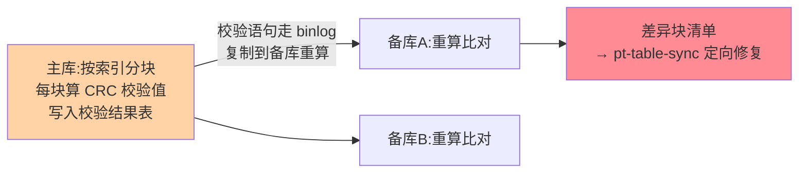
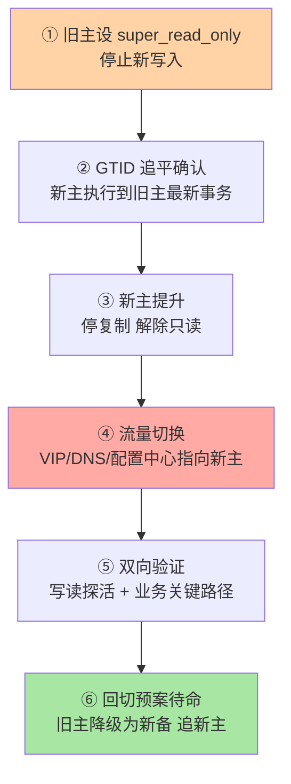

# 一致性校验与切换演练：把容灾从纸面变成肌肉记忆

> 主备不一致平时不声不响，切换时集中爆雷；切换流程平时不演练，真出事时全是第一次。这篇讲两件事：**用校验工具证明主备真的一致**，用**常态化演练证明切换真的能切**——容灾能力不是配置出来的，是演练出来的。

## 一句话摘要

一致性校验的工业标准是 **pt-table-checksum（主库分块计算 CRC、复制链路传播、备库重算比对）+ pt-table-sync（差异修复）**——利用复制本身传播校验任务，天然覆盖「漂移源头是复制语义」的场景。切换演练的核心是**计划内切换 SOP 的常态化执行**：旧主只读锁定 → GTID 追平确认 → 新主提升 → 流量切换 → 双向验证 → 回切预案待命。**校验给「不敢切」的底气，演练给「切得动」的手感**。

## 🎯 本文核心

**核心一句话：容灾能力 = 校验证明「数据真的一致」+ 演练证明「切换真的能切」——切换的安全核心是「先锁旧、再切流」的顺序红线，顺序由工具固化而不是靠人记；没演练过的切换 SOP 等于没有 SOP。**

体系链：漂移五源与源头治理 → pt-table-checksum 的复制传播设计 → 切换六步与两处红线 → 双写窗口脑裂事故 → 演练四层纵深与频率。全文一句话可重构：「防漂移靠源头组合拳，能切换靠顺序固化，有底气靠常态化演练」。

## 前置阅读

- 特性层《深入理解主从复制系列》：GTID 语义——切换自动补差的机制基础
- 本目录篇 1《主从延迟治理》：追平确认的监控口径

## 目标导向

本文是什么：主备校验工具原理 + 切换演练 SOP。功能是什么：把「主备是否一致」「能不能切」两个模糊焦虑变成可执行清单。能得到什么：校验方案选型、切换六步 SOP、回切预案模板、演练频率的行业口径。为什么用：容灾建设、切换前检查、季度演练计划，必看。

## 一、主备为什么会漂移：先认清敌人

| 漂移源 | 机制 | 典型场景 |
|---|---|---|
| 语义性差异 | 非确定性语句（STATEMENT 格式时代主因） | 旧集群 ROW 改造前的历史存量 |
| 人工干预 | 备库被直写（read_only 未锁全） | 应急操作绕过流程 |
| 跳过事件 | `SET GLOBAL sql_replica_skip_counter` 滥用 | 出错时「跳过去再说」 |
| 崩溃窗口 | 非 AFTER_SYNC + 双 1 被放松 | 历史故障遗留差异 |
| 升级差异 | 主备版本/参数不一致的行为差异 | 滚动升级窗口 |

**防漂移的源头治理**：ROW 格式 + `super_read_only` + 禁止无脑跳事件 + AFTER_SYNC + 双 1——这套组合把漂移压到接近零；校验工具的角色从「日常必查」演进为「定期体检 + 变更后抽查」。

## 二、pt-table-checksum：校验为什么准

设计精妙处：**校验计算在主库执行、比对语句经 binlog 复制到备库重算**——备库算出的块校验值与主库传来的期望值比对。它天然回答了「以谁为准」：以主库为准，且覆盖的是「复制语义内」的所有漂移。工程要点：分块按索引走（无主键表又来捣乱）、限速控制对主库的扰动、大表按业务低峰跑——工具默认已做分块与限速，但**扰动评估是使用者的责任**。

修复侧 pt-table-sync 按「主库为准」生成差异修复语句——注意它在备库执行写操作会进入复制环，**生产用法通常是「查出差异 → 评估来源 → 定向修复或重建从库」**，盲跑 sync 是大忌。

## 三、切换六步 SOP

三处关键细节：

1. **① 与 ④ 的原子性是安全核心**：旧主只读必须先于流量切换成立——顺序反了就是双写窗口（见事故推演）
2. **② 用 GTID 集合比对而非秒数**：`WAIT_FOR_EXECUTED_GTID_SET` 把「追平了吗」变成程序可判定的确定性问题
3. **⑥ 回切预案在切换前写好**：新主出问题的回退路径、旧主追新主的复制重建——切换当晚不该有任何「现场发明」

## 四、事故推演：一次双写窗口的脑裂

某系统做计划内切换：运维先改了配置中心把写入流量指向新主，再准备去旧主设只读——**顺序颠倒**。切换窗口内一个重试中的写请求到达旧主成功落库，同一个业务事务又在新主执行成功：两笔订单同号不同库。恢复发现后人工比对修复耗时一天，业务对账反复核对。

三条铁律沉淀：

1. **「先锁旧、再切流」是顺序红线**——只读锁定必须先于流量切换成立，顺序写进自动化脚本而不是写在文档里靠人记
2. **切换工具化**：VIP/配置中心/只读锁定的多步操作人工执行必有顺序风险，orchestrator 类工具或内部切换平台把顺序固化成原子动作——**人不再是可以出错的那一环**
3. **幂等与对账兜底**：写请求天然重试的业务，切换窗口的幂等设计（唯一业务键）把双写从「资损」降级为「可对账的重复」

**Trade-off 视角**：切换自动化程度越高、RTO 越短，但工具接管越深，「演练真实感」越弱——业内折中是**工具执行 + 人工决策点**：判断「切不切」靠人，执行「怎么切」靠工具。

## 五、演练常态化：频率与纵深

| 演练层级 | 内容 | 业内频率口径 |
|---|---|---|
| 计划内切换 | 本篇六步 SOP 全程 | 季度级常态 |
| 故障注入切换 | 模拟主库宕机（kill 进程/断网）触发自动切换 | 半年级别，验证工具链 |
| 全链路容灾 | 机房级故障、切换 + 下游联动恢复 | 年度级，与大促演练合并 |
| 校验体检 | pt-table-checksum 全库扫描 | 月度级，变更后加测 |

演练的价值公式：**发现流程漏洞 × 团队肌肉记忆 × 工具链验证**。没演练过的切换 SOP = 没有切换 SOP——第一次真实执行的切换，几乎必然踩中演练本可发现的问题。

**量级演进视角**：校验与演练的成本都随数据量级与拓扑复杂度上涨——千万行以下的库月度全量校验无压力，亿级大表必须分块分批滚动、按月分表推进；从库从 1 个到 10 个，演练对象从「一次切换」演进为「一组拓扑的编排」——演练计划跟着集群量级走，不是全行业一张时间表。

## 业内惯例

> 💡 **实战提示**
> - 什么时候跑全量校验：滚动升级完成后、历史故障恢复后、季度例行——变更后加测是必选项，例行体检是基础项
> - 切换演练第一课是「顺序红线」脚本化：只读锁定 → 追平确认 → 切流量三步固化进切换工具，人工只剩「切不切」的决策点
> - sync 工具的生产行为规范：pt-table-sync 只在评估差异来源后定向使用，常规修复优先「重建从库」——盲跑 sync 让修复语句进复制环，可能把差异扩散
> - 探活三绿才算切完：写读探活 + 拓扑检查（新主从库重建追平）+ 业务关键路径冒烟——「流量指过去」只是切换的中场

- **切换平台化**：切换操作收敛到内部平台/开源编排工具（orchestrator 类），人工只做决策与复核——顺序红线由代码保证
- **只读锁定用 `super_read_only`**：普通 `read_only` 挡不住高权限账号，双开关都设是惯例细节
- **演练报告归档进变更系统**：每次演练的耗时、问题、修复项可追溯——演练数据反过来驱动容灾架构迭代
- **校验工具与监控告警联动**：差异块出现即告警，修复走工单——校验不是年度动作而是体检机制

## 你们可能会问

**Q1：有 MGR/InnoDB Cluster 了还需要手动切换演练吗？**
集群化方案把切换自动化了，但「自动化失败时的人工预案」依然需要演练——工具也有 bug、也有适用边界，**演练对象从「人执行流程」演进为「人验证自动化 + 兜底流程」**，演练本身不能省。

**Q2：pt-table-checksum 对业务的影响怎么控制？**
分块大小、并行度、限速三参可调；跑前在低峰试点单表验证扰动，再放全库。大表按月度分批滚动，避免一次性全库扫描。

**Q3：切换后怎么快速确认「切对了」？**
探活三件套：写读探活（写测试表立刻读回）、复制拓扑检查（新主的从库是否重建追平）、业务关键路径冒烟（登录/下单核心链路）——三绿才算切换完成，而不是「流量指过去了」就算。

## 六、自测三问

1. pt-table-checksum 的设计精妙处是什么？为什么它天然覆盖复制语义内的漂移？
2. 切换六步里哪两步的顺序是安全红线？违反的后果是什么？
3. 演练的三个价值是什么？工具化之后演练为什么仍不能省？

## 开放问题

- 云数据库把高可用封装成「秒级切换 + SLA 承诺」，用户视角的「校验与演练」向「验证云的能力边界」迁移——**云的故障注入演练**（如混沌工程平台触发主备切换）正在成为新形态。
- 校验技术面对更大的表与更严的 RPO 要求，增量实时校验（而非周期全量）是工具演进方向，社区已有探索方案。

## 🎯 核心带走

- **核心一句话**：校验证明一致（pt-table-checksum 借复制传播校验），演练证明能切（六步 SOP + 顺序红线工具化）——容灾是演练出来的不是配置出来的
- **体系链**：漂移五源 → 校验原理 → 切换六步 → 脑裂事故 → 四层演练纵深
- **哪里会坏**：先切流后锁旧（双写窗口）、skip_counter 滥用、sync 盲跑扩散差异、演练只演成功路径
- **边界**：本篇管「校验与切换」；GTID 与复制机制在特性层复制系列，方案选型总览在入门层篇 13，延迟治理在本目录篇 1

## 📌 数据与事实声明

- 写于 2026-09-08，工具口径以 percona-toolkit 3.x 为准；GTID 等待函数、`super_read_only` 为 MySQL 8.0 官方能力
- 演练频率为业内经验口径（季度/半年/年度分级）；事故推演为高频切换事故模式的匿名化复述
- 免责：工具行为以官方文档为准

## 📚 参考资料

| 类型 | 标题 | 来源 |
|---|---|---|
| 官方文档 | GTID / Replication Solutions（Failover 相关） | dev.mysql.com/doc/refman/8.0/en/ |
| 开源工具 | Percona Toolkit（pt-table-checksum/sync） | docs.percona.com/percona-toolkit |
| 开源工具 | orchestrator（复制拓扑编排，公开归档） | github.com/openark/orchestrator |
| 实战书 | 《高性能 MySQL（第 4 版）》高可用章 | 公开出版 |
