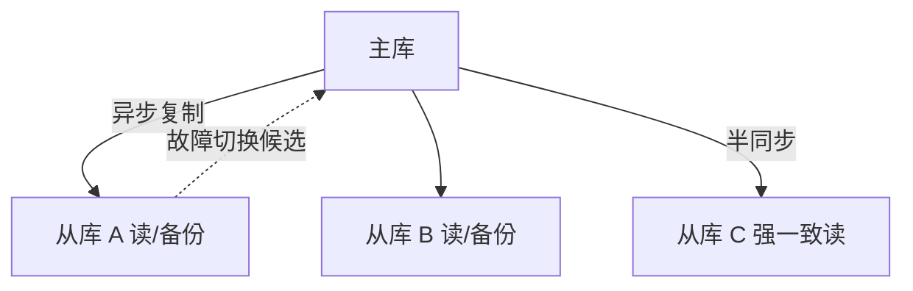

# 主从高可用架构全景：方案对比与选型决策

> 特性层讲了三线程协议 + 半同步并行复制，专题层《主从与高可用深度》篇 1 给了延迟治理 SOP。本篇是**架构级收束**：把主从复制的所有变体（异步/半同步/同步/组复制/InnoDB Cluster）放在一起对比，给出可复用的选型决策树。

## 一句话摘要

主从不只是「一个主库 + 几个从库」——同步级别、拓扑结构、故障切换、延迟治理四个维度决定架构选型。全文把 MySQL 主从的完整变体（异步/半同步/无损半同步/组复制/InnoDB Cluster）做系统对比，覆盖金融/互联网/混合云三类场景的选型建议。

## 🎯 本文核心

**核心一句话：主从架构选型 = 同步级别 × 拓扑 × 切换方式 × 延迟治理的四维权衡，且量级是第一输入——量级决定架构，架构不追新；「互联网交易半同步 AFTER_SYNC、金融账务零丢失组合、多写多活才上组复制」是三条经过生产验证的落点。**

决策链：四同步级别（丢失窗口 × 性能的连续谱）→ 五架构变体（各自的风险面）→ 四维决策树 → 量级视角校准 → 场景落点。机制细节（AFTER_SYNC 时序、MTS、GTID）全部链回特性层复制系列，本文只做架构收束。

## 前置阅读

- 特性层《深入理解主从复制系列》篇 1/2：三线程 + 半同步/MTS
- 专题层《主从与高可用深度》篇 1：延迟治理 SOP
- 专题层《主从与高可用深度》篇 2：并行复制与半同步调优

## 一、主从复制的四种同步级别

| 级别 | 主库提交 | 备库 ACK | 丢失窗口 | 性能 | 适用 |
|---|---|---|---|---|---|
| **异步** | 立即返回 | 不等 | 可能丢 | 最高 | 读扩散/报表 |
| **半同步（AFTER_COMMIT）** | 等至少 1 备 ACK | relay log 落盘 | 窗口小 | 中 | 一般业务 |
| **无损半同步（AFTER_SYNC）** | 等至少 1 备 ACK | binlog sync 后 | 零丢失 | 中低 | 金融/账务 |
| **同步复制** | 等所有备 ACK | 重放完成 | 零丢失 | 最低 | 极端场景 |

**选型决策**：

```
一致性要求？
├─ 可丢数据 → 异步（报表/分析）
├─ 不丢 + 性能 → 半同步 AFTER_SYNC（互联网默认）
├─ 金融级零丢失 → 无损半同步 + 双 1 + wait_for_slave_count=1
└─ 极端强一致 → 同步复制（性能代价大，慎用）
```



## 二、五种主从架构变体

### 2.1 经典异步主从

```
主库 ──binlog──→ 从库1
         ────────→ 从库2
         ────────→ 从库3（延迟复制，误删逃生舱）
```

**特点**：简单、性能好、主库无感知
**适用**：读扩散、报表、备份
**风险**：主库崩溃丢事务

### 2.2 半同步主从

```
主库 ──binlog──→ 从库1 ──ACK──→ 主库提交
```

**特点**：至少一个备库收到 binlog 才返回客户端
**适用**：互联网业务默认
**风险**：备库挂了自动降级为异步（需监控降级事件）

### 2.3 组复制（Group Replication）

```
节点1 ──事务──→ 节点2 ──事务──→ 节点3
   ←── 共识（ Paxos 类）──→
```

**特点**：多主/单主可选，Paxos 共识协议，零丢失
**适用**：金融级高可用
**风险**：性能开销大，运维复杂

### 2.4 InnoDB Cluster

组复制 + MySQL Router + MySQL Shell = 一站式高可用方案。

**特点**：自动故障切换 + 读写分离 + 集群管理
**适用**：新建集群默认选项
**风险**：云厂商锁定

### 2.5 延迟复制（Delayed Replica）

```
主库 ──binlog──→ 备库（延迟 1 小时）
```

**特点**：人为制造延迟
**适用**：误删逃生舱（DBA 有 1 小时回滚窗口）
**风险**：延迟从库数据滞后，业务不能读


## 三、架构选型决策树

```
业务场景？
├─ 读扩散 + 报表 → 经典异步 + 延迟从库
├─ 互联网交易 → 半同步 AFTER_SYNC + MTS
├─ 金融账务 → 无损半同步 + 双 1 + 延迟从库
├─ 多写多活 → 组复制 / InnoDB Cluster
└─ 云原生 → 云厂商托管（PolarDB / Vitess）
```

**四维决策**：

| 维度 | 选项 | 取舍 |
|---|---|---|
| 同步级别 | 异步/半同步/同步 | 一致性 vs 性能 |
| 拓扑结构 | 一主多从/双主/组复制 | 复杂度 vs 可用性 |
| 故障切换 | 人工/半自动/自动（Cluster） | 风险 vs 自动化 |
| 延迟治理 | MTS/WRITESET/GTID 等待 | 追平速度 vs 顺序一致性 |

## 四、事故推演：半同步降级导致数据不一致

**场景**：某金融系统配置半同步，主库崩溃后切换备库，发现少了一笔交易。

**根因链路**：

1. 半同步等待点 = AFTER_COMMIT（不是 AFTER_SYNC）
2. 主库提交后等备库 ACK → 备库收到 binlog 但未重放
3. 主库崩溃 → 备库提升为主库
4. 备库上事务未重放 → 数据不一致

**修复**：
1. 升级到 AFTER_SYNC（无损半同步）
2. 切换流程加 GTID 追平确认
3. 监控半同步降级事件

**教训**：半同步 ≠ 强一致，AFTER_COMMIT 的可见性缺陷是经典坑。

## 四、量级视角：选型的第一输入

量级是选型的第一输入：日写入百万级、读多写少（10:1 以上）——一主两从异步复制足够，半同步都是额外开销；写入千万级且资金相关——半同步起步，配 MGR 或更高一致方案；单表过亿导致主从延迟雪崩时，问题已不在复制架构而在分库分表（衔接分库分表篇）。**量级决定架构，架构不追新。**

> 💡 **实战提示**
> - 什么时候升级同步级别：容灾评审把 RPO 从「可丢秒级」收紧到「零丢失」时——级别跟着 RPO 定价，不跟着版本新特性走
> - 什么时候上 InnoDB Cluster：团队没有 7×24 DBA 响应能力但业务要求自动容错——集群化用产品复杂度换人力，有人力的团队自管主从反而更灵活
> - 云托管评估两问：切换 SLA 的真实语义（秒级切换是切什么、丢什么）+ 出口迁移成本——「托管的高可用」替代不了「自己的演练」
> - 延迟从库在所有级别下都值得配：异步/半同步/集群全部兼容，它是与级别正交的误删保险

## 五、你们可能会问

**Q1：异步级别是不是「不专业」？**
不是，它是与业务容忍度匹配的理性选择——报表/日志/备份从库用异步最经济；「专业」体现在按数据分级配置级别（核心链路半同步、边缘链路异步），而不是全库一律最严。

**Q2：多主（双主写）什么场景才值得用？**
双主各写不同业务域（按库拆写）是可行形态；同库双主互写需要冲突解决（LWW/CRDT 类），应用语义复杂度陡增——多数「想要多主」的真实需求是「写扩展」，答案是分库分表而不是双主。

**Q3：从「经典主从」迁到 InnoDB Cluster 的主要代价是什么？**
运维体系重建（监控/变更/演练对象从复制拓扑变为集群拓扑）+ 写入延迟增加（多数派确认）+ 组件栈变厚（Shell/Router）——按「自动容错收益 vs 迁移成本」算账，存量稳定集群不必为追新迁移。

## 五、业内惯例

- **GTID + ROW binlog + 双 1 是新建集群的三件默认套**
- **从库规格不低于主库**：重放端硬件倒挂 = 结构性追不平
- **延迟从库做误删逃生舱**：`REPLICATE_DELAY` 数小时，成本极低收益巨大
- **写后读自己**：关键业务走 `WAIT_FOR_EXECUTED_GTID_SET`
- **半同步降级必须告警**：降级窗口 = 静默回到异步语义
- **所有表显式主键**：WRITESET 依赖主键/唯一键

## 六、边界与链回（不重复机制）

常见误区（半同步≠强一致、延迟大头不在网络、复制不是备份、GTID 改变进度归属）的完整推演全部在特性层《深入理解主从复制系列》篇 1/2 与专题层篇 1——本篇作为架构收束不再复述；延迟从库、写后读 GTID 等待的工程细节在专题层篇 1/3。

## 七、开放问题

- MySQL 8.0.22+ 的 ReplicaSet vs 组复制：「经典主从 + 治理」与「集群化自动容错」两条路线的成本模型仍在演变
- 云原生数据库（PolarDB/Aurora）的存储层抽象让复制对用户透明，但一致性的保障边界需要重新评估
- 多写多活场景下（跨地域），冲突解决机制（Last-Writer-Win / CRDT）仍在演进

## 🎯 核心带走

- **核心一句话**：主从架构选型 = 四维权衡（级别/拓扑/切换/延迟治理）× 量级第一输入——互联网 AFTER_SYNC、金融零丢失组合、多写才上组复制；量级决定架构，架构不追新
- **决策链**：四级别谱系 → 五变体风险面 → 四维决策树 → 量级校准 → 场景落点
- **哪里会坏**：AFTER_COMMIT 的可见性缺陷、级别与 RPO 脱节、为追新迁移存量集群
- **边界**：本篇是主从四篇的架构收束；机制在特性层复制系列，延迟/调优/校验演练在本目录篇 1-3——四篇构成完整的高可用运维体系

## 📌 数据与事实声明

- 写于 2026-09-09，机制以 MySQL 8.0 为基准
- 参数默认值以 dev.mysql.com 官方文档为准
- 事故案例为公开技术社区高频案例模式的匿名化复述

## 📚 参考资料

| 类型 | 标题 | 来源 |
|---|---|---|
| 官方文档 | Replication / Group Replication | dev.mysql.com/doc/refman/8.0/en/ |
| 官方文档 | InnoDB Cluster | dev.mysql.com/doc/refman/8.0/en/innodb-cluster.html |
| 实战书 | 《高性能 MySQL（第 4 版）》复制章 | 公开出版 |
| 开源工具 | MySQL Shell / MySQL Router | mysql.com |
| 社区沉淀 | 各大厂公开的主从架构演进文章 | 技术社区公开文章 |