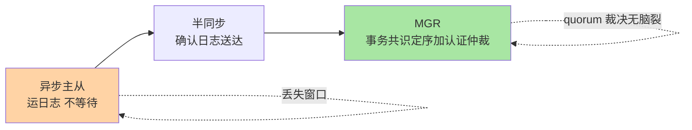
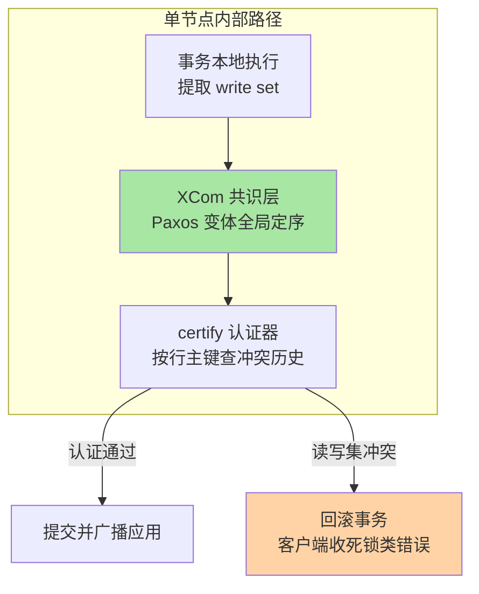
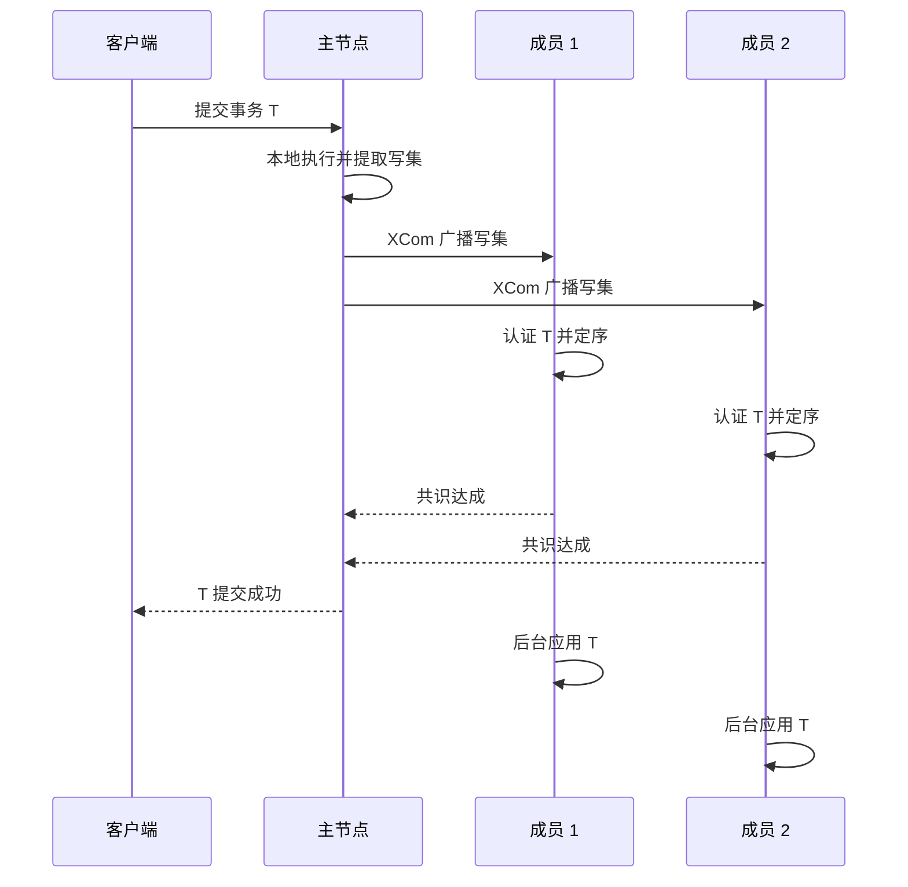
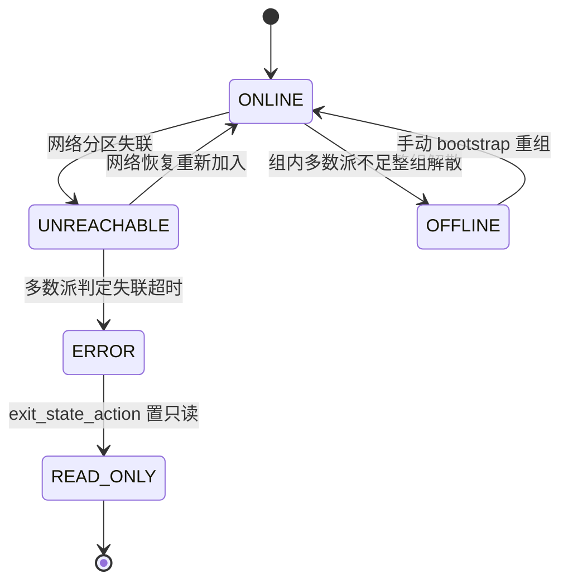

# MGR 组复制深挖：Paxos 认证如何改写主从的可用性契约

> 本目录前四篇把主从与半同步讲透了，但都绕不开两个遗留问题：故障切换依赖外部组件、切换瞬间的一致性靠流程纪律兜底。组复制（Group Replication，MGR）把这两个问题收进数据库内核。本篇深挖它的本质：共识协议怎么做、认证（certify）怎么判冲突、分区时谁活谁死、以及生产采用的真实门槛。

## 一句话摘要

MGR 与主从/半同步的本质差异只有一句话：**主从复制运输日志、半同步确认日志送达、MGR 对事务本身做共识**——每个事务携带写集（write set）经 Paxos 变体（XCom 插件）达成全局顺序，再在认证阶段按行主键检测读写冲突，冲突者回滚。可用性契约随之改变：半同步 + 外部切主有脑裂窗口和丢失窗口，MGR 用多数派（quorum）裁决，少数派自动停服，理论上不存在双主脑裂。代价是提交路径多一轮共识往返、认证冲突的多主回滚、以及一整套新的运维语义。

## 🎯 本文核心

**核心一句话：MGR = 乐观执行 + Paxos 定序 + 认证仲裁——事务先本地跑、再广播写集定序、认证冲突即回滚；它把「谁有最新数据」这个问题从切换时的猜测变成了共识时刻的确定。**

机制链：与主从的本质差异 → 认证协议细节 → 单主/多主两种形态 → 冲突检测与回滚 → 网络分区行为（quorum 裁决）→ 生产采用门槛 → 量级视角。

## 前置阅读

- 特性层《深入理解主从复制系列》篇 1/2：三线程协议与半同步（本篇的对照面）
- 专题层《主从与高可用深度》篇 2：半同步调优（半同步的 ACK 语义）
- 专题层《主从与高可用深度》篇 4：架构全景（本篇是其中组复制一节的深挖）

## 一、与主从/半同步的本质差异

| 维度 | 异步主从 | 半同步 | MGR |
|---|---|---|---|
| 复制对象 | binlog 日志运输 | binlog 日志运输 + 送达确认 | 事务写集 + 共识定序 |
| 提交等待 | 不等 | 等至少一个备库收日志 | 等多数派认证事务 |
| 故障切换 | 外部工具 + 人工 | 外部工具 + 人工 | 内置失败检测 + 自动选主 |
| 丢失窗口 | 有 | AFTER_SYNC 下零丢失 | 认证通过即零丢失 |
| 脑裂 | 可能（双写风险） | 可能 | 无（quorum 裁决） |
| 冲突处理 | 无（错序靠 GTID 暴露） | 无 | 认证失败自动回滚 |



**追问一：半同步 AFTER_SYNC 已经零丢失了，为什么说它不是共识？**
常被误解的一点：半同步确认的是「binlog 已到达备库的 relay log」，不是「这个事务在全局有了唯一顺序」。备库收到日志但可能与主库上其他事务的提交顺序不同——多源、并行重放、切换时刻的位点歧义，都要靠外部工具去裁决。共识协议把裁决做进了提交时刻：所有成员对「事务 T 排在第几、和哪些事务冲突」达成一致的结论，切换只是换一个已经在同一序列里的节点当读头。这正是复制契约的底层跃迁：从「运输保障」升级为「语义保障」，两套机制解决的是不同层面的问题。

**追问二：为什么 MGR 选择「先本地执行、再广播认证」的乐观路线，而不是「先共识、再执行」？**
这是核心设计取舍（设计哲学）：如果先共识再执行，共识阶段就要携带事务的全部行数据，消息体大、共识轮次慢，且执行阶段的死锁/约束冲突会把已定序的事务再次作废。乐观路线广播的只是写集（行主键哈希 + 读写标记），消息小；冲突在认证阶段按确定性规则裁决，所有节点结论必然一致。代价是：冲突的事务要等执行完才被回滚，多主写热点下这部分浪费真实存在——权衡的是「常态快速路径」与「冲突时的浪费」，MGR 押注常态。

**追问三：既然有认证仲裁，为什么不能放心用多主解决写扩展？**
替代方案不成立的根因：认证只保证「同一行不会被两个节点同时改成功」，它不增加吞吐——冲突事务照样回滚重试。多主的收益是「多入口」（不同业务域各写各的互不冲突），不是「同一份数据多机写入变快」。写扩展的正源依然是分库分表，这在整合层分库分表篇已完整展开。

## 二、认证协议：XCom 与 certify 的分工



### 2.1 全局定序：Paxos 变体承担的部分

每个事务执行完成后，写集被封装成消息交给组通信层（XCom，Paxos 变体实现）。XCom 保证：所有成员以**相同的顺序**看到相同的消息序列。注意分工——Paxos 只负责「定序 + 消息不丢」，它不判断事务对不对；事务级语义（冲突检测）由认证器完成。这种分层是理解 MGR 的钥匙：**共识层回答「先后」，认证层回答「行不行」**。

### 2.2 认证：按行主键的乐观并发控制

每个成员的认证器维护一段「认证信息历史」（近期已认证事务的写集，按行主键组织）。新事务认证时：

1. 比对本事务写集的行 key 与历史中「比自己晚提交快照但先定序」事务的写集；
2. 写-写或写-读（依赖了未提交版本）冲突 → 认证失败，事务回滚；
3. 通过 → 本事务写集进入历史，历史定期按全局最小未决事务位点裁剪。

多主模式下两个节点同时改同一行：先定序者提交，后定序者在认证阶段回滚，客户端收到死锁类错误需重试——**冲突裁决是确定性的，所有成员算出同一个结果**，这是「无脑裂」承诺的语义基础。

### 2.3 认证堆积与流控

落后成员的认证队列会堆积（认证依赖前序事务完成），堆积过大拖垮整组。MGR 用流控（quota）限制主节点发送速率，阈值由 `group_replication_flow_control_certifier_threshold`（默认 25000，官方文档口径）等参数控制——线上排查「整组写入吞吐突然一起下降」时，认证队列堆积与流控触发是第一个要看的指标。

## 三、单主模式与多主模式



- **单主模式**（`group_replication_single_primary_mode=ON`，默认）：只有主节点可写，其余 `super_read_only`。主故障时组内自动选主，次序由 `group_replication_member_weight`（默认 50）与 UUID 字典序决定。**这是生产默认形态**——业务无冲突回滚风险，切换无需外部工具。
- **多主模式**：所有成员可写，要求 `group_replication_enforce_update_everywhere_checks=ON` 并接受认证冲突回滚；自增键靠 `group_replication_auto_increment_increment`（默认 7）错位防撞。适合「多入口、少冲突」的形态：各节点写不同业务域，或冲突代价可接受的重试型写入。

**追问：主切换后新主上能立刻读到全部已提交数据吗？**
默认一致性级别 `group_replication_consistency=EVENTUAL` 下，切换瞬间新主可能先返回「旧数据读」再追平——这就是切换后读到旧值的根因。8.0.14+ 提供 BEFORE/AFTER 等级别：关键业务在切换流程中用 `BEFORE_ON_PRIMARY_FAILOVER` 挡住旧读，代价是切换期间读请求等待。这是「切换可用性」与「读一致性」的显式 Trade-off，不再靠流程纪律隐性兜底。

## 四、冲突检测与回滚：多主的代价面

认证冲突的工程形态集中在三个观察点：

1. **冲突计数**：`performance_schema.replication_group_member_stats` 的冲突检测指标（`COUNT_CONFLICTS_DETECTED` 等）——多主健康的量化口径，持续上涨即写热点警报。
2. **回滚风暴模式**：同一批热点行被多节点并发更新时，认证失败率飙升，业务侧表现为大量死锁类错误重试，吞吐反而低于单主——冲突热点没有分散时，多主是负优化。
3. **大事务放大**：写集随事务行数线性膨胀，单事务改百万行会让共识消息与认证队列同时爆炸——MGR 对大事务的容忍度远低于主从，大事务治理（拆批）是前置条件。

## 五、网络分区行为：quorum 裁决



- **多数派存续**：分区后只有包含多数派的一侧继续提供服务，少数派侧停止处理事务——「双活成两套独立数据」在协议层面被排除。三节点组挂一个：剩余两个构成多数派，组活着；挂两个：剩余一个无法凑多数派，整组停服。这就是**必须 3 起步、奇数部署**的数学原因。
- **两节点组是反模式**：任何一侧失联都无法判定对方死活，可用性反而不如单机。经典误配置就是「为了省机器部署 2 节点 MGR」。
- **失联超时**：`group_replication_unreachable_majority_timeout`（默认 0 即无限等待，官方文档口径）——网络不稳定环境建议给有限值，让被隔离节点尽快进入退出状态而不是挂着假装正常。
- **退出动作**：`group_replication_exit_state_action` 默认 `READ_ONLY`（8.0.16+，官方文档口径），被驱逐的节点降级只读而不是自杀式重启，便于人工介入后归队。

**事故推演 A**：某系统为「高可用」搭了 2 节点 MGR，一次交换机闪断后两侧同时停服，业务完全不可用——排查结论不是 MGR 故障，是部署拓扑本身无法 quorum。复盘 Action：3 节点起步，跨机房部署时按「机房级多数派」设计（如 2+1 或 3+2 五节点），并把「拔网线演练」（手动隔离单节点验证自动选主）纳入上线检查单。

**事故推演 B**：多主集群上线后冲突指标持续走高，业务重试告警——排查发现两个入口在并发更新同一批账户行。复盘 Action：按业务域重新划分写入口，热点域收敛到单主写入；「多主」不是默认形态，是特定写入拓扑的专用工具。

**事故推演 C**：大批量夜间跑批期间整组吞吐骤降，各节点认证队列同时堆积——根因是单个千万行级更新事务把共识消息撑爆，流控把所有成员限速。复盘 Action：跑批改批量化提交（单事务千行级），大事务治理进上线检查项——MGR 时代「大事务」从性能问题升级为可用性问题。

## 六、生产采用门槛

**前置条件清单**：

| 条件 | 要求 | 不满足的后果 |
|---|---|---|
| 存储引擎 | InnoDB、表显式主键 | 写集提取失效，认证退化为不可判 |
| 复制格式 | ROW binlog + GTID 开启 | 写集与位点体系不成立 |
| 节点数 | 3 或 5（奇数，上限 9，公开口径） | 分区无法 quorum，可用性塌陷 |
| 网络质量 | 成员间 RTT 低且稳定（同地域机房级） | 提交路径含共识往返，延迟放大 |
| 大事务 | 单事务行数受控 | 共识消息膨胀 + 流控连锁 |
| 业务写入拓扑 | 冲突域已知且分散（多主尤其） | 认证回滚风暴 |

**切换演练步骤**（单主场景，前置条件：3 节点组全部 ONLINE、业务可容忍秒级写切换）：

```bash
# 第 1 步：确认组成员与主节点身份
SELECT * FROM performance_schema.replication_group_members;
# 第 2 步：指定新主（目标节点执行，8.0.13+）
SELECT group_replication_set_as_primary('成员UUID');
# 第 3 步：验证——主角色迁移且旧主转只读
SELECT MEMBER_ID, MEMBER_ROLE FROM performance_schema.replication_group_members;
```

验证标准：新主承接写流量、旧主 `super_read_only` 生效、业务写入错误率为零；回退方案是反向再执行一次 `set_as_primary` 切回原主——组内角色迁移是双向可逆操作，这是比外部切主工具更安全的演练形态。

### 参数级配置清单

| 配置项 | 默认值 | 分档推荐 | 为什么 |
|---|---|---|---|
| `group_replication_single_primary_mode` | ON | 默认单主起步 | 多主只服务明确的写入拓扑，冲突代价默认不付 |
| `group_replication_member_weight` | 50 | 按机房优先级分层设值 | 单主选主次序的唯一业务可控旋钮 |
| `group_replication_consistency` | EVENTUAL | 关键链路 BEFORE/AFTER | 切换后旧读是隐性数据错误，显式挡住 |
| `group_replication_unreachable_majority_timeout` | 0（无限等待） | 网络不稳环境 5-30 秒 | 失联节点尽快退出，不给假活留窗口 |
| `group_replication_exit_state_action` | READ_ONLY | 保持默认 | 被驱逐节点降级而非重启，保留现场 |
| `group_replication_flow_control_certifier_threshold` | 25000（官方文档口径） | 保持默认+监控队列 | 阈值是保护线，不是调优目标 |
| `group_replication_auto_increment_increment` | 7 | 多主保持默认 | 多主并发插入自增错位防撞 |
| `group_replication_ip_allowlist` | AUTOMATIC | 多网段显式配置 | 通信白名单默认按私网段推断，跨网段需显式声明 |

> 💡 **实战提示**
> - InnoDB Cluster = MGR + Router + Shell：Router 承担读写分离与故障转移的流量侧，MGR 只管数据侧——评估时按整套算成本，不要只算数据库
> - 监控三件套：组成员角色变化事件、认证冲突计数趋势、认证队列深度——这三条覆盖 MGR 绝大多数故障的前兆
> - 升级走滚动：组内逐个节点停服升级，多数派在线保证服务不中断——这是 MGR 相比主从在运维侧的真实红利
> - 别用 MGR 替代备份：组复制防机器故障不防误删，误删事务会被认证通过并全组应用——备份恢复是独立防线（链备份恢复系列篇 1）

## 七、不同量级的思考：约束驱动解法

- **十万级（日写入十万级、单库可承载）** —— 约束来源：机器成本与运维复杂度预算。这一档的核心问题是「别为用不上的可用性等级付费」，而不是「上最新共识架构」。思考方式：成本匹配驱动——异步主从 + 延迟从库就够，MGR 的共识往返与拓扑复杂度在这一档是纯负担，故障切换用脚本自动化即可。
- **百万级（日写入百万级、RPO 收紧到零）** —— 约束来源：丢失窗口与切换时长的业务容忍度。这一档的核心问题是「切换时刻的数据确定性」，而不是「写入吞吐」。思考方式：RPO 红线驱动——半同步 AFTER_SYNC 满足零丢失时优先半同步（运维生态成熟）；切换频率高、外部切主工具的历史故障成本高时，MGR 单主开始有正收益。
- **千万级（资金级业务、切换必须自动化且零丢失）** —— 约束来源：人工切换的响应时长与出错率。这一档的核心问题是「把切换从流程问题变成协议问题」，而不是「读写分离做得更细」。思考方式：自动化信任驱动——MGR 单主 3/5 节点 + `group_replication_consistency` 收紧 + 滚动升级红利，整体拥有成本开始反超「半同步+外部工具」的运维投入。
- **亿级（写入超单实例极限、分库分表集群）** —— 约束来源：任何单组 MGR 都不增加写扩展，分片是绕不开的前置。这一档的核心问题是「每个分片内的高可用单元如何标准化」，而不是「MGR 能不能扛住全量写入」。思考方式：单元化驱动——分片组内各自 MGR 单主化（或按业务降级为半同步），全局再解决跨分片事务与恢复编排，MGR 退化为「分片内高可用标准件」。

**自下而上与触发升级**：从十万到亿级，可用性方案的演进不是「越高级越好」而是「契约逐级收紧」——十万级接受丢失窗口、百万级收紧 RPO、千万级收紧切换自动化、亿级把高可用拆进分片单元；自下而上地看，每一档都在复用下一档的基本件（主从是 MGR 的退化形态，MGR 是分片单元的内置件）。触发升级的信号同样有三条：RPO 要求从「可丢」变「零丢」、外部切主的故障成本超过共识开销、分片化后需要标准化的单元高可用。信号未到就上 MGR，是用复杂度买不需要的保险。

## 八、你们可能会问

**Q1：MGR 和集群中间件（如 ProxySQL + 主从）什么关系？谁替代谁？**
不同层：ProxySQL 类解决「流量怎么路由、故障后流量去哪」，MGR 解决「数据副本间怎么达成一致」。替代关系只发生在故障裁决这一段——ProxySQL + 外部检测的裁决是「观察者猜测」，MGR 裁决是「协议确定」。两者常组合使用（Router/ProxySQL 在前、MGR 在后），不是互斥选型。

**Q2：既然 Paxos 保证不脑裂，MGR 有没有失效场景？**
有，且场景明确：整组同时损失多数派（机房级故障）后组解散，需要人工 bootstrap 重组——协议保证的是「不会出现两个多数派」，不保证「多数派永远存在」。追问一：bootstrap 会不会误操作导致数据分叉？重组基于「选定哪个成员的数据为正源」，配合 binlog 归档与备份（备份恢复系列）可校验正源一致性——协议外的最后一段仍要流程兜底，这就是「协议把不确定性压缩到一个人工决策点」的含义。

**Q3：从半同步迁到 MGR，最大的隐性成本是什么？**
不是性能损耗（单主模式常态损耗有限，业内认知在个位数到 10% 量级），是**语义迁移**：切换流程、监控口径、升级手册、大事务纪律全部换代。团队按主从心智运维 MGR，会在 quorum、流控、认证队列这些「新故障面」上踩空——迁移成本的大头在学习曲线，不在参数。

## 九、什么时候用/不用与 Trade-off

| 场景 | 推荐 | 不推荐 |
|---|---|---|
| 新建核心库、要求自动切换零丢失 | MGR 单主 / InnoDB Cluster | 异步主从 + 人工切换 |
| 存量半同步稳定运行 | 保持半同步（生态成熟） | 为追新迁移 |
| 多业务域多入口写入 | MGR 多主（冲突域隔离前提下） | 同一行多节点并发写 |
| 写吞吐不足 | 分库分表（MGR 不增吞吐） | MGR 多主 |
| 两节点「省钱高可用」 | 三节点起步 | 两节点 MGR（无法 quorum） |

Trade-off 三条主线：**确定性换往返**——提交路径多一轮共识，换来切换时刻零猜测；**自动化换学习曲线**——故障裁决机制收进协议，换来一整套新的故障面与运维语义；**多入口换冲突风险**——多主开放写入口，换来认证回滚成为业务必须消化的常态。MGR 的正确定位：把「切换瞬间的人为不确定性」协议化的专用工具，不是普适的「更强复制」——理解这套机制的设计原理，比记住参数表更重要。

## 十、开放问题

- 跨地域（同城双机房以上距离）MGR 的共识延迟与「地域级多数派」设计，仍是单元化架构中最依赖业务权衡的一环
- `group_replication_consistency` 细粒度级别（BEFORE/AFTER）的应用侧适配，多数 ORM/框架尚未原生暴露，一致性级别的收紧行动常卡在应用改造
- MySQL 8.4 起组复制相关默认值与参数演进（如通信栈新形态）需要持续跟官方口径，本文以 8.0 系为基准

## 🎯 核心带走

- **核心一句话**：MGR = 乐观执行 + Paxos 定序 + 认证仲裁；共识层回答「先后」，认证层回答「行不行」，quorum 回答「谁活着」
- **与主从的本质差异**：主从运日志、半同步确认送达、MGR 对事务定序并裁决冲突——切换从「外部猜测」变「协议确定」，可用性契约的底层机制完成跃迁
- **哪里会坏**：两节点组无法 quorum、多主冲突风暴、大事务撑爆共识消息、切主后 EVENTUAL 旧读
- **采用门槛**：主键/GTID/ROW 前置、奇数节点、网络质量、大事务治理；写扩展不归它管，归分库分表

## 📌 数据与事实声明

- 写于 2026-09-18，机制以 MySQL 8.0 组复制为基准，8.4+ 参数演进以官方文档为准
- 参数默认值以 dev.mysql.com 官方文档为准，标注「官方文档口径」处均已核对公开文档
- 事故推演为公开技术社区高频案例模式的匿名化推演，非任何真实公司事件
- 性能损耗量级描述为业内认知，非精确基准测试

## 📚 参考资料

| 类型 | 标题 | 来源 |
|---|---|---|
| 官方文档 | MySQL 8.0 Reference Manual: Group Replication | dev.mysql.com/doc/refman/8.0/en/group-replication.html |
| 官方文档 | InnoDB Cluster / group_replication 系统变量 | dev.mysql.com/doc/refman/8.0/en/group-replication-options.html |
| 实战书 | 《高性能 MySQL（第 4 版）》复制与高可用章 | 公开出版 |
| 系列内链 | 半同步语义与调优 | 2_并行复制与半同步调优-深度.md |
| 系列内链 | 架构全景与选型 | 4_主从架构全景与选型决策-深度.md |
