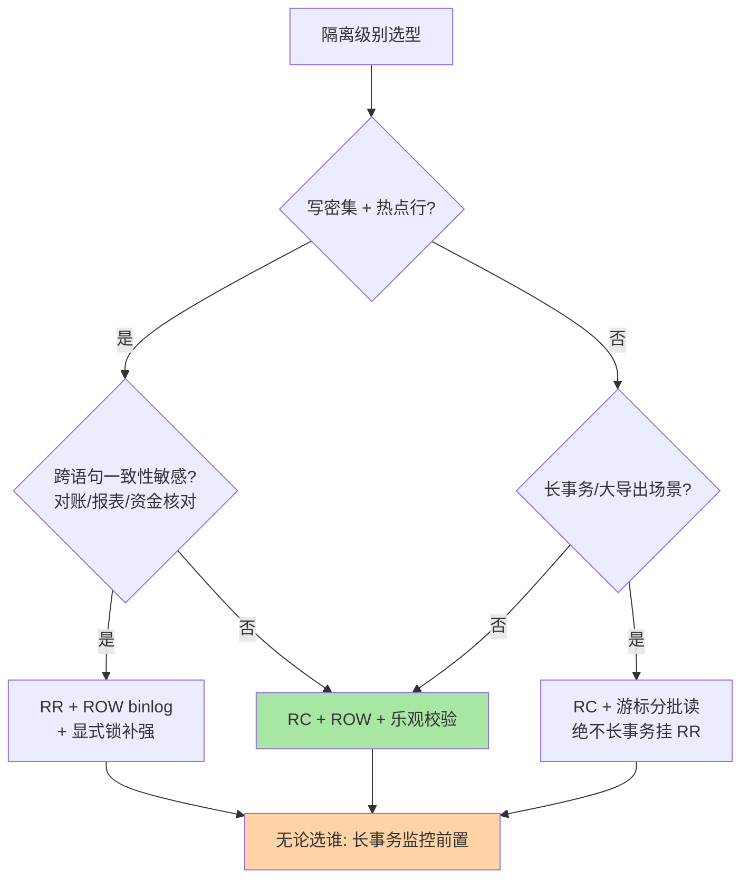
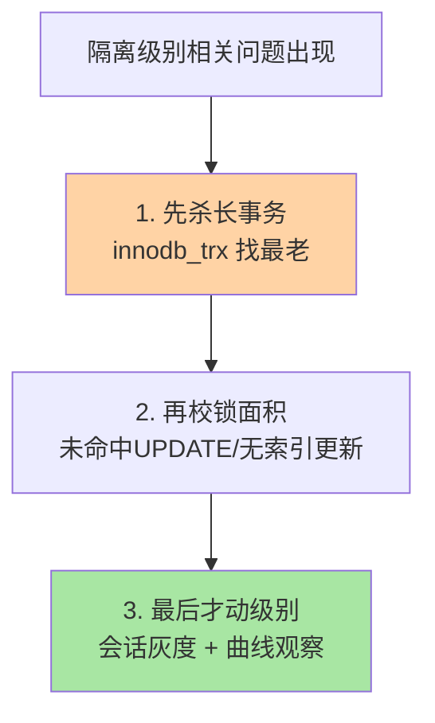

# 事务与MVCC全景：从机制到选型的收束决策

> 特性层把隔离级别的实现机制讲透了（快照读/当前读分工、ReadView、间隙锁）。本篇是专题层的**决策级收束**：机制不再重复讲，只回答三个实战问题——不同量级下隔离级别怎么选、决策树长什么样、长事务与 undo 的治理优先级怎么排。

## 一句话摘要

隔离级别的实现机制收敛成一句话：**RC 与 RR 只差 ReadView 时机与间隙锁开关**（特性层已证）。本篇在这条机制底座上叠加量级与业务维度，给出可执行的选型决策树、五维选型对照、参数基线与治理优先级——把「机制正确」落成「生产选择」。

## 🎯 本文核心

**核心一句话：隔离级别选型 = 机制代价 × 业务容忍 × 规模约束的三元函数——RC 用「跨语句一致性」换「锁面积小、并发高」，RR 用「并发」换「强一致视图」；规模越大、并发越高，越要主动选而不是默认拿。**

决策链（本篇结构挂这条链上）：机制底座（链回特性层）→ 四级别实现全景表 → 量级演进（单机 → 分表 → 分布式）→ 选型决策树 → 五维对照 → 参数基线 → 长事务治理优先级。全文一句话可重构：「默认值是起点不是答案，选型要按三元函数算」。

## 前置阅读

- 特性层《深入理解事务与MVCC系列》篇 1《隔离级别的实现路径》：快照读/当前读分工、RC/RR 两处实现差异（机制正式定义篇）
- 特性层《深入理解事务与MVCC系列》篇 2《版本链与 ReadView》：ReadView 结构与可见性算法
- 特性层《深入理解锁系列》篇 1：记录/间隙/临键锁与加锁规则

## 一、机制底座一分钟（链回，不重写）

特性层已证明的三条结论，本篇直接引用为公理：

1. **快照读/当前读分工**：普通 SELECT 走 MVCC 不加锁，UPDATE/DELETE/FOR UPDATE 走当前读加锁
2. **RC/RR 只差两处**：ReadView 创建时机（每语句 vs 每事务）+ 间隙锁开关
3. **锁面积公式**：锁范围 = 索引访问路径 × 隔离级别——RR 的间隙锁把点冲突放大为区间冲突

这三条是选型的「机制代价」项；「业务容忍」「规模约束」两个维度本篇展开。

## 二、量级演进：规模如何改变选型

| 规模 | 典型架构 | 隔离级别选择 | 风险点 |
|---|---|---|---|
| 单实例 < 百万行 | 单库单表 | 默认 RR 即可 | 几乎无——量小什么级别都扛得住 |
| 单实例 百万~亿行 | 单库分表/大表 | RC + 乐观校验 | 长事务拖 undo、热点行间隙锁冲突 |
| 跨机房 亿~十亿行 | 分库分表 + 异构索引 | RC + 全局 ID + 对账 | 跨片事务、时钟与延迟 |
| 十亿行以上 / 强一致跨片 | NewSQL 或 TCC/Saga | RC 语义 + 补偿 | 对账延迟、最终一致的业务改造 |

**量级的本质约束**：规模越大，事务越长、并发越高，RR 的间隙锁持有面越大——「默认 RR 蒙混」的成本随量级非线性上涨。这也是为什么互联网大厂普遍在「单库时代末期」完成向 RC 的切换：不是 RR 不好，是量级把它的代价放大到了不可接受。

## 三、选型决策树

决策树的判断次序有意为之：**先问负载形态（写密集/热点），再问一致性敏感，最后问事务形态**——多数团队反着来（先问「要不太一致了」），结果在错误的维度上过度设计。

## 四、五维选型对照

| 维度 | 选 RC | 选 RR |
|---|---|---|
| 并发写密集/热点行 | ✅ 锁面积小 | 间隙锁放大冲突 |
| 不可重复读无感 | ✅ 单语句一致即可 | — |
| 长报表/一致性导出 | — | ✅ 固定快照 |
| 资金核对/跨语句事务 | — | ✅ + 显式锁 |
| 事务内「读-算-写」模式 | — | ✅（但优先改原子写） |

**明确推荐**：互联网在线业务默认 RC + ROW binlog + 乐观校验（版本条件更新）；资金/对账域保留 RR + 显式锁。两者共存靠会话级隔离级别——「全局保守、局部放松」或「全局 RC、关键会话 RR」都是成熟打法，唯一错误答案是「全公司一个级别不讨论」。

> 💡 **实战提示**
> - 切 RC 的标准动作是「三件套一起上」：RC + ROW binlog + 应用层乐观校验——只切级别不补校验，等于拆了护栏不装安全带
> - 评审大导出任务先问事务形态：RR 长事务直接否，改「RC + 游标分批」或备库执行——undo 水位比导出速度金贵
> - 级别灰度看两条曲线：锁等待次数与死锁频次，切 RC 后死锁应下降、锁等待应收敛，两条不降说明瓶颈不在级别
> - 会话级别验证写进健康检查：连接池初始化后跑一次 `SELECT @@transaction_isolation` 比对预期，环境漂移当场抓获

## 五、参数基线与治理优先级

| 参数 | 生产推荐 | 为什么 |
|---|---|---|
| `transaction_isolation` | 按决策树定（多为 RC） | 默认值是历史产物，选型要回到三元函数 |
| `binlog_format` | ROW（硬性） | RC 语义下 STATEMENT 有主备分叉风险 |
| `innodb_lock_wait_timeout` | 按 SLA 调（常见 5-10s） | 默认 50s 的长等待会堆积雪崩；超时是「事务放弃等待」，与脑裂无关 |
| `innodb_undo_log_truncate` | ON（8.0 默认） | 配合独立 undo 表空间防暴涨 |

**治理优先级**（隔离级别相关问题的处置顺序）：

1. **先杀长事务**——隔离级别引发的多数问题（快照过旧、undo 膨胀、锁持有长）根源是事务太长，`innodb_trx` 按 `trx_started` 找最老事务
2. **再校锁面积**——热点行的未命中 UPDATE、无索引更新，按锁系列篇 1 的规则推演改写
3. **最后才动级别**——级别切换是全局语义变更，走「会话灰度 → 观察锁等待与死锁曲线 → 全局」的节奏

## 六、跨周期经验：长事务拖爆 undo 的完整剧本

**场景**（行业典型案例叙事）：某交易平台的流水导出任务用 RR 事务跑 4 小时，期间 undo 表空间暴涨、History list length 飙到百万级，全库写入随之抖动。

**根因链路**：RR 长事务的 ReadView 持续有效 → 它「可能需要」的旧版本都无法 purge → undo 持续膨胀 → 清理滞后反噬全库快照读性能。注意归因要准：**是 ReadView 拽住版本链，不是「FOR UPDATE 读旧版本」**——当前读根本不走版本链，混淆这两点会导出错误的治理动作。

**止血三步**：

1. 紧急：kill 长事务，undo 水位随 purge 追平回落（8.0 独立表空间可自动 truncate）
2. 短期：导出任务改「RC + 游标分批」或走备库，事务按秒级设计
3. 长期：长事务监控（分钟级告警）+ 批量任务的事务纪律进评审清单

**Trade-off**：导出一致性（RR 固定快照）与 undo 水位（快照持有时长）不可兼得——解法不是二选一，是把「大事务」改造成「分批小事务 + 断点续传」，两边都要。

## 七、你们可能会问

**Q1：为什么大厂都「敢」用 RC？RC 丢的一致性谁来补？**
由应用层补：更新带版本/状态条件（乐观校验）、资金操作显式锁或原子更新。RC 体系的前提是「应用知道自己要什么一致性」——这恰是它比「默认 RR 然后祈祷」更工程化的地方。

**Q2：跨库分表后隔离级别还有意义吗？**
单库语义只在分片内成立。跨片一致性靠分布式事务体系（XA/TCC/Saga/基干 NewSQL 的快照隔离），MySQL 的隔离级别退化为「分片内并发行为旋钮」——这也是大规模下 RR 的间隙锁意义骤降的原因。

**Q3：怎么验证线上实际生效的级别？**
`SHOW VARIABLES LIKE 'transaction_isolation'` 看全局，会话内 `SELECT @@transaction_isolation` 看当前连接——中间件、连接池初始化 SQL 都可能改写它，「配置中心写的」不等于「连接里生效的」。

## 八、常见误区

- **「RR 就完全没有幻读」**：快照读没有，当前读靠间隙锁基本消除但非公理级保证——特性层篇 1 的分工表是精确答案
- **「RC 不安全」**：RC 放弃的是跨语句一致视图，不是正确性；配上 ROW 与乐观校验是海量生产验证过的体系
- **「级别越高越安全」**：每一级都在付并发账，序列化生产近乎禁用——安全与可用分开定价
- **「UPDATE 的 WHERE 读的是快照」**：当前读读最新已提交版本——误解它是丢失更新事故无法归因的根源

## 九、开放问题

- 快照读与当前读的「双时间线」是 InnoDB 实现选择而非 SQL 标准，PG 等采用不同折中——哪种更优仍由业务形态检验
- 分布式数据库的快照隔离需跨节点对齐时钟（TSO/HLC），单机隔离语义的平移路径各家尚未收敛

## 🎯 核心带走

- **核心一句话**：隔离级别选型 = 机制代价 × 业务容忍 × 规模约束；互联网默认 RC + ROW + 乐观校验，资金域保留 RR + 显式锁，长事务治理永远排在换级别之前
- **决策链**：机制公理（链回特性层）→ 量级演进 → 决策树 → 五维对照 → 治理优先级
- **哪里会坏**：大事务挂 RR（undo 拖爆）、跨片后误用单机隔离语义、配置中心与连接实际级别漂移
- **边界**：本篇是决策收束；机制细节全部在特性层事务与MVCC 系列、锁系列——本文不重复任何一个机制推演

## 📌 数据与事实声明

- 写于 2026-09-09（2026-09-10 按新标准重构为决策级收束），机制以 MySQL 8.0 InnoDB 为基准
- 「互联网默认 RC + ROW」为公开技术规范与社区通行口径；量级分档为行业经验认知
- 免责：参数名与默认值以 dev.mysql.com 官方文档为准

## 📚 参考资料

| 类型 | 标题 | 来源 |
|---|---|---|
| 官方文档 | Transaction Isolation Levels / InnoDB Locking | dev.mysql.com/doc/refman/8.0/en/ |
| 官方源码 | mysql/mysql-server（storage/innobase/row/row0sel.cc） | github.com/mysql/mysql-server |
| 原理书 | 《MySQL 技术内幕：InnoDB 存储引擎》姜承尧 | 公开出版 |
| 实战书 | 《高性能 MySQL（第 4 版）》事务章 | 公开出版 |
| 系列导航 | MySQL 系列目录 | `docs/data/mysql/index.md` |
