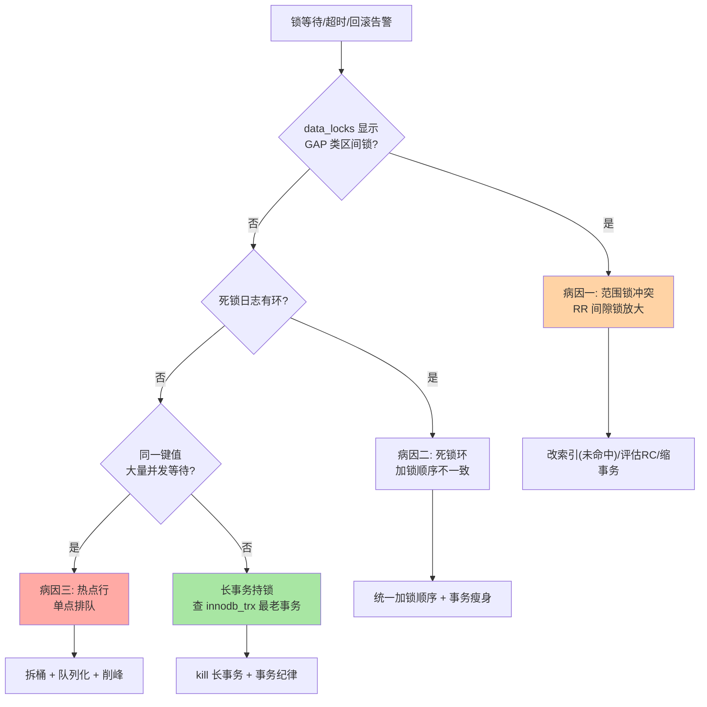
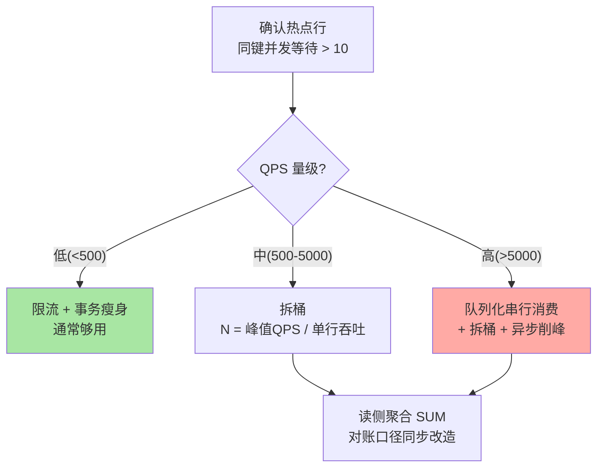

# 锁深度全景：从锁类型到热点治理的收束决策

> 特性层把加锁规则、死锁检测、锁等待监控讲透了。本篇是锁的**决策级收束**：六类锁一张全景表、死锁与锁等待的归因分叉、热点行治理的完整决策链——机制链回特性层，本篇只回答「生产上怎么选、怎么治、怎么排」。

## 一句话摘要

InnoDB 锁体系按对象与语义分六类（记录/间隙/临键/插入意向/自增/元数据），生产上的锁问题收敛为三类病因：**范围锁冲突（RR 间隙锁）、死锁环（加锁顺序）、热点行（单点排队）**——分别对应「级别与索引选型」「顺序统一 + 检测器」「拆桶 + 队列化 + 削峰」三套药方。本篇给出全景对照、归因分叉与治理决策链。

## 🎯 本文核心

**核心一句话：锁问题的排障是「先归因到三类病因，再走对应的治理分支」——范围锁冲突改索引与级别，死锁改加锁顺序，热点行做架构降维；参数（超时/检测开关）永远是最后的止血带，不是治疗手段。**

决策链：六类锁全景 → 三类病因的归因分叉 → 各分支的治理手法与代价 → 选型对照 → 参数的真实定位。全文一句话可重构：「先分类归因，再对病下药，参数兜底不治病」。

## 前置阅读

- 特性层《深入理解锁系列》篇 1《行锁与间隙锁加锁规则》：锁在索引、五条推演公理（机制正式定义篇）
- 特性层《深入理解锁系列》篇 2《死锁检测与处理》：等待图、代价裁决、唯一键插入剧本
- 特性层《深入理解锁系列》篇 3《锁等待与监控》：三件套监控与 L1-L4 治理阶梯

## 一、六类锁全景：一张表对齐

| 锁类型 | 对象 | 典型触发 | 阻塞什么 | 特性层详解 |
|---|---|---|---|---|
| 记录锁 | 单条索引记录 | 等值命中 | 同记录的写 | 篇 1 |
| 间隙锁 | 记录间开区间 | RR 范围/未命中 | 区间内**插入** | 篇 1 |
| 临键锁 | 记录 + 前间隙 | RR 当前读默认 | 插入 + 记录写 | 篇 1 |
| 插入意向锁 | 意图插入的间隙 | INSERT 前的检查 | 与已持有间隙锁冲突（互相之间兼容） | 篇 1 |
| 自增锁 | AUTO_INCREMENT 计数 | 插入取号 | 8.0 默认 `autoinc_lock_mode=2`（交错模式）下**通常不阻塞并发插入**——「自增锁锁表」是老版本记忆 | 篇 1 |
| 元数据锁 MDL | 表定义 | 任何表访问（读锁）/ DDL（写锁） | 长查询拖着 MDL 读锁时 DDL 全表阻塞 | 入门层篇 8 |

全景表的用法不是背，是**归因映射**：出锁问题时先判断「是哪类锁在等」——`data_locks` 的 `LOCK_MODE` 与 `LOCK_TYPE` 直接给出答案，再走对应分支。

## 二、归因分叉：三类病因三套药

归因分叉的顺序有意设计：**先看锁类型（最便宜的证据），再看死锁日志，最后才怀疑热点**——热点治理成本最高，不该在没有证据时先上。

## 三、分支一：范围锁冲突（RR 间隙锁）

典型现场：`UPDATE ... WHERE id=999`（999 不存在）锁住区间，插入成片等待。治理按代价从低到高：

1. **改写法消灭未命中锁**：幂等检查改为原子写（`INSERT ... ON DUPLICATE KEY` / 判 affected rows）
2. **评估该会话切 RC**：锁面积直接减半（点锁），适合写密集热点路径
3. **索引修正**：未命中的根源常是「以为走唯一索引实际走了普通索引/全扫」——按锁系列篇 1 公理重新推演

**代价认知**：RC 切换是全局语义变更（binlog ROW 强绑定），单点收益不值得全局冒险——先改写法，级别是最后选项。

## 四、分支二：死锁环

死锁的完整机制与检测在特性层篇 2，决策收束为三句话：

- **预防优先于重试**：统一加锁顺序（按主键升序）、事务瘦身、索引到位——预防三式消灭剧本型死锁
- **重试必须幂等**：偶发型死锁重试是止损不是修复；剧本型重试大概率再撞
- **检测开关的真实定位**：`innodb_deadlock_detect=OFF` 只适用于「热点行已排队成百上千、检测 CPU 成新瓶颈」且已落地拆桶降维的场景——批量导入场景**不需要也不应该**关检测（导入的死锁靠「按主键排序分批」预防，检测器保持默认 ON 兜真环）

## 五、分支三：热点行（治理决策链）

热点行是三类病因里唯一需要**架构级**动作的。锁风暴链路：高并发更新同一行 → 记录锁排队 → 等待堆积 → 超时回滚 → 业务重试 → 竞争更烈。

**拆桶的隐藏代价**：读侧从「读一行」变「聚合一组」，强一致读取需要事务内聚合；桶数 N 不是越大越好——N 超过实际并发度后只剩读放大。**队列化的隐藏代价**：延迟换吞吐，用户体验从「实时扣减」变「受理中」，产品语义要跟得上。

## 六、选型对照与参数的真实定位

| 场景 | 推荐策略 | 理由 |
|---|---|---|
| 读多写少 | 默认级别即可 | 锁冲突少，别过度设计 |
| 写密集 + 热点路径 | RC + 乐观校验 | 锁面积小（专题篇 1 决策树） |
| 热点单行 | 拆桶 + 队列 | 架构降维是唯一根治 |
| 批量导入/删除 | 按主键排序分批 | 预防死锁与 undo 膨胀，检测器保持 ON |

| 参数 | 定位 | 为什么不是治疗 |
|---|---|---|
| `innodb_lock_wait_timeout` | 止血带（常见调 5-10s） | 改变失败速度，不减少冲突总量；前提是应用幂等重试 |
| `innodb_deadlock_detect` | 热点场景的最后开关 | OFF 后真环等超时拆——堆积效应比偶发死锁更伤 |
| `innodb_print_all_deadlocks` | 取证常开 | 日志只留最近一次，全量落错误日志代价可忽略 |

> 💡 **实战提示**
> - 排障先取证再动手：`data_locks`（锁类型与区间）→ 死锁日志（环与剧本）→ `innodb_trx`（最老事务）——三份证据到手，三分之二的问题自己说出答案
> - 拆桶数按「峰值 QPS / 单行吞吐上限」起算，压测校准；桶键用 `id % N` 时注意扩桶是一次数据迁移
> - 超时参数调小必须配套幂等重试与退避——否则快失败只是把雪崩加速
> - 锁告警分三条独立阈值：区间锁等待（GAP）、死锁频次、同键并发数——三条曲线分开了，归因不迷路

## 七、你们可能会问

**Q1：为什么不让数据库自己解决热点行？**
单行锁的物理上限（一行一个锁队列）是并发模型的边界，内核的热点优化（组提交向单行聚合）仍在社区议题阶段——工程上拆桶/队列化是当下唯一根治路径，等待内核演进不如现在就掌握降维手法。

**Q2：三类病因会同时出现吗？**
会，且常互相伪装：热点行排队会表现为「大量锁等待」像范围锁问题；死锁频发可能是热点拆桶不均的新热点。归因分叉图的作用就是强制「先看证据再下结论」。

**Q3：批量任务与在线流量的锁隔离怎么做？**
时间隔离（低峰跑批量）+ 路径隔离（批量按主键升序分批）+ 资源隔离（批量走备库/独立实例）——三层里至少做两层，全靠时间隔离的方案在大表上迟早翻车。

## 八、常见误区

- **「行锁不会锁全表」**：机制上不会，无索引 WHERE 全扫全锁效果近似表锁——锁粒度由索引路径决定，不由主观意图决定
- **「间隙锁防读」**：间隙锁不阻塞任何读，只阻塞插入——使命是 RR 防幻插入
- **「死锁是数据库故障」**：检测回滚是正常机制；频繁死锁才是设计问题——按剧本修而不是调参
- **「关检测器是热点行标配」**：它是拆桶/队列化之后的最后一步，单独关 = 把 50 秒超时当检测器用，堆积效应更凶

## 九、开放问题

- 分布式数据库把等待图跨节点展开，死锁检测需要全局协调，时效与开销的平衡各家差异大，尚无收敛标准
- 热点行的内核级方案（单行组提交、写合并）成熟后，「拆桶 + 队列化」这套工程手段或将部分退役——值得持续跟踪内核演进

## 🎯 核心带走

- **核心一句话**：锁问题先归因三类病因（范围锁/死锁环/热点行）再对病下药——改写法、改顺序、做降维；参数是止血带不是治疗
- **决策链**：六类锁全景 → 归因分叉 → 三分支治理 → 选型对照 → 参数定位
- **哪里会坏**：未命中 UPDATE 锁区间、异序加锁成环、热点单行排队风暴、批量任务关检测的错误「优化」
- **边界**：本篇是决策收束；加锁规则、死锁检测、监控三件套的机制细节全部在特性层锁系列——本文零机制重复

## 📌 数据与事实声明

- 写于 2026-09-09（2026-09-10 按新标准重构），机制以 MySQL 8.0 InnoDB 为基准；`innodb_autoinc_lock_mode` 默认 2 为 8.0 口径
- 热点阈值（同键等待 >10）、超时调优区间（5-10s）为业内经验认知，需按业务 SLA 定
- 免责：参数与行为以 dev.mysql.com 官方文档为准

## 📚 参考资料

| 类型 | 标题 | 来源 |
|---|---|---|
| 官方文档 | InnoDB Locking / Deadlocks / AUTO_INCREMENT Handling | dev.mysql.com/doc/refman/8.0/en/ |
| 官方源码 | mysql/mysql-server（storage/innobase/lock/） | github.com/mysql/mysql-server |
| 原理书 | 《MySQL 技术内幕：InnoDB 存储引擎》姜承尧 | 公开出版 |
| 实战书 | 《高性能 MySQL（第 4 版）》锁章 | 公开出版 |
| 系列导航 | MySQL 系列目录 | `docs/data/mysql/index.md` |
