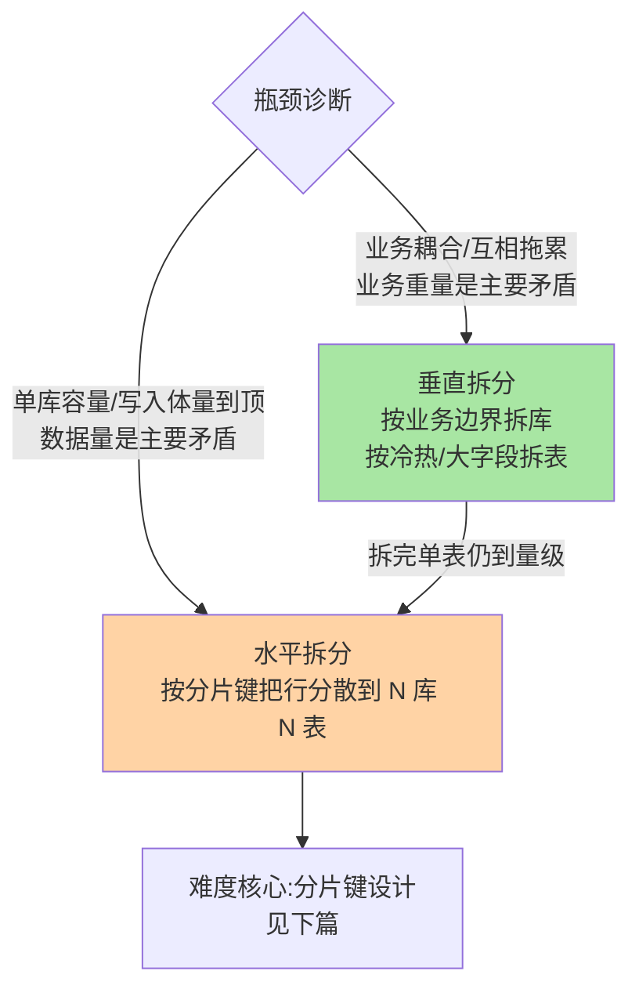
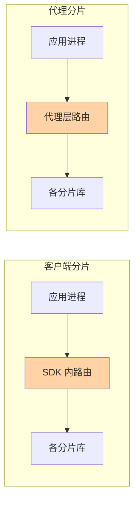

# 拆分方案选型：什么时候拆、往哪个方向拆

> 分库分表是「打破了才做」的手术：一旦拆开，跨片查询、分布式事务、运维复杂度全找上门。所以选型的第一问不是「怎么拆」，是「现在真的到了必须拆的量级吗」——这篇给出一套先诊断、再定方向、后选工具的完整决策链。

## 一句话摘要

拆分决策三步走：**① 量级诊断**（先穷尽单库优化，到达量级红线才动手）；**② 方向选择**（垂直拆按业务边界与冷热分家，水平拆按行分散容量与写入压力）；**③ 工具选型**（客户端分片 SDK 与代理层两条路线）。**垂直拆解决「业务的重量」，水平拆解决「数据的体量」**——绝大多数大表最终需要的是水平拆，而水平拆的一切难度都源自拆分键（下篇主题）。

## 🎯 本文核心

**核心一句话：拆分是单向门决策——先诊断量级（单库手段穷尽 + 红线触发），再定方向（垂直治业务重量、水平治数据体量），最后选工具（SDK vs 代理按团队形态）；为想象中的量级预支复杂度，是存储设计里最贵的乐观。**

决策链：单库优化清单（拆前必做）→ 量级红线（亿级/写瓶颈/运维窗口）→ 方向决策树（垂直 → 水平的经典路径）→ 中间件双路线取舍 → 「为拆而拆」事故的沉淀。全文一句话可重构：「先证明必须拆，再决定怎么拆——顺序反了就是为拆而拆」。

## 前置阅读

- 入门层篇 14《分库分表与扩展》：拆分的基本概念
- 本目录篇 1《索引失效排查手册》的量级视角：单库优化的天花板在哪

## 目标导向

本文是什么：拆分时机诊断、方向选择、中间件选型的决策方法论。功能是什么：给「要不要拆、怎么拆」一个可评审的决策过程。能得到什么：量级红线的判断维度、垂直/水平决策树、两类中间件架构的取舍表。为什么用：容量规划评审、大表治理专项、新业务存储选型，必看。

## 一、量级诊断：先确认真的需要拆

拆分是代价最高的存储决策，动刀前把单库手段用尽：

```text
单库优化清单（拆分前必须做完）：
□ 索引治理完成（冗余清理 + 覆盖索引，见索引优化深度）
□ 冷热分离：历史数据归档到冷表/冷库，热表只剩活跃数据
□ 大字段外移：TEXT/JSON 拆到附表，主表行宽收敛
□ 读写分离承接读压力（复制链路治理见主从深度）
□ 写入削峰：批量异步化、热点行拆桶

量级红线参考（行业认知口径，按硬件实测）：
· 单表行数进入亿级、B+ 树高度 4 层成常态
· 单实例写入持续逼近硬件瓶颈、垂直扩容（更大规格）不再经济
· 单库容量逼近备份/DDL/复制的时间窗口上限
```

**量级演进视角**：百万级靠索引、千万级靠优化与缓存、亿级才谈拆分——**跳级拆分是过度设计**：千万行的表拆成 32 片，换来的是跨片查询、分布式 ID、双倍运维，收益却接近零。

## 二、方向选择：垂直与水平解决两种病



- **垂直拆库**：订单、商品、用户各归各库——解决业务耦合（一个业务拖垮连接池、互相抢锁），顺带把总容量分摊。它几乎零风险，**业务边界清晰的中大型系统第一步都该做垂直拆**
- **垂直拆表**：宽表按访问频率分家（热字段主表、冷字段附表）、大字段外移——行宽下降让每页装更多行，缓存命中率上升
- **水平拆表/库**：同一张表按分片键把行散到多库多表——唯一能同时解决「容量」与「写入」的方案，代价是查询路由与跨片事务

两者组合是常态：**先垂直解耦、后水平扩容**是业内演进的经典路径。

## 三、中间件选型：客户端 SDK vs 代理层

两条路线的**机制**差异在「路由发生在哪一层」：SDK 在应用进程内解析 SQL 并路由，代理在独立进程拦截转发——**原理**不同，架构形态与取舍随之：



| 维度 | 客户端分片（如 ShardingSphere-JDBC） | 代理层分片（如 ShardingSphere-Proxy） |
|---|---|---|
| 架构位置 | SDK 嵌入应用进程 | 独立代理进程，应用连代理 |
| 性能 | 少一跳网络，延迟低 | 多一跳转发 |
| 语言生态 | 绑定语言（Java 为主） | 语言无关，异构系统友好 |
| 运维 | 无独立组件 | 代理集群的部署/扩容/监控 |
| 升级 | 随应用发版，灰度慢 | 代理独立升级，全局快 |
| 复杂查询支持 | 应用侧解析 | 代理侧统一，管控强 |

**取舍口诀**：技术栈统一、追求极致延迟 → 客户端；异构技术栈、重管控运维 → 代理；两者同源（ShardingSphere 双形态并存）时可**按团队形态混用**。自研分片中间件在业内已是「历史遗产」多于「新建选项」——生态成熟度是选型的压倒性权重。

## 四、事故推演：一次「为拆而拆」的过度设计

某系统核心表 3000 万行，团队提前规划「亿级未来」，按用户 ID 拆了 64 片。一年后暴露的问题：运营后台按时间维度拉报表，全片广播聚合；分布式 ID 接入改造；分片扩容（64→128）的再平衡方案论证了一个季度没落地；新同事理解数据分布的培训成本持续存在。而这张表在做好归档与索引后，真实活跃数据从未超过 4000 万行。

三条沉淀：

1. **拆分红利按「当前量级」兑现，拆分成本按「片数」计**——为想象中的量级预支复杂度，是存储设计里最贵的乐观
2. **片数设计要留「逻辑层」**：业界默认用「逻辑分片数大、物理映射可调」的设计（如 1024 逻辑槽映射到物理实例），把「扩容」变成「映射调整」——这条路在选型时就该定，别等分完再论证
3. **拆分决策要写 ADR**：量级假设、片数理由、再平衡方案一并归档——一年后评估「拆错了没」才有依据

## 业内惯例

> 💡 **实战提示**
> - 拆分评审先过「归档关」：把历史数据归档后的活跃行数算给评审会看——多数「到量级」的表归档后回到舒适区，归档永远是拆分的前置手术
> - 什么时候定逻辑分片映射：第一次做水平拆就定（1024 逻辑槽起步）——它把未来的「扩容」从数据迁移降级为映射调整，事后补设计等于二次拆分
> - 中间件选型做「团队形态两问」：应用团队有没有能力承接分片心智（→ SDK）？有没有中间件团队承接代理运维（→ Proxy）？两个都没有就是时机未到
> - 拆分 ADR 四要素：量级假设、分片键理由、片数与映射方案、再平衡预案——一年后评估决策质量全靠它

- **先归档再拆分**：多数「到量级」的表归档历史后回到舒适区——归档是拆分的前置手术，业内默认流程
- **逻辑分片 + 映射表**：固定大逻辑片数（512/1024），映射到可变的物理实例——扩容只动映射不动数据分布规则，是再造分的通行解
- **云上选型看托管分片能力**：云厂商的分布式数据库（PolarDB-X 类、Vitess 类托管）把分片路由、扩容再平衡产品化——新建系统优先评估托管能力，自管分片是存量延续选项
- **拆分与团队形态匹配**：客户端分片要求应用团队承接分片心智，代理分片要求中间件团队承接运维——按「谁有富余人力」定路线是务实的业内现实

## 你们可能会问

**Q1：分库和分表必须一起做吗？**
不必。只分表解决单表 B+ 树体量，但实例容量与写入仍集中；只分库解决容量写入但单表仍大。**先分表（同库内）验证分片键设计，再演进到分库**是风险更低的渐进路径。

**Q2：分片数怎么定？**
「当前量级 × 预期增长 ÷ 单片舒适容量」向上取整，且配逻辑分片映射留余量。舒适容量业内口径单表千万级内——按行宽与硬件实测校准，不背通用数字。

**Q3：拆分后还能回退吗？**
物理上可以反向合并（数据搬回），但业务上几乎不可逆——应用已依赖分片路由语义。**把拆分当单向门决策，门前的量级诊断就要更认真**。

## 五、自测三问

1. 拆分前必须做完的单库优化清单有哪些？为什么归档排第一？
2. 垂直拆与水平拆各解决什么病？经典演进路径是什么？
3. 客户端与代理两条路线的取舍口诀是什么？

## 开放问题

- 分布式数据库（原生分片 + 分布式事务）与「MySQL + 分片中间件」两条路线的竞争持续——业务无感分片一旦成熟到价格可接受，自建分片的工程价值将系统性重估。
- Serverless 形态的「按需自动分片」已有云厂商试点，容量规划这门手艺的半自动化程度在快速上升。

## 🎯 核心带走

- **核心一句话**：拆分 = 单向门决策——量级诊断先行（穷尽单库手段），垂直治业务重量、水平治数据体量，工具按团队形态选；逻辑分片映射在第一次拆分时就定
- **决策链**：优化清单 → 量级红线 → 方向树 → SDK/Proxy 取舍 → ADR 归档
- **哪里会坏**：为想象量级预支 64 片、归档没做就上手术台、扩容方案临时论证
- **边界**：本篇管「要不要拆、往哪拆」；分片键设计与迁移实操在下两篇，跨片查询与事务的架构答案在篇 4

## 📌 数据与事实声明

- 写于 2026-09-08，工具口径以 ShardingSphere 5.x 与主流云分布式数据库公开文档为准
- 量级红线（亿级/4 层树/千万舒适区）为行业认知口径，决策需按硬件与行宽实测校准
- 免责：产品能力以各官方文档为准

## 📚 参考资料

| 类型 | 标题 | 来源 |
|---|---|---|
| 开源项目 | Apache ShardingSphere（JDBC/Proxy 双形态） | shardingsphere.apache.org |
| 开源项目 | Vitess（CNCF，分片中间件） | vitess.io |
| 实战书 | 《高性能 MySQL（第 4 版）》规模化章 | 公开出版 |
| 社区沉淀 | 各大厂公开的分库分表演进文章 | 技术社区公开文章 |
