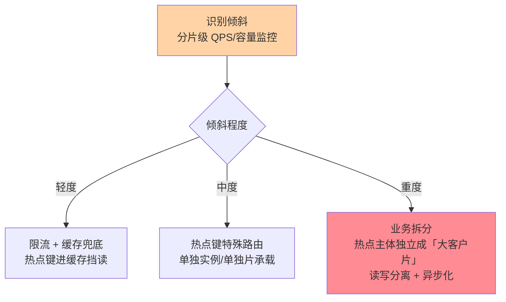
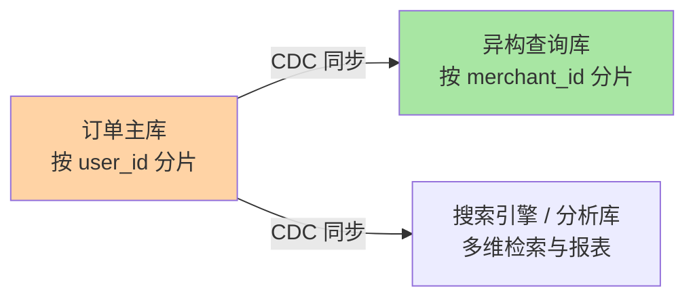

# 分片键设计：数据分布与查询路由的总开关

> 分片键一旦选定就几乎不可更改——它同时决定数据落在哪、查询走哪片、热点如何分布。这篇讲透选键三原则、三种路由算法的取舍、倾斜治理与跨片查询的分层解法，把「最重要的存储设计决策」变成可评审的流程。

## 一句话摘要

分片键设计的铁律是**三问定键**：① 高频查询带不带它（带 = 路由到单片，不带 = 全片广播）；② 分布均不均匀（哈希后各片数据量与流量是否均衡）；③ 值稳不稳定（键值永不变更，变更 = 数据搬家）。**没有完美分片键，只有「为最高频查询维度牺牲其他维度」的取舍**——跨维度查询靠异构索引补齐，这是分片设计的终极平衡术。

## 🎯 本文核心

**核心一句话：分片键同时决定「数据落在哪、查询走哪片、热点如何分布」——三问定键（高频带键？分布均匀？值终身不变），选不出完美键就为最高频维度牺牲其余，跨维度靠异构索引补；键选错 = 全系统为它陪葬。**

决策链：三问定键（订单表三候选实测推演）→ 三种路由算法取舍 → 倾斜治理三层（限流/特殊路由/业务拆分）→ 跨维度三层解法（避免/异构/溢出）→ 「换键搬家」事故的沉淀。全文一句话可重构：「键是分片体系的宪法，设计时把取舍写进文档，运行时靠异构与治理补维度」。

## 前置阅读

- 本目录篇 1《拆分方案选型》：水平拆的决策语境
- 入门层篇 5：索引的最左前缀——分片键与索引键在思维上同构（都是「检索路径的第一段」）

## 目标导向

本文是什么：分片键选型、路由算法、倾斜与跨片查询的完整方法论。功能是什么：给「键选谁、怎么路由、歪了怎么办、别的维度怎么查」一套答案。能得到什么：三问定键法、哈希/范围/查找表三种路由的取舍表、异构索引的分层解法。为什么用：分片方案评审、热点问题归因、跨片查询优化，必看。

## 一、三问定键：把取舍摆在桌面上

以订单表为例走一遍三问：

```text
候选分片键：user_id / order_id / create_time

Q1 高频查询带它吗？
  · C 端「我的订单」按 user_id 查 → user_id 得分最高
  · 风控按 order_id 单号查 → order_id 得分高但频率低一档
  · 运营按时间拉报表 → 谁当键它都是广播

Q2 分布均匀吗？
  · user_id 哈希：大商户与小用户各占一用户 → 大 V 用户下单量
    是均值百倍 → 流量倾斜（数据量均匀、流量不均匀）
  · order_id 哈希：天然均匀
  · create_time 范围：当前月片滚烫、历史片冷 → 时间倾斜

Q3 值会变吗？
  · user_id：订单归属永不变 → 合格
  · 手机号当键：换号即搬家 → 不合格
```

结论（业内最常见的落点）：**C 端主导的订单表用 user_id 哈希**——用「运营按时间查变成广播」换取「最高频的 C 端查询路由到单片」。这个取舍要写进设计文档，让所有后来者知道「为什么我的查询是广播」。

## 二、三种路由算法：一张取舍表

| 算法 | 路由规则 | 优势 | 代价 |
|---|---|---|---|
| 哈希取模 / 一致性哈希 | hash(key) → 片 | 分布均匀、路由简单 | 扩容再平衡复杂（一致性哈希缓解） |
| 范围分片 | 按键区间切 | 范围查询友好、易理解 | 天然热点（最新区间最热） |
| 查找表（映射服务） | 键 → 片的显式映射 | 灵活、可定向迁移 | 多一次查找 + 映射服务可靠性 |

业内主流是**哈希族**：`hash(user_id) % 逻辑片数`，配合「大逻辑片数 + 映射到物理实例」（上篇的结论）让扩容变成映射调整。路由算法的演进主线是「扩容成本递减」：裸取模全量再平衡 → 一致性哈希部分迁移 → 查找表只改映射。范围分片留给「时间序列 + 冷热分明」的表（日志、账单归档），热点用「最新片拆更细」或「历史自动降温」对冲。

## 三、倾斜治理：数据均匀 ≠ 流量均匀

哈希解决了数据量均匀，**流量倾斜**仍会来：头部主播的店铺、爆款商品、大客户的账号——单片流量可以是均值百倍。分层治理：



关键认知：**倾斜是业务形态的投影，不是技术缺陷**——治理上限由业务决定（大促头部商品就是全民访问），技术能做的是「识别早、隔离好、降级稳」。与 Sentinel 系列的「热点参数限流」互为上下游：接入层挡读流量，存储层做物理隔离。

## 四、跨维度查询：异构索引是终极答案

用 user_id 分片后，「商家查订单」「风控按单号查」「运营按时间拉报表」全是跨片广播。解法分层：

```text
第一层：能避免就避免
  · 低频后台查询 → 并行扫所有片聚合（接受秒级延迟，不优化）
第二层：异构一份「按另一维分片」的索引库
  · 订单按 user_id 分片（主库）→ 同步一份到「按 merchant_id 分片」
    的查询库（商家侧查询走它）→ 数据由 binlog/CDC 同步
第三层：复杂检索溢出到专用引擎
  · 多维筛选/全文 → 同步进 Elasticsearch（互指本仓库 ES 系列）
    /宽表进 ClickHouse 类分析库（运营报表）
```

**Trade-off 核心**：主库分片键只为最高频维度服务，其余维度用「异构副本 + 最终一致」换——一致性代价（同步延迟秒级）与维护代价（多一套同步链路）是显式付出的。业内成熟系统几乎都是「主库 + N 个异构查询库」的组合形态，单一组件服务所有维度是不存在的理想：



## 五、事故推演：一次「换键」引发的数据搬家事故

某系统早期用「手机号」做用户表分片键（业务注册即绑定）。一年后业务支持换绑手机号——**键值变更触发数据搬家**：迁移脚本跨片搬运 + 双写校验 + 应用层路由缓存刷新，牵动三周工程；期间一次缓存未刷新导致新号查不到、旧号查到他人数据的串号投诉。

三条沉淀：

1. **身份类键值必须「终身不变」**：选键时问「业务演进中有没有任何路径会改它」——换绑、合并、过户类业务是键值稳定性的天然杀手
2. **「代理键」模式是兜底**：业务标识可变的系统，用稳定的内部 ID（注册即生成、永不变更）当分片键，可变标识只做二级索引/异构库
3. **迁移类操作自带监控**：键值变更 = 小规模「搬家」，双写 + 校验 + 灰度的一整套迁移纪律（下篇展开）同样适用

## 业内惯例

> 💡 **实战提示**
> - 什么时候重审分片键：单片 QPS 与均值差一个量级、跨片广播查询进慢查 Top、业务出现「换绑/合并/过户」需求——三条任一出现就把分片键拉回评审桌
> - 新查询接入评审第一问「带分片键吗」：不带键的查询显式白名单登记（频率/超时/异构路由），匿名广播是慢查染名人堂的常驻选手
> - 倾斜监控出「片级报表」：容量/QPS/慢查按分片维度，热点键进单独告警——片级可见才谈得上片级治理
> - 代理键模式做兜底判断：业务标识只要存在「可变路径」（换绑/改名/过户），就用不可变内部 ID 当键，可变标识降级为二级索引

- **分片键写进表设计文档的第一行**：所有查询设计先对「分片键维度」对齐——业内把「带不带分片键」作为 SQL 评审第一问
- **不带键的查询走白名单**：跨片查询显式登记（频率、超时、是否可走异构库），禁止匿名广播在生产横行
- **分片监控带「单片水位」**：容量、QPS、慢查询按分片维度出报表——倾斜要「片级可见」才能「片级治理」
- **哈希函数避免裸取模**：裸取模是朴素起点，一致性哈希与映射表是演进产物——用 `hash()` 族而非直接 `key % N`（键值分布不均时裸取模放大倾斜），细节但值得写进规范

## 你们可能会问

**Q1：能不能用组合键（user_id + time）兼顾两个维度？**
组合键只能优化「两维同时给定」的查询（哈希后仍单一落点），单维查询照样广播——它不解决维度冲突，只收窄特定场景。维度冲突的通用解仍是异构索引。

**Q2：一致性哈希解决了什么、没解决什么？**
解决「扩容时只迁移部分数据」；不解决流量倾斜（键值分布问题与路由算法无关）。把它当「扩容友好」技术而非「热点治理」技术。

**Q3：分片键和分表后每片的主键怎么共存？**
业内默认：片内主键 = 全局分布式 ID（下篇展开），分片键作为普通索引列存在——两者职责正交：ID 管唯一性，分片键管路由。

## 六、自测三问

1. 三问定键是哪三问？订单表为什么业内默认选 user_id？
2. 数据量均匀为什么还会有倾斜？倾斜治理的三层动作是什么？
3. 跨维度查询的三层解法是什么？异构索引付出的一致性代价是什么？

## 开放问题

- 分布式数据库把「二级索引全局化」做成内核能力（索引表自动分布），应用侧「异构索引」的工程量有望被产品吸收——两条路线的成本分界在持续移动。
- 多租户 SaaS 的分片键常取 tenant_id，租户间体量悬殊（超大同租户）催生「租户级动态迁移」能力，调度式分片管理是活跃方向。

## 🎯 核心带走

- **核心一句话**：分片键 = 分布 + 路由 + 热点的总开关——三问定键，为最高频维度牺牲其余，跨维度靠异构索引；键值必须终身不变
- **决策链**：三问定键 → 路由算法取舍 → 倾斜三层治理 → 跨维度三层解法 → 换键事故教训
- **哪里会坏**：可变键值搬家、大 V 流量倾斜、匿名广播查询、裸取模放大倾斜
- **边界**：本篇管「键怎么选」；拆分时机与工具在篇 1，全局 ID 与迁移在篇 3，架构全景在篇 4

## 📌 数据与事实声明

- 写于 2026-09-08，机制口径以 ShardingSphere 5.x 文档与分布式数据库公开资料为准
- 「大 V 流量百倍倾斜」为行业认知口径；事故推演为高频案例模式的匿名化复述
- 免责：产品能力以各官方文档为准

## 📚 参考资料

| 类型 | 标题 | 来源 |
|---|---|---|
| 开源项目 | Apache ShardingSphere（分片/路由文档） | shardingsphere.apache.org |
| 关联系列 | 本仓库《深入理解 Elasticsearch 系列》（异构检索） | docs/data/elasticsearch/ |
| 实战书 | 《高性能 MySQL（第 4 版）》规模化章 | 公开出版 |
| 社区沉淀 | 各大厂公开的分片键设计实践 | 技术社区公开文章 |
