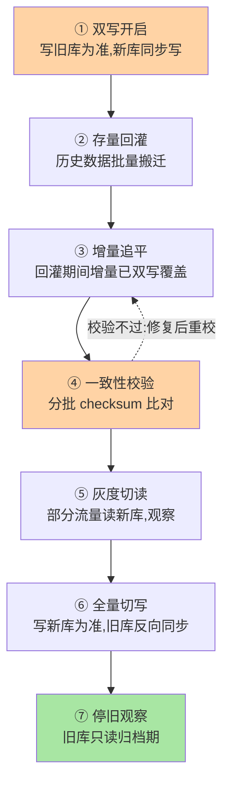
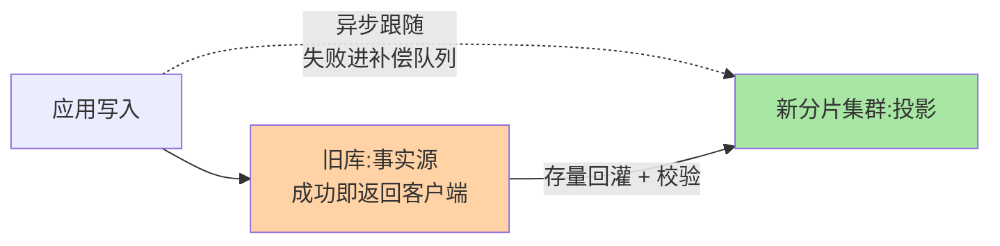

# 分布式 ID 衔接与平滑迁移：拆分的临门两脚

> 分片键定了、工具选好了，还差两脚临门：**主键换成全局唯一的分布式 ID**，以及**存量数据无痛搬到新分片**。前者是选型题（机制深挖互指分布式 ID 系列），后者是流程题——双写、回灌、校验、灰度切换，每一步都有翻车姿势。这篇把两脚都落地。

## 一句话摘要

分库分表后自增主键跨片必冲突，**分布式 ID 是入场券**——业内主流是「号段模式」（DB 批量发号，简单可靠）与「雪花模式」（时间戳 + 机器号，本地发号无依赖），选型互指本仓库分布式 ID 系列的正式定义篇。**存量迁移的工业标准是七阶段双写流程**：双写开启 → 存量回灌 → 增量追平 → 一致性校验 → 灰度切读 → 全量切写 → 停旧观察，每阶段有明确的进入/退出条件与回滚点——**迁移的本质是「把一次大切换拆成七次可回滚的小切换」**。

## 🎯 本文核心

**核心一句话：迁移 = 把一次不可逆的大切换拆成七次可回滚的小切换——旧库始终是事实源、新库是投影，直到校验过关才反转；跳过任何一阶段（尤其校验）等于拆掉它挡住的那类事故的防线。**

流程链：ID 入场券（号段/雪花 vs UUID 出局）→ 七阶段与各自的回滚点 → 双写三细节（以谁为准/写次序/ID 映射表）→ 校验三件套（行数/内容/业务抽样）→ 切写不可轻退点 → 跳过校验的事故剧本。全文一句话可重构：「阶段不可压缩，窗口可以前置；成功率不等于一致性」。

## 前置阅读

- 本目录篇 1/2：拆分决策与分片键——迁移的目标形态
- 关联正式定义篇：`architecture/system-design/distributed-id` 系列（ID 机制深挖在那边，本文只做分片语境的选型衔接）

## 目标导向

本文是什么：分片语境下的 ID 选型衔接 + 存量数据迁移全流程。功能是什么：给「ID 怎么换、数据怎么搬、出了问题怎么回」一套可执行方案。能得到什么：两类 ID 的分片适配要点、七阶段迁移 SOP、校验与回滚的工程细节。为什么用：分库分表落地、历史库改造、云迁移项目，必看。

## 一、分布式 ID：分片语境下的选型衔接

单表内自增 ID 在分片后失去全局唯一性，各片独立自增必然撞号。选型口径（机制深挖互指分布式 ID 系列，此处只讲与分片的适配面）：

| 方案 | 发号方式 | 分片适配性 | 注意点 |
|---|---|---|---|
| 号段模式 | 应用向 DB 批量取号段，内存分发 | 依赖一个「发号库」，弱化分库部署复杂度 | 号段长度权衡迁移高峰的耗尽速度 |
| 雪花模式 | 本地按时间戳 + 机器号生成 | 无中心依赖，与分片完全解耦 | 机器号分配与时钟回拨治理 |
| UUID | 本地随机 | 无依赖但无序——聚簇插入恶化（特性层篇 1 的页分裂代价） | 生产主键基本排除 |

两条分片特有考量：**① ID 与路由的模块边界要清晰**——ID 只管唯一，路由只认分片键，别用「ID 哈希当路由」把两件事焊死（除非一开始就按 ID 分片且确定不改）；**② 趋势递增保护聚簇**——雪花/号段天然趋势递增，与 B+ 树顺序插入友好；这是 UUID 出局的根本原因。

## 二、迁移七阶段：把大切换拆成七次小切换

每阶段的进入/退出条件与回滚点：

| 阶段 | 进入条件 | 退出条件 | 回滚方式 |
|---|---|---|---|
| ① 双写 | 新库就绪、双写开关可灰度 | 双写成功率 100% 且有监控 | 关开关回单写旧库 |
| ② 回灌 | 双写稳定运行 | 存量搬迁完成、时间戳水位记录 | 删新库数据重来 |
| ③ 追平 | 回灌完成 | 追平延迟 < 阈值并稳定 | 同② |
| ④ 校验 | 追平稳定 | 分批 checksum 差异清零 | 不通过则修数重校 |
| ⑤ 切读 | 校验通过 | 灰度读无异常反馈 | 读开关回旧库（秒级） |
| ⑥ 切写 | 灰度读稳定满一个观察期 | 写入成功率 + 业务指标正常 | **写开关回旧库 + 反向补偿**（最重回滚点） |
| ⑦ 停旧 | 切写稳定满观察期 | 无回滚诉求、归档完成 | 已过回滚窗口，走正向修复 |

**阶段⑥是全流程的「不可轻退点」**：切写后旧库已不是事实源，回滚需要把期间的写反向同步回旧库——业内做法是切写后保留「反向同步链路」数天，回滚窗口与反向同步共存亡。

## 三、双写的三个工程细节

双写链路的架构原则一句话：**旧库是事实源、新库是投影**——上下游职责不对称，迁移才不会把线上稳定性拖下水：

1. **以谁为准**：双写期间**写旧库为准、新库异步跟随**（不是同步双写）——同步双写把新库故障传导给主链路，违背迁移「不动线上稳定性」的初衷。新库写失败记补偿队列，不阻塞业务
2. **写次序**：先旧后新，且旧库成功即返回——「新库是投影」的心智贯穿双写期
3. **迁移期间的新表结构**：新库分片表的主键换分布式 ID，旧库仍是自增——**回灌时 ID 映射表（旧 ID → 新 ID）必须落库**，关联表（子表外键）随映射表批量改写。这是存量迁移里最容易漏的一环，漏了就是关联断裂

## 四、一致性校验：迁移动作的「结算依据」

校验三件套（原理与主备校验同源，互指本目录 HA 篇 3 的 pt-table-checksum）：

- **行数校验**：按分片 + 时间分块计数比对——最粗但最快，先跑它兜住大方向
- **内容校验**：分块 CRC/哈希比对——发现「数量对但内容漂」的静默差异（双写 bug 的典型产物）
- **抽样业务校验**：按业务语义抽单（订单金额、状态机终态）——技术校验之外的最后一道业务保险

**量级演进视角**：千万行以下可以全量校验；亿级存量必须「分块 + 并发 + 低峰窗口」三件套，且校验本身可能跑数天——**校验窗口要写进迁移计划的关键路径**，不是「回头补一下」的杂项。

## 五、事故推演：一次跳过校验的切写事故

某团队为赶大促窗口，把七阶段压缩成「双写三天 → 直接全量切写」，跳过了④校验（认为双写成功率 100% 足够）。切写两天后客服反馈批量订单缺附件——归因发现双写中间某小时新库写入失败未进补偿队列（监控盲区），该时段附件关联全部缺失。回滚已过窗口（旧库停更），只能靠日志修复数据，工程量数倍于当时一次校验。

三条沉淀：

1. **「双写成功率 100%」≠「数据一致」**——成功率度量「调用成功」，校验度量「结果一致」，两个指标之间隔着补偿队列的可靠性
2. **阶段不可压缩，窗口可以前置**——赶时间的正确姿势是「提前开始迁移」，不是「删减流程」；七阶段的每一环都有它挡住的事故形态
3. **回滚窗口与观察期成正比**——切写后的观察期是最后的退路，用观察期换排期，账算不过来

## 业内惯例

> 💡 **实战提示**
> - 迁移排期原则「窗口可以前置、阶段不可压缩」：赶大促的正确姿势是提前两个月启动，不是删掉校验——每个阶段都有它挡住的特定事故形态
> - 切写观察期与反向同步共存亡：切写后保留旧库反向同步链路数天，回滚窗口 = 观察期长度，写进迁移预案
> - ID 映射表单独建库管理：回灌生成的旧 ID → 新 ID 映射是关联表改写的枢纽，丢失 = 关联断裂，它的可靠级按核心元数据对待
> - 什么时候走停机迁移：数据量小（千万内）+ 停机窗口可得——「停写 → 搬 → 切」的简化版反而比双写更不容易出错，别为了「高级」硬上双写

- **迁移平台化**：双写开关、追平监控、校验任务、切读切写灰度收敛到内部迁移平台/开源工具链——平台把七阶段的上下游动作编排成原子步骤，多环境下手工执行的风险指数放大
- **切读先于切写**：读是低风险验证（错了回读开关），写是高风险切换（回滚要反向补偿）——**用读流量给新库做免费压测**是业内标准步骤
- **迁移文档按「阶段手册」写**：每阶段的目的、操作、验收、回滚一页纸——迁移执行者按手册走，不靠记忆与口头交接
- **旧库归档期保留可查**：停写不等于下线，归档期按月计——「查旧库」是客户投诉排查的最后依据

## 你们可能会问

**Q1：能不能不停机迁移？**
本文七阶段就是不停机方案——双写保证增量不丢，回灌处理存量。业内说的「停机迁移」是中小数据量下「停写 → 搬 → 切」的简化版，代价是停机窗口；亿级存量没得选，必须走双写。

**Q2：迁移期间业务能感知吗？**
理想状态零感知：双写在异步链路上完成，切读切写是路由层变化。能被业务感知的迁移（报错率上升、延迟变大）本身就是异常信号——「迁移不动线上稳定性」是流程设计的硬约束。

**Q3：分布式 ID 切换要不要和数据迁移一起做？**
一起做成本最低：回灌时统一换发新 ID（映射表一次生成），避免「先迁移后换 ID」的二次搬家。但双库并行期两套 ID 体系并存，映射表是枢纽——这也解释了为什么映射表必须落库且不可丢。

## 六、自测三问

1. 雪花与号段两种 ID 的分片适配性差异是什么？UUID 为什么出局？
2. 七阶段各自的回滚方式是什么？哪个阶段是「不可轻退点」，为什么？
3. 双写为什么「以旧为准、异步跟随」而不是同步双写？校验三件套各挡什么问题？

## 开放问题

- 云数据库与分布式数据库提供「逻辑库到物理分片」的透明迁移产品，七阶段流程正被平台化为「一键迁移 + 分阶段回滚」——自建迁移工程的经验价值向「校验与对账设计」收拢。
- CDC 生态（binlog 订阅类）让异构迁移（MySQL → 分片集群 → 湖仓）共用一条变更流，「迁移」与「数据总线」的基础设施正在合流。

## 🎯 核心带走

- **核心一句话**：迁移 = 七次可回滚的小切换；旧库是事实源、新库是投影，校验过关才反转——双写成功率 100% ≠ 数据一致
- **流程链**：ID 入场券 → 七阶段（各有回滚点）→ 双写三细节 → 校验三件套 → 切写不可轻退点
- **哪里会坏**：跳过校验直接切写、同步双写传导故障、ID 映射表丢失、压缩阶段赶窗口
- **边界**：本篇管「怎么搬」；拆分决策在篇 1、分片键在篇 2，ID 机制深挖在分布式 ID 正式定义篇（本文零重复）

## 📌 数据与事实声明

- 写于 2026-09-08，流程口径综合公开的迁移实践与工具文档；七阶段为业内通用模式的归纳
- ID 机制深挖以本仓库 `architecture/system-design/distributed-id` 系列为正式定义篇，本文不重复其内容
- 免责：具体工具行为以官方文档为准

## 📚 参考资料

| 类型 | 标题 | 来源 |
|---|---|---|
| 关联系列 | 本仓库《从零开始认识分布式 ID 系列》 | docs/architecture/system-design/distributed-id/ |
| 开源项目 | Apache ShardingSphere（数据迁移/弹性伸缩模块） | shardingsphere.apache.org |
| 开源项目 | 各类 CDC 工具（binlog 订阅迁移链路） | 公开项目文档 |
| 实战书 | 《高性能 MySQL（第 4 版）》规模化章 | 公开出版 |
